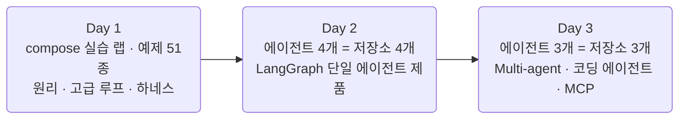

# AI Agent 실전

LiteLLM · LangGraph · RAG · Multi-agent · MCP를 다루는 **3일 12시간** 과정의
강의 자료 저장소입니다. 강의 문서·슬라이드·용어집을 담은 사이트를 빌드해
GitHub Pages로 공개합니다.

- 공개 사이트: [2026-ai-agents.github.io/2026-ai-agents](https://2026-ai-agents.github.io/2026-ai-agents/)
- 코드 저장소: GitHub 조직 [2026-ai-agents](https://github.com/2026-ai-agents)
- 커리큘럼 원안: [docs/course-plan.md](docs/course-plan.md)

## 개요

- 대상: 프로그래밍에 익숙한 전공생 (Python 사용 경험 필수)
- 난이도: 중상. 코드를 따라 치는 수업이 아니라 설계·판단·트레이스 읽기에 무게를 둔 시연
- 형태: 강사 시연 + 예제 실행 + 코드 리딩. 수업 중 실습·과제는 없고, 재현은 자율
- GPU 불필요: 추론과 임베딩은 전부 외부 API. 로컬 Python 환경도 필요 없음



## 자료와 코드의 분리

**이 저장소는 강의 자료만 담습니다.** 실행되는 코드는 조직의 에이전트별
저장소에 있고, 저장소 하나가 에이전트 하나이자 완결된 제품입니다.

| 저장소 | 일차 | 형태 | 컨테이너 | 릴리즈 |
| --- | --- | --- | --- | --- |
| `core` | 공용 | pip installable 라이브러리 | — | v1.0 단일 |
| `day1-agent-lab` | Day 1 | compose 실습 랩 (터미널 실행) | lab 단일 | v0.1 \~ v1.0 (5단) |
| `diet-agent` | Day 2 ① | compose 웹 제품 | app · ui · db | v0.1 \~ v1.0 (4단) |
| `booking-agent` | Day 2 ② | compose 웹 제품 | app · ui · db | v0.1 \~ v1.0 (4단) |
| `secretary-agent` | Day 2 ③ | compose 웹 제품 | app · ui · db | v0.1 \~ v1.0 (4단) |
| `food-rag-agent` | Day 2 ④ | compose 웹 제품 | app · ui · db · rag | v0.1 \~ v1.0 (4단) |
| `energy-agent` | Day 3 ① | compose 웹 제품 | app · ui · db | v0.1 \~ v1.0 (4단) |
| `support-agent` | Day 3 ② | compose 웹 제품 | app · ui · db · rag | v0.1 \~ v1.0 (4단) |
| `coding-agent` | Day 3 ③ | compose 실행기 + 산출물 앱 | app · ui | v0.1 \~ v1.0 (5단) |

각 저장소는 완전히 독립된 compose 스택입니다. 공통인 것은 시작 명령뿐입니다.

```sh
git clone <저장소 주소>
cd <저장소>
cp .env.sample .env
docker compose up --build
```

## 저장소 구조

```plaintext
2026-ai-agents/
├── site/                    # 강의 사이트 (stack-site-builder 기반 Astro) — 강의·슬라이드·글·도구·용어집
├── docs/                    # 커리큘럼 원안 + 규칙 문서(작성·문서화·git·배포)
├── scripts/                 # 저장소 스크립트 (문서 스타일 검사 등)
├── .github/workflows/       # GitHub Pages 배포
├── docker-compose.yml       # 사이트 실행 (보기 전용, 소스 내장)
├── docker-compose.dev.yml   # 사이트 실행 (site/ 바인드 마운트 + 핫리로드)
├── CLAUDE.md                # AI 도구용 저장소 가이드
├── CHANGELOG.md             # 변경 기록
└── README.md
```

## 강의 사이트 실행

Docker만 있으면 저장소 루트에서 바로 띄울 수 있습니다. Node나 pnpm을 깔 필요는
없습니다.

### 보기 전용

소스와 의존성이 이미지에 들어 있어 클론 직후 바로 뜹니다.

```sh
docker compose up      # 사이트 가동: http://localhost:4321/2026-ai-agents/
docker compose down    # 중지·정리
```

### 콘텐츠 편집 (개발용)

`site/`를 바인드 마운트해 호스트에서 고친 내용이 핫리로드로 반영됩니다.
자료를 쓰거나 고칠 때는 이쪽을 씁니다.

```sh
docker compose -f docker-compose.yml -f docker-compose.dev.yml up

# 백그라운드로 띄우고 로그만 따라가기
docker compose -f docker-compose.yml -f docker-compose.dev.yml up -d
docker compose logs -f app

# 중지·정리 (node_modules 볼륨까지 지우려면 -v)
docker compose down
```

`docker-compose.dev.yml`은 별도 스택이 아니라 **오버라이드**입니다. 같은 `app`
서비스를 덮어써 두 파일이 한 컨테이너로 합쳐집니다. 두 파일을 항상 함께 넘기면
어느 저장소에서든 같은 명령이 같은 뜻이 됩니다.

의존성을 바꾼 뒤에는 이미지를 다시 만들어야 합니다.

```sh
docker compose -f docker-compose.yml -f docker-compose.dev.yml up --build
```

### 로컬 pnpm

컨테이너 없이 직접 돌리려면 Node 24 이상이 필요합니다.

```sh
cd site
pnpm install
pnpm dev       # http://localhost:4321/2026-ai-agents/
pnpm build     # dist/ 정적 빌드 (배포와 같은 산출물)
pnpm check     # astro check (타입 검사)
```

콘텐츠를 어디에 쓰는지 등 자세한 내용은
[site/README.md](site/README.md)를 참고하세요.

### base 경로 주의

주소에 `/2026-ai-agents/`가 붙는 이유는 GitHub Pages 프로젝트 사이트의 base
경로를 로컬에서도 그대로 쓰기 때문입니다. `http://localhost:4321/`은 404가
납니다. 배포는 [docs/deployment.md](docs/deployment.md)를 참고하세요.

## 기여

git flow를 따릅니다. 새 작업은 `develop`에서 `feature/*` 브랜치를 만들어
시작하고, `main`에는 직접 커밋하지 않습니다. 상세 규칙은
[docs/git-workflow.md](docs/git-workflow.md), 문서·콘텐츠 작성 규칙은
[docs/writing-rules.md](docs/writing-rules.md)를 참고하세요.

## License

강의 자료의 라이선스는 추후 명시 예정입니다.
