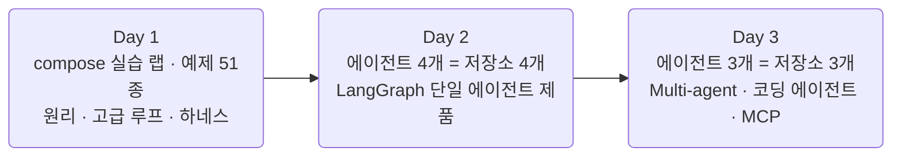
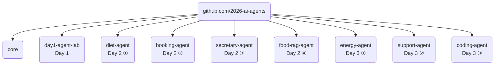
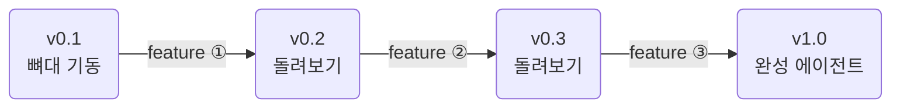
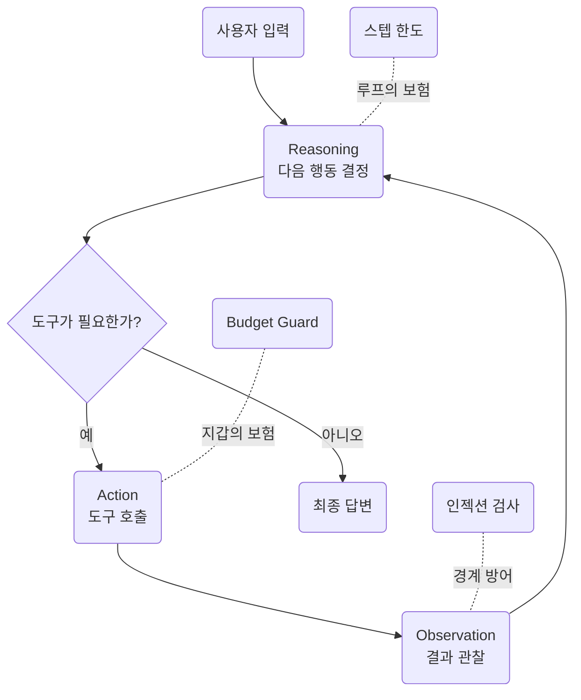
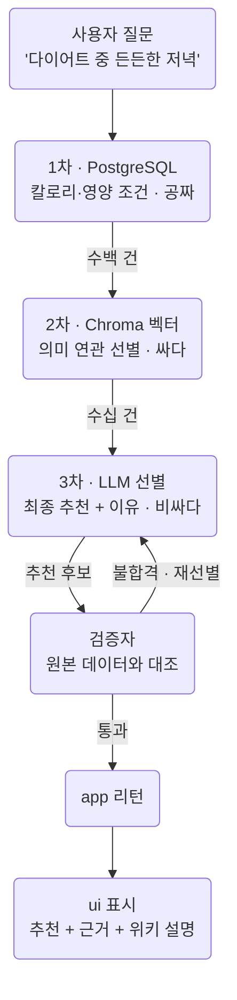
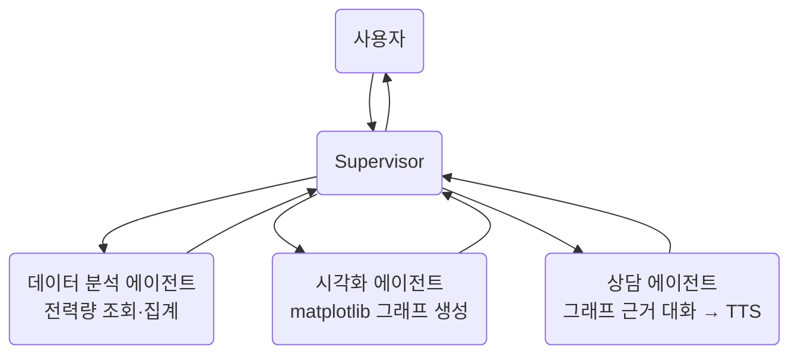
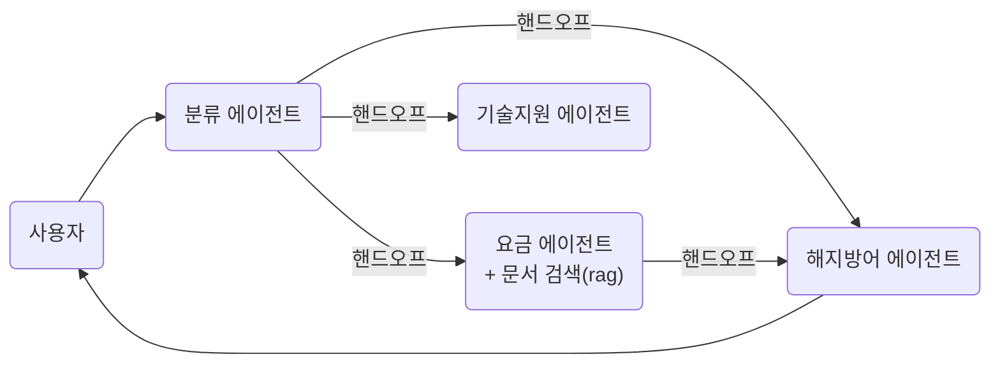
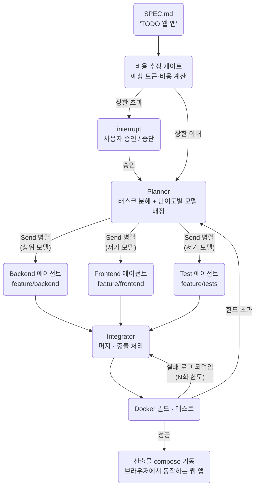
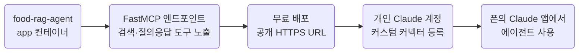

# AI Agent 실전 — LiteLLM · LangGraph · RAG · Multi-agent · MCP

> 3일 / 총 12시간 (일 4시간)
> 시연 중심 · 코드는 전부 완성본 제공 · 모든 소스는 GitHub 조직 `github.com/2026-ai-agents` 로 공유

수업 중 실습·과제는 없습니다. **모든 코드는 완성된 형태로 제공**되며, 강사가 실행·해설하는 시연과 코드 리딩으로 진행합니다. 재현은 각자의 속도로 — 저장소를 클론해 같은 명령으로 같은 결과를 볼 수 있고, 릴리즈 태그가 단계별 체크포인트가 됩니다.

**모든 저장소는 docker compose 기반**입니다. Day 1은 예제 중심의 실습 랩(단일 컨테이너, 터미널 실행)에서 원리·고급 루프·하네스를 다지고, Day 2부터는 에이전트 하나가 저장소 하나이자 compose로 뜨는 멀티 컨테이너 웹 제품입니다. 로컬에 Python 환경을 만들 필요가 없습니다 — Docker만 있으면 모든 재현이 동일하게 됩니다.



## 1. 과정 정보

- 대상: 프로그래밍에 익숙한 전공생(Python 사용 경험 필수)
- 난이도: 중상 — 코드를 따라 치는 수업이 아니라, 설계·판단·트레이스 읽기에 무게를 둔 시연
- 선수지식
    - Python 함수·클래스·예외 처리
    - REST·JSON 감각, git 기본(branch·merge·tag)
    - Docker는 `compose up`을 실행할 수만 있으면 됨(사전 준비 가이드 참고)
    - 비동기(async)는 몰라도 됨 — Day 1 예제에서 다룸
- 형태: 강사 시연 + 예제 실행 + 코드 리딩. 재현·심화는 자율(모든 명령·코드 공개)

## 2. 저장소와 릴리즈 운영

### 2.1. 조직과 저장소

조직: **github.com/2026-ai-agents** · 저장소 하나 = 에이전트 하나 = 완결된 제품.

| 저장소 | 일차 | 형태 | 컨테이너 | 릴리즈 |
|---|---|---|---|---|
| `core` | 공용 | pip installable 라이브러리 | — | v1.0 단일 |
| `day1-agent-lab` | Day 1 | compose 실습 랩 (터미널 실행) | lab 단일 | v0.1 ~ v1.0 (5단) |
| `diet-agent` | Day 2 ① | compose 웹 제품 | app · ui · db | v0.1 ~ v1.0 (4단) |
| `booking-agent` | Day 2 ② | compose 웹 제품 | app · ui · db | v0.1 ~ v1.0 (4단) |
| `secretary-agent` | Day 2 ③ | compose 웹 제품 | app · ui · db | v0.1 ~ v1.0 (4단) |
| `food-rag-agent` | Day 2 ④ | compose 웹 제품 | app · ui · db · rag | v0.1 ~ v1.0 (4단) |
| `energy-agent` | Day 3 ① | compose 웹 제품 | app · ui · db | v0.1 ~ v1.0 (4단) |
| `support-agent` | Day 3 ② | compose 웹 제품 | app · ui · db · rag | v0.1 ~ v1.0 (4단) |
| `coding-agent` | Day 3 ③ | compose 실행기 + 산출물 앱 | app · ui (+ 산출물 별도 compose) | v0.1 ~ v1.0 (5단) |

- **각 저장소는 완전히 독립된 compose 스택입니다.** 컨테이너·볼륨·네트워크를 저장소 간에 공유하지 않습니다. booking-agent의 db와 food-rag-agent의 db는 서로 다른 PostgreSQL 인스턴스이고, 한 저장소를 내리면 그 에이전트의 컨테이너만 내려갑니다
- 아래는 공유 자원이 아니라 **저장소들에서 반복 사용하는 컨테이너 이름 규약**(용어 사전)입니다
    - `lab` — Day 1 전용. Python 실행 환경 컨테이너로, 예제·에이전트를 전부 터미널에서 실행
    - `app` — FastAPI + LangGraph 에이전트 본체
    - `ui` — Streamlit 웹 화면
    - `db` — PostgreSQL(도메인 데이터 + checkpointer 영속화)
    - `rag` — Chroma 벡터 서버(검색이 필요한 에이전트만)
- 저장소 레이아웃은 통일하지 않습니다. 에이전트마다 자연스러운 구조로 가고, 각 README가 구조·시나리오·재현 방법을 안내합니다. 공통인 것은 시작 명령뿐입니다: `git clone` → `cp .env.sample .env` → `docker compose up --build`
- Day 1의 `day1-agent-lab`만 예제 모음집 형태(`docker compose exec lab python examples/...`로 실행)이고, **Day 2부터는 저장소 하나가 예제가 아니라 독립된 응용프로그램**입니다 — 세션은 그 제품을 릴리즈 사다리를 오르며 시연·해부하는 방식으로 진행



### 2.2. 릴리즈 사다리: v0.1에서 v1.0으로

- 원칙
    - **v0.1 = 시작점** — 뼈대가 기동되는 상태. compose가 뜨고 UI가 열리지만 에이전트는 아직 비어 있거나 최소 동작
    - **릴리즈 하나 = feature 하나의 완결** — 그리고 모든 릴리즈는 그 자체로 실행 가능. 시연은 "돌려보고 → 보강하고 → 다음 단으로"의 리듬으로 사다리를 오름
    - **v1.0 = 완성된 에이전트** — `main`은 항상 v1.0 완성본
- 재현 방법
    - 특정 단계 재현: `git checkout v0.2` → `docker compose up --build` — 그 시점의 코드로 그 시점의 동작
    - 단계 사이 학습: `git diff v0.2 v0.3` — "이번 feature가 코드로는 무엇이었나"를 diff로 읽음. 릴리즈 노트에 각 단의 의도를 기록
    - 무거운 산출물(데이터·인덱스)은 해당 릴리즈의 자산으로 첨부(또는 다운로드 링크) — 어느 단에서 시작해도 재현 가능
- 수업과의 대응
    - 세션 진행이 태그를 오르는 것과 1:1 — "지금 우리는 v0.2에서 v0.3으로 가는 중"이 늘 성립
    - 일부 저장소는 실패 재현 시나리오(무한 루프, 상태 오염, 검증 생략 환각, 과잉 라우팅, 인젝션 페이로드)를 포함 — 세션에서 트레이스를 읽으며 원인을 추적하는 과정을 시연



## 3. RAG 데이터: 기존 식단 플래너 자산의 재사용

RAG는 데이터 파이프라인을 처음부터 만들지 않습니다. 별도 과정에서 구축한 **식단 플래너**(week03-meal-planner)의 정제된 음식 DB를 가져와, 위키 설명을 덧붙여 검색 가능하게 만든 산출물을 씁니다.

- 데이터 구성
    - 음식 DB 약 2만 건(정제 완료 스냅샷) → PostgreSQL 적재: 이름·분류·칼로리·영양 수치 등 정형 검색용
    - 각 음식의 위키 설명 텍스트를 수집해 음식명과 함께 구글 임베딩(gemini-embedding-001)으로 벡터화 → Chroma 인덱스: 의미 검색용
- 배포 산출물은 강사가 제공: PostgreSQL 덤프 + Chroma 벡터 인덱스 파일. `data/` 아래에 풀면 compose가 그대로 물어 검색이 바로 동작하며, 수업에서는 복원 명령만 소개 (배포 방식은 릴리즈 자산/드라이브 링크 중 추후 확정)
- 위키 수집·정제·임베딩 과정 자체는 이 과정의 범위 밖 — "정제된 데이터와 색인이 이미 있다"에서 출발

## 4. 사전 준비 가이드 (강의 전 완료 권장)

이 과정은 **GPU가 전혀 필요 없습니다**. 모델 추론과 임베딩은 전부 외부 API로 처리하며, 로컬 Python 환경도 필요 없습니다. 준비는 아래 2단계가 전부이고, 순서대로 진행합니다. (API 키가 있어야 `.env`를 채울 수 있으므로 충전이 먼저입니다)

- ① 플랫폼 3사(Google AI Studio · OpenAI · Anthropic) 중 1개 이상 API 키 발급 + 소액 충전
- ② Docker 셋업 — Docker Desktop 설치 → `day1-agent-lab` 클론(공개 저장소, 계정 불필요) → `.env`에 API 키 세팅 → `docker compose up --build` 기동 → `check_env.py` 통과 확인

### 4.1. API 키 발급과 소액 충전

무료 티어만으로도 일부 진행은 가능하지만, 결제(소액 $5~$10 충전)를 권장합니다.

- 권장 이유
    - 무료 티어는 rate limit이 빡빡해 멀티 에이전트의 폭발적 호출에서 금방 막힘
    - 도구 호출(tool calling) 안정성은 상위 모델일수록 확연히 좋음
- 플랫폼별 특징과 발급 절차 (화면 문구는 바뀔 수 있으니 흐름만 참고)
    - **Google AI Studio / Gemini** — 무료 티어가 관대하고 Flash 계열이 저렴. 의미 검색용 임베딩(gemini-embedding-001)도 이쪽 키를 사용하므로 **최소 1개를 발급한다면 Google 권장**
        - aistudio.google.com 접속 → 구글 계정 로그인 → "Get API key"에서 키 생성 → 유료 사용 시 Google Cloud 결제 계정 연결
    - **OpenAI Platform** — 함수 호출이 안정적이고 자료가 풍부
        - platform.openai.com 접속 → 가입 → Settings > Billing에서 카드 등록·크레딧 충전 → API keys에서 키 생성
    - **Anthropic Claude Platform** — 긴 컨텍스트와 tool use 추론이 강해 복잡한 멀티 에이전트·코딩 에이전트에 유리
        - console.anthropic.com 접속 → 가입 → Billing에서 크레딧 충전 → API Keys에서 키 생성
- 발급한 키는 메모장 등에 임시 보관 — Docker 셋업 단계에서 `.env`에 넣습니다. 키는 절대 공개 저장소·채팅에 올리지 않기

LiteLLM이 세 플랫폼을 동일 인터페이스로 통일하므로, 같은 코드로 3사를 교체하며 비용·품질·지연을 비교할 수 있고, **난이도에 따라 다른 등급의 모델을 배정하는 라우팅**(Day 3 coding-agent)도 같은 코드 위에서 이뤄집니다.

### 4.2. Docker 셋업

#### 1) Docker Desktop 설치

- docker.com/products/docker-desktop 에서 OS에 맞는 설치 파일 다운로드 → 설치 → 실행
- Windows는 설치 중 WSL2 활성화 안내를 따르면 됨
- 설치 확인: 터미널에서 아래 명령이 버전을 출력하면 완료

```bash
docker compose version
```

#### 2) 저장소 클론과 .env 세팅

```bash
git clone https://github.com/2026-ai-agents/day1-agent-lab.git
cd day1-agent-lab
cp .env.sample .env
```

- `.env.sample`은 키 이름만 있고 값이 비어 있는 견본 파일입니다. 복사본인 `.env`를 편집기로 열어 앞 단계에서 발급한 키를 채웁니다 — **셋 중 하나만 있어도 됩니다**

```bash
# .env (예시)
GEMINI_API_KEY=여기에_붙여넣기
OPENAI_API_KEY=
ANTHROPIC_API_KEY=
```

- `.env`는 gitignore 되어 있어 커밋되지 않습니다. `.env.sample`에는 절대 실제 키를 넣지 않기

#### 3) 기동과 환경 점검

```bash
docker compose up --build -d
docker compose exec lab python check_env.py
```

- `check_env.py`가 확인하는 것: 채워진 키로 실제 호출 1회(유효성), 사용 가능한 모델, 컨테이너 내 패키지 버전 — 전부 통과하면 준비 끝 (Docker 동작 확인과 환경 점검을 한 번에)
- 잘 안 될 때
    - `docker: command not found` → Docker Desktop이 실행 중인지 확인
    - 키 인증 실패 → `.env`의 키 앞뒤 공백·따옴표 확인, 충전 여부 확인
    - 그 외는 첫날 오리엔테이션 시간에 함께 해결

---

## 5. Day 1 — 에이전트 해부, 고급 루프, 하네스 엔지니어링 (240분)

교재: `day1-agent-lab` · compose로 `lab` 컨테이너 하나를 띄우고, 모든 예제·에이전트를 터미널에서 실행합니다(`docker compose exec lab python examples/...`). 프레임워크 없이 에이전트(여행 플래너)의 원리를 체득하고, ReAct 너머의 루프와 하네스(인젝션 방어·비용 가드)까지 다집니다.

릴리즈 사다리 — 세션 진행과 1:1

| 릴리즈 | 상태 |
|---|---|
| v0.1 | 예제 51종 + 에이전트 뼈대(도구 없음) |
| v0.2 | 도구 장착: 예산 계산 도구가 스키마로 실림 |
| v0.3 | ReAct 루프 완성: 여행 플래너가 처음 동작 |
| v0.4 | 고급 루프: Reflexion 재시도 장착 |
| v1.0 | 하네스 완성: 인젝션 방어 + budget guard |

- 오리엔테이션 + 환경 점검(15분)
    - 조직·릴리즈 사다리 사용법, 예제 실행 방법, 3일 로드맵

### 5.1. LLM API의 본질 (25분) — `examples/01_api/` 11종

- ★ `01_hello_completion.py` — 최소 호출, 요청·응답 JSON 원문 그대로 관찰
- `02_roles.py` — system/user/assistant 역할이 응답을 어떻게 바꾸는지 비교
- ★ `03_tokens.py` — 같은 문장의 한국어/영어 토큰 수 비교, 한글이 왜 더 비싼가
- `04_context_limit.py` — 컨텍스트 한도를 일부러 초과시켜 에러 재현
- `05_temperature.py` — temperature 0 vs 1로 같은 질문 5회 반복, 산포 비교
- ★ `06_streaming.py` — 스트리밍 델타 청크가 오는 모양
- ★ `07_async_parallel.py` — 도시 5곳 동시 호출, 순차 대비 소요 시간 비교
- `08_multiturn_stateless.py` — LLM은 무상태: 히스토리를 매번 다 보내야 이어짐을 확인
- `09_json_mode.py` — 응답을 JSON으로 강제하는 방법과 깨지는 케이스
- `10_vision.py` — 이미지 입력 한 장(멀티모달 맛보기)
- `11_cost_calc.py` — 토큰 단가표로 방금 호출의 비용을 직접 계산

### 5.2. LiteLLM 통합 레이어 (25분) — `examples/02_litellm/` 10종

- ★ `01_provider_swap.py` — 모델 문자열만 바꿔 3사 교체
- ★ `02_three_way_compare.py` — 같은 프롬프트를 3사에 던져 응답·지연·비용 나란히 출력
- ★ `03_fallback.py` — 주 모델 실패 시 폴백 체인 동작 관찰
- `04_retry_timeout.py` — 재시도 횟수·타임아웃 설정과 동작
- `05_cache.py` — 응답 캐싱: 같은 질문 두 번째는 공짜·즉시
- `06_cost_callback.py` — 콜백으로 호출별 토큰·비용 자동 집계
- `07_rate_limit.py` — 일부러 rate limit을 맞고 백오프로 살아나는 과정
- `08_router.py` — 여러 모델에 요청을 분산하는 라우터 구성
- `09_model_info.py` — 모델별 컨텍스트 한도·단가 메타데이터 조회
- `10_embedding.py` — 임베딩도 같은 인터페이스로(Day 2 RAG 예고)

### 5.3. Tool calling 심화 (40분) — `examples/03_tools/` 10종 → **v0.2**

- ★ `01_single_tool.py` — 환율 조회 도구 1개, 요청~응답 왕복
- ★ `02_roundtrip_raw.py` — tool call의 JSON 원문 해부: 모델이 "실행해 달라"고 보내는 것의 실체
- ★ `03_pydantic_schema.py` — Pydantic 모델에서 도구 스키마 자동 생성
- `04_parallel_tools.py` — 항공+숙소 동시 도구 호출
- `05_arg_constraints.py` — 선택 인자·기본값·enum 제약이 스키마에 실리는 모양
- `06_tool_choice.py` — 특정 도구 강제/도구 사용 금지 제어
- ★ `07_tool_error.py` — 도구 예외를 모델에 되먹여 스스로 복구하는 패턴
- `08_hallucinated_args.py` — 모델이 인자를 지어내는 사고 재현과 검증 코드
- `09_structured_output.py` — 도구 호출을 응용해 LLM을 "타입 있는 함수"처럼 쓰기
- `10_tool_selection.py` — 도구 10개 중 맞는 것을 고르게 하기: 도구 설명 문구가 선택 품질을 가름
- v0.2 코드 포인트: 여행 예산 계산 도구가 Pydantic 모델 → 스키마로 실리는 지점을 짚기

### 5.4. ReAct 루프 (45분) — `examples/04_react/` 4종 → **v0.3**

- ★ `01_react_trace.py` — 완성본 에이전트를 돌리며 reasoning→action→observation 트레이스 읽기
- `02_max_steps.py` — 스텝 한도를 1, 3, 10으로 바꿔가며 행동 변화 관찰
- `03_prompt_ablation.py` — 시스템 프롬프트를 한 문단씩 빼면 루프가 어떻게 무너지는가
- `04_context_growth.py` — 스텝마다 컨텍스트가 부풀어 비용이 커지는 것을 그래프로
- v0.3 코드 포인트: 도구 호출/최종 답변 분기, observation 되먹임, 종료 조건(스텝 한도)
- 실패 재현: 종료 조건을 뺀 버전으로 무한 루프를 일으키고, 트레이스로 원인을 짚은 뒤 스텝 한도가 막아내는 것 확인
- "3박 4일 오사카, 예산 80만원" 요청이 검색→일정→예산 도구를 오가며 풀리는 것 확인

### 5.5. ReAct 너머의 루프들 (35분) — `examples/05_loops/` 6종 → **v0.4**

- ReAct의 한계: 한 스텝씩 더듬어 가느라 느리고, 매 스텝에 전체 히스토리를 실어 비쌈
- ★ `01_plan_execute.py` — 계획을 먼저 세우고 순차 실행하는 Plan-and-Execute
- ★ `02_replan.py` — 실행 중 막히면 계획을 다시 세우는 재계획 루프
- ★ `03_reflexion.py` — 생성 결과를 평가자가 채점, 미달이면 피드백과 함께 재시도
- `04_eval_rubric.py` — 평가 기준(루브릭)을 바꾸면 결과 품질이 달라지는 실험
- `05_rewoo.py` — 관찰 없이 플랜 한 번으로 도구를 병렬 실행하는 ReWOO(토큰 절약 특화)
- `06_loop_cost_compare.py` — 같은 여행 과제를 ReAct vs Plan-and-Execute로 풀어 스텝·비용 비교 리포트
- v0.4 코드 포인트: Reflexion의 평가 → 재시도 분기(통과 기준과 최대 재시도 횟수)
- 이 패턴들이 Day 3 coding-agent에서 전부 재등장함을 예고

### 5.6. 하네스 엔지니어링 (40분) — `examples/06_harness/` 10종 → **v1.0**

- 하네스: 모델을 감싸는 실행 환경 전체(시스템 프롬프트, 도구 정의, 컨텍스트 관리, 가드레일, 로깅) — 같은 모델도 하네스가 성능을 가름
- ★ `01_harness_onoff.py` — 하네스 요소를 하나씩 끄며 같은 과제의 성공률 변화 관찰
- `02_injection_direct.py` — 사용자 입력에 실린 직접 인젝션("지금까지 지시 무시해")
- ★ `03_injection_indirect.py` — 검색 도구가 물어온 웹페이지 본문에 심긴 간접 인젝션을 에이전트가 따르는 사고 재현
- ★ `04_boundary_wrap.py` — 도구 결과를 데이터 경계로 감싸 지시·데이터를 분리하는 방어
- `05_tool_permission.py` — 위험 도구(결제·삭제)에 확인 절차를 끼우는 권한 분리
- `06_output_filter.py` — 출력 검사: API 키 등 비밀이 응답에 새는 것을 차단
- `07_path_jail.py` — 파일 도구를 작업 폴더에 감금(경로 탈출 차단)
- ★ `08_budget_estimate.py` — 실행 전 예상 토큰·비용 추정
- ★ `09_budget_guard.py` — 실행 중 누적 비용이 상한을 넘으면 중단. 스텝 한도가 "루프의 보험"이라면 이것은 "지갑의 보험"
- `10_trace_log.py` — 모든 호출·도구 실행을 구조화 로그로 남겨 사후 추적 가능하게
- v1.0 코드 포인트: budget guard의 경고 임계·중단 임계 2단계 판정, 인젝션 페이로드가 방어 코드에 막히는 지점

### 5.7. MCP 맛보기: 도구를 표준으로 가져오기 (15분)

- 지금까지 도구는 손으로 정의했지만, MCP(Model Context Protocol)는 도구를 표준 프로토콜로 주고받는 방식
- 시연: 공개 MCP 서버의 도구를 여행 에이전트에 연결해, 코드 수정 없이 도구 목록이 늘어나는 것 관찰
- Day 3에서는 역방향 — 우리가 만든 에이전트를 MCP 서버로 만들어 개인 Claude에 연결하는 것을 시연



## 6. Day 2 — LangGraph 단일 에이전트 제품 4종 (240분)

**한 시간에 에이전트 하나, 저장소 하나.** 개념은 에이전트마다 하나씩 얹습니다 — 그래프 → 영속성·승인 → 장기 메모리 → RAG. 모든 저장소가 릴리즈 사다리로 진행되므로, 각 세션은 "v0.1 기동 → 태그를 오르며 feature 시연 → v1.0 확인"의 같은 리듬입니다.

- Day 2 도입(10분)
    - compose 제품과 릴리즈 사다리 사용법, 오늘 볼 4개 에이전트와 각각이 얹는 개념

### 6.1. diet-agent — LangGraph 기본기 (55분) · app · ui · db

식단 상담 웹앱: 식단을 입력하면 칼로리·영양을 분석하고 조언합니다. db에는 식품 칼로리 시드 데이터. **Day 1의 수제 ReAct를 선언적 그래프로 다시 세우는 것**이 이 에이전트의 전부입니다.

| 릴리즈 | 상태 |
|---|---|
| v0.1 | compose 기동, UI 빈 화면, 그래프 뼈대 |
| v0.2 | 분기 동작: 도구 호출/답변이 갈림 |
| v0.3 | 대화 누적: 멀티턴 상담 성립 |
| v1.0 | UI 연결 완성: 식단 상담 제품 |

- 시연 진행 — 릴리즈 사다리를 오르며
    - v0.1 투어: compose 기동, UI 빈 화면 확인, State·Node·Edge·compile 뼈대 코드 리딩 — LangGraph 멘탈 모델을 실물 코드로
    - v0.2 분기: conditional edge가 도구 호출/최종 답변을 가르는 것을 트레이스로 확인
    - v0.3 누적: reducer가 없을 때 상태가 덮어써져 대화가 끊기는 문제를 먼저 보여준 뒤, reducer 추가로 멀티턴 상담이 성립하는 순간. 토큰/스텝 단위 스트리밍도 여기서
    - v1.0: UI에서 식단 상담 완성 확인, Day 1 raw 버전과 나란히 놓고 비교 — 같은 동작, 다른 구조
- 코드에서 보는 곳: 그래프 정의(노드·엣지 연결부), conditional edge 함수, 메시지 reducer 선언

### 6.2. booking-agent — 영속성과 승인 (55분) · app · ui · db

레스토랑 예약 에이전트: 대화로 예약을 잡되, **확정 직전에 반드시 사람의 승인을 받습니다**(interrupt). 예약과 대화 상태가 PostgreSQL에 영속화되어, 컨테이너를 재시작해도 대화가 이어집니다.

| 릴리즈 | 상태 |
|---|---|
| v0.1 | 메모리 대화만: 재시작하면 다 잊음 |
| v0.2 | 영속화: pg checkpointer, 재시작 생존 |
| v0.3 | 승인 흐름: 확정 전 interrupt |
| v1.0 | time-travel + 예약 관리 완성 |

- 시연 진행 — 릴리즈 사다리를 오르며
    - v0.1: 대화로 예약이 잡히지만 `docker compose restart` 한 방에 전부 백지 — 결핍을 먼저 겪는 것이 이 저장소의 출발점
    - v0.2: checkpointer를 PostgreSQL에 물리고, thread별로 대화가 분리되는 것 확인. 저장된 상태를 덤프로 열어 안에 뭐가 들었는지 읽고, 재시작 후에도 대화가 이어지는 것을 눈앞에서 증명
    - v0.3: 예약 확정 노드 직전의 interrupt — 실행이 멈추고, 승인하면 확정·거절하면 수정으로 갈리는 흐름
    - v1.0: time-travel로 과거 상태로 되돌려 "다른 시간대로 예약했다면"을 재실행 + 예약 조회·취소 완성
- 코드에서 보는 곳: checkpointer 연결부, interrupt 삽입 지점과 승인/거절 분기
- 실패 재현: 상태 오염 시나리오를 상태 덤프를 읽으며 추적하는 과정 시연

### 6.3. secretary-agent — 장기 메모리 (55분) · app · ui · db

개인 비서 에이전트: 대화 중 알게 된 사용자의 취향·사실("알레르기 있어", "회의는 오전 선호")을 **장기 메모리에 저장하고, 새 대화(thread)에서도 기억**합니다. 단기 기억(checkpointer, thread 안)과 장기 기억(store, thread를 넘어)의 구분이 이 에이전트의 개념입니다.

| 릴리즈 | 상태 |
|---|---|
| v0.1 | 단기 기억만: 새 대화에선 백지 |
| v0.2 | store 연결: 장기 기억 저장·조회 |
| v0.3 | 기억 판단: 뭘 기억할지 스스로 결정 |
| v1.0 | 기억 검색·갱신 완성 |

- 시연 진행 — 릴리즈 사다리를 오르며
    - v0.1: 대화는 잘 되지만 새 thread를 열면 백지 — "단기 기억만으로는 비서가 아니다"를 먼저 확인
    - v0.2: 장기 메모리 store 연결. 같은 정보를 단기(checkpointer)와 장기(store)에 각각 두고, 새 thread에서 누가 기억하는지 대조
    - v0.3: 기억 판단 — 대화에서 "무엇을 기억할 가치가 있는가"를 에이전트가 스스로 결정해 저장하는 메모리 노드
    - v1.0: 저장된 기억을 의미 기반으로 검색해 관련 것만 꺼내 쓰고, 바뀐 사실("이사했어")로 기존 기억을 갱신·삭제
- 코드에서 보는 곳: store 읽기/쓰기 지점, 기억 판단 노드의 프롬프트
- 완성 장면: 새 thread를 열고 "내가 뭘 못 먹는다고 했지?"에 답하는 순간

### 6.4. food-rag-agent — Agentic RAG 식단 추천 (65분) · app · ui · db · rag

음식 DB 약 2만 건 + 위키 설명 위의 **식단 추천 에이전트**입니다. "다이어트 중인데 든든한 저녁 뭐 먹을까?" 같은 질문에, 2만 건을 세 단계 깔때기로 좁혀 추천하고, 추천을 내보내기 전에 **검증자가 원본 데이터와 대조**합니다. rag 컨테이너(Chroma)가 처음 등장합니다.

추천 파이프라인 — 선별자와 검증자

- 선별자 (2만 건 → 소수)
    - 1차 · PostgreSQL: 칼로리·영양 등 정형 조건으로 후보 압축 (예: 600kcal 이하, 단백질 20g 이상)
    - 2차 · Chroma: 질문을 임베딩해 1차 후보 중 의미가 맞는 것 선별 (예: "든든한", "매콤한" 같은 흐릿한 조건)
    - 3차 · LLM: 2차 후보 몇십 건만 프롬프트에 넣어 최종 추천 선별 + 추천 이유 생성
- 검증자 (내보내기 전 대조)
    - 4차 · 검증: 추천된 음식이 실제 DB에 존재하는가, 칼로리·영양 수치가 원본과 일치하는가, 사용자의 조건을 정말 충족하는가 — 불합격이면 재선별
    - 5차 · 통과분만 app이 리턴 → 6차 · ui 표시 (추천 + 근거 수치 + 위키 설명)

배경 이론 정리

- **후보 깔때기와 비용 사다리** — 2만 건은 컨텍스트에 다 넣을 수 없고, 넣을 수 있어도 비쌉니다. SQL(공짜·결정적) → 임베딩(싸다·의미) → LLM(비싸다·판단) 순으로, 싼 층이 후보를 줄여준 뒤에만 비싼 층이 일합니다. 각 층은 대체가 아니라 분담 — SQL은 동의어를 못 잇고, 벡터는 정렬·집계를 못 하고, LLM만 이유를 설명합니다
- **원본 한 벌, 색인은 옆에** — 음식 행의 원본은 PostgreSQL에만 있고, Chroma에는 벡터와 필터용 최소 메타데이터만 둡니다. 2차 선별도 음식 id top-k를 얻은 뒤 원본 행은 PostgreSQL에서 꺼내며, 답의 근거가 항상 원본 한 곳에서 나옵니다
- **무엇을 임베딩하는가** — 음식명 + 위키 설명을 벡터로 만듭니다. 서술 텍스트가 있어야 "든든한", "해장에 좋은" 같은 의미 질의가 붙습니다. 칼로리 같은 수치는 벡터에 넣지 않습니다 — 숫자는 SQL 필터의 일
- **생성과 검증의 분리** — LLM의 3차 선별은 그럴듯하지만 보증이 없습니다(없는 음식, 틀린 수치, 조건 위반). 검증자는 LLM이 아니라 **코드가 원본 데이터와 대조**하는 결정적 검사이며, Day 1 Reflexion(생성 → 평가 → 재시도)의 제품판입니다. "LLM 출력을 그대로 믿지 않는다"가 이 에이전트의 핵심 규율
- **grounding** — 최종 응답에는 근거(원본 수치·위키 출처)가 함께 나가고, 근거 없는 내용은 검증자 단계에서 걸러집니다

| 릴리즈 | 상태 |
|---|---|
| v0.1 | 데이터 적재 + 검색 서비스만(에이전트 없음) |
| v0.2 | 선별 깔때기: SQL 1차 → 벡터 2차 → LLM 3차 |
| v0.3 | 검증자: 원본 대조, 불합격 재선별 |
| v1.0 | app 리턴 + ui 표시 완성 |

- 시연 진행 — 릴리즈 사다리를 오르며
    - v0.1: 에이전트 없이 검색만 — SQL 조건 검색(칼로리 정렬)과 의미 검색("든든한 국물 요리")을 따로 돌려 각 층의 성격 확인. 유사도 점수·임계, 메타데이터 필터까지
    - v0.2: 세 단계 깔때기 연결 — 단계별 후보 수가 2만 → 수백 → 수십 → 3~5로 줄어드는 것을 로그로 관찰, 3차 프롬프트에 실제로 들어가는 컨텍스트 실물을 디버그 로그로 확인
    - v0.3: 검증자 — 3차 추천 중 조건 위반·수치 불일치가 걸러지는 것 관찰. 검증자를 끈 상태에서 환각(없는 음식 추천)이 통과하는 사고를 먼저 재현한 뒤, 검증자가 막는 것 확인
    - v1.0: ui에서 추천 + 근거 수치 + 위키 설명이 함께 표시되는 완성 상태
- 코드에서 보는 곳: 1·2차 선별 쿼리, 3차 선별 프롬프트, 검증자의 대조 로직과 재선별 분기, 근거 조립부



## 7. Day 3 — Multi-agent, 병렬 코딩 에이전트, MCP (240분)

멀티 에이전트의 양대 패턴을 제품 하나씩으로 구현한 뒤, 3일 전체가 합쳐진 정점으로 **병렬 코딩 에이전트**를 봅니다.

- 멀티 에이전트 설계 원칙(25분)
    - 언제 나눠야 하는가 — 단일 거대 에이전트 vs 분리의 트레이드오프
    - supervisor vs handoff, 각 패턴이 어울리는 문제 유형

### 7.1. energy-agent — supervisor 패턴 (65분) · app · ui · db

전력회사 시나리오: db의 사용자별 전력량 시계열을 분석하고, 그래프를 생성한 뒤, 그래프를 근거로 상담 대화를 만들어 TTS로 출력합니다. ui 대시보드에서 그래프와 오디오를 확인합니다. (실제 전화 연동은 범위 밖, TTS 데모까지)

| 릴리즈 | 상태 |
|---|---|
| v0.1 | 단일 에이전트가 전부 처리(비교 기준점) |
| v0.2 | supervisor 분리: 3개 하위 에이전트 라우팅 |
| v0.3 | 차트 도구: 그래프가 대시보드에 뜸 |
| v1.0 | TTS 상담 완성 |

- 시연 진행 — 릴리즈 사다리를 오르며(65분)
    - v0.1: 단일 에이전트가 분석·시각화·상담을 전부 처리 — 비교 기준점. 프롬프트가 비대해지고 컨텍스트가 섞이는 것을 확인
    - v0.2: supervisor 분리 — 데이터 분석·시각화·상담 3개 하위 에이전트로 나누고, 같은 질문을 v0.1과 v0.2에 던져 응답 품질·컨텍스트 크기 비교. "왜 나누는가"의 실증. supervisor의 판단 과정을 트레이스로 읽고, 라우팅 프롬프트·분기 로직 해부
    - v0.3: 차트 도구 — matplotlib 그래프를 도구 호출로 생성, 대시보드에 뜨는 것 확인
    - v1.0: TTS 상담 — 그래프 수치를 근거로 상담 대화를 생성해 TTS로 출력, 대시보드에서 그래프·오디오가 함께 뜨는 완성 상태
- 코드에서 보는 곳: supervisor 라우팅 프롬프트와 분기 로직, 하위 에이전트 정의, 차트·TTS 도구
- 실패 재현: 시각화가 필요 없는 요청에도 그래프를 그리는 과잉 라우팅을 트레이스로 잡는 과정 시연



### 7.2. support-agent — handoff(swarm) 패턴 (60분) · app · ui · db · rag

고객 상담 시나리오: 문의를 분류 에이전트가 받아 요금·기술지원·해지방어 전문 에이전트로 제어권을 직접 넘깁니다. rag 컨테이너에는 요금제·약관 문서 벡터가 들어 있어, 요금 에이전트가 Day 2의 검색 패턴을 그대로 재사용합니다.

| 릴리즈 | 상태 |
|---|---|
| v0.1 | 분류만: 어디로 보낼지 말만 함 |
| v0.2 | handoff: 제어권이 실제로 넘어감 |
| v0.3 | 라우팅 기준: 애매한 문의 처리 |
| v1.0 | RAG 재사용: 요금 에이전트가 문서 인용 |

- 시연 진행 — 릴리즈 사다리를 오르며(60분)
    - v0.1: 분류 에이전트가 "요금 문의네요, 요금 담당으로 보내야 합니다"라고 말만 함 — 제어권 이양이 없는 상태
    - v0.2: handoff — 제어권이 실제로 넘어감. handoff tool의 정의를 해부하고, 핸드오프 때 대화 상태가 어떻게 함께 넘어가는지 관찰
    - v0.3: 라우팅 기준 — 분류 에이전트의 기준 프롬프트 해부. 복합 문의("요금도 이상하고 인터넷도 안 돼요")와 분류 불가 문의가 어떻게 처리되는지
    - v1.0: RAG 재사용 — 요금 에이전트가 rag 컨테이너의 요금제·약관 문서를 검색·인용해 답변. RAG가 멀티 에이전트의 부품이 되는 장면
- 코드에서 보는 곳: handoff tool 정의, 분류 기준 프롬프트, 요금 에이전트의 문서 검색 도구
- energy-agent(supervisor)와 나란히 놓고 구조 비교 — 패턴마다 어울리는 문제가 따로 있음



### 7.3. coding-agent — 병렬 코딩 에이전트, 3일의 종합 (55분) · app · ui + 산출물 compose

스펙 문서(`SPEC.md`)를 받으면 **비용을 먼저 추정해 상한을 점검**하고, planner가 태스크를 분해하며 **난이도에 따라 태스크별로 다른 등급의 모델을 배정**합니다. backend·frontend·test 에이전트가 각자의 feature 브랜치에서 병렬로 작성·커밋하고, integrator가 머지해 Docker로 빌드·기동합니다. 실패하면 integrator가 로그를 읽고 고치되, **수정 한도를 넘기면 planner로 돌아가 재계획**합니다. ui는 진행 대시보드(태스크 상태·브랜치·비용 누적)이고, **산출물인 웹 앱은 별도 compose로 뜨는 독립 제품**입니다.

| 릴리즈 | 상태 |
|---|---|
| v0.1 | worker 1명 순차 실행(느리지만 동작) |
| v0.2 | 병렬화: Send로 worker 3명 동시 작업 |
| v0.3 | 비용 게이트 + 난이도별 모델 배정 |
| v0.4 | 복구 루프: 수정 한도 → 재계획 |
| v1.0 | 대시보드 완성 |

3일 동안 배운 것이 전부 이 안에 있습니다.

- Day 1 — 도구 루프, Plan-and-Execute, Reflexion(실패 로그 되먹임), budget guard
- Day 2 — 그래프 구조, interrupt(비용 초과 시 사용자 승인), 비용 사다리(난이도별 모델 배정)
- Day 3 — supervisor + 병렬 실행

세션 구성:

- 시연 진행 — 릴리즈 사다리를 오르며(55분)
    - v0.1: worker 1명이 순차로 전부 작성 — 동작하지만 느림. 에이전트에게 쥐어준 도구들(파일 쓰기, branch·commit·merge, docker 빌드·로그 수집)의 실체를 코드로 해부
    - v0.2: 병렬화 — planner의 태스크 목록을 Send로 worker 3명에게 동시 디스패치. ui 대시보드와 `git log --graph`로 브랜치 3개가 동시에 자라는 것을 관찰(**git 이력이 곧 에이전트의 작업 기록**), v0.1 대비 소요 시간을 숫자로 비교
    - v0.3: 비용 게이트 + 모델 배정 — 실행 전 예상 비용 리포트(태스크 수·모델 배정·예상 비용)가 뜨고 승인해야 진행. 태스크 난이도 판정에 따라 상위/저가 모델이 갈리는 지점 해부
    - v0.4: 복구 루프 — 빌드 실패 로그가 integrator에게 되먹여지고, 수정 한도를 넘기면 planner 재계획으로 넘어가는 분기
    - v1.0: `SPEC.md`에 "TODO 웹 앱"을 넣고 전체 실행 — 비용 승인 → 병렬 코딩 → 머지 → 산출물 compose 기동 → 브라우저에서 앱 동작 확인
- 코드에서 보는 곳: Send 병렬 디스패치, 난이도 판정 → 모델 배정, 비용 추정 게이트, 수정 한도 초과 → 재계획 분기
- `SPEC.md`를 "타이머 앱"으로 바꾼 재현 방법 안내 — 같은 에이전트, 다른 제품(자율 재현용 SPEC 2종 제공)



- 운영 노트
    - LLM 코딩은 비결정적이므로 사전 실행해 둔 git 이력·완성 이미지를 예비로 준비 — 라이브가 꼬여도 `git log --graph` 리플레이로 과정을 보여줄 수 있음
    - budget guard와 스텝·수정 한도가 코드에 걸려 있어 실행이 폭주하지 않음 — Day 1의 하네스가 여기서 실전으로 일함

### 7.4. MCP 활용 시연 (25분)

Day 1에서 MCP로 도구를 **가져오는** 쪽을 봤다면, 이번엔 우리가 만든 에이전트를 MCP 서버로 만들어 **내어주는** 쪽입니다. 학생 개인 계정을 전제하지 않으며, 따라하기 가이드는 저장소 문서로 제공합니다.

- 라이브 시연(25분)
    - food-rag-agent의 app에 FastMCP 엔드포인트를 얹어 음식 검색·식단 추천 도구 노출 → 무료 플랫폼 배포 → 강사 개인 Claude 계정에 커스텀 커넥터 등록 → 폰의 Claude 앱에서 "다이어트 중인데 든든한 저녁 추천해줘"가 동작하는 순간까지
    - ChatGPT Developer Mode로도 동일 연결이 가능함을 소개(유료 플랜 전용)
    - 따라하기 가이드(`docs/mcp-deploy.md`)를 저장소에 제공 — 자율 재현용



### 7.5. 마무리 (10분)

- 3일 전체 회고 — raw 루프에서 하네스·제품형 에이전트 7종·MCP까지의 여정 정리
- Q&A

---

## 8. 전체 요약

| 저장소 | 개념 | 릴리즈 사다리 |
|---|---|---|
| `day1-agent-lab` | 원리 · 고급 루프 · 하네스 (예제 51종) | v0.1 뼈대 → v0.2 도구 → v0.3 ReAct → v0.4 고급 루프 → v1.0 하네스 |
| `diet-agent` | 그래프 기본 | v0.1 뼈대 → v0.2 분기 → v0.3 누적 → v1.0 제품 |
| `booking-agent` | 영속성 · 승인 | v0.1 휘발 → v0.2 영속 → v0.3 승인 → v1.0 완성 |
| `secretary-agent` | 장기 메모리 | v0.1 백지 → v0.2 store → v0.3 판단 → v1.0 완성 |
| `food-rag-agent` | Agentic RAG · 선별과 검증 | v0.1 검색만 → v0.2 선별 깔때기 → v0.3 검증자 → v1.0 제품 |
| `energy-agent` | supervisor | v0.1 단일 → v0.2 분리 → v0.3 차트 → v1.0 TTS |
| `support-agent` | handoff | v0.1 분류 → v0.2 handoff → v0.3 기준 → v1.0 RAG |
| `coding-agent` | 3일의 종합 | v0.1 순차 → v0.2 병렬 → v0.3 비용 → v0.4 복구 → v1.0 대시보드 |

- Day 1은 예제 51종의 실습 랩(★ 약 25종만 수업 중 실행·해설, 나머지는 자율 학습용), **Day 2부터는 저장소 하나가 독립된 응용프로그램** — 세션은 릴리즈 사다리를 오르며 제품을 시연·해부
- 릴리즈마다 실행 가능 + 무거운 산출물은 릴리즈 자산으로 첨부 — 어느 단에서든 재현 가능
- 실패 재현 시나리오: 무한 루프(day1) / 인젝션 페이로드(day1 harness) / 상태 오염(booking) / 검증 생략 환각(food-rag) / 과잉 라우팅(energy) — 세션에서 트레이스로 원인을 추적하는 과정을 시연

## 9. 수료 시 얻는 것

- `core` — LiteLLM 래퍼 + budget guard 공용 라이브러리
- `day1-agent-lab` — ReAct·Plan-and-Execute·Reflexion과 인젝션 방어까지 갖춘 여행 에이전트 + 예제 51종
- compose로 뜨는 제품형 에이전트 7종 (각각 v0.1 → v1.0 릴리즈 이력 포함, 전부 재현 가능)
    - `diet-agent`(그래프 기본) · `booking-agent`(영속성·승인) · `secretary-agent`(장기 메모리) · `food-rag-agent`(agentic RAG 식단 추천)
    - `energy-agent`(supervisor + 차트 + TTS) · `support-agent`(handoff + RAG 재사용) · `coding-agent`(비용 게이트·모델 라우팅·재계획을 갖춘 병렬 코딩 에이전트)
- coding-agent용 SPEC 2종(TODO 웹 앱·타이머 앱) — 스펙만 바꿔 각자 다른 제품을 뽑아볼 수 있음
- MCP 배포 따라하기 가이드(`docs/mcp-deploy.md`)

## 10. 준비물 체크리스트

- 노트북(GPU 불필요, RAM 8GB 이상 권장 — 컨테이너 3~4개 동시 기동)
- git + Docker Desktop — 로컬 Python 환경은 불필요, 의존성은 전부 컨테이너 이미지에 포함
- 플랫폼 3사 중 최소 1개 API 키(가급적 소액 충전) — 의미 검색 실습에는 Google 키 권장
