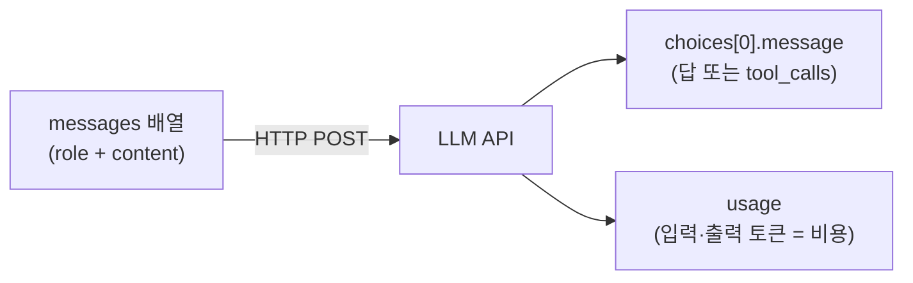

> 원안 5.1절. 교재는 `examples/01_api/` 11종입니다.  
> 예제 11종 전부를 수업에서 실행합니다. 이 문서에는 **11종 전부의 실제
> 실행 결과**를 실었습니다.  
> 실측 환경: 2026-08-14, litellm 1.96.2, 기본 모델 `gemini-3.5-flash-lite`

- **교재**: [examples/01_api](https://github.com/2026-ai-agents/day-01/tree/main/examples/01_api)
- **핵심 문장**: [[llm|LLM]] API의 전부는 "messages 배열을 보내면 choices가 돌아온다"



이 세션의 예제 11종은 전부 이 그림 하나의 변주입니다. 무엇을 실어 보내는가
(역할·이미지·히스토리), 무엇이 돌아오는가(문장·JSON·델타 청크), 그리고
usage가 곧 돈이라는 것.

## 1. 최소 호출: 요청과 응답의 전부

코드: [`01_hello_completion.py`](https://github.com/2026-ai-agents/day-01/blob/main/examples/01_api/01_hello_completion.py)

요청에 무엇이 실려 가고 응답에 무엇이 담겨 오는지, JSON 원문을 그대로 봅니다.

```python
request = {
    "model": model,
    "messages": [{"role": "user", "content": "안녕하세요! 한 문장으로 인사해 주세요."}],
}
response = completion(**request)
print(response.model_dump_json(indent=2))
```

실행 결과의 핵심부입니다.

```text
=== 응답 원문 (모델이 돌려주는 것 전체) ===
{
  "model": "gemini-3.5-flash-lite",
  "choices": [
    {
      "finish_reason": "stop",
      "message": {
        "content": "안녕하세요! 만나서 반가운데, 오늘 어떤 도움이 필요하신가요?",
        "role": "assistant",
        "tool_calls": null,
        "provider_specific_fields": { "thought_signatures": ["El4KXAERTTIP…"] }
      }
    }
  ],
  "usage": { "completion_tokens": 16, "prompt_tokens": 11, "total_tokens": 27 }
}

=== 그중 실제로 쓰는 것 ===
  choices[0].message.content = '안녕하세요! 만나서 반가운데, 오늘 어떤 도움이 필요하신가요?'
  usage = 입력 11 토큰 + 출력 16 토큰
```

읽기: 쓰는 것은 `content`와 `usage` 두 곳뿐이지만, `tool_calls: null` 자리를
기억해 두세요. 4세션에서 저 자리가 채워지는 순간 에이전트가 시작됩니다.
`provider_specific_fields`처럼 프로바이더 고유 필드가 섞여 오는 것도
실물에서만 보이는 부분입니다.

## 2. 역할: system이 내용과 형식을 정한다

코드: [`02_roles.py`](https://github.com/2026-ai-agents/day-01/blob/main/examples/01_api/02_roles.py)

같은 질문("오사카에서 꼭 먹어야 할 것 하나만")에 system만 바꿔 붙입니다.

```python
personas = {
    "(system 없음)": None,
    "미슐랭 심사위원": "당신은 미슐랭 심사위원입니다. 미식가의 기준으로 깐깐하게 답하세요.",
    "초등학생 눈높이": "당신은 초등학생에게 설명하는 선생님입니다. …",
    "JSON 응답기": "반드시 {\"추천\": ..., \"이유\": ...} 형태의 JSON으로만 답하세요.",
}
```

```text
=== system = (system 없음) ===
오사카 여행에서 단 하나만 먹어야 한다면 … '오코노미야키'를 추천합니다.

=== system = 미슐랭 심사위원 ===
… 미슐랭 심사위원의 엄격한 기준으로, 오직 단 하나의 미식 경험을 꼽아야
한다면 저는 망설임 없이 '제대로 된 갓포 요리(割烹)'를 선택하겠습니다.

=== system = 초등학생 눈높이 ===
와, 오사카 여행 정말 부럽다! 선생님은 타코야키를 꼭 추천할게! …

=== system = JSON 응답기 ===
{"추천": "타코야키", "이유": "오사카의 소울 푸드로, …"}
```

읽기: 답의 내용(갓포 요리 vs 타코야키)과 형식(산문 vs JSON)이 전부 system에서
갈렸습니다. 에이전트의 성격·규칙·말투가 실리는 자리이고, 7세션의 하네스에서
이 자리가 방어선이 됩니다.

## 3. 토큰: 한글이 더 비싼 이유

코드: [`03_tokens.py`](https://github.com/2026-ai-agents/day-01/blob/main/examples/01_api/03_tokens.py)

API 호출 없이 토크나이저만으로 도는 예제라 키가 필요 없습니다.

```text
   한국어 |   영어 | 문장
    11 |    9 | 안녕하세요, 오늘 날씨가 정말 좋네요.…
    23 |   23 | 3박 4일 오사카 여행 일정을 짜 주세요. 예산은 80…
    19 |   10 | 대규모 언어 모델은 토큰 단위로 텍스트를 처리합니다.…
  합계: 한국어 53 토큰 vs 영어 42 토큰 (약 1.3배)
```

읽기: 과금·컨텍스트 한도는 글자 수가 아니라 토큰 수 기준입니다. 같은 뜻을
한국어로 쓰면 이 랩 기준 약 1.3배의 토큰을 쓰고, 세 번째 문장(19 vs 10)처럼
2배 가까이 벌어지기도 합니다.

## 4. 컨텍스트 한도: 넘치면 잘리는 게 아니라 거부된다

코드: [`04_context_limit.py`](https://github.com/2026-ai-agents/day-01/blob/main/examples/01_api/04_context_limit.py)

채워진 키 중 한도가 가장 작은 모델을 골라, 한도의 1.5배를 보냅니다.
요청이 거부되므로 과금되지 않습니다.

```python
model = min(available_models(), key=lambda m: get_model_info(m)["max_input_tokens"])
limit = get_model_info(model)["max_input_tokens"]
text = chunk * (int(limit * 1.5) // chunk_tokens + 1)   # 확실히 초과
```

```text
=== anthropic/claude-haiku-4-5의 입력 한도 ===
  max_input_tokens = 200,000

=== 일부러 초과 요청 ===
  보내는 입력: 약 300,001 토큰 (한도의 1.5배)

=== 에러 원문 ===
  ContextWindowExceededError
  … "prompt is too long: 275024 tokens > 200000 maximum"
```

읽기: 두 가지가 보입니다. ① 초과분은 잘리는 게 아니라 요청 자체가 거부된다.
② 우리가 근사 토크나이저로 센 30만 토큰을 프로바이더는 27.5만으로 셌다.
토큰 수는 모델마다 다르게 세므로, 한도 근처의 계산은 항상 여유를 둬야 합니다.
에이전트 루프에서 히스토리가 무한히 자라면 정확히 이 에러를 만납니다.

## 5. temperature: 재현성과 다양성의 손잡이

코드: [`05_temperature.py`](https://github.com/2026-ai-agents/day-01/blob/main/examples/01_api/05_temperature.py)

temperature 0과 1로 같은 질문을 5번씩 던집니다.

```python
# Gemini 3+는 temperature를 시스템 지침으로 옮기는 중이라(호출마다 경고),
# 이 파라미터의 시연은 다른 프로바이더를 우선한다.
model = next((m for m in models if not m.startswith("gemini/")), models[0])
```

```text
(시연 모델: openai/gpt-5.4-nano)

=== temperature = 0.0 ===
  1회: 도쿄 / 2회: 도쿄 / 3회: 도쿄 / 4회: 도쿄 / 5회: 도쿄
  → 서로 다른 답 1종

=== temperature = 1.0 ===
  1회: **도쿄** / 2회: 도쿄 / 3회: 도쿄 / 4회: **오사카** / 5회: 도쿄 (Tokyo)
  → 서로 다른 답 4종
```

읽기: 0이면 5번 모두 같은 답, 1이면 내용도 표기도 흩어집니다. 재현성이
필요한 자리(도구 선택·채점·검증)는 0, 발상이 필요한 자리는 높게 씁니다.
곁가지 발견 하나: Gemini 3+는 이 파라미터 자체를 은퇴시키는 중입니다.
같은 파라미터도 프로바이더마다 지원 상태가 다르다는 실례입니다.

## 6. 스트리밍: 답은 조각으로 온다

코드: [`06_streaming.py`](https://github.com/2026-ai-agents/day-01/blob/main/examples/01_api/06_streaming.py)

```text
=== 처음 5개 청크 원문 ===
  chunk[0] delta='**'
  chunk[1] delta='"먹다 지쳐 쓰러진다는 \'구이도락(食い'
  chunk[2] delta="倒れ)'의 본고장이자, 화려한 네온사인과 정겨운 인간미가 공존"
  chunk[3] delta='하는 일본 최고의 활기찬 도시."**'
  chunk[4] delta=''

=== 조각을 이어붙인 전체 답 ===
  **"먹다 지쳐 쓰러진다는 '구이도락(食い倒れ)'의 본고장이자, …"** (총 6개 청크)
```

읽기: 채팅 UI가 글자를 흘리는 것의 실체가 이 델타 조각들입니다. 조각의 크기와
경계는 프로바이더 마음이라(청크 0은 `**` 두 글자, 청크 2는 한 구절), 이어붙이는
쪽이 완성 텍스트를 책임집니다.

## 7. 병렬 호출: 동시에 물으면 몇 배 빠른가

코드: [`07_async_parallel.py`](https://github.com/2026-ai-agents/day-01/blob/main/examples/01_api/07_async_parallel.py)

도시 5곳의 대표 음식을 순차로 묻고, 다시 동시에 묻습니다.

```python
tasks = [acompletion(model=model, messages=[…]) for city in cities]
await asyncio.gather(*tasks)
```

```text
=== 순차 호출 (5회) ===   5.2초
=== 병렬 호출 (5회 동시) ===   1.5초
=== 비교 ===   순차 5.2초 → 병렬 1.5초 (약 3.4배)
```

읽기: LLM 호출은 네트워크 대기가 대부분이라 병렬화 이득이 큽니다.
`acompletion` + `gather` 패턴 하나면 충분하고, Day 3 coding-agent의 병렬
worker가 이 확장판입니다.

## 8. 무상태: 기억은 서버가 아니라 배열에 있다

코드: [`08_multiturn_stateless.py`](https://github.com/2026-ai-agents/day-01/blob/main/examples/01_api/08_multiturn_stateless.py)

```text
=== 1턴: 자기소개 ===
  김철수님, 안녕하세요! 오사카 여행 계획을 세우고 계시다니 …

=== 2턴 (히스토리 없이): 제 이름이 뭐라고 했죠? ===
  죄송하지만, 이전 대화에서 이름을 말씀해 주지 않으셔서 저는 아직 성함을
  모릅니다.

=== 2턴 (히스토리 포함): 같은 질문 ===
  철수님의 이름은 김철수님이십니다!
```

읽기: 서버는 아무것도 기억하지 않습니다. "이어지는 대화"는 클라이언트가
messages 배열 전체를 매번 다시 보내서 만드는 착시입니다. 이 배열이 스텝마다
부풀어 비싸지는 것이 에이전트 루프의 비용 구조이고(5세션에서 그래프로 봅니다),
이 배열을 관리하는 일이 곧 컨텍스트 엔지니어링입니다.

## 9. JSON 강제: 부탁이 아니라 계약으로

코드: [`09_json_mode.py`](https://github.com/2026-ai-agents/day-01/blob/main/examples/01_api/09_json_mode.py)

````text
=== 그냥 부탁만 한 경우 ===
  오사카의 대표적인 명소 2곳을 담은 JSON 배열입니다.
  ```json
  [ { "name": "오사카 성", … } ]
  ```
  → json.loads 실패: Expecting value: line 1 column 1 (char 0)

=== response_format으로 강제한 경우 ===
  [{"name": "오사카 성", "fee": "600엔"}, {"name": "우메다 스카이 빌딩", "fee": "2000엔"}]
  → json.loads 통과
````

읽기: 부탁하면 설명 문장과 코드펜스가 섞여 와서 파싱이 깨집니다. 강제하면
파싱이 계약이 됩니다. 다만 형태의 계약일 뿐 값의 계약은 아니라서(fee가
"600엔"이라는 문자열), 타입까지 묶는 방법은 4세션의 구조화 출력에서 잇습니다.

## 10. 이미지 입력: 멀티모달도 같은 구조

코드: [`10_vision.py`](https://github.com/2026-ai-agents/day-01/blob/main/examples/01_api/10_vision.py)

공개 이미지를 직접 내려받아 base64 data URL로 싣습니다.

```python
req = urllib.request.Request(image_url, headers={"User-Agent": "day-01-lab/1.0"})
image_b64 = base64.b64encode(urllib.request.urlopen(req).read()).decode()
content = [
    {"type": "text", "text": "이 사진의 건물이 무엇인지 한 문장으로 답해 주세요."},
    {"type": "image_url", "image_url": {"url": f"data:image/jpeg;base64,{image_b64}"}},
]
```

```text
=== 이미지 입력의 모양 ===
  원본 86KB(base64)가 data URL로 content 배열에 들어간다

=== 응답 ===
  이 사진 속 주요 건물은 일본 오사카에 위치한 역사적인 랜드마크인 오사카성입니다.
```

읽기: content가 문자열에서 [text 조각, image 조각] 배열로 바뀌었을 뿐, 구조는
같습니다. 참고로 이 예제는 처음에 이미지 URL을 그대로 넘기다가 호스트의
User-Agent 차단과 썸네일 정책에 두 번 깨졌습니다. 이미지를 직접 받아 base64로
싣는 지금 방식이 실전에서도 안전한 형태입니다.

## 11. 비용 계산: 토큰 곱하기 단가

코드: [`11_cost_calc.py`](https://github.com/2026-ai-agents/day-01/blob/main/examples/01_api/11_cost_calc.py)

키 없이 돕니다. 비용 = 입력 토큰 × 입력 단가 + 출력 토큰 × 출력 단가.

```text
=== 모델별 비용 (litellm 내장 단가표) ===
  모델                              입력단가/1M   출력단가/1M      이 호출
  gemini/gemini-3.5-flash-lite     $     0.30   $     2.50   $ 0.001257
  openai/gpt-5.4-nano              $     0.20   $     1.25   $ 0.000630
  anthropic/claude-haiku-4-5       $     1.00   $     5.00   $ 0.002523
```

읽기: "3박 4일 오사카" 요청에 500토큰짜리 답을 가정한 계산입니다. 호출 한
번은 티끌이지만 에이전트는 루프입니다. 스텝 10번, 부푸는 히스토리, 멀티
에이전트 N명이면 자릿수가 달라집니다. 그래서 7세션에서
[[budget-guard|budget guard]]를 답니다.

## 이 세션이 남기는 것

- 응답에서 쓰는 곳은 `content`와 `usage`, 그리고 아직 비어 있는 `tool_calls`
- 기억은 서버가 아니라 messages 배열에 있고, 그 배열이 비용이다
- 형태는 강제할 수 있지만(JSON 모드), 값의 보증은 다음 세션들의 몫이다

다음 세션: [LiteLLM 통합 레이어](/course/day-01-session-03/)
