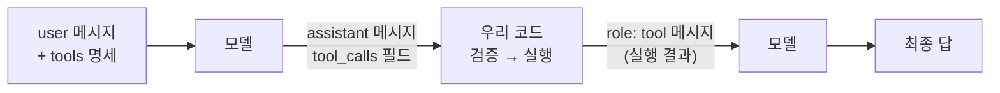
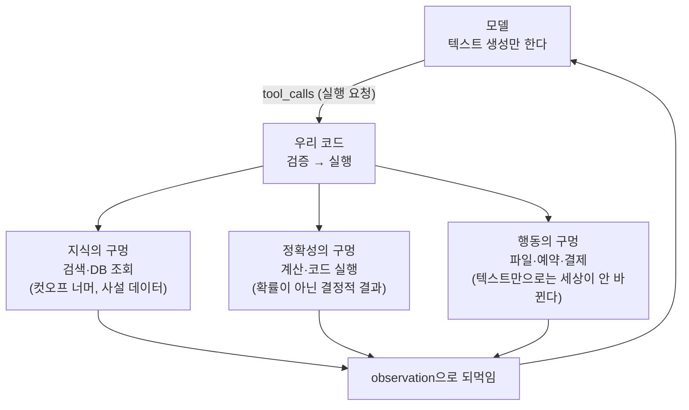
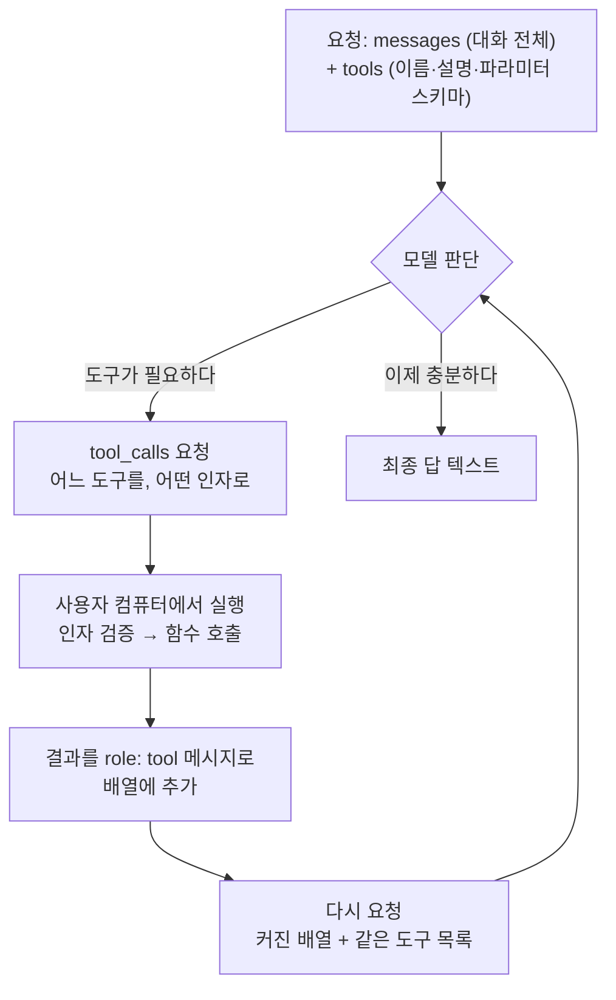
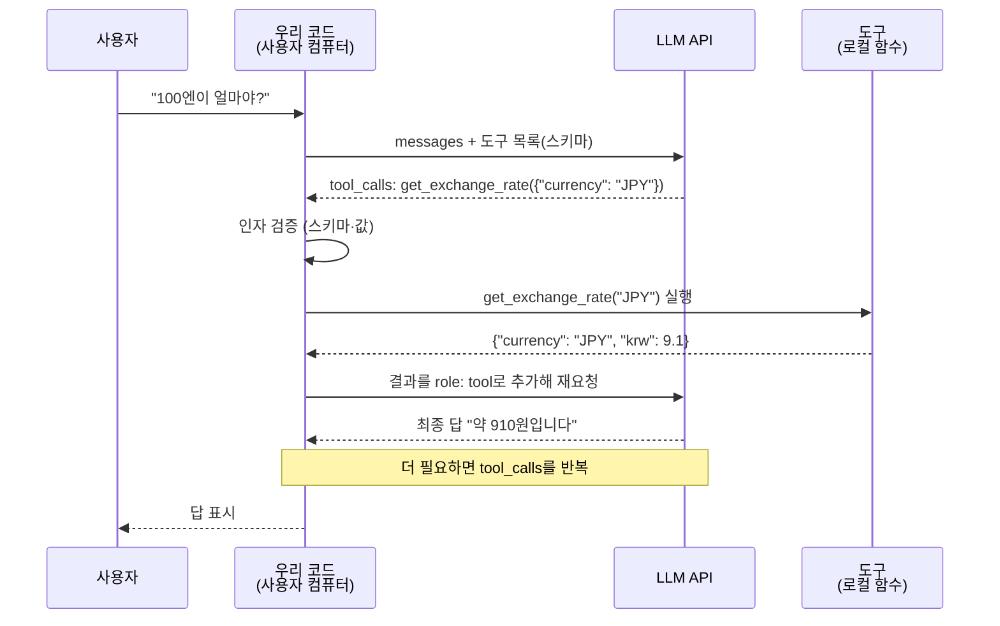

> 원안 5.3절. 교재는 `examples/03_tools/` 10종이고, 세션 끝에서
> 릴리즈 사다리의 **v0.2**로 오릅니다.  
> 예제 10종 전부를 수업에서 실행합니다. 이 문서에는 **10종 전부의 실제
> 실행 결과**를 실었습니다.

- **교재**: [examples/03_tools](https://github.com/2026-ai-agents/day-01/tree/main/examples/03_tools)
- **핵심 문장**: 모델은 함수를 실행하지 못한다. "실행해 달라"고 요청할 뿐이고, 실행은 우리 코드의 일이다



[[tool-calling|tool calling]]의 전부가 이 왕복 한 번입니다. 모델이 보내는
것도, 우리가 돌려주는 것도 결국 messages 배열에 쌓이는 평범한 메시지입니다.

## 1. 왕복 한 번을 끝까지 손으로

코드: [`01_single_tool.py`](https://github.com/2026-ai-agents/day-01/blob/main/examples/03_tools/01_single_tool.py)

#### 무엇을 보는가

환율 조회 도구 1개짜리 최소 구성입니다.

#### 코드 발췌

```python
def get_exchange_rate(currency: str) -> dict:
    return {"currency": currency, "krw": RATES[currency]}

resp = completion(model=model, messages=messages, tools=tools)
call = resp.choices[0].message.tool_calls[0]          # ① 모델의 실행 요청
result = get_exchange_rate(**json.loads(call.function.arguments))  # ② 우리가 실행
messages.append({"role": "tool", "tool_call_id": call.id,
                 "content": json.dumps(result)})       # ③ 결과 회신
```

#### 코드 실행

```bash
docker compose exec lab python examples/03_tools/01_single_tool.py
```

#### 실행 결과

```text
=== 1왕복: 모델이 도구를 요청한다 ===
  요청된 함수: get_exchange_rate
  요청된 인자: {"currency": "JPY"}

=== 2왕복: 우리가 실행하고, 결과를 되돌려준다 ===
  실행 결과: {'currency': 'JPY', 'krw': 9.1}

=== 최종 답 ===
  현재 환율 기준으로 100엔은 약 **910원**입니다.
```

#### 결과 읽기

"100엔이 얼마쯤이죠?"라는 자연어가 `{"currency": "JPY"}`라는 구조화된
인자로 바뀌었습니다. 이 번역이 모델의 몫이고, 실행과 회신은 전부 우리 코드의
몫입니다.

## 2. tool call의 실체: 메시지 필드 하나

코드: [`02_roundtrip_raw.py`](https://github.com/2026-ai-agents/day-01/blob/main/examples/03_tools/02_roundtrip_raw.py)

#### 무엇을 보는가

같은 왕복을 이번엔 원문으로 봅니다.

#### 코드 실행

```bash
docker compose exec lab python examples/03_tools/02_roundtrip_raw.py
```

#### 실행 결과

```text
=== ① 모델이 보낸 assistant 메시지 원문 ===
{
  "content": null,
  "role": "assistant",
  "tool_calls": [
    {
      "function": { "arguments": "{\"city\": \"오사카\"}", "name": "get_weather" },
      "id": "call_85312__thought__El4KXAER…",
      "type": "function"
    }
  ]
}

=== ③ 이 시점의 messages 배열 전체 구조 ===
  [0] role=user      content
  [1] role=assistant tool_calls
  [2] role=tool      content

=== ④ 최종 답 ===
  오사카의 오늘 날씨는 맑고, 기온은 21도입니다. 야외활동하기 좋은 날씨네요!
```

#### 결과 읽기

"모델이 함수를 호출한다"의 실체는 assistant 메시지의 `tool_calls` 필드
하나입니다. `content`는 null이고, 우리가 돌려주는 것도 role이 tool인 평범한
메시지입니다. Gemini는 call id에 자기 내부 서명을 붙여 보내는 것도 원문에서만
보입니다. 프로바이더마다 이런 결이 다르고, 그것을 담요처럼 덮는 것이
LiteLLM의 일입니다.

## 3. 도구의 개요: AI는 도구로 세상과 닿는다

1번과 2번이 왕복의 기계 장치를 보여줬으니, 한 발 물러서서 봅니다. 도구란
무엇이고, 우리가 매일 쓰는 AI 제품 속에서 어떻게 일하고 있으며, 만들 때는
무엇을 지켜야 하는가. 이 지도를 갖고 가면 뒤의 예제 여덟 개가 전부 이 지도의
한 칸씩입니다.

#### 우리가 매일 만나는 도구들

모델 자체는 텍스트를 생성하는 것밖에 못 합니다. 그런데 우리가 쓰는 제품들은
분명히 그 이상을 합니다.

- ChatGPT가 "검색 중…"을 띄우는 순간: 웹 검색 도구가 불린 것입니다
- Claude가 첨부 문서를 읽고 표를 고치는 순간: 파일 읽기·쓰기 도구입니다
- Claude Code가 코드를 고치고 테스트를 돌리는 순간: Read·Edit·Bash 같은
  도구들이고, 그것을 반복하는 루프가 다음 세션에서 만들 [[react|ReAct]]입니다

전부 1번에서 손으로 밟은 왕복, 그대로입니다. 모델이 요청하고, 제품의 코드가
실행하고, 결과를 되먹입니다. 그래서 **같은 모델이라도 쥐여준 도구 목록이
다르면 다른 제품**이 됩니다. 모델이 "할 수 있는 일"의 경계는 모델이 아니라
도구 목록이 긋습니다.

#### 도구가 메우는 세 가지 구멍



- **지식**: 모델은 학습 시점 이후를 모르고, 우리 회사 DB는 아예 모릅니다.
  검색·조회 도구가 그 구멍을 메웁니다
- **정확성**: 모델의 산수는 그럴듯한 확률이지 계산이 아닙니다. 환율표를
  뒤지는 1번의 도구처럼, 정확해야 하는 값은 결정적 코드가 냅니다
- **행동**: 답변 텍스트는 세상을 바꾸지 못합니다. 예약이 잡히고 파일이
  써지는 것은 도구가 실행됐기 때문입니다. 그래서 행동 도구에는 권한이
  따라붙습니다 (7세션의 게이트)

#### 만들 때 지켜야 하는 것

이 세션의 남은 예제들이 하나씩 증명할 규율의 목록입니다.

- **모델에게 도구는 문자열이 전부다**: 코드가 아니라 이름·설명·스키마만
  보입니다. 설명이 곧 프롬프트입니다 (11번에서 실측)
- **인자는 모델이 지어낸 값이다**: 형태는 스키마가, 값의 실재는 실행 직전의
  검증 코드가 책임집니다 (4번과 9번)
- **에러는 죽이지 말고 되먹인다**: 실패를 알려주면 모델이 방법을 바꿉니다
  (8번)
- **좁게 준다**: 필요한 최소 도구만 쥐여줍니다. 목록이 길수록 선택 품질이
  떨어지고, 위험 도구가 섞일수록 공격면이 넓어집니다 (11번과 7세션)

## 4. Pydantic: 스키마와 검증이 한 몸

코드: [`03_pydantic_schema.py`](https://github.com/2026-ai-agents/day-01/blob/main/examples/03_tools/03_pydantic_schema.py)

#### 무엇을 보는가

스키마 생성 부분은 키 없이 돕니다.

#### 코드 발췌

```python
class BudgetArgs(BaseModel):
    """여행 예산 계산 인자 — 이 docstring이 그대로 설명이 된다."""
    nights: int = Field(ge=0, description="숙박 일수")
    people: int = Field(ge=1, description="인원 수")
    include_flight: bool = Field(default=True, description="항공권 포함 여부")

schema = BudgetArgs.model_json_schema()      # ① 모델에게 보여줄 스키마
BudgetArgs.model_validate(raw_args)          # ② 도착한 인자의 검증
```

#### 코드 실행

```bash
docker compose exec lab python examples/03_tools/03_pydantic_schema.py
```

#### 실행 결과

```text
=== pydantic 모델에서 뽑은 JSON 스키마 ===
{
  "properties": {
    "nights": { "minimum": 0, "type": "integer", … },
    "people": { "minimum": 1, "type": "integer", … },
    "include_flight": { "default": true, "type": "boolean", … }
  },
  "required": ["nights", "people"], …
}

=== 도착한 인자의 검증도 같은 모델로 ===
  정상 인자 → nights=3 people=2 include_flight=True
  불량 인자 → ValidationError (ge 제약이 잡았다)
```

#### 결과 읽기

손으로 쓰던 JSON 스키마가 파이썬 클래스에서 자동으로 나오고, 같은
클래스가 도착한 인자를 검증합니다. 명세와 검증이 한 몸이라 어긋날 수가
없습니다. 아래 v0.2에서 보듯 에이전트 본체의 도구가 전부 이 방식입니다.

## 5. 병렬 도구 호출: 독립 조회는 한 턴에

코드: [`04_parallel_tools.py`](https://github.com/2026-ai-agents/day-01/blob/main/examples/03_tools/04_parallel_tools.py)

#### 무엇을 보는가

항공과 숙소, 서로 의존이 없는 조회 2건을 한 질문에 담습니다. 모델이
tool_calls 배열에 두 요청을 함께 실어 보내는지 봅니다.

#### 코드 실행

```bash
docker compose exec lab python examples/03_tools/04_parallel_tools.py
```

#### 실행 결과

```text
=== 한 턴에 실려 온 도구 요청: 2건 ===
  search_flights({"city": "오사카"})
  search_hotels({"city": "오사카"})

=== 두 결과를 함께 반영한 답 ===
  * 항공권 (최저가 기준): 약 310,000원 (LCC 기준)
  * 숙소 (1박 기준): 난바 지역 기준 약 120,000원
```

#### 결과 읽기

tool_calls는 배열입니다. 서로 의존이 없는 조회면 모델이 두 요청을 한
턴에 실어 보내고, 왕복이 줄어든 만큼 싸고 빠릅니다.

## 6. 인자 제약: 스키마는 프롬프트보다 강하다

코드: [`05_arg_constraints.py`](https://github.com/2026-ai-agents/day-01/blob/main/examples/03_tools/05_arg_constraints.py)

#### 무엇을 보는가

키 없이 돕니다. 선택 인자·기본값·enum이 스키마에 실리는 모양입니다.

#### 코드 실행

```bash
docker compose exec lab python examples/03_tools/05_arg_constraints.py
```

#### 실행 결과

```text
  "category": {
    "anyOf": [ { "enum": ["관광", "식당", "카페"], "type": "string" },
               { "type": "null" } ],
    "default": null, …
  },
  "max_results": { "default": 5, "maximum": 20, "minimum": 1, … },
  "required": ["city"]
```

#### 결과 읽기

enum은 "이 셋 중 하나만", default는 "안 주면 이 값", required 밖은 "안
줘도 됨"을 모델에게 선언합니다. "카테고리는 관광·식당·카페 중 하나로 해줘"라는
프롬프트 문장보다, 스키마에 박힌 enum이 강합니다.

## 7. tool_choice: 쓸지 말지를 코드가 정한다

코드: [`06_tool_choice.py`](https://github.com/2026-ai-agents/day-01/blob/main/examples/03_tools/06_tool_choice.py)

#### 무엇을 보는가

도구가 전혀 필요 없는 인사말에 tool_choice 세 값을 시험합니다.

#### 코드 실행

```bash
docker compose exec lab python examples/03_tools/06_tool_choice.py
```

#### 실행 결과

```text
=== tool_choice = auto (기본) ===      인사말에 대한 반응: 그냥 답변
=== tool_choice = none (금지) ===      인사말에 대한 반응: 그냥 답변
=== tool_choice = required (강제) ===  인사말에 대한 반응: 도구 요청 calc_budget
```

#### 결과 읽기

required가 인사에도 예산 도구를 부르게 만들었습니다. 강제는 강력하지만
질문과 무관한 호출도 만듭니다. 구조화 출력(10번)처럼 제어권을 코드가 가져야
하는 자리에 골라 씁니다.

## 8. 에러 되먹임: 실패를 알려주면 복구한다

코드: [`07_tool_error.py`](https://github.com/2026-ai-agents/day-01/blob/main/examples/03_tools/07_tool_error.py)

#### 무엇을 보는가

도구는 THB(태국 바트)를 모릅니다. 예외를 죽이는 대신 에러를 결과로
돌려줍니다.

#### 코드 발췌

```python
except ValueError as e:
    result = json.dumps({"error": str(e)}, ensure_ascii=False)
messages.append({"role": "tool", "tool_call_id": call.id, "content": result})
```

#### 코드 실행

```bash
docker compose exec lab python examples/03_tools/07_tool_error.py
```

#### 실행 결과

```text
=== [1] get_exchange_rate({'currency': 'THB'}) → 실패를 되먹임 ===
  {"error": "지원하지 않는 통화: THB. 지원 목록: ['JPY', 'USD']"}

=== [1] get_exchange_rate({'currency': 'JPY'}) → 성공 ===

=== [2] 최종 답 ===
  죄송합니다. 현재 바트(THB) 환율은 직접 조회할 수 없습니다.
  대신 엔화(JPY) 환율을 기준으로 대략적인 금액을 …
```

#### 결과 읽기

에러 메시지를 읽은 모델이 지원 통화(JPY)로 방법을 바꿔 답을
완성했습니다. 좋은 에러 메시지는 사람을 위한 것이기 전에 모델을 위한
것입니다. 지원 목록을 에러에 담았기에 복구가 한 번에 됐습니다.

## 9. 인자 환각: 스키마는 통과해도 값은 허구일 수 있다

코드: [`08_hallucinated_args.py`](https://github.com/2026-ai-agents/day-01/blob/main/examples/03_tools/08_hallucinated_args.py)

#### 무엇을 보는가

호텔 목록을 알려주지 않고 예약을 시키면, 모델은 이름을 지어냅니다.

#### 코드 실행

```bash
docker compose exec lab python examples/03_tools/08_hallucinated_args.py
```

#### 실행 결과

```text
=== 모델이 보낸 인자 ===
  {'nights': 3, 'hotel': '오사카 오션뷰 호텔'}

=== 실행 전 검증 ===
  차단: Value error, 존재하지 않는 호텔: '오사카 오션뷰 호텔'.
        목록: ['난바 그랜드', '우메다 스카이', '신사이바시 인']
  → 스키마는 통과했지만 값이 허구다. 검증이 없었다면 유령 예약이 실행됐다
```

#### 결과 읽기

'오사카 오션뷰 호텔'은 문자열 타입이라 스키마는 통과합니다. 값이
실재하는지는 스키마가 모릅니다. pydantic validator의 존재 확인이 실행 직전에
잡았습니다. LLM이 만든 값은 실행 직전에 코드로 검증한다, 예외 없이. 이것이
Day 2 food-rag-agent 검증자의 씨앗입니다.

## 10. 구조화 출력: LLM을 타입 있는 함수처럼

코드: [`09_structured_output.py`](https://github.com/2026-ai-agents/day-01/blob/main/examples/03_tools/09_structured_output.py)

#### 무엇을 보는가

도구를 실행할 생각이 없어도, 원하는 출력 구조를 스키마로 강제할 수 있습니다.

#### 코드 발췌

```python
tool = {"type": "function", "function": {
    "name": "emit_trip_plan",
    "parameters": TripPlan.model_json_schema()}}
resp = completion(…, tools=[tool],
                  tool_choice={"type": "function", "function": {"name": "emit_trip_plan"}})
plan = TripPlan.model_validate(json.loads(raw))   # 여기서부터는 파이썬 객체
```

#### 코드 실행

```bash
docker compose exec lab python examples/03_tools/09_structured_output.py
```

#### 실행 결과

```text
=== 검증까지 통과한 타입 있는 결과 ===
  city = 교토, budget = 400,000원, days = 2일
  1일차: 아침 교토역 도착 및 아라시야마 대나무숲 산책 / 점심 니시키 시장 … / 저녁 기온 거리 …
  2일차: 아침 후시미이나리 신사 … / 점심 산넨자카 두부 요리 … / 저녁 기요미즈데라 야간개장 …
```

#### 결과 읽기

2세션의 JSON 모드가 형태만 보장했다면, 이것은 `plan.days[0].lunch`처럼
타입까지 보장합니다. 자유 문장이 검증된 객체가 되는 순간이고, 문자열 파싱은
없습니다.

## 11. 도구 선택: 이름과 설명이 품질을 가른다

코드: [`10_tool_selection.py`](https://github.com/2026-ai-agents/day-01/blob/main/examples/03_tools/10_tool_selection.py)

#### 무엇을 보는가

같은 10개 도구를 ① 성의 있는 이름·설명, ② 익명 이름(tool_0…)·무성의한 설명
두 벌로 등록하고 같은 질문("이번 주말 오사카에 축제 하나요?")을 던집니다.

#### 코드 실행

```bash
docker compose exec lab python examples/03_tools/10_tool_selection.py
```

#### 실행 결과

```text
=== 성의 있는 이름·설명 ===
  선택된 도구: event_calendar  (정답: event_calendar)

=== 익명 이름·무성의한 설명 ===
  선택된 도구: tool_0  (정답: tool_8)
```

#### 결과 읽기

실행 코드는 한 줄도 바뀌지 않았는데, 문자열을 지우자 선택이
틀렸습니다. tool_0은 장소 검색 자리입니다. 모델이 보는 것은 코드가 아니라
이름과 설명 문자열뿐입니다. 도구 설명은 곧 프롬프트입니다.

## 12. 전체 그림: 요청에서 답까지, 도구 호출의 한 바퀴

세션을 닫으며 전 과정을 한 장으로 정리합니다. 지금까지의 예제 열한 개가
전부 이 그림 안의 어느 화살표였습니다.

#### 요청에 실려 가는 것

매 요청에는 두 가지가 함께 실립니다.

- **messages**: 지금까지의 대화 전체. 이전의 도구 요청과 결과도 여기
  쌓여 있습니다
- **tools**: 도구 목록. 도구마다 이름, 설명(문서화), 파라미터 스키마가
  들어갑니다

한 가지 유의할 점: 스키마가 선언하는 것은 **입력(파라미터)뿐**입니다. 리턴
타입 선언란은 없습니다. 결과는 role이 tool인 메시지의 문자열로 돌아갈
뿐이고, 모델은 도구 설명과 관찰한 결과로 리턴의 모양을 파악합니다. 결과
JSON의 키를 일관되게 유지하는 것이 중요한 이유입니다.

#### 구조도: 판단과 실행의 순환



모델은 매번 "다른 도구가 더 필요한가, 이제 답할 수 있는가"만 판단합니다.
이 순환에 종료 조건을 달아 돌리는 것이 다음 세션의 [[react|ReAct]]입니다.

#### 역할별 흐름: 누가 무엇을 하는가



- **모델(LLM API)**: 판단만 합니다. 어떤 도구를 어떤 인자로 쓸지 정하고,
  결과를 읽고, 답을 씁니다. 실행 능력은 없습니다
- **우리 코드(사용자 컴퓨터)**: 실행의 전부를 쥡니다. 검증, 함수 호출, 결과
  회신, 그리고 위험 도구 앞의 게이트까지. 방어선이 전부 여기인 이유입니다
- **도구(로컬 함수)**: 모델의 존재를 모릅니다. 그냥 파이썬 함수입니다.
  단위 테스트가 쉬운 이유이기도 합니다

#### 이 구조가 알려주는 것

- **실행 주체는 항상 사용자 쪽입니다**: ChatGPT의 검색도, Claude Code의
  파일 수정도, 실행은 서비스의 코드가 합니다. 모델은 끝까지 텍스트(요청)만
  보냅니다
- **도구 목록은 매 요청 반복 전송됩니다**: 도구 스키마도 토큰입니다. 도구가
  많을수록 매번 내는 비용이 커집니다. 3번에서 말한 "좁게 준다"의 이유가
  하나 더 늘었습니다
- **결과도 그냥 메시지입니다**: 2세션의 무상태 원칙이 여기서도 성립합니다.
  왕복의 기억은 전부 배열에 있습니다

## v0.2 코드 포인트: 예산 계산 도구가 스키마로 실리는 지점

에이전트 본체에 도구 3종(검색·이동시간·예산)이 실립니다. 코드에서 보는 곳은
[agent/tools.py](https://github.com/2026-ai-agents/day-01/blob/main/agent/tools.py)입니다.

```python
class BudgetArgs(BaseModel):
    """숙박·식비·항공을 합쳐 여행 예산(원)을 계산한다."""
    nights: int = Field(ge=0, le=30, description="숙박 일수")
    people: int = Field(ge=1, le=10, description="인원 수")
    style: Literal["절약", "보통", "고급"] = Field(default="보통", …)
    include_flight: bool = Field(default=True, …)

REGISTRY = {
    "search_places": (SearchPlacesArgs, search_places),
    "estimate_travel_time": (TravelTimeArgs, estimate_travel_time),
    "calc_budget": (BudgetArgs, calc_budget),
}

def run_tool(name: str, raw_arguments: str) -> str:
    """도구 실행의 단일 관문: 검증 → 실행 → JSON 문자열."""
```

- docstring이 곧 도구 설명입니다. 11번 예제의 교훈이 구조로 박힌 자리입니다
- `run_tool` 관문 하나로만 실행합니다. 검증 실패·미등록 도구도 예외가 아니라
  에러 결과로 돌려줘서, 8번 예제의 복구 패턴이 항상 성립합니다
- 이 지점의 유닛 테스트 11개가 예산 산수·스키마 제약·관문의 방어를 박제합니다

```bash
git checkout v0.2
docker compose exec lab python -m agent.main "3박 4일 오사카 2명, 예산 얼마나 들까?"
docker compose exec lab pytest        # 이 시점의 테스트 16개 통과
```

v0.2의 에이전트는 도구를 딱 1왕복만 씁니다. 여러 도구를 오가며 반복하는
루프는 다음 세션의 v0.3에서 완성됩니다.

## 이 세션이 남기는 것

- tool call의 실체는 메시지 필드 하나, 실행·회신은 전부 우리 코드
- 모델의 능력 경계는 도구 목록이 긋는다. 지식·정확성·행동의 구멍을 도구가 메운다
- pydantic 모델 하나 = 스키마 생성 + 인자 검증. 명세와 검증이 한 몸
- 에러도 결과다. 잘 쓴 에러 메시지가 모델의 복구를 만든다
- 스키마는 형태만 안다. 값의 실재는 실행 직전의 검증 코드가 책임진다
