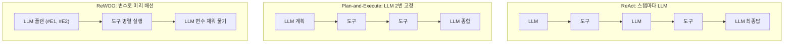

> 원안 5.5절. 교재는 `examples/05_loops/` 6종이고, 세션 끝에서 **v0.4**로
> 오릅니다.  
> 예제 6종 전부를 수업에서 실행합니다. 이 문서에는 **6종 전부의 실제
> 실행 결과**를 실었습니다. 도구 층은 결정적 목데이터라 루프 구조만
> 관찰됩니다.

- **교재**: [examples/05_loops](https://github.com/2026-ai-agents/day-01/tree/main/examples/05_loops)
- **출발점**: [[react|ReAct]]의 한계. 한 스텝씩 더듬어 가느라 느리고, 매 스텝에 전체 히스토리를 실어 비쌉니다



## 1. Plan-and-Execute: 계획 먼저, 실행은 LLM 없이

코드: [`01_plan_execute.py`](https://github.com/2026-ai-agents/day-01/blob/main/examples/05_loops/01_plan_execute.py)

```python
# ① 계획: 도구 호출 목록을 JSON으로 한 번에 뽑는다
plan = json.loads(completion(…, response_format={"type": "json_object"}).…)["steps"]
# ② 실행: LLM 없이 도구만 돈다
observations = [run(step) for step in plan]
# ③ 종합: 결과를 모아 한 번에 답을 만든다
final = completion(…, content=f"요청: {question}\n도구 결과: {observations}…")
```

```text
=== ① 계획 (LLM 호출 1번) ===
  1. search({'city': '오사카', 'category': '관광'})
  2. budget({'nights': 1, 'people': 2})

=== ② 실행 (LLM 호출 0번) ===
  search → [{"name": "오사카성", …}, {"name": "도톤보리", …}, …]
  budget → {"숙박": 120000, "식비": 200000, "항공": 700000, "합계": 1020000}

=== ③ 종합 (LLM 호출 1번) ===
  ### 예상 예산 (2인 기준, 1박 2일)
  * 항공: 700,000원 / 숙박: 120,000원 / 식비: 200,000원 / 합계: 1,020,000원

=== 정리 ===
  LLM 호출 총 2번 (ReAct였다면 도구 2개 + 최종답 = 3번 이상)
```

읽기: [[plan-execute|Plan-and-Execute]]는 호출 횟수가 계획 1 + 종합 1로
고정입니다. 도구 실행 사이에 LLM이 없으니 5세션의 팽창 계단이 아예 생기지
않습니다. 대신 계획이 틀리면 그대로 틀립니다. 그 약점을 다음 예제가
메웁니다.

## 2. 재계획: 막히면 실패를 들고 계획으로

코드: [`02_replan.py`](https://github.com/2026-ai-agents/day-01/blob/main/examples/05_loops/02_replan.py)

목DB에 없는 도시(나라)를 물어 실패 경로를 확실히 밟습니다.

```python
if attempt > 1:
    extra = f"주의: 직전 계획의 {failed!r} 검색이 빈 결과였다. 검색 가능한 도시: 오사카, 교토"
```

```text
=== 계획 시도 1 ===
  계획: search({'city': '나라', 'category': '관광'})
  실행 실패: '나라' 검색 결과 0건 → 재계획으로

=== 계획 시도 2 ===
  계획: search({'city': '교토', 'category': '관광'})

=== 실행 성공 ===
  교토 → 2곳: ['후시미 이나리', '기요미즈데라']
```

읽기: 실패 기록("나라가 빈 결과였다")과 힌트를 첨부해 계획을 다시 세우자,
2차 계획이 지원 도시로 옮겨 갔습니다. "계획 → 실행 → 막히면 재계획"이
Day 3 coding-agent 복구 루프의 원형입니다. 재계획에도 한도(3회)가 있다는 것,
소진되면 사람에게 넘긴다는 것까지가 설계입니다.

## 3. Reflexion: 생성과 평가의 분리

코드: [`03_reflexion.py`](https://github.com/2026-ai-agents/day-01/blob/main/examples/05_loops/03_reflexion.py)

가족 단톡방 후기 3문장을 쓰고, 평가자가 루브릭으로 채점합니다.

```python
RUBRIC = """다음 기준으로 채점하라 (각 0~10, JSON으로만 답):
- specific: 구체적 장소·음식 이름이 들어갔는가
- tone: 가족 단톡방에 맞는 말투인가
- length: 정확히 3문장인가"""

draft = generate(feedback)          # 생성자
score = evaluate(draft)             # 평가자 (temperature 0)
if total >= 24: break               # 통과 기준
feedback = score["feedback"]        # 미달이면 피드백을 들고 재시도
```

```text
=== 시도 1 — 평가 28/30 ===
  "가족들 생각나서 여행 내내 틈틈이 선물 골랐는데 … 다음에는 꼭 우리 가족
  다 같이 다시 오자!"
  채점: {'specific': 8, 'tone': 10, 'length': 10,
        'feedback': '오사카라는 구체적 지명이 언급되어 있으나, 더 구체적인
                     음식이나 장소 이름이 추가되면 완벽합니다.'}
  → 통과 기준(24) 도달, 종료
```

읽기: 이번 실행은 1회 만에 통과했지만, 구조가 중요합니다. 평가자는 점수와
함께 "무엇이 부족한가"를 한 줄로 돌려주고, 미달이면 그 피드백이 다음 생성
프롬프트에 박힙니다. "한 번에 잘 쓰기"보다 "고칠 점을 알고 다시 쓰기"가 쉽다는
사실을 구조로 만든 것이 [[reflexion|Reflexion]]입니다.

## 4. 루브릭 실험: 기준을 바꾸면 승자가 뒤집힌다

코드: [`04_eval_rubric.py`](https://github.com/2026-ai-agents/day-01/blob/main/examples/05_loops/04_eval_rubric.py)

같은 초안 2개(정보형 A, 감성형 B)를 두 루브릭으로 채점합니다.

```text
=== 루브릭 ①: 정보 밀도 ===
  초안 A (정보형): 10점 — 입장료·이동 시간·가격·위치가 매우 잘 포함
  초안 B (감성형): 1점 — 구체적인 가격이나 시간 정보가 전혀 없어 낮은 점수

=== 루브릭 ②: 감성 전달 ===
  초안 A (정보형): 4점 — 장면이 연상되거나 여운을 느끼기에는 아쉬움
  초안 B (감성형): 9점 — 풍경이 시각적으로 선명하게 그려지며 깊은 여운
```

읽기: 같은 글이 10점과 4점, 1점과 9점을 오갔습니다. 바뀐 것은 글이 아니라
기준입니다. 평가자를 두는 순간 "무엇이 좋은 결과인가"의 정의가 코드에
박제되므로, Reflexion의 품질은 생성자가 아니라 루브릭 설계에서 나옵니다.

## 5. ReWOO: 관찰 없이 플랜 한 번, 도구는 병렬

코드: [`05_rewoo.py`](https://github.com/2026-ai-agents/day-01/blob/main/examples/05_loops/05_rewoo.py)

결과 자리를 #E1, #E2 변수로 비워 둔 채 계획을 세웁니다.

```text
=== ① 플랜 (변수 자리가 비어 있다) ===
  #E1 = search({'city': '오사카', 'category': '관광'})
  #E2 = budget({'nights': 1, 'people': 2})
  solve: #E1의 관광지 목록과 #E2의 예산을 조합하여 최종 답을 작성합니다.

=== ② 도구 일괄 실행 (서로 의존이 없으니 병렬 가능) ===
  #E1 ← [{"name": "오사카성", …}, …]
  #E2 ← {"합계": 1020000, …}

=== ③ 변수를 채워 한 번에 풀기 ===
  ### 오사카 1박 2일 2인 여행 예산
  * 숙박비 120,000원 / 식비 200,000원 / 항공료 700,000원 / 총 합계 1,020,000원
```

읽기: [[rewoo|ReWOO]]도 LLM 호출 2번 고정이지만, Plan-and-Execute와 달리
플랜 시점에 결과를 변수로 미리 배선해 두므로 도구를 전부 병렬로 던질 수
있습니다. 대가는 적응력입니다. 중간 결과를 보고 방향을 트는 능력이 없어서,
2번 예제 같은 상황이 오면 그대로 무너집니다. 토큰 절약 특화 루프입니다.

## 6. 루프 비용 비교: 같은 과제의 두 계산서

코드: [`06_loop_cost_compare.py`](https://github.com/2026-ai-agents/day-01/blob/main/examples/05_loops/06_loop_cost_compare.py)

```text
=== 계산서 ===
  루프                     LLM호출     입력tk     출력tk        비용
  ReAct                      2      483      312 $  0.000925
  Plan-and-Execute           2      207      373 $  0.000995
```

읽기: 정직하게 읽어야 하는 결과입니다. 이 과제는 도구 2개짜리로 작아서,
ReAct도 2호출 만에 끝났고 비용 차이가 사실상 없습니다. Plan-and-Execute의
이득은 스텝이 늘수록 벌어집니다. 5세션의 팽창 그래프(6스텝, 입력 7,400토큰)와
나란히 놓고 보면, 루프 선택은 과제의 크기와 성격이 정하는 문제라는 것이
보입니다. 작은 과제에 정교한 루프를 다는 것도 낭비입니다.

## v0.4 코드 포인트: 평가 → 재시도 분기

에이전트 본체에 Reflexion이 실립니다. 코드에서 보는 곳은
[agent/reflexion.py](https://github.com/2026-ai-agents/day-01/blob/main/agent/reflexion.py)입니다.

```python
RUBRIC = """… (각 0~10)
- schedule: 요청한 기간의 하루 단위 일정이 전부 있는가
- budget: 예산 내역과 합계가 있고, 요청 상한을 존중하는가
- grounded: 장소·수치가 도구 확인 결과에 근거하는가"""

PASS_THRESHOLD = 24            # 30점 만점의 통과선

for attempt in range(1, max_retries + 2):   # 최초 1회 + 재시도 N회
    loop_result = react.run(prompt, …)       # 생성자 = 5세션의 루프
    evaluation = evaluate(question, loop_result.answer)   # temperature 0
    if evaluation.passed:
        return result
    feedback = evaluation.feedback           # 다음 시도의 프롬프트에 박힌다
```

- 채점은 temperature 0입니다. 채점이 흔들리면 재시도가 도박이 됩니다
- 재시도 상한(기본 2회)이 있고, 소진되면 마지막 답과 평가 이력을 그대로
  돌려줍니다. 조용히 죽지 않습니다
- 유닛 테스트가 미달→통과 재시도, 상한 소진, 피드백이 재시도 프롬프트에
  실리는지까지 박제합니다

```bash
git checkout v0.4
docker compose exec lab python -m agent.main --verbose "2박 3일 교토, 예산 50만원"
docker compose exec lab pytest        # 이 시점의 테스트 21개 통과
```

## 이 세션이 남기는 것

- 루프의 스펙트럼: 적응력(ReAct) ↔ 비용(ReWOO), 그 사이의 Plan-and-Execute
- 실패는 계획으로 되돌린다. 재계획에도 한도가 있고, 소진되면 사람에게
- 평가 기준이 품질을 정의한다. 루브릭이 곧 "좋은 결과"의 코드화다
- 이 패턴들은 Day 3 coding-agent에서 전부 재등장한다. 계획 분해, 실패 로그
  되먹임, 수정 한도 초과 시 재계획까지 오늘 본 구조 그대로다

다음 세션: [하네스 엔지니어링](/course/day-01-session-07/)
