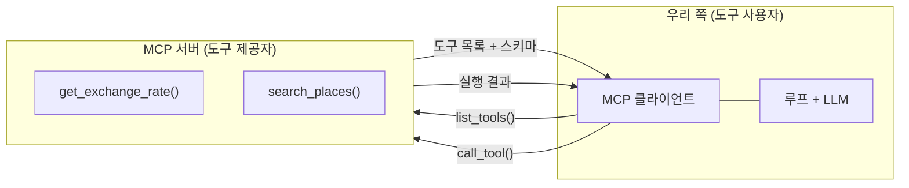

> 원안 5.7절. Day 1의 마지막 세션입니다.  
> 교재는 `examples/07_mcp/` 시연 4종이고, 전부 수업에서 실행합니다. 이
> 문서에는 **4종의 실제 실행 결과**를 실었습니다. v1.1.0에 3종이, v1.2.0에
> HTTP 전송 시연이 추가되었습니다.

- **교재**: [examples/07_mcp](https://github.com/2026-ai-agents/day-01/tree/main/examples/07_mcp)
- **핵심 문장**: 도구를 손으로 정의하는 대신, 표준 프로토콜로 주고받는다

## 무엇이 달라지는가

오늘 하루 종일 도구는 우리가 손으로 정의했습니다. 스키마를 쓰고, 실행 관문을
만들고, 결과를 되먹였습니다. Model Context Protocol, 곧 [[mcp|MCP]]는 그 도구를
표준 프로토콜로 주고받는 방식입니다.

- 도구 제공자가 MCP 서버를 열면, 클라이언트는 도구 목록을 프로토콜로 받아옵니다
- 우리 코드에는 도구별 구현이 없어도 됩니다. 연결만 하면 도구 목록이 늘어납니다
- 도구 정의(이름·설명·스키마)의 모양은 4세션에서 본 것과 같습니다. 표준화된
  것은 내용이 아니라 주고받는 방법입니다



## 1. 도구를 서버로 내어놓는다

코드: [`01_mcp_server.py`](https://github.com/2026-ai-agents/day-01/blob/main/examples/07_mcp/01_mcp_server.py)

#### 무엇을 보는가

4세션에서 손으로 등록하던 것과 같은 평범한 함수 2개(환율·장소 검색)를,
데코레이터 하나로 MCP 서버에 싣습니다. 함수 시그니처와 docstring이 그대로
프로토콜의 도구 명세가 됩니다.

#### 코드 발췌

```python
mcp = FastMCP("travel-tools")

@mcp.tool()
def get_exchange_rate(currency: str) -> dict:
    """통화 코드(JPY, USD, EUR)의 원화 환율을 돌려준다."""
    if currency not in RATES:
        return {"error": f"지원하지 않는 통화: {currency}. 지원 목록: {list(RATES)}"}
    return {"currency": currency, "krw": RATES[currency]}

if __name__ == "__main__":
    if "--http" in sys.argv:
        mcp.run(transport="streamable-http")  # 상주 서버: 포트 8000
    else:
        mcp.run()  # stdio: 클라이언트가 이 프로세스를 직접 띄웠을 때의 전송
```

#### 코드 실행

```bash
docker compose exec lab python examples/07_mcp/01_mcp_server.py
```

#### 실행 결과

기본(stdio)으로 단독 실행하면 아무 출력 없이 침묵하고, Ctrl+C로 종료합니다.
실제로 실험해 보면 더 이상합니다. 이 상태에서 다른 터미널로 2번 클라이언트를
돌려도 **이 서버에는 로그 한 줄 찍히지 않고**, 서버를 아예 안 띄우고 돌린
것과 결과가 같습니다.

#### 결과 읽기

이상한 게 아니라 stdio 전송의 본질입니다. stdio에서는 **클라이언트가 서버를
자기 하위 프로세스로 직접 띄워** 표준입출력으로 대화합니다. 손으로 미리 띄운
서버의 stdio는 터미널에 물려 있어서 아무도 접속할 수 없고, 2번은 매번 자기
전용 서버를 새로 만듭니다. "서버 먼저, 접속은 나중"이라는 익숙한 그림은 아래
4번의 HTTP 전송이 담당합니다.

함수에 스키마를 손으로 쓴 곳이 없다는 것도 봐 두세요. 타입 힌트에서 자동
생성됩니다. 이 파일이 일부러 self-contained인 것도 같은 맥락입니다. stdio
클라이언트는 서버 하위 프로세스에 최소 환경만 넘기므로, 서버는 어디서 띄워도
도는 독립 실행체가 실전 형태입니다.

## 2. 도구 목록이 프로토콜로 배달된다

코드: [`02_list_tools.py`](https://github.com/2026-ai-agents/day-01/blob/main/examples/07_mcp/02_list_tools.py)

#### 무엇을 보는가

키 없이 도는 예제이고, **서버를 미리 띄울 필요가 없습니다**. 이 클라이언트가
1번 서버를 자기 하위 프로세스로 직접 띄워 접속합니다. 실행하면 서버의 요청
로그(`Processing request of type …`)가 이 터미널에 섞여 나오는데, 하위
서버의 stderr가 이쪽으로 흐르기 때문입니다. 도구 목록을 받아 출력하고 도구
하나를 원격 호출합니다.

#### 코드 발췌

```python
async with stdio_client(SERVER) as (read, write):
    async with ClientSession(read, write) as session:
        await session.initialize()
        tools = (await session.list_tools()).tools          # 목록 수신
        result = await session.call_tool(                    # 원격 실행
            "get_exchange_rate", {"currency": "JPY"})
```

#### 코드 실행

```bash
docker compose exec lab python examples/07_mcp/02_list_tools.py
```

#### 실행 결과

```text
=== 서버가 내어놓은 도구 목록 (프로토콜로 수신) ===
  get_exchange_rate: 통화 코드(JPY, USD, EUR)의 원화 환율을 돌려준다.
    입력 스키마: {"properties": {"currency": {"title": "Currency", "type": "string"}},
                 "required": ["currency"], …}
  search_places: 도시의 관광지·식당을 검색한다. 지원 도시: 오사카, 교토.
    입력 스키마: {"properties": {"city": {"title": "City", "type": "string"}}, …}

=== 원격 도구 호출: get_exchange_rate(JPY) ===
  { "currency": "JPY", "krw": 9.1 }
```

#### 결과 읽기

수신된 입력 스키마를 보세요. 4세션에서 pydantic으로 뽑던 것과 같은 JSON
스키마입니다. 우리 코드에는 도구 구현이 한 줄도 없는데 목록도 실행도
됩니다. 도구의 구현과 사용이 프로토콜을 사이에 두고 분리된 것입니다.

## 3. 받은 도구를 루프에 꽂는다

코드: [`03_mcp_to_agent.py`](https://github.com/2026-ai-agents/day-01/blob/main/examples/07_mcp/03_mcp_to_agent.py)

#### 무엇을 보는가

MCP로 받은 도구 목록을 litellm 도구 스키마로 변환해 4세션의 왕복 루프에
쥐여줍니다. 루프는 도구가 어디서 왔는지 모릅니다. 실행만 원격이 됩니다.

#### 코드 발췌

```python
def to_litellm_schema(tool) -> dict:
    """MCP 도구 명세 → litellm 도구 명세. 필드가 그대로 1:1로 옮겨진다."""
    return {"type": "function", "function": {
        "name": tool.name,
        "description": tool.description or "",
        "parameters": tool.inputSchema,
    }}

tools = [to_litellm_schema(t) for t in (await session.list_tools()).tools]
resp = completion(model=model, messages=messages, tools=tools)   # 4세션 그대로
result = await session.call_tool(call.function.name, args)       # 실행만 원격
```

#### 코드 실행

```bash
docker compose exec lab python examples/07_mcp/03_mcp_to_agent.py
```

#### 실행 결과

```text
=== 프로토콜로 받은 도구 2개를 루프에 장착 ===
  get_exchange_rate
  search_places
  [step 1] get_exchange_rate({"currency": "USD"}) → { "currency": "USD", "krw": 1385.0 }…
  [step 1] search_places({"city": "교토"}) → { "name": "후시미 이나리", … }…

=== 최종 답 ===
  100달러는 현재 환율(약 1,385원) 기준으로 **138,500원**입니다.
  그리고 교토 관광지로는 **후시미 이나리 신사**를 추천합니다. …
```

#### 결과 읽기

모델이 프로토콜로 받은 도구 2개를 한 턴에 병렬로 부르고 답을 조립했습니다.
변환 함수가 하는 일이 필드 1:1 복사뿐이라는 것이 핵심입니다. MCP의 도구
명세와 4세션의 도구 명세는 사실상 같은 물건이고, 그래서 "코드 수정 없이
도구 목록이 늘어난다"가 성립합니다.

## 4. 상주 서버: 서버 먼저, 접속은 나중

코드: [`04_http_client.py`](https://github.com/2026-ai-agents/day-01/blob/main/examples/07_mcp/04_http_client.py)

#### 무엇을 보는가

2번과 똑같은 일을 HTTP 전송으로 합니다. 이번에는 익숙한 그림 그대로입니다.
서버를 먼저 상주로 띄우고, 별도 프로세스인 클라이언트가 접속하며, 요청
로그는 서버 터미널에 찍힙니다. 키 없이 돕니다.

#### 코드 발췌

```python
URL = "http://127.0.0.1:8000/mcp"

async with streamablehttp_client(URL) as (read, write, _):
    async with ClientSession(read, write) as session:
        await session.initialize()
        tools = (await session.list_tools()).tools          # 이하 02와 동일
```

#### 코드 실행

```bash
# 터미널 1: 서버를 상주로 띄운다 (로그가 여기 찍힌다)
docker compose exec lab python examples/07_mcp/01_mcp_server.py --http

# 터미널 2: 접속해서 도구를 쓴다
docker compose exec lab python examples/07_mcp/04_http_client.py
```

#### 실행 결과

터미널 2 (클라이언트):

```text
=== 상주 서버 접속: http://127.0.0.1:8000/mcp ===
  get_exchange_rate: 통화 코드(JPY, USD, EUR)의 원화 환율을 돌려준다.
  search_places: 도시의 관광지·식당을 검색한다. 지원 도시: 오사카, 교토.

=== 원격 도구 호출: search_places(교토) ===
  { "name": "후시미 이나리", "category": "관광", "fee_yen": 0 }
  { "name": "기요미즈데라", "category": "관광", "fee_yen": 400 }
```

터미널 1 (서버 쪽에 이번에는 로그가 흐른다):

```text
INFO:     Uvicorn running on http://127.0.0.1:8000 (Press CTRL+C to quit)
Created new transport with session ID: e92899507abc46a1a04022cc5edfa050
INFO:     127.0.0.1:60710 - "POST /mcp HTTP/1.1" 200 OK
Processing request of type ListToolsRequest
INFO:     127.0.0.1:60712 - "POST /mcp HTTP/1.1" 200 OK
Processing request of type CallToolRequest
Terminating session: e92899507abc46a1a04022cc5edfa050
```

#### 결과 읽기

세션이 만들어지고, 요청이 들어오고, 세션이 정리되는 것까지 서버 로그에 다
보입니다. 두 전송의 차이를 정리하면 이렇습니다.

| | stdio (2번) | HTTP (4번) |
| --- | --- | --- |
| 서버의 수명 | 클라이언트가 띄우고 거둔다 | 먼저 떠서 계속 산다 |
| 관계 | 1 클라이언트 : 1 전용 서버 | N 클라이언트 : 1 서버 |
| 쓰임 | 로컬 도구 (에디터·CLI가 서버를 품음) | 세상에 내어주는 배포 |

클라이언트 코드는 접속 한 줄만 다르고 나머지는 2번과 같습니다. 우리가 만든
에이전트를 남에게 내어줄 때 쓰는 것도 이 HTTP 형태입니다.

## 역방향: 내어주기

오늘 본 것은 도구를 **가져오는** 쪽입니다. 반대 방향, 그러니까 우리가 만든
에이전트를 MCP 서버로 **내어주는** 쪽도 출발점은 같습니다. 1번 예제의
`@mcp.tool()` 데코레이터에 우리 함수를 붙이고 HTTP로 띄우면, 남의 클라이언트가
우리 도구를 부릅니다. 이 과정에서는 다루지 않지만, 가져오기를 이해했다면
내어주기는 같은 그림을 뒤집어 보는 일입니다.

## Day 1 마무리

오늘 오른 사다리를 되짚습니다.

| 릴리즈 | 오늘 얻은 것 |
| --- | --- |
| v0.1 | 요청·응답의 해부, 예제 51종 |
| v0.2 | 도구: 스키마와 검증, 실행 관문 |
| v0.3 | [[react\|ReAct]] 루프와 트레이스 |
| v0.4 | [[reflexion\|Reflexion]] 평가·재시도 |
| v1.0 | [[harness\|하네스]]: 경계 방어와 [[budget-guard\|budget guard]] |
| v1.1\~v1.2 | [[mcp\|MCP]]: 도구를 프로토콜로 주고받기, stdio와 HTTP 두 전송 |

내일은 이 수제 루프를 [[langgraph|LangGraph]]의 선언적 그래프로 다시 세우는
것에서 시작합니다. 같은 동작, 다른 구조를 나란히 놓고 비교합니다.

다음: [Day 2 개요](/course/day-02/)
