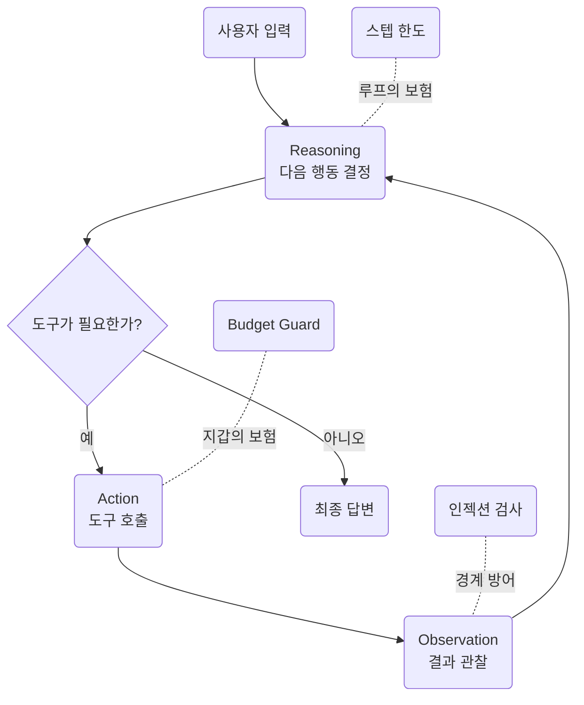

> Day 1 개요 문서입니다. 세션별 교안은 아래 세션 목록에서 들어갑니다.  
> 커리큘럼 원안은 저장소의 `docs/course-plan.md`에 있습니다.

- **교재**: [day-01](https://github.com/2026-ai-agents/day-01) 저장소
- **형태**: compose 실습 랩. `lab` 컨테이너 하나를 띄우고 예제·에이전트를 전부 터미널에서 실행
- **실행**: `docker compose exec lab python examples/...`

## 세션 목록

| 세션 | 주제 | 교재 | 릴리즈 |
| --- | --- | --- | --- |
| [1. 오리엔테이션과 환경 점검](/course/day-01-session-01/) | 조직·사다리 사용법, 랩 기동, 3일 로드맵 | `check_env.py` | v0.1 |
| [2. LLM API의 본질](/course/day-01-session-02/) | 요청·응답 해부, 역할, 토큰, 무상태, 비용 | `examples/01_api/` 11종 | — |
| [3. LiteLLM 통합 레이어](/course/day-01-session-03/) | 교체·폴백·캐싱·라우터·임베딩 | `examples/02_litellm/` 10종 | — |
| [4. Tool calling 심화](/course/day-01-session-04/) | 스키마·검증·구조화 출력, 도구 장착 | `examples/03_tools/` 10종 | → v0.2 |
| [5. ReAct 루프](/course/day-01-session-05/) | 트레이스 읽기, 스텝 한도, 무한 루프 재현 | `examples/04_react/` 4종 | → v0.3 |
| [6. ReAct 너머의 루프들](/course/day-01-session-06/) | Plan-Execute·재계획·Reflexion·ReWOO | `examples/05_loops/` 6종 | → v0.4 |
| [7. 하네스 엔지니어링](/course/day-01-session-07/) | 인젝션 방어, 권한·감금·필터, budget guard | `examples/06_harness/` 10종 | → v1.0 |
| [8. MCP 맛보기](/course/day-01-session-08/) | 도구를 표준으로 가져오기 | `examples/07_mcp/` 시연 4종 | → v1.2 |

예제는 총 51종이고 8세션의 MCP 시연 4종이 더해집니다. **전부 수업에서
실행합니다**. 세션 문서에는 전부를 실제로 돌린 실행 결과가 코드 발췌·해설과
함께 실려 있습니다. 2026-08-14 실측입니다.

## 릴리즈 사다리

세션 진행과 1:1로 대응하며, 어느 태그에서든 그 시점의 유닛 테스트가 전부
통과합니다. 2026-08-14에 태그별로 확인했습니다.

| 릴리즈 | 상태 | 테스트 |
| --- | --- | --- |
| v0.1 | 예제 51종 + 에이전트 뼈대 (도구 없음) | 5개 |
| v0.2 | 도구 장착: 예산 계산 도구가 스키마로 실림 | 16개 |
| v0.3 | [[react\|ReAct]] 루프 완성: 여행 플래너가 처음 동작 | 17개 |
| v0.4 | 고급 루프: [[reflexion\|Reflexion]] 재시도 장착 | 21개 |
| v1.0 | [[harness\|하네스]] 완성: 인젝션 방어 + budget guard | 33개 |
| v1.1\~v1.2 | [[mcp\|MCP]] 시연 4종 추가 (stdio·HTTP 전송) | 33개 |

## 이 날의 그림

## 실패 재현 시나리오

세션에서는 사고를 먼저 재현하고, 트레이스를 읽으며 원인을 추적한 뒤 방어
코드가 막아내는 것을 확인합니다.

- **무한 루프** (5세션): 종료 조건을 뺀 ReAct에서 스텝 한도가 막아내는 지점
- **간접 인젝션** (7세션): 검색 도구가 물어온 문서에 심긴 [[prompt-injection|인젝션]]을 데이터 경계가 막아내는 지점
