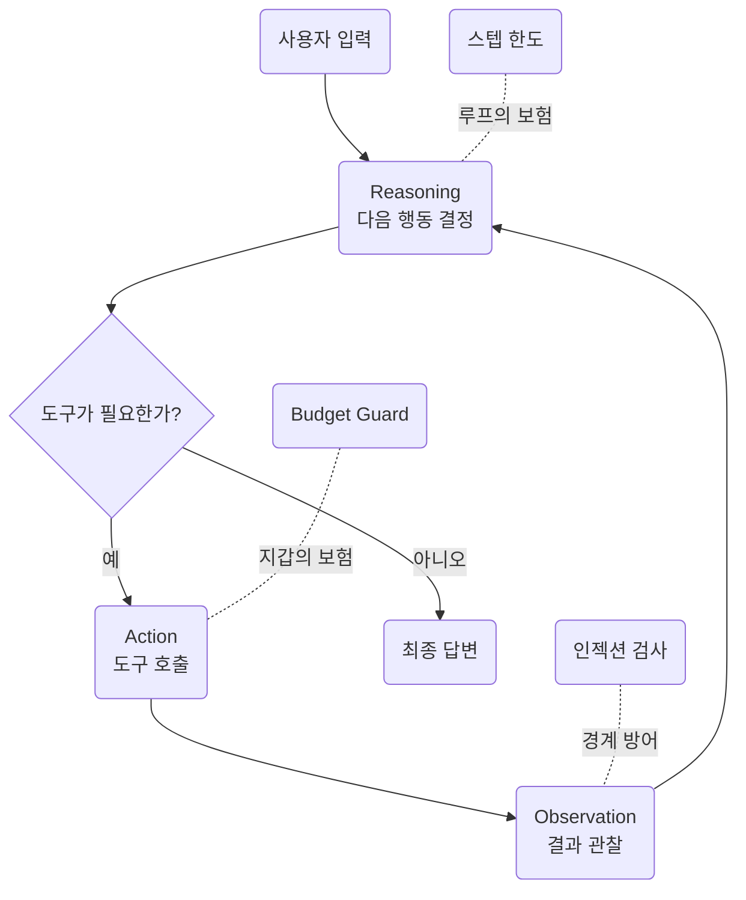

> Day 1 개요 문서입니다. 세션별 상세 교안은 준비 중이며, 확정되는 대로 이
> 문서에 채워집니다.  
> 커리큘럼 원안은 저장소의 `docs/course-plan.md`에 있습니다.

- **교재**: [day1-agent-lab](https://github.com/2026-ai-agents/day1-agent-lab)
- **형태**: compose 실습 랩. `lab` 컨테이너 하나를 띄우고 예제·에이전트를 전부 터미널에서 실행
- **분량**: 240분
- **실행**: `docker compose exec lab python examples/...`

## 릴리즈 사다리

세션 진행과 1:1로 대응합니다.

| 릴리즈 | 상태 |
| --- | --- |
| v0.1 | 예제 51종 + 에이전트 뼈대 (도구 없음) |
| v0.2 | 도구 장착: 예산 계산 도구가 스키마로 실림 |
| v0.3 | [[react\|ReAct]] 루프 완성: 여행 플래너가 처음 동작 |
| v0.4 | 고급 루프: [[reflexion\|Reflexion]] 재시도 장착 |
| v1.0 | [[harness\|하네스]] 완성: 인젝션 방어 + budget guard |

## 세션 구성

| 절 | 주제 | 시간 | 예제 |
| --- | --- | --- | --- |
| | 오리엔테이션 + 환경 점검 | 15분 | — |
| 1 | [[llm\|LLM]] API의 본질 | 25분 | `examples/01_api/` 11종 |
| 2 | [[litellm\|LiteLLM]] 통합 레이어 | 25분 | `examples/02_litellm/` 10종 |
| 3 | [[tool-calling\|Tool calling]] 심화 | 40분 | `examples/03_tools/` 10종 → v0.2 |
| 4 | ReAct 루프 | 45분 | `examples/04_react/` 4종 → v0.3 |
| 5 | ReAct 너머의 루프들 | 35분 | `examples/05_loops/` 6종 → v0.4 |
| 6 | 하네스 엔지니어링 | 40분 | `examples/06_harness/` 10종 → v1.0 |
| 7 | [[mcp\|MCP]] 맛보기 | 15분 | — |

예제는 총 51종입니다. 이 중 약 25종만 수업 중 실행·해설하고, 나머지는 자율
학습용입니다.

## 이 날의 그림

## 실패 재현 시나리오

세션에서는 사고를 먼저 재현하고, 트레이스를 읽으며 원인을 추적한 뒤 방어
코드가 막아내는 것을 확인합니다.

- **무한 루프**: 종료 조건을 뺀 ReAct 버전에서 스텝 한도가 막아내는 지점
- **인젝션 페이로드**: 검색 도구가 물어온 문서에 심긴 간접 [[prompt-injection|인젝션]]을 데이터 경계가 막아내는 지점
