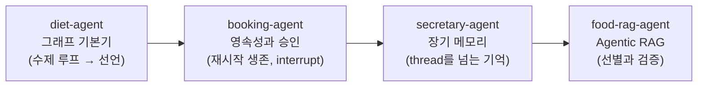

> 원안 6장 머리말. Day 2의 첫 세션입니다.  
> 오늘의 리듬은 하나입니다: **한 시간에 에이전트 하나, 저장소 하나.**

## Day 1과 달라지는 것

어제의 `day-01`은 예제 모음집이었습니다. 오늘부터는 저장소 하나가 **독립된
응용프로그램**입니다.

| | Day 1 (실습 랩) | Day 2 (제품) |
| --- | --- | --- |
| 저장소 | 예제 51종 + 에이전트 1개 | 에이전트 하나 = 저장소 하나 |
| 실행 | `docker compose exec lab python …` | `docker compose up` 하면 웹 제품이 뜸 |
| 컨테이너 | `lab` 하나 | `app`(FastAPI+LangGraph) · `ui`(Streamlit) · `db`(PostgreSQL) |
| 세션 진행 | 예제를 하나씩 실행 | 릴리즈 사다리를 오르며 제품을 시연·해부 |

공통인 것은 시작 명령뿐입니다. 어느 저장소든 같습니다.

```bash
git clone https://github.com/2026-ai-agents/<저장소>.git
cd <저장소>
cp .env.sample .env        # 키 채우기 (셋 중 하나면 됨)
docker compose up --build
```

## 릴리즈 사다리로 제품을 오른다

각 세션은 같은 리듬으로 진행됩니다: **v0.1 기동 → 태그를 오르며 feature
시연 → v1.0 확인.** [[release-ladder|릴리즈 사다리]]의 사용법은 Day 1
1세션에서 배운 그대로입니다.

```bash
git checkout v0.2 && docker compose up --build   # 그 시점의 코드로 그 시점의 동작
git diff v0.2 v0.3                               # 이번 feature가 코드로는 무엇이었나
docker compose exec app pytest                   # 어느 태그에서든 그 시점의 테스트가 통과
```

v0.1은 언제나 "compose가 뜨고 UI가 열리지만 에이전트는 최소 동작"인
시작점이고, v1.0은 완성된 제품입니다. `main`은 항상 완성본입니다. 수업 뒤
발견된 문제는 Day 1에서처럼 hotfix 태그(v1.0.1, …)로 main에 더해집니다.

## 오늘의 에이전트 4개, 개념은 하나씩

개념은 에이전트마다 하나씩 얹습니다. 그래프 → 영속성·승인 → 장기 메모리 →
RAG 순서이고, 뒤의 에이전트는 앞의 개념을 딛고 섭니다.



| 세션 | 저장소 | 얹는 개념 | 컨테이너 |
| --- | --- | --- | --- |
| [2. diet-agent](/course/day-02-session-02/) | `diet-agent` | [[langgraph\|LangGraph]] 기본기: State·Node·Edge, conditional edge, reducer | app · ui · db |
| [3. booking-agent](/course/day-02-session-03/) | `booking-agent` | 영속성([[checkpointer]])과 승인([[interrupt]]) | app · ui · admin · db |
| 4. secretary-agent (준비 중) | `secretary-agent` | 장기 메모리([[store]]) | app · ui · db |
| 5. food-rag-agent (준비 중) | `food-rag-agent` | [[agentic-rag\|Agentic RAG]]: 선별 깔때기와 검증자 | app · ui · db · rag |

이 이어달리기는 결핍으로 연결됩니다. diet-agent의 기억은 프로세스 메모리라
재시작하면 사라지고, 그것을 booking-agent가 PostgreSQL로 해결합니다.
그래도 기억은 thread를 못 넘어서 secretary-agent의 store가 이어받고,
수치는 45종 시드가 전부라 food-rag-agent가 대규모 데이터와 검증으로
확장합니다.

## 왜 LangGraph인가

Day 1에서 우리는 에이전트 루프를 손으로 짰습니다. while, if, append.
동작했고, 원리도 배웠습니다. 그런데 제품이 되려면 그 루프 위에 계속
얹어야 합니다. 대화 저장, 중단과 재개, 사람의 승인, 병렬 실행, 스트리밍.
전부 손으로 짤 수 있지만, 전부 손으로 짜는 팀은 유지보수로 죽습니다.

[[langgraph|LangGraph]]는 그 루프를 **State·Node·Edge의 선언**으로 바꾸고,
방금 나열한 것들을 그래프의 부품(checkpointer, interrupt, Send, stream)으로
제공합니다. 오늘 첫 세션에서 Day 1의 수제 루프와 같은 동작을 그래프로 다시
세워, 무엇이 같고 무엇이 편해지는지 나란히 확인합니다.
