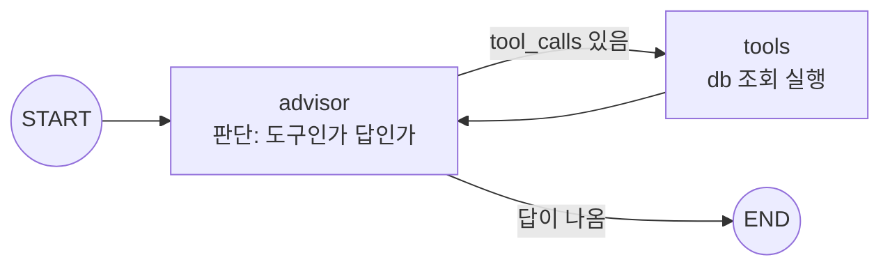

> 원안 6.1절. 교재는 [diet-agent](https://github.com/2026-ai-agents/diet-agent)
> 저장소이고, 릴리즈 사다리 v0.1\~v1.0을 오르며 진행합니다.  
> 이 문서의 실행 결과·화면은 2026-08-15에 실제로 돌린 실측입니다.

- **제품**: 식단을 입력하면 칼로리·영양을 분석하고 조언하는 상담 웹앱
- **컨테이너**: `app`(FastAPI + LangGraph) · `ui`(Streamlit) · `db`(PostgreSQL, 식품 45종 시드)
- **핵심 문장**: Day 1의 수제 ReAct를 선언적 그래프로 다시 세운다. 같은 동작, 다른 구조

## 시작하기

```bash
git clone https://github.com/2026-ai-agents/diet-agent.git
cd diet-agent
cp .env.sample .env        # 키 채우기 (셋 중 하나면 됨)
docker compose up --build
```

- ui → `http://localhost:8501` (상담 화면)
- app → `http://localhost:8000/docs` (API)
- 테스트: `docker compose exec app pytest` (키·네트워크 불필요)

## 릴리즈 사다리

| 릴리즈 | 상태 | 테스트 |
| --- | --- | --- |
| v0.1 | compose 기동, UI 빈 화면, 그래프 뼈대 | 2개 |
| v0.2 | 분기 동작: conditional edge가 도구 호출/답변을 가름 | 7개 |
| v0.3 | 대화 누적: reducer + checkpointer로 멀티턴 성립 | 8개 |
| v1.0 | UI 연결 완성: 식단 상담 제품 | 8개 |

네 태그 전부에서 `git checkout → docker compose up --build → pytest`가
통과하는 것을 확인해 두었습니다. 완성된 그래프의 모양은 이렇습니다.



## v0.1 · 뼈대: 그래프의 네 재료

#### 무엇이 서는가

compose가 3컨테이너를 띄우고, db에 식품 45종이 자동 적재되며, 그래프는
[[langgraph|LangGraph]]의 네 재료가 전부 보이는 최소 구성입니다. 도구도
분기도 누적도 아직 없습니다.

#### 코드 발췌

`app/agent/graph.py` 전체가 화면 하나에 들어옵니다.

```python
class DietState(TypedDict):
    """그래프가 나르는 상태. reducer가 없다 — 노드의 반환이 통째로 덮어쓴다."""
    messages: list[dict]

def advisor(state: DietState) -> dict:
    """상담사 노드: 지금까지의 메시지로 LLM을 한 번 부르고, 답을 붙여 돌려준다."""
    response = completion(model=pick_model(),
                          messages=[{"role": "system", "content": SYSTEM_PROMPT},
                                    *state["messages"]])
    answer = {"role": "assistant", "content": response.choices[0].message.content}
    return {"messages": [*state["messages"], answer]}

# ── 선언부: 이 다섯 줄이 v0.1 그래프의 전부다 ──
builder = StateGraph(DietState)      # State
builder.add_node("advisor", advisor) # Node
builder.add_edge(START, "advisor")   # Edge
builder.add_edge("advisor", END)
graph = builder.compile()            # 선언을 실행 가능한 그래프로
```

#### 시연

```bash
git checkout v0.1 && docker compose up --build
```


같은 질문을 API로 던져 보면:

```text
질문: 점심에 김치찌개랑 공기밥 먹었어요. 어때요?

답: 한국인이 가장 사랑하는 든든한 점심 메뉴네요!
  * 탄수화물: 공기밥으로 충분한 탄수화물이 공급됩니다.
  * 단백질 & 지방: 김치찌개에 들어가는 돼지고기나 참치, 두부 등을 통해 …
  * 나트륨: 김치찌개 특성상 국물에 나트륨이 매우 많습니다.
```

#### 결과 읽기

그럴듯하지만 수치가 하나도 없습니다. "들어가는 돼지고기나 참치"처럼
일반론으로 얼버무립니다. db에 김치찌개 240kcal이 있는데 에이전트는 그것을
모릅니다. 도구가 없기 때문이고, 그것이 v0.2입니다. State에 reducer가 없어
노드가 전체 목록을 다시 돌려주고 있다는 것도 봐 두세요. v0.3의 복선입니다.

## v0.2 · 분기: 루프의 if가 선언이 된다

#### 무엇이 바뀌나

`lookup_food`·`daily_total` 도구가 db를 조회하고, advisor는 매 턴 "도구를
부를 것인가, 답할 것인가"를 판단합니다. Day 1 루프 안의 `if
message.tool_calls`가 여기서는 **conditional edge 함수 하나의 선언**입니다.

#### 코드 발췌

```python
def route_after_advisor(state: DietState) -> Literal["tools", "__end__"]:
    """conditional edge 함수 — Day 1 루프의 if 분기가 선언으로 옮겨온 자리."""
    last = state["messages"][-1]
    return "tools" if last.get("tool_calls") else END

builder.add_conditional_edges("advisor", route_after_advisor,
                              {"tools": "tools", END: END})
builder.add_edge("tools", "advisor")   # observation은 다시 판단으로 돌아간다
```

#### 시연

```bash
git checkout v0.2 && docker compose up --build -d
docker compose exec app python demos/trace.py "김치찌개랑 공기밥 먹었는데 총 칼로리는?"
```

#### 실행 결과

```text
[advisor] 도구 요청 → daily_total({"names": ["김치찌개", "공기밥"]})
[tools] 결과 회신 → {"items": [{"name": "김치찌개", "kcal": 240, …}, {"name"…
[advisor] 최종 답 ↓

김치찌개와 공기밥의 영양 정보입니다.
* 김치찌개: 240 kcal (탄수화물 12g, 단백질 14g, 지방 14g)
* 공기밥: 310 kcal (탄수화물 68g, 단백질 5.5g, 지방 0.5g)
* 총 합계: **550 kcal** (탄수화물 80g, 단백질 19.5g, 지방 14.5g)
```

#### 결과 읽기

v0.1과 같은 질문인데 답의 성격이 바뀌었습니다. 일반론 대신 **db 원본
수치**(240 + 310 = 550)가 근거로 나옵니다. 트레이스의 세 줄이 그래프 그림과
1:1입니다: advisor가 요청하고, tools가 회신하고, advisor가 답합니다.
`graph.stream(stream_mode="updates")`가 노드 단위 관찰을 공짜로 줍니다.
Day 1에서는 StepRecord를 손으로 만들었던 자리입니다.

## v0.3 · 누적: reducer 한 줄이 멀티턴을 만든다

#### 무엇이 바뀌나

두 가지가 바뀌며 멀티턴 상담이 성립합니다. State의 messages에 reducer가
붙어 노드는 **델타만** 돌려주게 되고, [[checkpointer]]가 thread_id별 상태를
저장합니다.

#### 코드 발췌

```python
class DietState(TypedDict):
    """v0.3의 핵심 한 줄: reducer."""
    messages: Annotated[list[dict], operator.add]

def advisor(state: DietState) -> dict:
    …
    return {"messages": [message.model_dump()]}   # 델타만 — 합치는 건 그래프가

graph = builder.compile(checkpointer=MemorySaver())   # thread별 기억
```

#### 시연: thread 안의 기억, thread 밖의 백지

```bash
git checkout v0.3 && docker compose up --build -d
docker compose exec app python demos/multiturn.py
```

```text
=== thread A ===
[1턴] 점심에 비빔밥이랑 미역국 먹었어요.
  → 비빔밥 580 kcal + 미역국 90 kcal = 총계 670 kcal …
[2턴] 제가 방금 뭐 먹었다고 했죠? 저녁 추천도 해주세요.
  → 점심으로 **비빔밥**과 **미역국**을 드셨다고 하셨어요! 총 670 kcal
    정도였습니다. … 저녁은 단백질 위주로 …

=== thread B — 새 대화 ===
[1턴] 제가 방금 뭐 먹었다고 했죠?
  → 이전 대화나 기록이 없어 어떤 음식을 드셨는지 알 수 없습니다!
```

#### 사고 재현: reducer가 없으면

같은 노드·엣지·checkpointer에서 reducer만 뺀 그래프를 돌려 봅니다.

```bash
docker compose exec app python demos/broken_reducer.py
```

```text
=== 사고 ①: 대화가 끊긴다 (도구 없는 2턴) ===
[1턴] 안녕하세요! 저는 은수예요.
  → 반가워요, 은수님! …
  (이 시점 상태의 메시지 수: 1 — 내 인사는 증발하고 답변만 남았다)
[2턴] 제 이름이 뭐라고 했죠?
  → 이전 대화에서 이름을 말씀해 주신 적이 없습니다!

=== 사고 ②: 도구가 끼면 한 턴도 못 버틴다 ===
[질문] 점심에 비빔밥 먹었어요. (advisor가 도구를 부르는 순간…)
  → APIConnectionError: Missing corresponding tool call for tool
    response message …
```

사고 ①은 예상대로의 기억 상실입니다. 사고 ②가 더 깊습니다. tools 노드의
델타(role이 tool인 메시지)가 상태를 덮어써서, 짝이 되는 tool_calls를 잃은
**고아 tool 메시지**만 남고, 다음 advisor 호출을 API가 거부합니다. reducer
없이는 멀티턴이 아니라 한 턴도 못 버팁니다. 해법은 State의 한 줄입니다.

#### 스트리밍도 여기서

advisor가 토큰을 custom 스트림으로 흘리고, `/chat/stream`이 SSE로 relay합니다.

```bash
docker compose exec app python demos/stream.py "김치찌개 열량 알려줘"
```

```text
[스텝] advisor → 도구 요청 ['lookup_food']
[스텝] tools → 결과 회신
DB 기준으로 **김치찌개(1인분, 400g)**의 영양 정보는 다음과 같습니다.
* **칼로리:** 240 kcal …          ← 토큰이 오는 대로 찍힌다
```

#### 결과 읽기

기억의 정체는 Day 1 2세션에서 본 그대로입니다. 서버가 아니라 배열이
기억하고, checkpointer는 그 배열을 thread_id로 보관해 주는 장치입니다.
다만 `MemorySaver`는 **프로세스 메모리**입니다. `docker compose restart`
한 방이면 전부 사라집니다. 이 결핍을 PostgreSQL로 메우는 것이 다음 세션
booking-agent의 첫 장면이고, thread를 넘는 기억은 secretary-agent의
[[store]]가 맡습니다.

## v1.0 · 제품: UI까지 연결

#### 무엇이 완성되나

Streamlit UI가 세션마다 thread_id를 만들어 서버의 기억과 연결되고, 답은
SSE로 토큰이 오는 대로 그려지며, 도구 조회가 일어나면 말풍선 위에
표시됩니다. 사이드바에서 새 상담(새 thread)을 시작할 수 있습니다.

#### 시연

```bash
git checkout v1.0 && docker compose up --build    # main과 같다
```

브라우저에서 실제로 두 턴을 나눈 화면입니다. 1턴은 db 수치로 답하고,
2턴은 "방금 김치찌개와 공기밥(총 550 kcal)"을 정확히 기억한 채 저녁을
추천합니다.


#### Day 1과 나란히: 같은 동작, 다른 구조

| | day-01 (수제 루프) | diet-agent (LangGraph) |
| --- | --- | --- |
| 반복 | `for step in range(max_steps)` | 그래프의 순환 엣지 (tools → advisor) |
| 분기 | 루프 안의 `if message.tool_calls` | `route_after_advisor` conditional edge 선언 |
| 히스토리 축적 | `messages.append(…)` 손으로 | State의 reducer (`operator.add`) |
| 멀티턴 기억 | 호출자가 배열을 들고 다님 | checkpointer + thread_id |
| 트레이스 | 직접 만든 StepRecord | `graph.stream(stream_mode=…)` 내장 |

동작은 같습니다. 달라진 것은 그 동작이 **선언**되어 있어서, 다음 세션들의
부품(영속 checkpointer, [[interrupt]], store, 병렬 Send)이 루프를 다시 짜지
않고 꽂힌다는 점입니다.

## 이 세션이 남기는 것

- LangGraph의 재료는 넷뿐이다: State, Node, Edge, compile
- 분기는 conditional edge 함수의 선언이고, 그래프 그림과 코드가 1:1이 된다
- reducer는 장식이 아니다. 없으면 한 턴도 못 버티는 사고를 실측으로 봤다
- checkpointer는 배열을 thread별로 보관하는 장치이고, MemorySaver의 휘발성이
  다음 세션의 출발점이 된다

다음 세션: booking-agent — 영속성과 승인 (준비 중)
