> 원안 6.2절. 교재는 [booking-agent](https://github.com/2026-ai-agents/booking-agent)
> 저장소이고, 릴리즈 사다리 v0.1\~v1.0을 오르며 진행합니다.  
> 이 문서의 실행 결과·화면은 2026-08-15에 실제로 돌린 실측입니다.

- **제품**: 손님은 대화로 예약을 넣고, 사장은 따로 로그인해 승인하는 식당 예약 웹앱
- **핵심 문장**: 에이전트의 상태는 어디에 사는가. 그리고 되돌릴 수 없는 일은 누가 확인하는가

## 1. 시스템 구조: 컨테이너 4개, 그래프 2개

#### 컨테이너 넷과 그래프 둘

diet-agent의 세 컨테이너에 **사장 화면(admin)이 하나 더** 붙습니다.
손님과 사장은 서로 다른 주소에서 각자 로그인하는, 완전히 다른 화면을
씁니다.

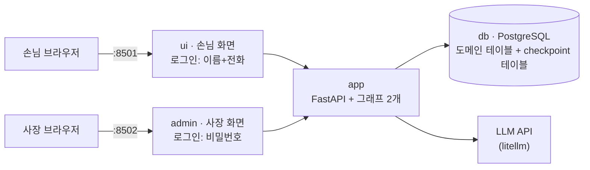

- `app` 안에 그래프가 **둘**입니다. 쓰기 앞에 멈추는 손님 예약 그래프,
  그리고 조회 전용인 사장 어시스턴트 그래프. 하나의 LangGraph 앱이
  그래프 하나라는 법은 없습니다
- `db`는 이번에 일이 두 배입니다. 예약 도메인 데이터에 더해, **대화
  상태(checkpoint)까지** 이 안에 삽니다. diet-agent가 남긴 결핍이 여기서
  풀립니다

#### 예약 한 건의 생애

상태 네 값으로 흐릅니다. 이 흐름이 세션 전체의 지도입니다.

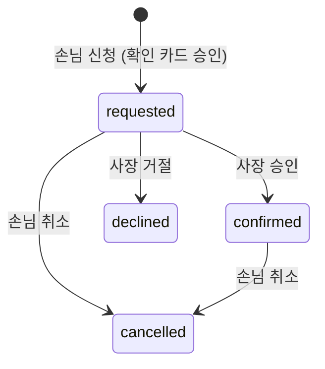

#### 이름이 같은 두 승인을 미리 갈라 둔다

이 세션에는 "승인"이 두 번 나옵니다. 성격이 전혀 다릅니다.

| | 손님의 확인 (v0.3) | 사장의 승인 (v1.0) |
| --- | --- | --- |
| 정체 | 그래프의 [[interrupt]] | 도메인 상태 머신 |
| 무엇이 멈추나 | 그래프 실행이 쓰기 직전에 멈춘다 | 아무것도 안 멈춘다. 행이 바뀔 뿐 |
| 왜 필요한가 | 에이전트의 불가역 행위를 사람이 확인 | 업무 규칙: 식당이 신청을 검토 |
| 재개 방법 | Command(resume=결정) | UPDATE 한 문장 |

## 2. 시작하기

```bash
git clone https://github.com/2026-ai-agents/booking-agent.git
cd booking-agent
cp .env.sample .env        # 키 채우기 (셋 중 하나면 됨)
docker compose up --build
```

- ui → `http://localhost:8501` (손님 화면)
- admin → `http://localhost:8502` (사장 화면, 비밀번호는 `.env`의 ADMIN_PASSWORD)
- 테스트: `docker compose exec app pytest` (LLM 키 불필요, db는 진짜)

## 3. diet-agent의 도착점이 이 저장소의 출발점이다

앞 세션이 한 시간에 걸쳐 세운 것(advisor ↔ tools 순환, conditional edge,
reducer, checkpointer)이 여기서는 **v0.1에 이미 들어 있습니다**. 새로
배우는 것은 그래프 모양이 아니라 세 가지 질문입니다.

- 그 상태는 **어디에** 사는가 (v0.1 → v0.2)
- 되돌릴 수 없는 행위 앞에서 **누가 확인하는가** (v0.3)
- 지나간 상태로 **되돌아갈 수 있는가** (v1.0)

한 가지 규약이 더해집니다. 손님의 신원입니다.

#### 코드 발췌: 신원은 LLM의 인자가 아니다

```python
class BookingState(TypedDict):
    """messages에는 reducer가 붙고(델타 반환), 신원 두 칸은 매 호출 덮어쓴다."""
    messages: Annotated[list[dict], operator.add]
    customer_id: int
    customer_name: str

def tools(state: BookingState) -> dict:
    """요청된 도구를 전부 실행한다. customer_id는 상태에서 주입 — LLM 인자가 아니다."""
    ...
    run_tool(call["function"]["name"], call["function"]["arguments"],
             customer_id=state["customer_id"])
```

로그인(이름+전화, 인증이 아니라 식별)에서 온 customer_id가 그래프 상태에
실리고, tools 노드가 실행 시점에 주입합니다. "저 3번 손님인데요"라는
말에 속아 남의 이름으로 예약하는 길을 **스키마 수준에서** 막는 것입니다.
LLM은 신원 인자를 만들 수조차 없습니다.

## 4. 릴리즈 사다리: 상태의 거처가 자라는 순서

| 릴리즈 | 상태 | 테스트 |
| --- | --- | --- |
| v0.1 | 손님 예약 대화 동작. 기억은 프로세스 메모리 (재시작 = 백지) | 10개 |
| v0.2 | PostgreSQL checkpointer. 재시작 생존, 상태는 SQL로 읽는 행 | 12개 |
| v0.3 | 쓰기 직전 interrupt. 확인 카드와 승인/보류 분기 | 16개 |
| v1.0 | 사장 입장 완성(승인 워크플로·어시스턴트·SQL 도구) + 조회·취소 + time-travel | 27개 |

네 태그 전부에서 `git checkout → docker compose up --build → pytest`가
통과하는 것을 확인해 두었습니다.

## 5. v0.1 · 결핍: 기억은 프로세스에 산다

#### 무엇이 서는가

compose가 4컨테이너 중 3개(app·ui·db)를 띄우고, db에 테이블 7개·손님
2명·기존 예약 3건이 시드됩니다. 손님 화면은 로그인부터입니다.

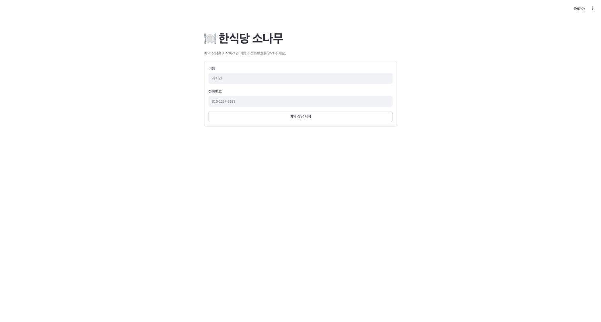

#### 코드 발췌: 로그인은 인증이 아니라 식별

```python
def normalize_phone(raw: str) -> str:
    """숫자만 남긴다 — 010-1111-2222와 01011112222는 같은 손님이다."""
    return re.sub(r"\D", "", raw)

@app.post("/login")
def login(body: LoginBody):
    """이름+전화로 손님을 찾거나 만든다. 같은 전화는 언제나 같은 손님이다."""
    row = conn.execute(
        """INSERT INTO customers (name, phone) VALUES (%s, %s)
           ON CONFLICT (phone) DO UPDATE SET name = EXCLUDED.name
           RETURNING id, name""", (body.name, normalize_phone(body.phone))).fetchone()
    ...
    return {"customer_id": customer_id, "name": name, "thread_id": f"cust-{customer_id}"}
```

전화번호가 곧 손님이고, 대화 thread도 손님마다 하나(`cust-<id>`)입니다.
식별자는 저장 전에 정규화합니다. 하이픈을 넣든 말든 같은 손님이어야
하기 때문입니다. 같은 손님이 다시 로그인하면 같은 대화가 이어집니다.
비밀번호도 토큰도 없는 수업용 최소 구성이라는 것은 밝혀 둡니다.

#### 그래프 실측: 출발점은 diet-agent의 완성형

이 시점의 draw_mermaid를 뽑으면(색 지정만 걷어내고 렌더), 앞 세션이
끝낸 바로 그 그림이 나옵니다. 여기가 출발점이라는 증명입니다.

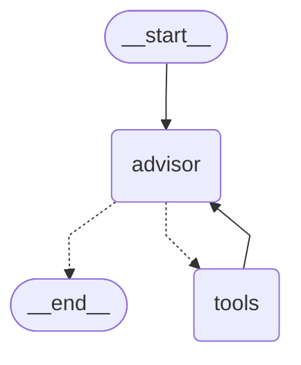

#### 사고 재현: 재시작 한 방이면 전부 잊는다

v0.1의 checkpointer는 MemorySaver, 즉 **app 서버 프로세스의 메모리**
입니다. 그래서 시연 스크립트도 그래프를 직접 import하지 않고 서버의
/chat API로 말을 겁니다. 재시작으로 사라지는 것이 바로 그 프로세스이기
때문입니다.

```bash
docker compose exec app python demos/amnesia.py          # 1부: 두 턴 대화
docker compose exec app python demos/amnesia.py --probe  # 기억 확인
docker compose restart app
docker compose exec app python demos/amnesia.py --probe  # 재시작 후 다시
```

#### 실행 결과

재시작 전의 probe는 다른 exec 프로세스에서 물어도 기억합니다. 기억의
주인이 서버 프로세스라는 뜻입니다.

```text
=== 기억 확인: 같은 thread에 이어 묻는다 ===

[손님] 방금 제가 몇 명이라고 했죠?
[상담사] 김서연 님, 6명이라고 말씀하셨습니다!
6분이서 여유롭게 이용하시기에는 룸1(6인석)이나 룸2(10인석) 모두 좋습니다. …
```

`docker compose restart app` 뒤, 같은 thread에 같은 질문:

```text
=== 기억 확인: 같은 thread에 이어 묻는다 ===

[손님] 방금 제가 몇 명이라고 했죠?
[상담사] 김서연 님, 방금 저에게 인원수를 따로 말씀해 주지 않으셨어요!
예약하시려면 **날짜, 시간, 그리고 인원수**를 알려주세요. …
```

#### 결과 읽기

같은 thread_id인데 답이 갈렸습니다. thread_id는 열쇠일 뿐, 금고
(MemorySaver의 딕셔너리)가 프로세스와 함께 사라졌기 때문입니다. 예약
행은 db에 살아남는데 **대화만 죽는** 비대칭도 봐 두세요. "아까 그 예약
바꿔주세요"가 통하지 않는 제품은 상담원이 매번 바뀌는 콜센터와 같습니다.
이 결핍이 v0.2의 주제입니다.

## 6. v0.2 · 이사: 상태의 거처가 PostgreSQL로

#### 무엇이 바뀌나

그래프 모양은 한 글자도 안 바뀝니다. compile에 꽂는 부품만 바뀝니다.
`git diff v0.1 v0.2 -- app/agent/graph.py`의 핵심이 이 세 줄입니다.

```python
# v0.2: 상태의 거처가 pg로 옮겨진다. 이 세 줄이 재시작 생존의 전부다.
pool = ConnectionPool(DATABASE_URL, kwargs={"autocommit": True})
checkpointer = PostgresSaver(pool)
checkpointer.setup()   # checkpoint 테이블이 없으면 만든다 (멱등)

graph = builder.compile(checkpointer=checkpointer)
```

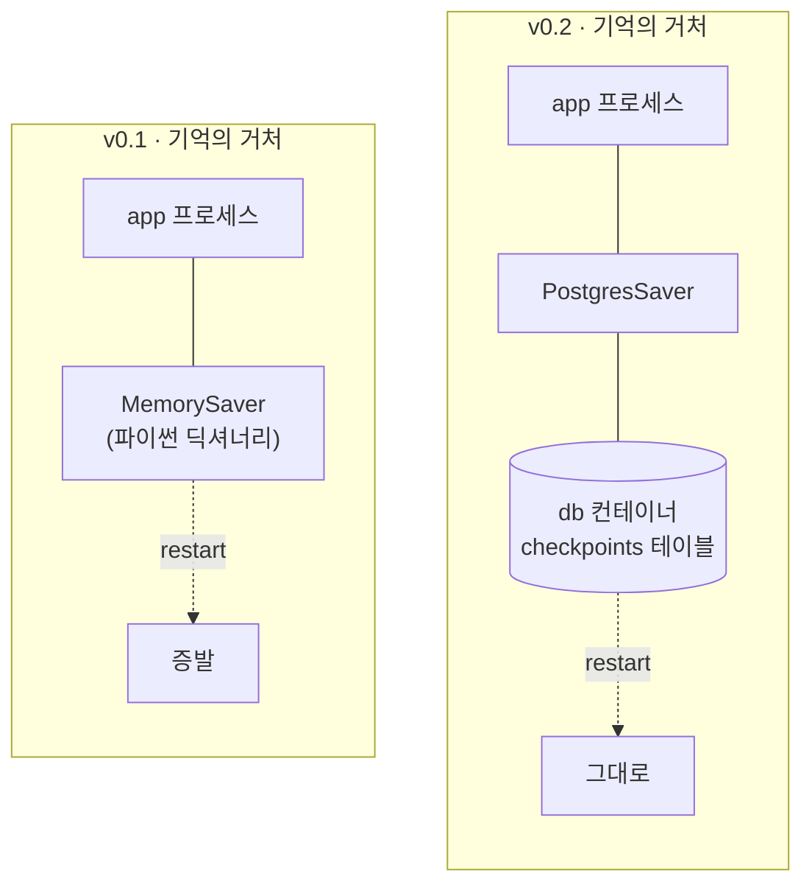

#### 시연: 같은 probe가 이번엔 살아남는다

v0.1과 완전히 같은 순서로 돌립니다. 대화 두 턴, 재시작, probe.

```bash
docker compose exec app python demos/amnesia.py
docker compose restart app
docker compose exec app python demos/amnesia.py --probe
```

#### 실행 결과

```text
=== 기억 확인: 같은 thread에 이어 묻는다 ===

[손님] 방금 제가 몇 명이라고 했죠?
[상담사] 김서연 님, 6분이라고 말씀해 주셨습니다!

8월 21일 오후 7시(19:00), 6분 모임으로 **룸1**과 **룸2** 중 어느 쪽으로
예약을 진행해 드릴까요?
```

v0.1에서 백지였던 바로 그 지점에서, 인원수는 물론 날짜·시간·후보
테이블까지 전부 이어집니다.

#### 기억의 실체를 열어 본다

기억이 "어딘가에 저장된다"가 아니라 **SQL로 읽을 수 있는 행**이라는
것까지 확인합니다.

```bash
docker compose exec app python demos/dump_checkpoint.py
```

```text
=== 1) SQL: checkpoint 테이블에 뭐가 쌓였나 ===

checkpoint 테이블: checkpoint_blobs, checkpoint_migrations, checkpoint_writes, checkpoints
  thread 'demo-amnesia': checkpoint 13개
  thread 't-f35cc299': checkpoint 6개
  …

=== 2) graph.get_state(): 그래프의 눈으로 복원한 같은 데이터 ===

demo-amnesia thread 메시지 10개:
  [user] 다음 주 금요일 저녁에 6명 모임이 있어요. 룸 자리 있을까요?
  [assistant] (도구 호출)
  [tool] {"res_date": "2026-08-21", "res_time": "18:00", "party_size"…
  [assistant] 김서연 님, 다음 주 금요일(8월 21일) 저녁 18:00에 6분 예약 가능한 룸은 …
  …
```

#### 결과 읽기

setup() 한 번이 만든 테이블 4개에 thread별 checkpoint가 쌓입니다.
**턴마다 하나가 아니라 노드 단위로** 쌓인다는 것(두 턴 대화에 13개)을 봐
두세요. 이 촘촘함이 v1.0 time-travel의 재료가 됩니다. draw_mermaid를
다시 뽑으면 v0.1과 바이트 단위로 같습니다. 상태의 거처는 그래프 그림에
나타나지 않는, compile의 일이기 때문입니다.

## 7. v0.3 · 관문: 쓰기 직전, 사람이 확인한다

#### 무엇이 바뀌나

request_reservation은 db에 행을 만드는 **되돌릴 수 없는 행위**입니다.
v0.3부터 advisor가 이 도구를 요청하면 tools로 직행하지 않고, confirm
노드가 [[interrupt]]로 실행을 멈춰 손님에게 확인 카드를 올립니다.

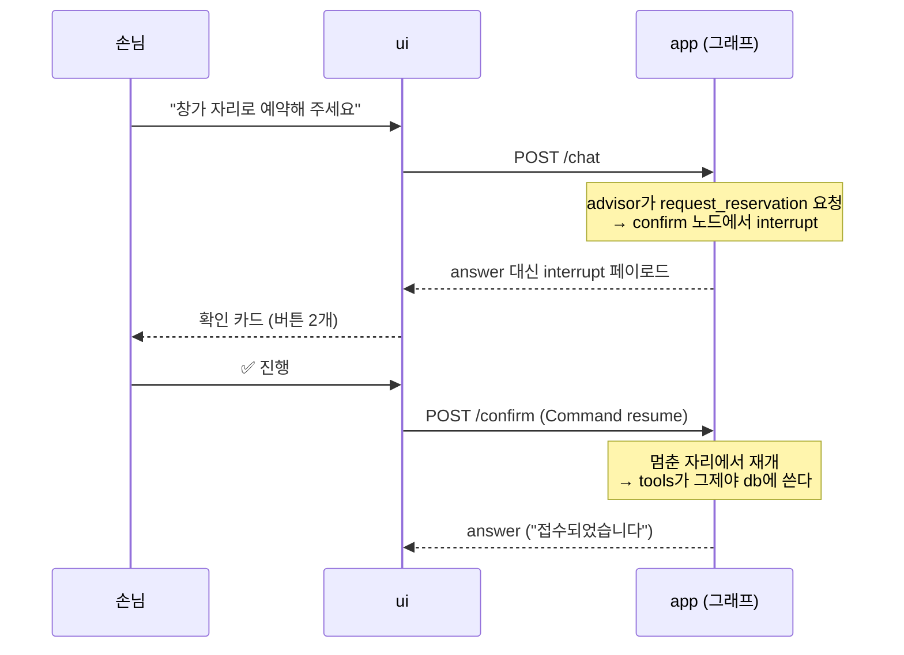

#### 코드 발췌: confirm 노드

```python
WRITE_TOOLS = {"request_reservation"}   # 되돌릴 수 없는 도구 — 사람 확인을 거친다

def confirm(state: BookingState) -> dict:
    """쓰기 도구 앞의 관문: interrupt로 멈춰 손님의 최종 확인을 받는다."""
    last = state["messages"][-1]
    write_calls = [c for c in last["tool_calls"] if c["function"]["name"] in WRITE_TOOLS]
    decision = interrupt({          # ← 여기서 실행이 멈춘다
        "type": "confirm_reservation",
        "requests": [json.loads(c["function"]["arguments"] or "{}") for c in write_calls],
    })
    if decision.get("approved"):
        return {"messages": []}     # 빈 델타 — 도구 실행(tools)으로 그대로 진행
    # 보류: 도구를 실행하지 않되, 모든 tool_call에 회신은 해야 대화가 성립한다
    return {"messages": [ ...거절 회신 tool 메시지들... ]}
```

interrupt()는 페이로드를 호출자에게 올려보내고 그 자리에서 멈춥니다.
Command(resume=결정)가 돌아오면 **같은 줄에서 반환값으로** 이어집니다.
읽기 도구(check_availability)는 이 관문을 거치지 않습니다. 사람을
세우는 것은 되돌릴 수 없는 행위 앞에서만입니다.

#### 그래프도 실측으로: confirm이 그림에 나타난다

구조가 바뀌었으니 draw_mermaid를 다시 뽑습니다. confirm 노드와 점선 두
갈래(승인 → tools, 보류 → advisor)가 새로 생겼습니다.

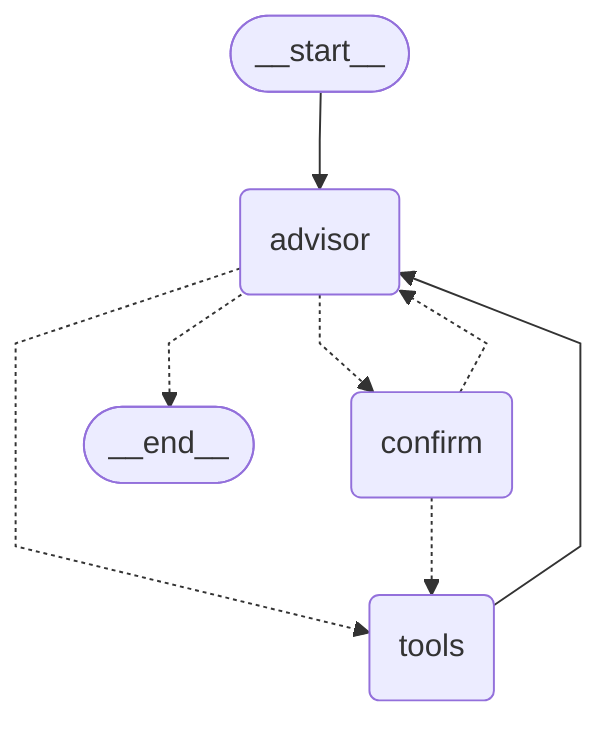

#### 시연: 멈추고, 승인해야 쓴다

```bash
git checkout v0.3 && docker compose up --build -d
docker compose exec app python demos/approve_flow.py
```

#### 실행 결과

```text
[손님] 모레 저녁 8시에 2명, 창가 자리로 예약해 주세요. 되는 창가 테이블 아무거나요.

=== 그래프가 멈췄다: /chat이 answer 대신 interrupt를 돌려줬다 ===
{
  "type": "confirm_reservation",
  "requests": [
    {"table_name": "창가2", "res_time": "20:00", "res_date": "2026-08-17", "party_size": 2}
  ]
}
(이 시점 db 예약 행: 0개 — 아직 아무것도 쓰지 않았다)

=== 승인을 되돌려준다: Command(resume={approved: True}) ===

[상담사] 박지훈 님, 모레(8월 17일) 저녁 8시 창가 자리(창가2)로 예약 신청이
완료되었습니다. 사장님 승인 후 확정되며, 결과는 다시 안내해 드리겠습니다.

승인 후 db 예약 행: 1개 — 이제야 썼다
```

#### 실행 결과: 보류하면 안 쓴다

`--decline`으로 같은 흐름을 보류로 끝내면, 도구는 실행되지 않고 보류
사유가 advisor에게 돌아갑니다. 실측에서는 사유("8시 말고 7시로")를 읽은
상담사가 곧장 19:00 예약안을 만들어 **새 확인 카드로 다시 멈추는** 것까지
잡혔습니다.

```text
=== 보류를 되돌려준다: Command(resume={approved: False, reason: 7시로}) ===

상담사가 바뀐 조건으로 다시 확인을 요청하며 멈췄다:
{
  "type": "confirm_reservation",
  "requests": [
    {"res_time": "19:00", "party_size": 2, "table_name": "창가1", "res_date": "2026-08-16"}
  ]
}
보류 후 db 예약 행: 0개 — 처음 요청(20:00)은 실행되지 않았다
```

#### 결과 읽기

이 보류 실측에는 덤이 하나 있습니다. 상담사가 "모레"를 하루 어긋난
날짜(08-16)로 계산한 장면이 그대로 찍혔습니다. **확인 카드가 정확히 이런
실수를 사람이 잡아내라고 있는 장치입니다.** 날짜가 눈앞에 보이니, 손님은
승인 전에 고칠 수 있습니다.

UI에서는 이 멈춤이 확인 카드로 렌더됩니다. 카드가 떠 있는 동안 입력창은
잠깁니다. 그래프가 결정을 기다리고 있기 때문입니다.

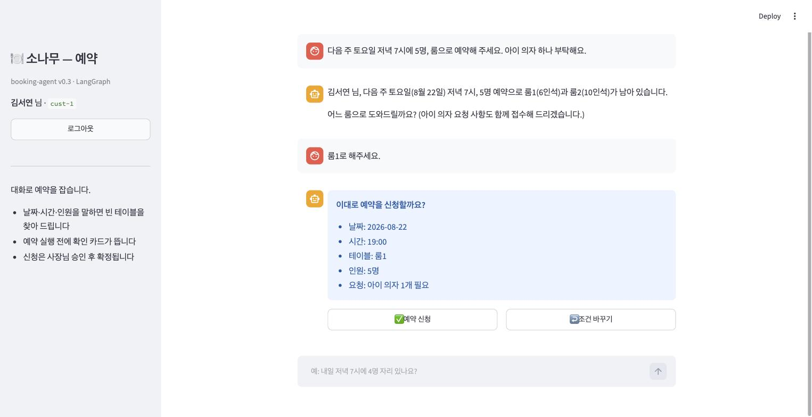

한 가지가 더 있습니다. 멈춘 상태 자체가 pg의 checkpoint입니다. 확인
카드를 띄워 둔 채 서버를 재시작해도 대기가 살아 있고, 결정이 하루 뒤에
와도 그 자리에서 이어집니다. **영속성(v0.2) 없이는 interrupt가 웹 제품이
될 수 없습니다.**

## 8. v1.0 · 두 입장: 손님과 사장은 다른 화면을 산다

#### 무엇이 완성되나

- 손님: my_reservations로 조회하고 cancel_reservation으로 취소. 취소도
  쓰기이므로 같은 확인 카드를 거칩니다
- 사장: 별도 화면(:8502)에서 승인/거절 대시보드와 운영 상담 에이전트
- time-travel: 과거 checkpoint에서의 평행 재생

#### 사장 화면: 승인은 상태 머신이다

비밀번호 하나로 들어오면(수업용 간이 인증), 승인 대기 목록과 버튼이
있는 대시보드가 뜹니다. 손님 화면과는 완전히 다른 구성입니다.

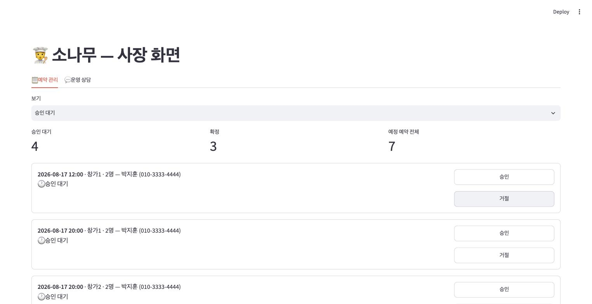

승인 버튼의 뒤는 그래프가 아니라 UPDATE 한 문장입니다.

```python
@app.post("/admin/decide", dependencies=[Depends(require_admin)])
def admin_decide(body: DecideBody):
    """사장의 승인/거절 — 도메인 상태 머신이다. 그래프는 멈춰 있지 않다."""
    row = conn.execute(
        """UPDATE reservations SET status = %s, decided_at = now()
           WHERE id = %s AND status = 'requested'
           RETURNING id, status""", ...)
```

`WHERE status = 'requested'`가 상태 머신의 전이 규칙입니다. 이미 결정된
건은 다시 못 바꾸고(409), requested에서만 confirmed/declined로 갑니다.

#### 한 예약의 여정: 두 입장이 만난다

시연에서 실제로 흐른 예약 한 건을 따라가 봅니다. 손님 김서연 님이 확인
카드를 승인해 접수한 "8월 22일 룸1, 5명, 아이 의자 요청" 건을 사장
화면에서 승인 클릭. 그리고 손님이 나중에 돌아와 묻습니다.

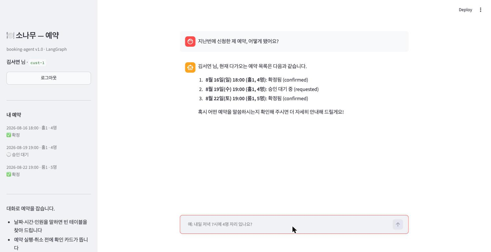

접수 때 담긴 아이 의자 요청까지 상태와 함께 돌아옵니다. 사이드바의
배지(확정·승인 대기)는 status 컬럼이 그대로 화면이 된 것입니다.

#### 운영 상담: 도구 설계의 스펙트럼

사장 화면의 두 번째 탭은 어시스턴트 채팅입니다. 도구가 재미있는
지점입니다. 고정 도구 둘(list_reservations, reservation_stats)은
안전하지만 정해진 질문만 답합니다. 그 밖의 집계는 **LLM이 SELECT를 직접
작성하는** run_sql이 맡습니다.

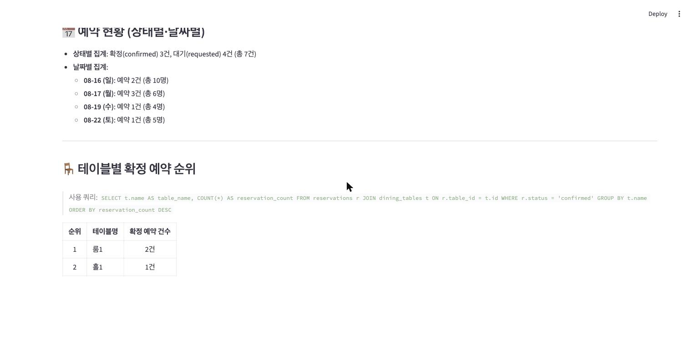

"테이블별로 어디가 제일 많이 나가는지"는 고정 도구에 없는 질문인데,
어시스턴트가 JOIN·GROUP BY 쿼리를 작성해 답하고 사용한 쿼리까지
밝힙니다. 자유에는 대가가 따르므로, run_sql은 세 겹 방어 뒤에서만
돕니다.

```python
def run_sql(args: RunSqlArgs) -> dict:
    query = args.query.strip().rstrip(";").strip()
    if not query.lower().startswith("select"):
        return {"error": "SELECT로 시작하는 조회만 허용된다. …"}     # 1겹
    if ";" in query:
        return {"error": "한 문장만 허용된다."}                      # 1겹
    if " limit " not in query.lower():
        query += " LIMIT 50"                                        # 2겹
    with psycopg.connect(DATABASE_URL) as conn:
        conn.execute("SET TRANSACTION READ ONLY")   # 3겹: pg가 쓰기를 거부
        cur = conn.execute(query)
```

#### 실행 결과: 방어를 직접 두드린 실측

```text
[쓰기 시도] DELETE FROM reservations
  → SELECT로 시작하는 조회만 허용된다. 쓰기·DDL은 이 도구의 일이 아니다.

[다중 문장] SELECT 1; DELETE FROM reservations
  → 한 문장만 허용된다.

[SELECT 위장 쓰기] SELECT setval('reservations_id_seq', 999999)
  → 쿼리 실패: cannot execute setval() in a read-only transaction
```

세 번째 줄이 핵심입니다. setval()은 SELECT로 시작하지만 시퀀스를 바꾸는
**진짜 쓰기**라 검사문을 통과합니다. 그것을 pg의 READ ONLY 트랜잭션이
잡습니다. 문자열 검사는 뚫려도 마지막 방어선이 남아 있어야 합니다.

#### time-travel: 과거를 다시 산다

checkpointer가 노드 단위로 남긴 상태들은 목록으로 열 수 있고, 그중
하나에서 **다시 실행할 수 있습니다**. "다른 시간대로 예약했다면"을
과거에서 다시 사는 것입니다.

```bash
docker compose exec app python demos/time_travel.py
```

```text
[1턴] 확인 카드: [{'table_name': '홀1', 'party_size': 4, 'res_date': '2026-08-19', 'res_time': '19:00'}]
[승인] 김서연 님, 다음 주 수요일(8월 19일) 19:00, 홀 테이블(홀1)로 예약 신청이 완료되었습니다. …

history: checkpoint 8개가 pg에 남아 있다
confirm 직전 checkpoint를 찾았다: 1f198525…

=== 그 시점에서 다시 실행한다 (포크) ===
[포크] 확인 카드: [{'table_name': '홀1', 'party_size': 4, 'res_date': '2026-08-19', 'res_time': '19:00'}]

=== 이번엔 다른 결정을 내린다: 보류 + 한 시간 늦게 ===
[재결정] 확인 카드: [{'table_name': '홀1', 'res_time': '20:00', 'res_date': '2026-08-19', 'party_size': 4}]

history: 8개 → 13개 — 원래 계보 위에 평행 계보가 얹혔다
```

#### 결과 읽기

get_state_history에서 confirm 직전 스냅숏을 골라 다시 실행하니 **같은
확인 카드가 다시 섰고**, 이번엔 보류 + "한 시간 늦게"로 답하자 상담사가
20:00 예약안을 새로 만들었습니다. 되돌리기(undo)가 아닙니다. 원래
계보(19:00 접수)는 그대로 남고, 그 위에 checkpoint 8개가 13개로 늘며
평행 계보가 얹힙니다. 디버깅에서 "그 시점에 다른 입력이었다면"을
재현하는 데 그대로 쓰이는 도구입니다.

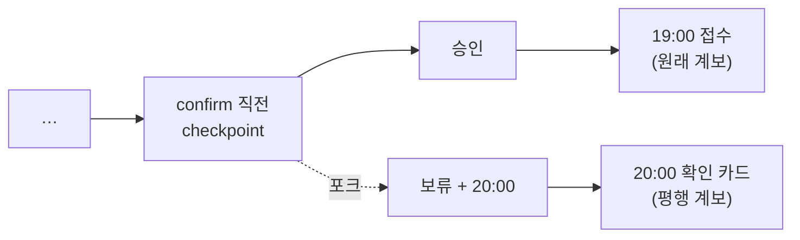

#### 현장 피드백 셋: v1.1.0

수업 리허설에서 실제 사용자로 써 보며 나온 요구 세 가지가 hotfix가 아닌
minor 릴리즈로 반영됐습니다. 셋 다 이 세션의 개념과 정확히 잇닿아
있습니다.

- **재로그인 대화 복원**: 새 `GET /history` 엔드포인트가 checkpointer에서
  thread를 읽어 화면을 다시 그립니다. 기억은 서버(pg)에 있으므로 화면은
  복원하면 됩니다. **열어 두고 떠난 확인 카드까지** 그대로 다시 섭니다
- **내 예약 클릭 재개**: 사이드바의 예약이 버튼이 되어, 누르면 그 예약
  건으로 상담이 이어집니다
- **전화번호 정규화**: 위의 로그인 발췌에 있는 normalize_phone이 이때
  들어왔습니다

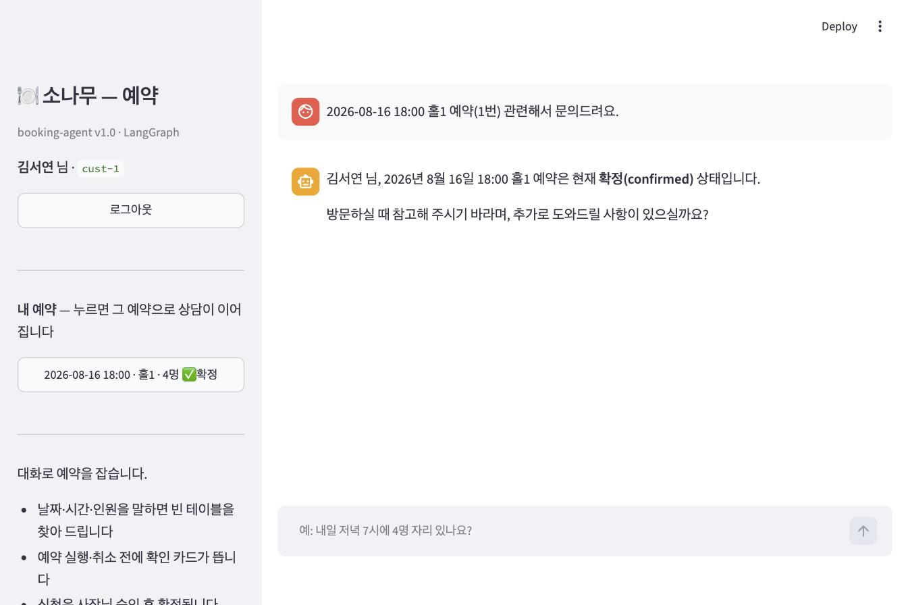

로그아웃했다가 하이픈 형식으로 다시 로그인한 직후의 실측 화면입니다.
채팅창에 지난 대화가 그대로 있습니다. v0.2가 약속한 영속성이 UI에서
보이는 순간입니다.

#### 더 단단하게: v1.2.0

- **db에 이름 있는 볼륨**: 그동안 pg 데이터가 익명 볼륨에 살아
  `docker compose down` 후 `up`이면 초기화됐습니다. pgdata 볼륨이 붙어
  이제 컨테이너를 지웠다 새로 만들어도 예약·대화가 그대로입니다. 실측으로
  down/up 뒤의 --probe가 전체 맥락을 기억했습니다. 초기화는 `down -v`로만
  일어납니다
- **새로고침 로그인 유지**: 손님은 URL의 손님 id, 사장은 로그인 때
  발급받은 세션 토큰이 새로고침을 넘깁니다. 전화번호도 비밀번호도 URL에
  싣지 않습니다. 사장 토큰은 app 프로세스 메모리에 살아 서버가 재시작되면
  만료되고, 그때는 다시 로그인하는 것이 맞는 동작입니다

과거 태그(v0.1\~v1.1.0)의 compose에는 볼륨 선언이 없어, 태그 체크아웃 후
기동하면 항상 깨끗한 시드에서 시작합니다. 릴리즈 사다리 재현에는 그쪽이
의도된 동작이라 그대로 둡니다.

## 9. 테스트도 교재다

#### 대역과 진짜의 경계

LLM은 각본 대역, db는 진짜라는 규약은 그대로이고, v0.3의 계약이 테스트
문장으로 박제되어 있습니다.

#### 쓰기 직전에 멈춘다는 계약

```python
def test_write_tool_pauses_before_execution(monkeypatch):
    wire(monkeypatch, [fake_response(tool_calls=[RESERVE_CALL])])
    result = graph_module.graph.invoke(state("홀2로 예약해 주세요"), cfg())
    assert "__interrupt__" in result
    assert rows() == 0                     # 멈춘 동안 db에는 아무것도 없다
```

#### 재시작 생존도 유닛테스트로

새로 compile한 그래프(새 프로세스 흉내)가 같은 pg에서 대화를 이어받는지를
확인합니다.

```python
def test_fresh_graph_instance_resumes_thread(monkeypatch):
    ...
    fresh = graph_module.builder.compile(checkpointer=PostgresSaver(graph_module.pool))
    fresh.invoke(state("몇 명이라고 했죠?"), config)
    sent = llm.calls[1]["messages"]
    assert [m.get("role") for m in sent] == ["system", "user", "assistant", "user"]
```

#### 나머지 약속들

그 밖에 승인만 쓰고 보류는 안 쓴다, 읽기 도구는 멈추지 않는다, 남의
예약은 취소되지 않는다, run_sql은 세 겹을 지킨다, 사장 승인은 requested
에서만 전이된다까지 27개가 어느 태그에서든 그 시점 분량만큼 통과합니다.

## 이 세션이 남기는 것

- 상태의 거처가 제품을 가른다. MemorySaver는 프로세스, PostgresSaver는
  db의 행이고, 바꾸는 데 세 줄이면 된다
- interrupt는 되돌릴 수 없는 행위 앞의 관문이다. 멈춘 상태도 checkpoint
  라서, 영속성이 있어야 비로소 웹 제품이 된다
- 승인이라고 다 같은 승인이 아니다. 손님 확인은 그래프의 멈춤, 사장
  승인은 도메인 상태 머신이다
- LLM에게 SQL을 맡기려면 방어를 겹으로 두른다. 문자열 검사는 뚫려도
  READ ONLY 트랜잭션은 남는다
- checkpoint 목록은 시간축이다. 과거에서 다시 실행하면 평행 계보가 열린다

기억은 이제 재시작을 넘습니다. 그러나 **thread를 넘지는 못합니다**.
김서연 님이 "새 상담"을 열면 아이 의자 이야기는 백지가 됩니다. 대화를
넘어 손님 자체를 기억하는 장기 메모리, 그것이 다음 세션 secretary-agent의
주제입니다.
