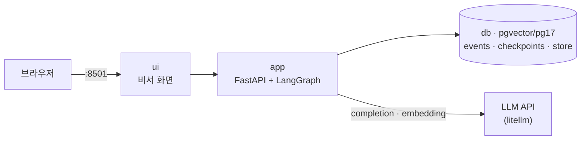
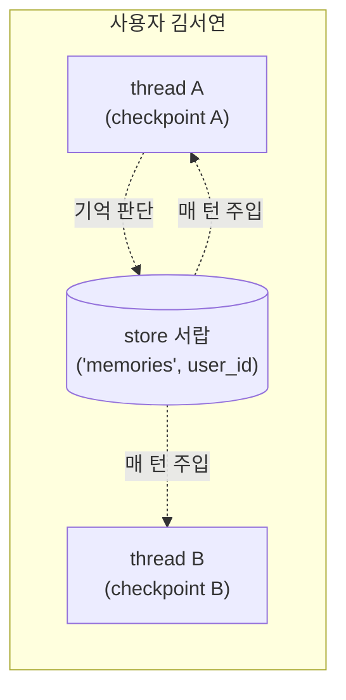
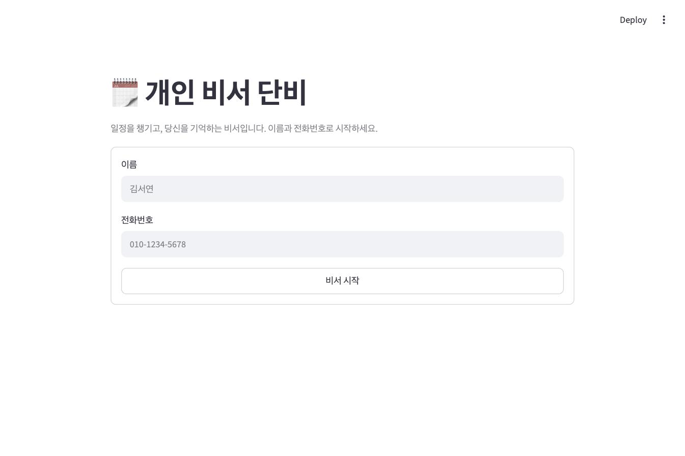
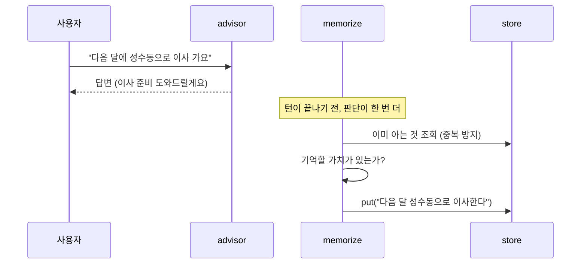
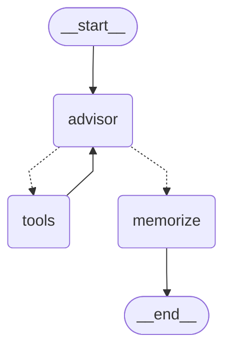
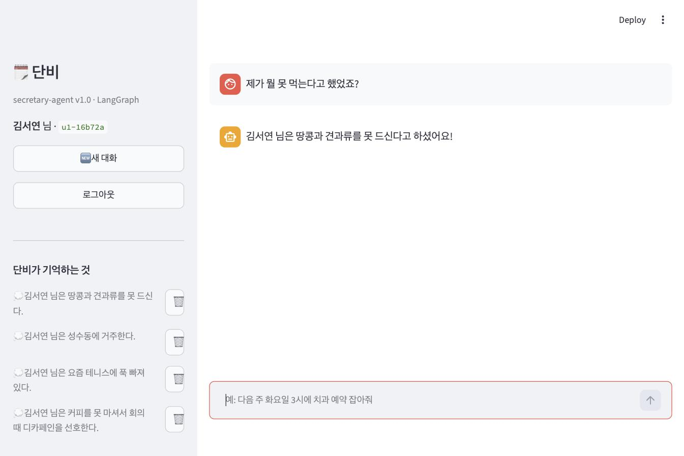

> 원안 6.3절. 교재는 [secretary-agent](https://github.com/2026-ai-agents/secretary-agent)
> 저장소이고, 릴리즈 사다리 v0.1\~v1.0을 오르며 진행합니다.  
> 이 문서의 실행 결과·화면은 2026-08-15에 실제로 돌린 실측입니다.

- **제품**: 일정을 챙기면서, 대화 중 알게 된 취향·사실을 기억하는 개인 비서 '단비'
- **핵심 문장**: 기억에는 수명이 있다. thread 안의 단기 기억과 사용자에 붙는 장기 기억은 다른 것이다

## 1. 시스템 구조: 세 가지 기억의 수명

#### 같은 db에 사는, 수명이 다른 기억 셋

컨테이너는 booking-agent보다 단순해져 셋(app·ui·db)이지만, db 안의
세계는 더 흥미로워집니다. **수명이 다른 기억 세 가지**가 같은 db에
삽니다.



| 저장소 | 무엇이 사는가 | 수명 |
| --- | --- | --- |
| `events` 테이블 | 일정 (도메인 데이터) | 영구. thread와 무관 |
| checkpoint 테이블 | 대화 상태 (단기 기억) | **thread 안**. 새 대화면 백지 |
| store 테이블 | 사용자에 대한 사실 (장기 기억) | **thread를 넘어** 사용자에 붙는다 |

#### thread별 열쇠와 사용자별 서랍

checkpointer가 **thread별 열쇠**라면 store는 **사용자별 서랍**입니다.
이 구분이 세션 전체의 지도입니다.



#### db 이미지에 미리 깔린 것

db 이미지가 `pgvector/pgvector:pg17`인 것도 봐 두세요. v1.0의 의미 기반
검색이 벡터 컬럼을 쓰는데, 이건 RAG가 아니라 RAG도 쓰는 **더 밑단의
부품**입니다. 다음 세션에서 이 부품이 파이프라인으로 확장됩니다.

## 2. 시작하기

```bash
git clone https://github.com/2026-ai-agents/secretary-agent.git
cd secretary-agent
cp .env.sample .env        # 키 채우기 (권장: Google — 의미 검색 임베딩에 필요)
docker compose up --build
```

- ui → `http://localhost:8501` (비서 화면, 이름+전화로 로그인)
- 테스트: `docker compose exec app pytest` (LLM 키 불필요, 임베딩도 결정적 대역)



## 3. booking-agent에서 이어받는 것, 달라지는 것

그래프 모양(advisor ↔ tools), pg checkpointer, 신원 주입, named volume,
새로고침 복원까지 앞 세션의 규약이 그대로 이어집니다. interrupt는 여기서
다시 쓰지 않습니다. 이미 배운 개념이고, 이 세션의 예산은 기억에 씁니다.

달라지는 것이 하나 있습니다. booking에서 thread는 손님마다
하나(`cust-1`)였지만, 여기서는 **대화마다 하나**입니다. 화면의
**"새 대화" 버튼이 이 저장소의 주인공**입니다. v0.1에서는 그 버튼이
비서를 백지로 만들고, v1.0에서는 백지가 되지 않는 것이 완성입니다.

## 4. 릴리즈 사다리: 기억이 자라는 순서

| 릴리즈 | 상태 | 테스트 |
| --- | --- | --- |
| v0.1 | 단기 기억만. 새 대화를 열면 백지 | 6개 |
| v0.2 | store 연결. "기억해 줘"라고 부탁한 것이 thread를 넘는다 | 10개 |
| v0.3 | 기억 판단. memorize 노드가 담을 것을 스스로 고른다 | 14개 |
| v1.0 | 의미 검색으로 관련 기억만 싣고, 낡은 기억은 갈아 끼운다 | 18개 |

네 태그 전부에서 `git checkout → docker compose up --build → pytest`가
통과하는 것을 확인해 두었습니다.

## 5. v0.1 · 결핍: 새 대화를 열면 비서가 나를 처음 본다

#### 무엇이 서는가

로그인(이름+전화 식별) 뒤 비서 대화가 동작합니다. 일정 도구
둘(add_event, my_events)이 db를 읽고 쓰며, 대화 상태는 pg checkpointer에
삽니다. 그래프는 앞 세션들과 같은 advisor ↔ tools 순환이라 그림은
생략합니다. 구조가 변하는 것은 v0.3입니다.

#### 사고 재현: 일정은 남고, 알레르기는 증발한다

```bash
docker compose exec app python demos/blank_slate.py
```

#### 실행 결과

```text
=== thread A (u1-0cab5a) ===

[김서연] 저 견과류 알레르기가 있어요. 그리고 다음 주 화요일 15시에 치과 예약 잡아 주세요.
[단비] 김서연 님, 견과류 알레르기 기억해 둘게요!
그리고 다음 주 화요일인 8월 18일 오후 3시에 치과 예약 잡아드렸습니다.

[김서연] 제가 무슨 알레르기가 있다고 했죠?
[단비] 김서연 님, 견과류 알레르기가 있다고 하셨어요! 제가 잘 기억하고 있겠습니다.

=== thread B (u1-392ebf) — 새 대화 ===

[김서연] 다음 주에 제 일정이 뭐가 있죠?
[단비] 서연 님, 다음 주 일정 안내해 드릴게요.
- 8월 18일 (화) 10:00 팀 주간 회의 · 15:00 치과 예약
- 8월 20일 (목) 19:00 부모님 저녁 식사 …

[김서연] 제가 무슨 알레르기가 있다고 했죠?
[단비] 서연 님, 알레르기에 대해 따로 말씀해 주신 기억이 없어요!
```

#### 결과 읽기

thread B의 두 답이 이 세션의 문제를 정확히 자릅니다. **방금 thread A가
잡은 치과 일정은 조회됩니다**. 일정은 db 행이라 thread와 무관하게
남으니까요. 그런데 한 메시지 전에 들은 알레르기는 백지입니다. 대화
기억이 thread 안에 갇혀 있기 때문입니다. thread A에서 "제가 잘 기억하고
있겠습니다"라고 약속한 직후라 더 아픕니다. 도메인 데이터가 아니라
**대화에서 흘린 사실들**을 thread 너머로 옮기는 것, 그것이 장기
기억(store)의 일입니다.

## 6. v0.2 · 서랍: 부탁한 기억이 thread를 넘는다

#### 무엇이 바뀌나

[[langgraph|LangGraph]]의 [[store]]가 checkpointer 옆에 실립니다. 같은
pool 위에 각자 자기 테이블을 만듭니다.

```python
# 두 기억이 같은 pg를 나눠 쓴다: thread별 열쇠(checkpointer)와 사용자별 서랍(store)
pool = ConnectionPool(DATABASE_URL, kwargs={"autocommit": True})
checkpointer = PostgresSaver(pool)
checkpointer.setup()
store = PostgresStore(pool)
store.setup()

graph = builder.compile(checkpointer=checkpointer, store=store)
```

#### 코드 발췌: 서랍을 여는 곳과 넣는 곳

읽기는 advisor가 합니다. `compile(store=…)`로 주입된 store를 노드가
시그니처로 받는 것이 LangGraph의 공식 규약입니다.

```python
def advisor(state: SecretaryState, config, *, store: BaseStore) -> dict:
    """store는 compile(store=…)로 주입된다 — 서랍을 열어 프롬프트에 싣는 지점."""
    memories = list_memories(store, state["user_id"])
    system = SYSTEM_PROMPT.format(..., memories=render_memories(memories))
```

쓰기는 remember 도구가 합니다. 네임스페이스 `("memories", user_id)`가
사용자별 격리를 책임집니다. 남의 서랍은 열리지 않고, 테스트가 그것을
박제합니다.

```python
def ns(user_id: int) -> tuple[str, str]:
    """사용자별 서랍 주소. 격리는 네임스페이스가 책임진다."""
    return ("memories", str(user_id))

def save_memory(store: BaseStore, user_id: int, fact: str) -> str:
    key = uuid.uuid4().hex[:8]
    store.put(ns(user_id), key, {"fact": fact})
    return key
```

#### 시연: 두 사실, 두 서랍

한 대화에서 사실 두 개를 말합니다. 하나는 "기억해 줘"라고 부탁하고,
하나는 흘리듯 말만 합니다.

```bash
git checkout v0.2 && docker compose up --build -d
docker compose exec app python demos/two_memories.py
```

#### 실행 결과

```text
=== thread A — 두 사실을 말한다 ===

[김서연] 기억해 주세요. 저는 커피를 못 마셔서 회의 때 디카페인으로 부탁해요.
[단비] 네, 서연 님. … 잘 기억해 둘게요. 새 대화에서도 잊지 않겠습니다!

[김서연] 아 그리고 요즘 테니스에 푹 빠져 있어요.
[단비] 테니스에 푹 빠지셨군요! …

=== thread B — 새 대화에서 둘 다 물어본다 ===

[김서연] 제가 회의 때 마실 것 뭐로 부탁했었죠?
[단비] 김서연 님, 회의 때 디카페인을 선호한다고 말씀하셨어요!

[김서연] 요즘 제가 뭐에 빠져 있다고 했죠?
[단비] 김서연 님, 그 내용은 제가 따로 기억해 둔 것이 없네요!

=== store에 실제로 든 것 ===
  💭 김서연 님은 커피를 못 마시며 회의 때 디카페인을 선호한다.
```

#### 결과 읽기

같은 대화에 있던 두 사실의 운명이 **저장된 곳** 때문에 갈렸습니다.
부탁한 디카페인은 store에 들어 새 thread에서 살아남았고, 흘린 테니스는
checkpoint에만 남아 thread와 함께 갇혔습니다. 단기와 장기의 경계를
이보다 좁게 자를 수는 없습니다.

덤이 하나 있습니다. 첫 실측에서는 **성실한 모델이 흘린 테니스까지
알아서 remember로 저장해** 이 대조가 무산됐습니다. 그런데 "스스로 판단해
저장한다"는 정확히 다음 단(v0.3)의 개념입니다. 그래서 v0.2 프롬프트는
"명시적으로 부탁할 때만 저장한다"로 잠갔습니다. 사다리의 단은 이렇게
실측으로 다듬어집니다.

`demos/dump_store.py`로 서랍을 SQL로 열어 보면 checkpoint 테이블 옆에
store 테이블이 나란히 있습니다. 단기와 장기는 신비한 무언가가 아니라
**같은 db의 다른 테이블**입니다.

```text
기억 테이블: checkpoint_blobs, …, checkpoints, store, store_migrations
  [memories.1] 4cf01b70: {'fact': '김서연 님은 커피를 못 마시며 회의 때 디카페인을 선호한다.'}
```

## 7. v0.3 · 판단: 부탁하지 않아도 담을 것을 담는다

#### 무엇이 바뀌나

진짜 비서는 "기억해 줘"를 기다리지 않습니다. 답이 나온 뒤 턴이 끝나기
전에 **memorize 노드**가 이번 턴의 대화를 읽고, 오래 기억할 가치가 있는
사실만 골라 서랍에 넣습니다.



#### 코드 발췌: 판단 기준은 코드가 아니라 프롬프트에 산다

```python
MEMORIZE_PROMPT = """당신은 개인 비서의 기억 판단기다. …
## 판단 기준
- 사용자에 대해 **오래 기억할 가치가 있는 사실**만 고른다: 취향, 건강·알레르기,
  가족·거처, 반복되는 습관, 앞으로의 대화에 계속 쓰일 사정.
- 잡담, 일회성 요청, 그때뿐인 감상은 버린다.
- "이미 기억하는 것"과 같은 내용은 다시 넣지 않는다.
…"""

def route_after_advisor(state: SecretaryState) -> Literal["tools", "memorize"]:
    """답이 나왔으면 끝이 아니라 기억 판단으로 — END 앞에 한 정거장이 생겼다."""
    last = state["messages"][-1]
    return "tools" if last.get("tool_calls") else "memorize"
```

memorize는 실패에 관대하게 짭니다. 판단기의 JSON이 깨지면 그 턴의
기억만 건너뜁니다. **기억은 놓쳐도 다음 턴이 있지만, 답변이 죽으면
제품이 죽습니다.** 테스트가 이 계약을 박제합니다.

#### 그래프도 실측으로: memorize 정거장이 나타난다

구조가 바뀌었으니 draw_mermaid를 색 지정만 걷어내고 다시 렌더합니다.
END로 가던 점선이 memorize를 거쳐 갑니다.



#### 시연: "기억해 줘" 없이

```bash
git checkout v0.3 && docker compose up --build -d
docker compose exec app python demos/auto_memory.py
```

#### 실행 결과

```text
=== thread A — '기억해 줘' 없이 말한다 ===

[김서연] 다음 달에 성수동으로 이사 가요. 이사 끝나면 집들이도 해야 하고 정신없네요.
[단비] 성수동으로 이사하시는군요, 서연 님! 축하드려요. …

[김서연] 오늘 날씨 진짜 덥네요. 아이스크림 생각나는 날이에요.
[단비] 정말 무더운 날씨네요, 서연 님. …

=== 두 턴 뒤의 store — 이사는 담기고 날씨는 버려졌나 ===
  💭 김서연 님은 다음 달에 성수동으로 이사한다.
  💭 김서연 님은 커피를 못 마시며 회의 때 디카페인을 선호한다.

=== thread B — 새 대화 ===

[김서연] 저 어디로 이사 간다고 했었죠?
[단비] 서연 님, 다음 달에 성수동으로 이사 가신다고 기억하고 있어요!
```

#### 결과 읽기

"기억해 줘"를 한 번도 말하지 않았습니다. 이사는 담기고 날씨 잡담은
버려졌으며, 새 대화가 이사 갈 곳을 답합니다. 무엇을 담고 무엇을
버릴지가 **프롬프트의 판단 기준**에 산다는 것이 이 노드의 특징입니다.
기준을 바꾸고 싶으면 코드가 아니라 프롬프트를 고칩니다.

## 8. v1.0 · 완성: 의미로 꺼내고, 낡으면 갈아 끼운다

#### 무엇이 완성되나

- **의미 기반 조회**: 기억이 쌓이면 전부를 매 턴 실을 수 없습니다.
  store에 시맨틱 인덱스가 붙고, advisor는 지금 발화와 의미가 가까운
  상위 5건만 싣습니다
- **기억 갱신**: memorize 판단이 add에 remove가 더해져, 낡은 기억을
  지우고 새 사실로 갈아 끼웁니다
- **내 기억은 내가 관리**: 사이드바 기억 목록에 🗑 삭제 버튼

#### 코드 발췌: 인덱스 선언과 의미 조회

```python
# v1.0: store에 시맨틱 인덱스가 붙는다 — put 때 임베딩이 함께 저장되고,
# search(query=…)가 pgvector 위에서 의미 검색이 된다.
store = PostgresStore(pool, index={"dims": EMBED_DIMS, "embed": embed})

def advisor(state, config, *, store: BaseStore) -> dict:
    """서랍을 여는 지점 — v1.0부터는 전부가 아니라 **관련 기억만** 싣는다."""
    last_user = next((m["content"] for m in reversed(state["messages"])
                      if m.get("role") == "user" and m.get("content")), "")
    memories = search_memories(store, state["user_id"], query=last_user, limit=5)
```

#### 실행 결과: 질의마다 다른 기억이 올라온다

기억 6건을 채우고 세 가지 질의로 검색한 실측입니다. 데모는
`demos/semantic_recall.py`, 임베딩은 gemini-embedding-001입니다.

```text
[질의] 다음 회의 일정을 잡아 줘
   score=0.721  회의는 오전을 선호한다
   score=0.605  커피를 못 마셔서 회의 때 디카페인을 마신다

[질의] 간식으로 쿠키 사 갈까 하는데
   score=0.617  커피를 못 마셔서 회의 때 디카페인을 마신다
   score=0.606  견과류 알레르기가 있다

[질의] 주말에 뭐 하지
   score=0.632  매주 목요일 저녁에 테니스를 친다
   score=0.610  성수동에 산다
```

회의 질의엔 회의 선호가, 쿠키 심부름엔 견과류 알레르기가, 주말 질문엔
테니스가 올라옵니다. 문자열이 겹쳐서가 아니라 **의미가 가까워서**입니다.
순위가 항상 직관과 같지는 않으므로 상위 1건이 아니라 관련권
전체인 <strong>top-5</strong>를 싣습니다. 검색은 정답기가 아니라 깔때기입니다.

#### 실행 결과: 사실은 변한다

```text
=== 말하기 전의 store ===
  💭 김서연 님은 다음 달에 성수동으로 이사한다.
  …

[김서연] 저 이사 끝났어요! 이제 성수동 주민이에요. 새집에서 첫 출근이었어요.
[단비] 와, 서연 님! 드디어 이사 무사히 마치셨군요. …

=== 말한 뒤의 store ===
  💭 김서연 님은 성수동에 거주한다.
  …
```

"이사 끝났어요" 한 마디에 memorize가 낡은 기억("다음 달에 이사한다")을
remove하고 새 사실("성수동에 거주한다")을 add했습니다. 판단기가 지어낸
key는 무시됩니다. **서랍은 쌓이기만 하는 창고가 아닙니다.**

#### 완성 장면

새 대화를 열고 묻습니다. 이 세션이 처음 겪은 결핍, 바로 그 질문입니다.



한 대화에서 흘리듯 말한 알레르기를 memorize가 담았고, 새 thread의
advisor가 의미 검색으로 꺼내 답했습니다. 사이드바의 "단비가 기억하는
것"은 store가 그대로 화면이 된 것이고, 🗑 버튼으로 사용자가 직접
지울 수 있습니다. 내 기억의 주인은 나입니다.

## 9. 테스트도 교재다

#### 임베딩까지 대역으로

LLM은 각본 대역, db는 진짜라는 규약에 이음새가 하나 더해집니다.
**임베딩도 대역**입니다. conftest가 임베딩 함수를 텍스트 해시 기반의
결정적 벡터로 갈아 끼워, 키 없이도 인덱싱·limit·격리 같은 **기계
동작**을 검증합니다. 의미 순위의 품질은 대역으로 잴 수 없으므로 실제
임베딩의 몫으로 남기고, 데모에서 실측합니다.

#### 낡은 기억이 갈아 끼워지는가

```python
def test_memorize_replaces_stale_fact(monkeypatch):
    old_key = save_memory(graph_module.store, TEST_USER, "다음 달 성수동으로 이사한다")
    wire(monkeypatch, [
        fake_response(content="이사 축하드려요!"),
        fake_response(content=f'{{"add": ["성수동에 산다"], "remove": ["{old_key}"]}}'),
    ])
    graph_module.graph.invoke(state("저 이사 끝났어요! 이제 성수동 주민이에요"), cfg())
    facts = [m["fact"] for m in list_memories(graph_module.store, TEST_USER)]
    assert facts == ["성수동에 산다"]      # 낡은 기억은 사라지고 새 사실만 남았다
```

#### 판단기가 죽어도 답변은 산다

이 계약도 테스트 문장입니다.

```python
def test_broken_judgment_never_kills_the_answer(monkeypatch):
    wire(monkeypatch, [
        fake_response(content="알겠습니다!"),
        fake_response(content="이건 JSON이 아니다"),    # 판단기가 망가진 턴
    ])
    result = graph_module.graph.invoke(state("안녕하세요"), cfg())
    assert result["messages"][-1]["content"] == "알겠습니다!"   # 답은 살아 있다
```

## 이 세션이 남기는 것

- 기억에는 수명이 있다. 도메인 행(영구), checkpoint(thread 안),
  store(사용자에 붙음)는 같은 db의 다른 테이블이다
- store는 네임스페이스로 격리되는 사용자별 서랍이고, 노드는
  `compile(store=…)` 주입으로 연다
- 무엇을 기억할지는 코드가 아니라 프롬프트의 판단 기준이 정한다.
  판단이 죽어도 답변은 살아야 한다
- 기억이 쌓이면 전부가 아니라 의미가 가까운 것만 싣는다. 벡터 검색은
  RAG의 전유물이 아니라 밑단의 부품이다
- 사실은 변한다. 서랍은 add만 있는 창고가 아니라 remove로 갈아 끼우는
  살아 있는 기억이다

비서는 이제 나를 기억합니다. 그러나 비서가 아는 세상은 **내가 말해 준
것**이 전부입니다. 45종 시드와 몇 줄의 기억 너머, 수만 건의 데이터에서
근거를 찾아 검증까지 하는 것, 그것이 다음 세션 food-rag-agent의
주제입니다. 오늘 부품으로 만난 벡터 검색이 거기서 파이프라인이 됩니다.
