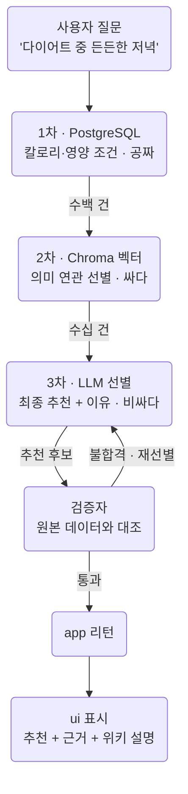

> Day 2 개요 문서입니다. 세션별 상세 교안은 준비 중이며, 확정되는 대로 이
> 문서에 채워집니다.  
> 커리큘럼 원안은 저장소의 `docs/course-plan.md`에 있습니다.

Day 1의 실습 랩과 달리, **Day 2부터는 저장소 하나가 예제가 아니라 독립된
응용프로그램**입니다. 각 세션은 "v0.1 기동 → 태그를 오르며 feature 시연 →
v1.0 확인"의 같은 리듬으로 진행됩니다.

- **분량**: 240분 (도입 10분 + 4개 세션)

## 오늘의 에이전트 4종

| 저장소 | 개념 | 시간 | 컨테이너 |
| --- | --- | --- | --- |
| `diet-agent` | [[langgraph\|LangGraph]] 기본기 | 55분 | app · ui · db |
| `booking-agent` | 영속성과 승인 | 55분 | app · ui · db |
| `secretary-agent` | 장기 메모리 | 55분 | app · ui · db |
| `food-rag-agent` | [[agentic-rag\|Agentic RAG]] 식단 추천 | 65분 | app · ui · db · rag |

## 1. diet-agent

식단 상담 웹앱입니다. **Day 1의 수제 [[react|ReAct]]를 선언적 그래프로 다시
세우는 것**이 이 에이전트의 전부입니다.

| 릴리즈 | 상태 |
| --- | --- |
| v0.1 | compose 기동, UI 빈 화면, 그래프 뼈대 |
| v0.2 | 분기 동작: 도구 호출/답변이 갈림 |
| v0.3 | 대화 누적: 멀티턴 상담 성립 |
| v1.0 | UI 연결 완성: 식단 상담 제품 |

## 2. booking-agent

레스토랑 예약 에이전트입니다. 대화로 예약을 잡되, **확정 직전에 반드시 사람의
승인을 받습니다**. 그 장치가 [[interrupt]]입니다.

| 릴리즈 | 상태 |
| --- | --- |
| v0.1 | 메모리 대화만: 재시작하면 다 잊음 |
| v0.2 | 영속화: pg [[checkpointer]], 재시작 생존 |
| v0.3 | 승인 흐름: 확정 전 interrupt |
| v1.0 | time-travel + 예약 관리 완성 |

## 3. secretary-agent

개인 비서 에이전트입니다. 대화 중 알게 된 사용자의 취향·사실을 **장기 메모리에
저장하고, 새 대화(thread)에서도 기억**합니다.

| 릴리즈 | 상태 |
| --- | --- |
| v0.1 | 단기 기억만: 새 대화에선 백지 |
| v0.2 | [[store]] 연결: 장기 기억 저장·조회 |
| v0.3 | 기억 판단: 뭘 기억할지 스스로 결정 |
| v1.0 | 기억 검색·갱신 완성 |

## 4. food-rag-agent

음식 DB 약 2만 건 + 위키 설명 위의 **식단 추천 에이전트**입니다. 2만 건을 세
단계 깔때기로 좁혀 추천하고, 추천을 내보내기 전에 **검증자가 원본 데이터와
대조**합니다. `rag` 컨테이너(Chroma)가 처음 등장합니다.

| 릴리즈 | 상태 |
| --- | --- |
| v0.1 | 데이터 적재 + 검색 서비스만, 에이전트 없음 |
| v0.2 | 선별 깔때기: SQL 1차 → 벡터 2차 → LLM 3차 |
| v0.3 | 검증자: 원본 대조, 불합격 재선별 |
| v1.0 | app 리턴 + ui 표시 완성 |

RAG 데이터는 처음부터 만들지 않습니다. 별도 과정에서 구축한 식단 플래너의
정제된 음식 DB에 위키 설명을 덧붙여 검색 가능하게 만든 산출물을 씁니다.
PostgreSQL 덤프와 Chroma 벡터 인덱스는 강사가 제공합니다.

## 실패 재현 시나리오

- **상태 오염** (`booking-agent`): 저장된 상태 덤프를 읽으며 원인을 추적
- **검증 생략 환각** (`food-rag-agent`): 검증자를 끈 상태에서 없는 음식이 추천되는 사고를 재현
