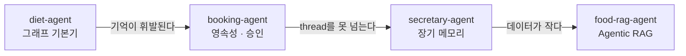

> Day 2 개요 문서입니다. 세션별 교안은 아래 세션 목록에서 들어갑니다.  
> 커리큘럼 원안은 저장소의 `docs/course-plan.md`에 있습니다.

Day 1의 실습 랩과 달리, **Day 2부터는 저장소 하나가 예제가 아니라 독립된
응용프로그램**입니다. 각 세션은 "v0.1 기동 → 태그를 오르며 feature 시연 →
v1.0 확인"의 같은 리듬으로 진행됩니다.

## 세션 목록

| 세션 | 시간 | 저장소 | 얹는 개념 | 컨테이너 |
| --- | --- | --- | --- | --- |
| [1. Day 2 도입](/course/day-02-session-01/) | 10분 | — | 제품과 사다리의 리듬, 4개 에이전트 조망 | — |
| [2. diet-agent](/course/day-02-session-02/) | 55분 | [diet-agent](https://github.com/2026-ai-agents/diet-agent) | [[langgraph\|LangGraph]] 기본기 | app · ui · db |
| [3. booking-agent](/course/day-02-session-03/) | 55분 | [booking-agent](https://github.com/2026-ai-agents/booking-agent) | 영속성([[checkpointer]])과 승인([[interrupt]]) | app · ui · admin · db |
| [4. secretary-agent](/course/day-02-session-04/) | 55분 | [secretary-agent](https://github.com/2026-ai-agents/secretary-agent) | 장기 메모리([[store]]) | app · ui · db |
| [5. food-rag-agent](/course/day-02-session-05/) | 65분 | [food-rag-agent](https://github.com/2026-ai-agents/food-rag-agent) | [[agentic-rag\|Agentic RAG]]: 선별과 검증 | app · ui · db · rag |

합계 240분입니다.

## 개념의 이어달리기

각 에이전트의 결핍이 다음 에이전트의 출발점입니다. diet-agent의 MemorySaver는
재시작하면 사라지고, booking-agent의 영속 기억도 thread 안에 갇히며,
secretary-agent까지의 데이터는 시드 수준입니다. food-rag-agent가 대규모
데이터 위의 선별·검증으로 Day 2를 닫습니다.

## 릴리즈 사다리 요약

| 저장소 | 릴리즈 사다리 |
| --- | --- |
| `diet-agent` | v0.1 뼈대 → v0.2 분기 → v0.3 누적 → v1.0 제품 |
| `booking-agent` | v0.1 휘발 → v0.2 영속 → v0.3 승인 → v1.0 완성 |
| `secretary-agent` | v0.1 백지 → v0.2 store → v0.3 판단 → v1.0 완성 |
| `food-rag-agent` | v0.1 검색만 → v0.2 선별 깔때기 → v0.3 검증자 → v1.0 제품 |

## 실패 재현 시나리오

세션에서는 사고를 먼저 재현하고, 원인을 추적한 뒤 방어가 막아내는 것을
확인합니다.

- **reducer 누락** (2세션): 대화가 끊기는 정도가 아니라, 도구가 끼면 고아
  tool 메시지로 한 턴 안에서도 API가 거부되는 사고
- **재시작 기억상실** (3세션): v0.1의 프로세스 메모리가 restart 한 방에
  백지가 되는 사고. 같은 시연이 v0.2에서 생존으로 뒤집힌다
- **SELECT 위장 쓰기** (3세션): 검사문을 통과하는 setval()을 pg의
  READ ONLY 트랜잭션이 막아내는 것까지 실측
- **새 대화 백지** (4세션): 방금 잡은 일정은 조회되는데 한 메시지 전의
  알레르기는 백지가 되는 대조. 같은 시연이 v0.2부터 생존으로 뒤집힌다
- **무근거 생성** (5세션): 이름만 주고 수치를 물으면 LLM이 닭백숙을
  115kcal이라 자신 있게 지어내는 사고. 원본은 56kcal이고, 검증자가
  3건 전부 사유와 함께 차단하는 것까지 실측
