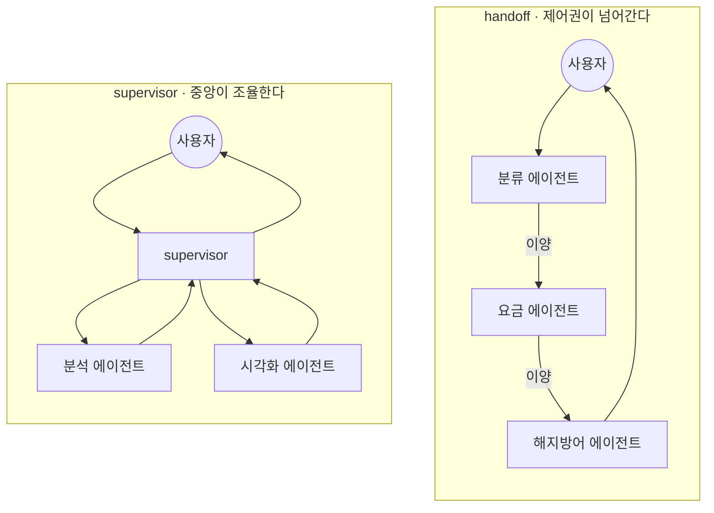
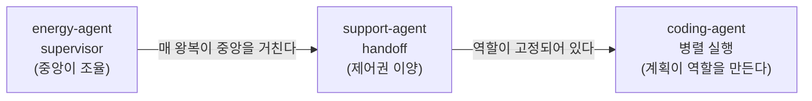

> 원안 7장 머리말. Day 3의 첫 세션입니다.  
> 오늘의 질문은 하나입니다: **언제 나누고, 어떻게 잇는가.**

## Day 2와 달라지는 것

어제까지 저장소 하나에는 에이전트가 하나였습니다. 오늘부터는 여럿입니다.
그래프의 노드가 도구가 아니라 **다른 에이전트**가 되는 순간, 새로 생각할
것이 생깁니다.

| | Day 2 (단일 에이전트 제품) | Day 3 (멀티 에이전트) |
| --- | --- | --- |
| 저장소 안의 에이전트 | 하나 | 여럿 |
| 그래프의 모양 | advisor와 tools의 순환 | 에이전트가 노드가 되고, 그 사이를 잇는 규칙이 생긴다 |
| 상태 | 한 대화가 한 상태를 쓴다 | 넘길 것과 남길 것을 정해야 한다 |
| 새 실패 모드 | 도구 선택 실수 | 라우팅 실수: 일이 엉뚱한 에이전트에게 간다 |
| 세션 진행 | 릴리즈 사다리 | 릴리즈 사다리 (그대로) |

## 나누지 않는 것이 기본이다

멀티 에이전트는 유행이라서 쓰는 구조가 아닙니다. 나누면 반드시 대가를
치르므로, **단일 에이전트로 먼저 만들고 그것이 무너지는 지점을 확인한 뒤에**
나눕니다. energy-agent의 v0.1이 정확히 그 비교 기준점으로 존재합니다.

#### 단일 에이전트가 무너지는 신호

- **프롬프트 비대**: 서로 다른 역할의 지침이 한 시스템 프롬프트에 쌓이면서
  서로 간섭합니다. 분석 지침과 상담 말투가 한 문서 안에서 다툽니다
- **컨텍스트 오염**: 분석용 원자료가 상담 단계까지 따라와, 뒤 작업이 앞
  작업의 찌꺼기를 계속 실어 나릅니다. 비용은 매 스텝 커집니다
- **도구 선택 품질 저하**: 도구를 20개 쥐어주면 고르는 정확도가 떨어집니다.
  Day 1 4세션에서 도구 10개로 이미 확인한 현상입니다

#### 나누는 대가

- **왕복이 늘어납니다.** 에이전트 사이를 오갈 때마다 호출이 더해지고,
  지연과 비용도 함께 늘어납니다
- **상태 전달을 설계해야 합니다.** 전부 넘기면 오염이 따라가고, 요약해서
  넘기면 정보가 샙니다. 무엇을 넘길지가 곧 설계입니다
- **라우팅이라는 새 실패 모드가 생깁니다.** 도구를 잘못 고르면 결과가
  이상해지지만, 일을 엉뚱한 에이전트에게 보내면 그럴듯한 답이 엉뚱한
  근거 위에 세워집니다

## 나누기로 했다면 정할 것 넷

단일 에이전트에서는 생각할 필요가 없던 결정들입니다. 오늘 볼 세 저장소는
같은 네 질문에 각각 다르게 답한 결과입니다.

| 결정 | 질문 | 이 과정의 답 |
| --- | --- | --- |
| **경계** | 누가 무엇을 맡는가 | 역할별로 도구를 나눈다. 볼 수 없는 도구는 잘못 부를 수도 없다 |
| **이양** | 제어권이 어떻게 움직이는가 | 중앙 복귀(supervisor)냐 넘겨주고 손 떼기(handoff)냐 |
| **화물** | 무엇을 함께 보내는가 | 요약만 보낼 것인가, 대화를 통째로 보낼 것인가 |
| **정지** | 언제 멈추는가 | 왕복·이양·수정에 각각 숫자로 된 한도를 건다 |

넷 중 앞의 셋은 설계이고, 마지막 하나는 안전장치입니다. 그리고 안전장치는
**판단이 아니라 숫자**여야 합니다. Day 1 하네스에서 스텝 한도를 걸었던 것과
같은 이유입니다. 판단하는 안전장치는 판단이 틀리면 함께 틀립니다.

## 두 패턴: supervisor와 handoff

나누기로 했다면 다음 질문은 하나입니다. **제어권을 누가 쥐는가.** 답이 둘로
갈리고, 그 둘이 오늘 볼 패턴입니다.

| | [[supervisor]] | [[handoff]] |
| --- | --- | --- |
| 제어권 | 중앙이 계속 쥔다 | 넘긴 쪽은 손을 뗀다 |
| 결과가 가는 곳 | 하위 에이전트가 supervisor에게 돌려준다 | 이어받은 에이전트가 사용자에게 직접 답한다 |
| 대화의 주인 | 언제나 supervisor | 지금 대화를 들고 있는 에이전트 |
| 어울리는 문제 | 한 요청을 여러 전문 작업으로 쪼개 합치는 일 (분석 → 그래프 → 상담) | 대화의 성격이 바뀌며 담당이 옮겨가는 일 (접수 → 요금 → 해지방어) |
| 비용 구조 | 왕복마다 중앙을 거치며 컨텍스트가 다시 실린다 | 넘긴 뒤에는 그 에이전트만 돌아 왕복이 짧다 |
| 새 실패 모드 | 과잉 라우팅: 필요 없는 하위 에이전트를 부른다 | 오배송과 핑퐁: 엉뚱한 곳으로 넘기거나 서로 떠넘긴다 |

어느 쪽이 옳은 패턴인지는 문제의 모양이 정합니다. **결과를 모아야 하면
supervisor, 담당이 바뀌면 handoff.** 오늘 두 제품을 나란히 놓고 같은
구조 질문을 던집니다.

#### 둘 말고도 있는 것

이 둘이 전부는 아닙니다. 다만 나머지는 대개 이 둘의 변형이거나, 둘을 섞은
것입니다.

| 모양 | 무엇인가 | 왜 오늘 따로 다루지 않는가 |
| --- | --- | --- |
| 파이프라인 | 순서가 고정된 줄 세우기 (A → B → C) | 라우팅 판단이 없다. 그래프 하나로 충분하고 Day 2에서 이미 했다 |
| 네트워크 | 누구나 누구에게 넘길 수 있다 | handoff의 제한을 푼 것이다. 실패 모드(핑퐁)가 그대로 커진다 |
| 계층 | supervisor 위에 supervisor를 둔다 | supervisor를 한 번 이해하면 겹치는 일이다. 규모가 커질 때 필요해진다 |
| 동적 팀 구성 | 계획이 역할을 그때그때 만든다 | 오늘 셋째 저장소(coding-agent)가 정확히 이것이다 |

마지막 줄이 오늘의 진행 방향이기도 합니다. 역할을 **사람이 미리 정한** 구조
둘을 먼저 보고, 역할을 **실행 시점에 만드는** 구조로 넘어갑니다.

## 오늘의 에이전트 3개

| 세션 | 저장소 | 얹는 개념 | 컨테이너 |
| --- | --- | --- | --- |
| [2. energy-agent](/course/day-03-session-02/) | `energy-agent` | [[supervisor]], 차트 도구, TTS 상담 | app · ui · db |
| [3. support-agent](/course/day-03-session-03/) | `support-agent` | [[handoff]], 라우팅 기준, [[rag\|RAG]] 재사용 | app · ui · db · rag |
| [4. coding-agent](/course/day-03-session-04/) | `coding-agent` | 병렬 실행, 비용 게이트, 재계획 (3일의 종합) | app · ui + 산출물 compose |

앞의 두 저장소는 사람이 역할을 미리 정해 둔 구조입니다. 분석·시각화·상담,
또는 요금·기술지원·해지방어처럼 담당이 고정되어 있습니다. coding-agent에서는
planner가 스펙을 읽고 **태스크를 그때그때 만들어** 병렬로 던집니다. 역할이
설계 시점이 아니라 실행 시점에 정해지는 것이 이 세 번째 단계의 차이입니다.

## 오늘 처음 나오는 것들

Day 2까지는 노드가 상태를 돌려주면 **미리 그려 둔 엣지**를 따라갔습니다.
오늘은 그것으로 부족한 자리가 나옵니다. 세 가지가 새로 등장하고, 각각 처음
쓰이는 세션에서 자세히 다룹니다. 여기서는 이름과 쓰임만 익혀 둡니다.

| 이름 | 한 줄로 | 왜 필요한가 | 어디서 |
| --- | --- | --- | --- |
| `Command` | 상태 갱신과 다음 노드를 **한 번에** 돌려준다 | 넘길 곳을 노드 자신이 정하는 구조라서 | 3세션 (handoff) |
| `Send` | 같은 노드를 **여러 벌 동시에** 띄운다 | 태스크 개수가 실행 시점에 정해지므로 | 4세션 (병렬) |
| `git worktree` | 저장소 하나에 **작업 디렉터리를 여럿** 붙인다 | 셋이 동시에 짜면 서로의 파일을 밟으므로 | 4세션 (병렬) |

여기에 Day 2에서 배운 것 둘이 새 자리에서 다시 쓰입니다. [[checkpointer]]는
"지금 담당이 누구인가"를 다음 턴까지 나르고, [[interrupt]]는 비용 상한 앞에
섭니다.

## 그리고 3일이 합쳐진다

coding-agent는 새 개념을 얹는 세션이라기보다, 3일 동안 배운 것이 전부 모이는
자리입니다.

- **Day 1**: 도구 루프, [[plan-execute|Plan-and-Execute]], 실패 로그를 되먹이는 [[reflexion|Reflexion]], [[budget-guard|budget guard]]
- **Day 2**: 그래프 구조, 비용 상한을 넘을 때 사람에게 묻는 [[interrupt]], 비용 사다리(난이도별 모델 배정)
- **Day 3**: supervisor와 병렬 실행

## 마지막은 합쳐지는 자리

세 저장소를 지나면 3일이 끝납니다. 마지막 세션은 새 개념을 얹는 대신, 사흘
동안 만든 여덟 개의 저장소를 되짚으며 무엇을 언제 쓸지 정리합니다.
