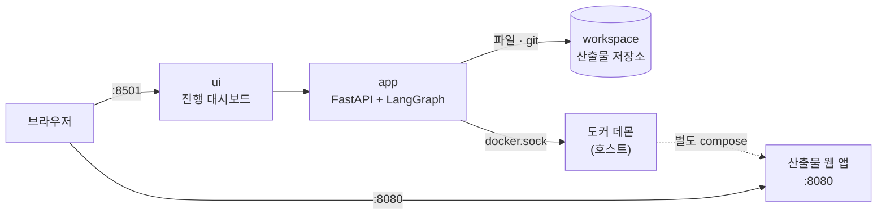
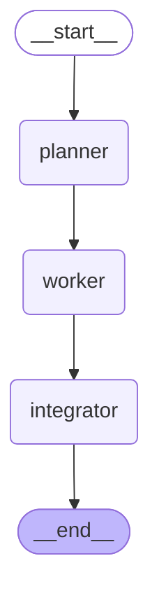
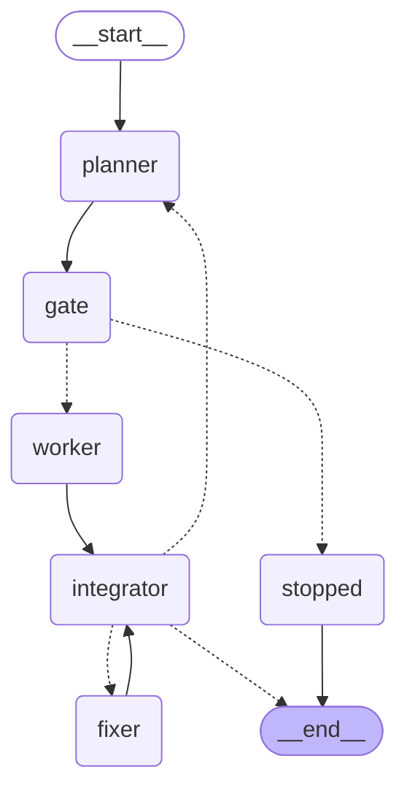
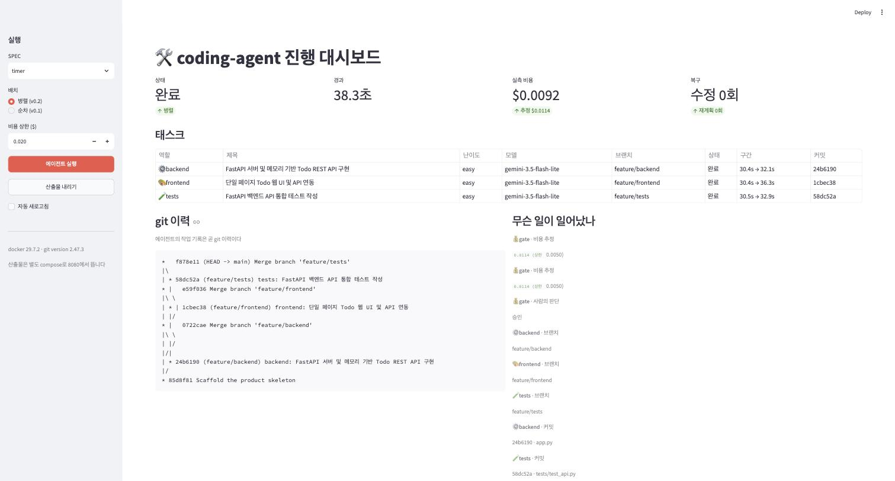
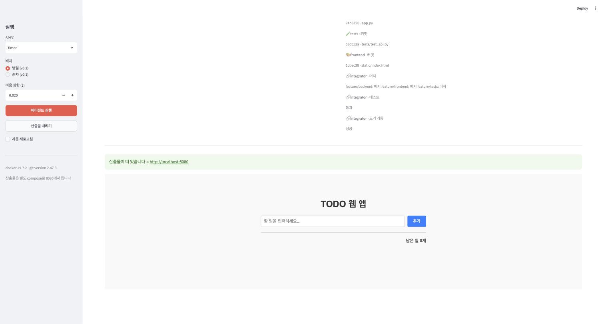

> 원안 7.3절. 교재는 [coding-agent](https://github.com/2026-ai-agents/coding-agent)
> 저장소이고, 릴리즈 사다리 v0.1\~v1.0을 오르며 진행합니다.  
> 이 문서의 실행 결과·화면은 2026-08-16에 실제로 돌린 실측입니다.

- **제품**: `SPEC.md`를 주면 태스크로 쪼개고, 여러 에이전트가 각자의 브랜치에서
  코드를 짜고, 머지해서 테스트하고, 도커로 띄우는 코딩 에이전트
- **핵심 문장**: 병렬화는 모델의 문제가 아니라 작업 공간의 문제다

## 1. 3일이 여기서 합쳐진다

이 세션은 새 개념을 얹는 자리가 아닙니다. 배운 것들이 각자의 자리를 찾는
자리입니다.

| 어디서 왔나 | 여기서 무엇이 되었나 |
| --- | --- |
| Day 1 도구 루프 | `write_file` 하나. "에이전트가 코드를 짠다"의 실체 |
| Day 1 하네스 | 스텝·수정·재계획 한도. 폭주하지 않는 이유 |
| Day 1 Plan-and-Execute | planner가 SPEC을 세 태스크로 쪼갠다 |
| Day 1 Reflexion | 빌드 실패 로그를 fixer에게 되먹인다 |
| Day 2 interrupt | 비용 상한을 넘으면 사람 앞에 선다 |
| Day 2 비용 사다리 | 난이도가 hard면 상위 모델, easy면 저가 모델 |
| Day 3 병렬 실행 | Send로 셋을 동시에, worktree로 격리 |

#### 만드는 것과 만들어진 것



산출물은 이 compose가 아니라 `workspace/todo-app/docker-compose.yml`로 따로
뜹니다. 대시보드가 죽어도 산출물은 돌고, 산출물을 내려도 대시보드는 남습니다.
**만드는 것과 만들어진 것을 섞지 않는 것**이 이 저장소의 첫 규율입니다.

컨테이너 안에서 도커를 부르려면 소켓을 빌려 씁니다. 이때 한 가지를 기억해야
합니다. 빌드 컨텍스트는 CLI가 직접 읽어 데몬으로 흘려보내므로 **컨테이너
경로**를 쓰고, 반대로 compose 안의 bind mount는 데몬이 호스트에서 해석하므로
호스트 경로가 필요합니다. 그래서 산출물 compose에는 bind mount를 넣지
않았습니다.

## 2. 경계를 먼저 긋는다

셋이 한 제품을 나눠 만들 때 흔한 사고는 둘입니다. 같은 파일을 동시에 고치는
것과, 서로 다른 규약을 가정하는 것입니다. 병렬로 짜기 **전에** 코드로 못
박습니다.

| | 누가 쓰는가 | 왜 |
| --- | --- | --- |
| `app.py` | backend 에이전트 | 제품 코드 |
| `static/index.html` | frontend 에이전트 | 제품 코드 |
| `tests/test_api.py` | tests 에이전트 | 제품 코드 |
| `Dockerfile` · `docker-compose.yml` · `requirements.txt` | 골격 | 매번 흔들릴 이유가 없다 |
| 브랜치 · 커밋 · 머지 · 빌드 | 하네스 | 모델이 git을 부를 이유가 없다 |

소유권 밖의 파일에 쓰려 하면 코드가 거부합니다. 엔드포인트 규약은 골격이
정해 세 프롬프트에 그대로 실립니다. **인프라 파일을 LLM이 매번 쓰게 하지
않는 것**도 같은 이유입니다. 바뀔 이유가 없는 것을 바뀔 수 있게 두면 실패만
늘어납니다.

## 3. v0.1: 한 사람이 하나씩



```
역할        모델                                          구간
backend   gemini-3.5-flash-lite             2.0s →   3.9s  완료
frontend  gemini-3.5-flash-lite             3.9s →   8.6s  완료
tests     gemini-3.5-flash-lite             8.6s →  11.2s  완료

전체 13.4초 · LLM 4회 · 출력 3,191 토큰 · $0.0086
머지 True · 테스트 True · 기동 True
```

동작합니다. 그리고 **구간이 겹치지 않습니다.** 셋은 서로의 결과를 기다릴
이유가 없는데도 줄을 서 있습니다.

git 이력이 곧 작업 기록입니다. 누가 어느 가지에서 무엇을 했는지가 남습니다.

```
*   bc66232 Merge branch 'feature/tests'
|\
| * 72643a0 tests: API 및 기능 통합 테스트 작성
* | dbe0c7d Merge branch 'feature/frontend'
|\|
| * d4575e5 frontend: 싱글 페이지 웹 인터페이스 구현
* | 1ba9447 Merge branch 'feature/backend'
|\|
| * 99b9124 backend: FastAPI 백엔드 및 메모리 스토어 구현
|/
* 3f010b2 Scaffold the product skeleton
```

## 4. v0.2: Send와 worktree

바뀐 것은 두 줄입니다. planner도 worker가 하는 일도 integrator도 v0.1의
것을 그대로 가져다 씁니다. 그래서 비교가 공정합니다.

```python
def fan_out(state):
    """여기가 v0.2의 전부다. 태스크마다 worker 하나씩."""
    return [Send("worker", {"task": task, "spec": state["spec"], "index": index})
            for index, task in enumerate(state["tasks"])]
```

그리고 **worktree**. 이것이 없으면 위의 한 줄은 사고입니다.

```python
worktree = runner.project.add_worktree(task["role"], task["branch"])
try:
    result = work_on(runner, task, payload["spec"], task["model"], worktree)
finally:
    runner.project.remove_worktree(task["role"])   # 브랜치는 남고 디렉터리만 치운다
```

브랜치를 나눠도 작업 트리가 하나면 셋이 같은 디렉터리에서 checkout 하며
서로의 파일을 밟습니다. `git worktree`는 저장소 하나에 작업 디렉터리를 여럿
붙이는 기능이고, 정확히 이 자리를 위해 있습니다.

```
=== v0.1 순차 ===
backend      2.0s →   3.9s          ██████
frontend     3.9s →   8.6s                ████████████████
tests        8.6s →  11.2s                                 █████████
전체 13.4초 · $0.0086 · 기동 True

=== v0.2 병렬 (Send + worktree) ===
backend      2.5s →   4.8s                 █████████████
frontend     2.5s →   6.7s                 █████████████████████████
tests        2.5s →   4.9s                 ██████████████
전체 8.8초 · $0.0085 · 기동 True
```

**시간은 줄고 비용은 그대로입니다.** 같은 일을 같은 모델로 하기 때문입니다.
병렬화가 파는 물건은 시간 하나뿐이고, 그것을 정확히 아는 것이 중요합니다.

한 가지 더. git 명령 자체는 자물쇠로 줄을 세웠습니다. 병렬로 벌고 싶은 것은
모델 호출 시간이지 worktree 장부가 아닙니다.

## 5. v0.3: 값을 먼저 묻는 문



planner와 worker 사이에 문이 하나 생겼습니다. 난이도에 따라 모델을 배정하고,
예상 비용을 계산하고, 상한을 넘으면 `interrupt`로 사람에게 묻습니다.

```
=== ① 상한 $0.05 — 넉넉하다 ===
    묻지 않고 끝까지 갔다 · 8.8초 · 실측 $0.0087
    추정 $0.0114 vs 실측 $0.0087

=== ② 상한 $0.005 — 빠듯하다, 승인한다 ===
    backend   gemini-3.5-flash-lite   출력 1500 토큰  $0.0040
    frontend  gemini-3.5-flash-lite   출력 1800 토큰  $0.0047
    tests     gemini-3.5-flash-lite   출력 1000 토큰  $0.0027
    합계                                             $0.0114  (상한 $0.0050)
    사람이 승인한다 → 7.7초 · 실측 $0.0089

=== ③ 상한 $0.005 — 빠듯하다, 중단한다 ===
    비용 상한을 넘어 사용자가 중단했습니다
    실측 $0.0011 — planner 한 번뿐이다. worker는 돌지 않았다.
```

세 번째가 이 기능의 값어치입니다. **거절할 수 있어야 문입니다.** 매번 묻는
문은 문이 아니고, 거절할 수 없는 물음은 물음이 아닙니다.

추정은 일부러 거칩니다. 역할별 예상 출력 토큰에 가격표를 곱한 것이 전부이고,
자릿수만 맞으면 상한은 제 일을 합니다. 화면에 추정과 실측을 나란히 두면
"얼마나 맞는지"까지 함께 배웁니다.


## 6. v0.4: 실패한 뒤가 진짜 일이다

셋이 따로 짜면 규약의 빈틈에서 어긋납니다. 이 저장소에서 실제로 난 실패는
이랬습니다.

```
FAILED tests/test_api.py::test_create_todo - assert 201 == 200
```

backend는 생성에 201을 돌려주고 tests는 200을 기대했습니다. 규약이 상태
코드를 못 박지 않았기 때문입니다. 사람 팀에서도 똑같이 나는 사고입니다.

- **고치기**: integrator가 실패 로그를 fixer에게 되먹입니다. fixer는 로그와
  세 제품 파일과 규약을 보고 **한 번에 한 파일만** 다시 씁니다. 여러 개를
  한꺼번에 고치면 무엇이 나았는지 알 수 없습니다. 최대 2회
- **재계획**: 그래도 안 되면 planner로 돌아갑니다. 실패 로그를 붙여 다시
  계획하고, worker는 새 브랜치 `-r2`에서 짭니다. 최대 1회
- **포기**: 그다음은 멈춥니다. 무한히 도는 자동화는 자동화가 아닙니다

실패를 일부러 심고 재어 봤습니다.

```
=== ① 통합 실패를 심는다 ===
    FAILED tests/test_api.py::test_create_returns_the_item - assert 200 == 12345

=== ② integrator가 로그를 읽고 한 파일을 고친다 ===
    수정 1회차 · 고친 파일 ['tests/test_api.py'] ac44a9f → 테스트 True
    비용: $0.0089 (1회, 수정은 상위 모델로)
```

**fixer는 테스트를 고쳤습니다.** 규약과 어긋난 쪽이 테스트였기 때문입니다.
무엇을 고칠지는 모델이 정하고, 한 번에 한 파일이라는 제약만 코드가 겁니다.

한도의 값어치는 계속 실패시켜 보면 드러납니다.

```
수정 1회 · 재계획 1회 · 기동 False
비용 $0.0942 — 한도가 없었다면 여기서 멈추지 않았다.
```

두 번의 시도가 git 이력에 그대로 남습니다. 이것이 사후에 무슨 일이
있었는지 읽는 방법입니다.

```
* 41e1c81 (HEAD -> main) fix: app.py
| * cde5a7b (feature/backend-r2) backend: FastAPI 서버 및 메모리 기반 Todo REST API 구현
|/
| * 93dbd56 (feature/frontend-r2) frontend: 단일 페이지 Todo 웹 UI 구현
|/
* baf559f fix: app.py
| * f3c8b3f (feature/backend) backend: 메모리 기반 Todo API 구현
|/
* 488cab6 Scaffold the product skeleton
```

## 7. v1.0: 전체 실행

SPEC을 고르고, 상한을 걸고, 실행하고, 승인하고, 결과를 봅니다.



태스크 구간이 30초대에서 시작하는 것은 병렬이라서가 아니라 **사람이 승인
버튼을 누를 때까지 기다렸기 때문**입니다. 게이트는 돈만 쓰는 것이 아니라
시간도 씁니다.

그리고 마지막으로, 에이전트가 만든 웹 앱이 브라우저에서 돕니다.



`specs/`의 SPEC을 타이머 앱으로 바꾸면 같은 에이전트가 다른 제품을 만듭니다.
바뀐 것은 문서 한 장이고, 코드는 그대로입니다.

## 8. 이 세션이 남기는 것

| 물음 | 이 저장소의 답 |
| --- | --- |
| "에이전트가 코드를 짠다"의 실체는 | `write_file` 도구 하나와 평범한 git·docker 호출 |
| 병렬화의 어려움은 어디에 있나 | 모델이 아니라 작업 공간. worktree가 없으면 서로를 밟는다 |
| 병렬로 무엇을 버는가 | 시간뿐이다. 비용은 그대로다 |
| 비용은 언제 묻는가 | 실행 전에. 거절할 수 있어야 문이다 |
| 실패하면 어떻게 하는가 | 로그를 되먹여 한 파일씩 고치고, 안 되면 재계획하고, 한도를 넘으면 멈춘다 |
| 무슨 일이 있었는지 어떻게 아는가 | git 이력. 브랜치와 커밋이 곧 작업 기록이다 |
