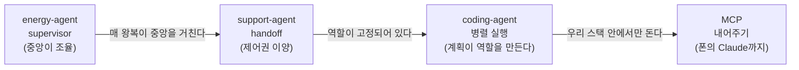

> Day 3 개요 문서입니다. 세션별 교안은 아래 세션 목록에서 들어갑니다.  
> 커리큘럼 원안은 저장소의 `docs/course-plan.md`에 있습니다.

Day 2까지는 **에이전트 하나가 저장소 하나**였습니다. Day 3부터는 저장소 하나
안에 에이전트가 여럿입니다. 새로 배우는 것은 그 여럿을 **언제 나누고 어떻게
잇는가**이고, 진행 리듬은 그대로입니다: v0.1 기동 → 태그를 오르며 feature
시연 → v1.0 확인.

## 세션 목록

| 세션 | 저장소 | 얹는 개념 | 컨테이너 |
| --- | --- | --- | --- |
| [1. 멀티 에이전트 설계 원칙](/course/day-03-session-01/) | — | 언제 나누는가, 두 패턴의 갈림길 | — |
| [2. energy-agent](/course/day-03-session-02/) | `energy-agent` | [[supervisor]]: 중앙이 조율한다 | app · ui · db |
| [3. support-agent](/course/day-03-session-03/) | `support-agent` | [[handoff]]: 제어권이 넘어간다 | app · ui · db · rag |
| 4. coding-agent (준비 중) | `coding-agent` | 병렬 실행과 비용 게이트, 3일의 종합 | app · ui + 산출물 compose |
| 5. MCP 활용 시연 (준비 중) | `food-rag-agent` | [[mcp\|MCP]]: 도구를 내어주기 | app + FastMCP |
| 6. 마무리와 회고 (준비 중) | — | 3일 전체 회고 | — |

## 개념의 이어달리기

Day 2가 결핍으로 이어졌다면, Day 3은 **한 패턴의 한계가 다음 패턴을 부르는**
방식으로 이어집니다.

supervisor는 하나의 요청을 여러 전문 작업으로 쪼개 합치는 데 강하지만, 모든
왕복이 중앙을 거칩니다. handoff는 담당이 옮겨가는 대화에 어울리지만, 역할이
사람 손으로 미리 정해져 있습니다. coding-agent에서는 planner가 태스크를
그때그때 만들어 병렬로 던지고, 마지막 MCP 시연은 우리가 만든 에이전트를
바깥 세계에 내어주며 과정을 닫습니다.

## 릴리즈 사다리 요약

| 저장소 | 릴리즈 사다리 |
| --- | --- |
| `energy-agent` | v0.1 단일 → v0.2 supervisor 분리 → v0.3 차트 → v1.0 TTS |
| `support-agent` | v0.1 분류만 → v0.2 handoff → v0.3 라우팅 기준 → v1.0 RAG 재사용 |
| `coding-agent` | v0.1 순차 → v0.2 병렬 → v0.3 비용 게이트 → v0.4 복구 루프 → v1.0 대시보드 |

## 3일이 합쳐지는 곳

coding-agent는 새 개념을 하나 더 얹는 세션이 아니라, 3일 동안 배운 것이 전부
모이는 자리입니다. Day 1의 도구 루프와 [[budget-guard|budget guard]], Day 2의
그래프와 [[interrupt]], Day 3의 supervisor와 병렬 실행이 한 제품 안에서 함께
돕니다.

스펙 문서 하나를 넣으면 비용을 먼저 추정해 상한을 점검하고, 태스크를 나눠
worker들이 각자의 브랜치에서 병렬로 작성하며, 빌드가 실패하면 로그를 되먹여
고치다가 한도를 넘기면 계획으로 돌아갑니다. 산출물은 별도 compose로 뜨는
독립 웹 앱입니다.

## 실패 재현 시나리오

Day 3의 새 실패 모드는 **라우팅**입니다. 도구를 잘못 고르는 것과 달리, 일을
엉뚱한 에이전트에게 보내면 트레이스를 읽기 전에는 원인이 보이지 않습니다.

- **과잉 라우팅** (2세션): 시각화가 필요 없는 요청에도 그래프를 그리는
  supervisor를 트레이스로 잡는 과정
- **애매한 문의** (3세션): 복합 문의("요금도 이상하고 인터넷도 안 돼요")와
  분류 불가 문의가 어디로 가는지, 라우팅 기준 프롬프트를 고쳐가며 확인
- **빌드 실패와 재계획** (4세션): 실패 로그를 되먹여 고치는 복구 루프, 그리고
  수정 한도를 넘겨 계획 단계로 되돌아가는 분기
