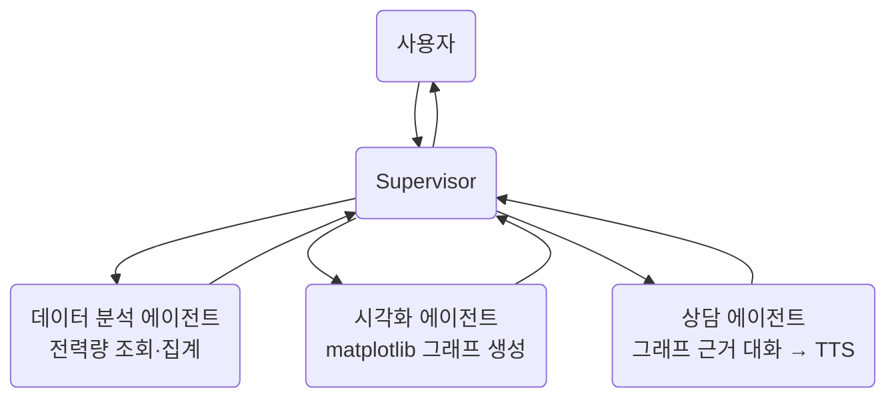
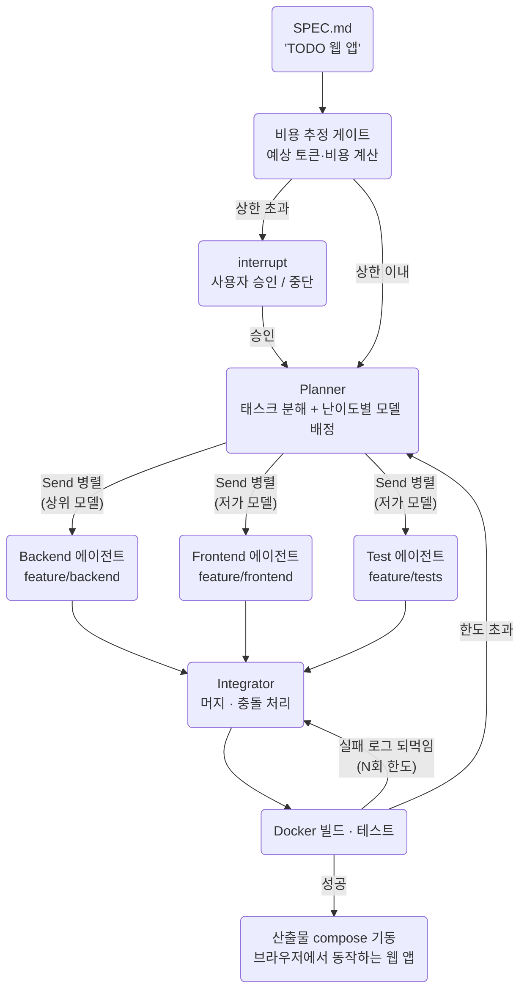
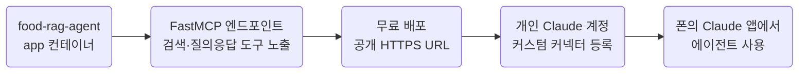

> Day 3 개요 문서입니다. 세션별 상세 교안은 준비 중이며, 확정되는 대로 이
> 문서에 채워집니다.  
> 커리큘럼 원안은 저장소의 `docs/course-plan.md`에 있습니다.

- **분량**: 240분 (설계 원칙 25분 + 3개 세션 + MCP 25분 + 마무리 10분)

## 멀티 에이전트 설계 원칙 (25분)

- 언제 나눠야 하는가: 단일 거대 에이전트와 분리의 트레이드오프
- [[supervisor]]와 [[handoff]], 각 패턴이 어울리는 문제 유형

## 1. energy-agent, supervisor 패턴 (65분)

전력회사 시나리오입니다. 사용자별 전력량 시계열을 분석하고, 그래프를 생성한
뒤, 그래프를 근거로 상담 대화를 만들어 TTS로 출력합니다.
컨테이너는 app · ui · db입니다.

| 릴리즈 | 상태 |
| --- | --- |
| v0.1 | 단일 에이전트가 전부 처리 (비교 기준점) |
| v0.2 | supervisor 분리: 3개 하위 에이전트 라우팅 |
| v0.3 | 차트 도구: 그래프가 대시보드에 뜸 |
| v1.0 | TTS 상담 완성 |

## 2. support-agent, handoff 패턴 (60분)

고객 상담 시나리오입니다. 문의를 분류 에이전트가 받아 요금·기술지원·해지방어
전문 에이전트로 제어권을 직접 넘깁니다. 컨테이너는 app · ui · db · rag이며,
요금 에이전트가 Day 2의 검색 패턴을 그대로 재사용합니다.

| 릴리즈 | 상태 |
| --- | --- |
| v0.1 | 분류만: 어디로 보낼지 말만 함 |
| v0.2 | handoff: 제어권이 실제로 넘어감 |
| v0.3 | 라우팅 기준: 애매한 문의 처리 |
| v1.0 | [[rag\|RAG]] 재사용: 요금 에이전트가 문서 인용 |

## 3. coding-agent, 3일의 종합 (55분)

스펙 문서(`SPEC.md`)를 받으면 **비용을 먼저 추정해 상한을 점검**하고, planner가
태스크를 분해하며 **난이도에 따라 태스크별로 다른 등급의 모델을 배정**합니다.
backend·frontend·test 에이전트가 각자의 feature 브랜치에서 병렬로 작성·커밋하고,
integrator가 머지해 Docker로 빌드·기동합니다.

| 릴리즈 | 상태 |
| --- | --- |
| v0.1 | worker 1명 순차 실행 (느리지만 동작) |
| v0.2 | 병렬화: Send로 worker 3명 동시 작업 |
| v0.3 | 비용 게이트 + 난이도별 모델 배정 |
| v0.4 | 복구 루프: 수정 한도 → 재계획 |
| v1.0 | 대시보드 완성 |

3일 동안 배운 것이 전부 이 안에 있습니다.

- **Day 1**: 도구 루프, [[plan-execute|Plan-and-Execute]], 실패 로그를 되먹이는 [[reflexion|Reflexion]], [[budget-guard|budget guard]]
- **Day 2**: 그래프 구조, 비용 초과 시 사용자 승인을 받는 [[interrupt]], 비용 사다리(난이도별 모델 배정)
- **Day 3**: supervisor + 병렬 실행

## 4. MCP 활용 시연 (25분)

Day 1에서 [[mcp\|MCP]]로 도구를 **가져오는** 쪽을 봤다면, 이번엔 우리가 만든
에이전트를 MCP 서버로 만들어 **내어주는** 쪽입니다.

- `food-rag-agent`의 app에 FastMCP 엔드포인트를 얹어 음식 검색·식단 추천 도구 노출
- 무료 플랫폼 배포 후 개인 Claude 계정에 커스텀 커넥터 등록
- 폰의 Claude 앱에서 에이전트가 동작하는 순간까지

따라하기 가이드는 저장소 문서로 제공되므로, 자율 재현이 가능합니다.

## 실패 재현 시나리오

- **과잉 라우팅** (`energy-agent`): 시각화가 필요 없는 요청에도 그래프를 그리는 supervisor를 트레이스로 잡는 과정
