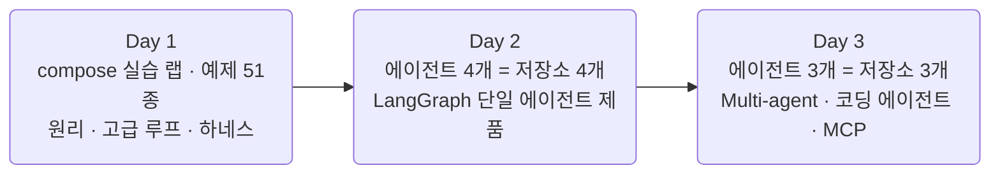
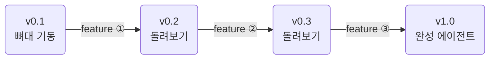

## AI Agent 실전 \{#overview}

3일 / 총 12시간(일 4시간)의 시연 중심 과정입니다. 코드는 전부 완성된 형태로
제공되며, 강사가 실행·해설하는 시연과 코드 리딩으로 진행합니다.

- **대상**: 프로그래밍에 익숙한 전공생 (Python 사용 경험 필수)
- **난이도**: 중상. 코드를 따라 치는 수업이 아니라 설계·판단·트레이스 읽기에 무게를 둡니다
- **형태**: 강사 시연 + 예제 실행 + 코드 리딩. 재현·심화는 자율
- **소스**: 모든 코드는 GitHub 조직 [2026-ai-agents](https://github.com/2026-ai-agents)에 공개됩니다

수업 중 실습·과제는 없습니다. 재현은 각자의 속도로 하면 됩니다. 저장소를
클론해 같은 명령으로 같은 결과를 볼 수 있고, 릴리즈 태그가 단계별
체크포인트가 됩니다.

## 3일의 흐름 \{#flow}

Day 1은 예제 중심의 실습 랩(단일 컨테이너, 터미널 실행)에서 원리와 고급 루프,
하네스를 다집니다. Day 2부터는 **에이전트 하나가 저장소 하나이자 compose로 뜨는
멀티 컨테이너 웹 제품**입니다.

## 선수지식 \{#prerequisites}

- Python 함수·클래스·예외 처리
- REST·JSON 감각, git 기본 (branch·merge·tag)
- Docker는 `compose up`을 실행할 수만 있으면 됩니다
- 비동기(async)는 몰라도 됩니다. Day 1 예제에서 다룹니다

## 저장소 구성 \{#repos}

저장소 하나가 에이전트 하나이자 완결된 제품입니다. 모든 저장소는
독립된 compose 스택이라 컨테이너·볼륨·네트워크를 서로 공유하지 않습니다.

| 저장소 | 일차 | 형태 | 컨테이너 | 릴리즈 |
| --- | --- | --- | --- | --- |
| `core` | 공용 | pip installable 라이브러리 | — | v1.0 단일 |
| `day1-agent-lab` | Day 1 | compose 실습 랩 (터미널 실행) | lab 단일 | v0.1 \~ v1.0 (5단) |
| `diet-agent` | Day 2 ① | compose 웹 제품 | app · ui · db | v0.1 \~ v1.0 (4단) |
| `booking-agent` | Day 2 ② | compose 웹 제품 | app · ui · db | v0.1 \~ v1.0 (4단) |
| `secretary-agent` | Day 2 ③ | compose 웹 제품 | app · ui · db | v0.1 \~ v1.0 (4단) |
| `food-rag-agent` | Day 2 ④ | compose 웹 제품 | app · ui · db · rag | v0.1 \~ v1.0 (4단) |
| `energy-agent` | Day 3 ① | compose 웹 제품 | app · ui · db | v0.1 \~ v1.0 (4단) |
| `support-agent` | Day 3 ② | compose 웹 제품 | app · ui · db · rag | v0.1 \~ v1.0 (4단) |
| `coding-agent` | Day 3 ③ | compose 실행기 + 산출물 앱 | app · ui | v0.1 \~ v1.0 (5단) |

컨테이너 이름은 공유 자원이 아니라 저장소들에서 반복 쓰는 **이름 규약**입니다.

- `lab`: Day 1 전용 Python 실행 환경. 예제·에이전트를 전부 터미널에서 실행
- `app`: FastAPI + LangGraph 에이전트 본체
- `ui`: Streamlit 웹 화면
- `db`: PostgreSQL (도메인 데이터 + checkpointer 영속화)
- `rag`: Chroma 벡터 서버 (검색이 필요한 에이전트만)

## 릴리즈 사다리 \{#release-ladder}

[[release-ladder|릴리즈 사다리]]는 이 과정의 진행 방식 그 자체입니다.
세션 진행이 태그를 오르는 것과 1:1로 대응합니다.

- **v0.1은 시작점**입니다. compose가 뜨고 UI가 열리지만 에이전트는 아직 비어
  있거나 최소 동작만 합니다
- **릴리즈 하나가 feature 하나의 완결**이고, 모든 릴리즈는 그 자체로 실행됩니다
- **v1.0은 완성된 에이전트**입니다. `main`은 항상 v1.0 완성본입니다

재현 방법은 두 가지입니다.

- 특정 단계 재현: `git checkout v0.2` 후 `docker compose up --build`
- 단계 사이 학습: `git diff v0.2 v0.3`으로 "이번 feature가 코드로는 무엇이었나"를 읽기

## 일차별 개념 \{#by-day}

| 저장소 | 개념 | 릴리즈 사다리 |
| --- | --- | --- |
| `day1-agent-lab` | 원리 · 고급 루프 · 하네스 (예제 51종) | v0.1 뼈대 → v0.2 도구 → v0.3 [[react\|ReAct]] → v0.4 고급 루프 → v1.0 [[harness\|하네스]] |
| `diet-agent` | 그래프 기본 | v0.1 뼈대 → v0.2 분기 → v0.3 누적 → v1.0 제품 |
| `booking-agent` | 영속성 · 승인 | v0.1 휘발 → v0.2 영속 → v0.3 승인 → v1.0 완성 |
| `secretary-agent` | 장기 메모리 | v0.1 백지 → v0.2 [[store]] → v0.3 판단 → v1.0 완성 |
| `food-rag-agent` | [[agentic-rag\|Agentic RAG]] · 선별과 검증 | v0.1 검색만 → v0.2 선별 깔때기 → v0.3 검증자 → v1.0 제품 |
| `energy-agent` | [[supervisor\|supervisor]] | v0.1 단일 → v0.2 분리 → v0.3 차트 → v1.0 TTS |
| `support-agent` | [[handoff\|handoff]] | v0.1 분류 → v0.2 handoff → v0.3 기준 → v1.0 RAG |
| `coding-agent` | 3일의 종합 | v0.1 순차 → v0.2 병렬 → v0.3 비용 → v0.4 복구 → v1.0 대시보드 |

## 준비물 \{#checklist}

이 과정은 **GPU가 전혀 필요 없습니다**. 모델 추론과 임베딩은 전부 외부 API로
처리하며, 로컬 Python 환경도 필요 없습니다.

- 노트북 (GPU 불필요, RAM 8GB 이상 권장. 컨테이너 3\~4개를 동시에 띄웁니다)
- git + Docker Desktop
- 플랫폼 3사(Google AI Studio · OpenAI · Anthropic) 중 최소 1개 API 키. 가급적 소액 충전

준비 절차는 [사전 준비 가이드](/article/prep-guide/)에 단계별로 정리해 두었습니다.

## 수료 시 얻는 것 \{#outcome}

- `core`: LiteLLM 래퍼 + budget guard 공용 라이브러리
- `day1-agent-lab`: ReAct·Plan-and-Execute·Reflexion과 인젝션 방어까지 갖춘 여행 에이전트 + 예제 51종
- compose로 뜨는 제품형 에이전트 7종 (각각 v0.1 → v1.0 릴리즈 이력 포함)
- coding-agent용 SPEC 2종 (TODO 웹 앱·타이머 앱)
- MCP 배포 따라하기 가이드
