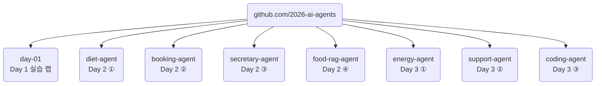
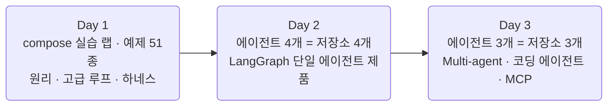

import Slide from 'stack-site-builder/components/Slide.astro';

{/* 슬라이드 작성 규칙은 docs/writing-rules.md의 "슬라이드 규칙"을 따릅니다. */}

<Slide class="cover">

# AI Agent 실전

Day 1 · 1. 오리엔테이션과 환경 점검

*CodeCompose · 2026*

</Slide>

<Slide>

## 이 세션이 하는 일
::sub[이 세션이 끝나면 랩이 기동되고, 이후는 계속 예제를 실행합니다]

- 이 과정의 규칙과 저장소 조직
- **릴리즈 사다리** 사용법
- 랩 기동과 `check_env.py` 통과 확인
- 비용 감각과 3일 로드맵

</Slide>

<Slide>

## 이 과정의 규칙
::sub[따라 치지 않습니다. 읽고, 돌리고, 재현합니다]

- 수업 중 **실습·과제가 없습니다**
- 코드는 **전부 완성본**으로 제공
- 세션은 강사 시연 + 코드 리딩
- 재현은 각자의 속도로. 같은 명령이 같은 결과를 냅니다

</Slide>

<Slide>

## 저장소 하나 = 에이전트 하나
::sub[Day 1은 실습 랩, Day 2부터는 독립된 제품]



</Slide>

<Slide>

## 공통인 것은 시작 명령뿐

```bash
git clone https://github.com/2026-ai-agents/day-01.git
cd day-01
cp .env.sample .env        # 편집기로 열어 키 채우기 (셋 중 하나면 됨)
docker compose up --build -d
docker compose exec lab python check_env.py
```

- 저장소 레이아웃은 통일하지 않습니다.
  에이전트마다 자연스러운 구조로 가고, 각 README가 안내합니다
- 모든 저장소는 `docker compose` 기반. **로컬 Python 환경이 필요 없습니다**

</Slide>

<Slide>

## 컨테이너 이름 규약
::sub[저장소 사이에서 공유되는 자원이 아니라, 반복해서 쓰는 이름입니다]

- `lab`: Day 1 전용. 예제·에이전트를 전부 터미널에서 실행
- `app`: FastAPI + LangGraph 에이전트 본체
- `ui`: Streamlit 웹 화면
- `db`: PostgreSQL (도메인 데이터 + 상태 영속화)
- `rag`: Chroma 벡터 서버 (검색이 필요한 에이전트만)

`booking-agent`의 `db`와 `food-rag-agent`의 `db`는 **서로 다른 인스턴스**입니다

</Slide>

<Slide class="center">

## 릴리즈 사다리

**v0.1 뼈대 → v0.2 도구 → v0.3 ReAct → v0.4 고급 루프 → v1.0 하네스**

세션 진행이 태그를 오르는 것과 1:1

</Slide>

<Slide>

## 사다리 사용법
::sub[태그 하나가 그 시점의 동작 전체를 재현합니다]

```bash
git checkout v0.2 && docker compose up --build -d   # 그 시점의 코드로 그 시점의 동작
git diff v0.2 v0.3                                  # 이번 feature가 코드로는 무엇이었나
docker compose exec lab pytest                      # 어느 태그에서든 그 시점의 테스트가 통과
```

"지금 우리는 v0.2에서 v0.3으로 가는 중"이 늘 성립합니다

</Slide>

<Slide>

## 사다리의 세 가지 약속

- **v0.1은 시작점**: 뼈대가 기동되는 상태
- **릴리즈 하나 = feature 하나**, 그리고 **모든 릴리즈는 그 자체로 실행 가능**
- **v1.0은 완성본**이고 `main`이 항상 v1.0

무거운 산출물(데이터·인덱스)은 해당 릴리즈의 자산으로 붙습니다.
**어느 단에서 시작해도 재현됩니다**

</Slide>

<Slide>

## Day 1의 사다리는 다섯 단

| 릴리즈 | 상태 | 테스트 |
| --- | --- | --- |
| v0.1 | 예제 51종 + 에이전트 뼈대 (도구 없음) | 5개 통과 |
| v0.2 | 도구 장착: 예산 계산 도구가 스키마로 실림 | 16개 통과 |
| v0.3 | ReAct 루프 완성: 여행 플래너가 처음 동작 | 17개 통과 |
| v0.4 | 고급 루프: Reflexion 재시도 장착 | 21개 통과 |
| v1.0 | 하네스 완성: 인젝션 방어 + budget guard | 33개 통과 |

2026-08-14 기준으로 각 단에서 유닛 테스트가 전부 통과하는 것을 확인해 두었습니다

</Slide>

<Slide>

## check_env.py가 확인하는 것

- **키 유효성**: 채워진 키로 실제 호출 1회
- **사용 가능한 모델**
- **컨테이너 내 패키지 버전**

```text
=== 패키지 버전 ===
  python   3.13.15
  litellm  1.96.2
  pydantic 2.13.4
  pytest   8.4.2
```

키가 하나도 없으면 해결 방법을 안내하고 종료 코드 1로 끝납니다

</Slide>

<Slide>

## 잘 안 될 때

- `docker: command not found` → Docker Desktop이 실행 중인지 확인
- 키 인증 실패 → `.env`의 키 앞뒤 공백·따옴표 확인, 충전 여부 확인
- 그 외는 **지금 이 시간에 함께 해결합니다**

키는 셋 중 하나만 있어도 모든 예제가 돕니다.
의미 검색 실습에는 Google 키가 필요합니다

</Slide>

<Slide>

## 예제 실행 방법
::sub[전부 docker compose exec로 돕니다]

```bash
docker compose exec lab python examples/01_api/01_hello_completion.py
```

- 각 파일 상단 docstring에 "무엇을 보는가"와 실행 명령이 있습니다
- **예제 51종을 전부 수업에서 실행합니다.**
  세션 문서에 실행 결과가 함께 실려 있어, 재현할 때 자기 출력과 대조할 수 있습니다

</Slide>

<Slide>

## 키 없이 도는 것들

- 토큰 세기, 단가표, 스키마 생성, 경로 감금, 출력 필터,
  비용 추정, budget guard, 트레이스 로그
- 유닛 테스트는 키도 네트워크도 없이 돕니다

```bash
docker compose exec lab pytest
```

키 발급이 늦어져도 따라올 수 있는 구간이 있습니다

</Slide>

<Slide class="center">

## 비용은 얼마나 드나

$5 충전을 권했습니다. 그 돈이 어디에 얼마나 쓰이는지

</Slide>

<Slide>

## 2026-08-14 실측

| 하는 일 | 비용 |
| --- | --- |
| `check_env.py` 1회 (3사 각 1콜) | $0.0001 미만 |
| 예제 하나 실행 (호출 1\~5회) | $0.001 \~ $0.01 수준 |
| 여행 플래너 풀런 1회 (루프 + 도구 3종) | $0.003 \~ $0.010 |
| 루프가 8스텝을 다 쓰는 최악 시나리오 | $0.007 \~ $0.033 |

</Slide>

<Slide>

## 비용 읽기

- 예제 51종을 전부 따라 돌리고 에이전트를 여러 번 실행해도
  **하루 $1 안쪽**입니다
- 유닛 테스트는 LLM을 부르지 않으므로 0원, 키 없이 도는 예제도 0원
- 기본 모델 3종은 전부 각 사의 저가 티어입니다.
  단, 프로바이더마다 가격 하한이 달라서 Anthropic이 상대적으로 비쌉니다

</Slide>

<Slide class="center">

## 호출 한 번은 티끌이지만
## 에이전트는 루프입니다

비용 감각은 첫날부터 장비처럼 챙깁니다

7세션에서 누적 비용에 상한을 거는 budget guard를 답니다

</Slide>

<Slide>

## Day 1의 흐름
::sub[예제 51종을 전부 함께 봅니다]

1. LLM API의 본질
2. LiteLLM 통합 레이어
3. Tool calling 심화 → **v0.2**
4. ReAct 루프 → **v0.3**
5. ReAct 너머의 루프들 → **v0.4**
6. 하네스 엔지니어링 → **v1.0**
7. MCP 맛보기

</Slide>

<Slide>

## 3일 로드맵



</Slide>

<Slide>

## 3일이 얹는 것

- **Day 1 (오늘)**: 프레임워크 없이 원리를 다집니다.
  LLM API의 본질부터 tool calling, ReAct와 그 너머의 루프, 하네스, MCP 맛보기
- **Day 2**: 에이전트 4개가 각각 저장소 하나씩. LangGraph 위에서
  그래프, 영속성과 승인, 장기 메모리, Agentic RAG를 하나씩 얹습니다
- **Day 3**: supervisor와 handoff 패턴, 3일의 종합인 병렬 코딩 에이전트,
  우리가 만든 에이전트를 MCP 서버로 내어주는 시연

</Slide>

<Slide class="center">

## 다음 세션부터 예제를 실행합니다

**LLM API의 본질** · `examples/01_api/` 11종

교안: 강의 사이트의 Day 1 세션 문서

</Slide>
