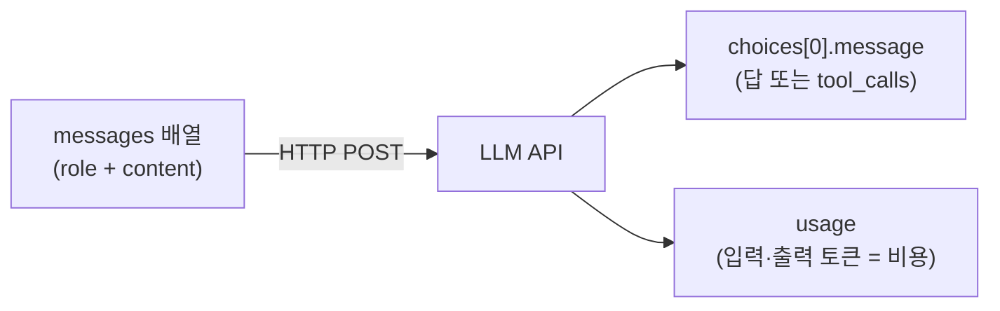
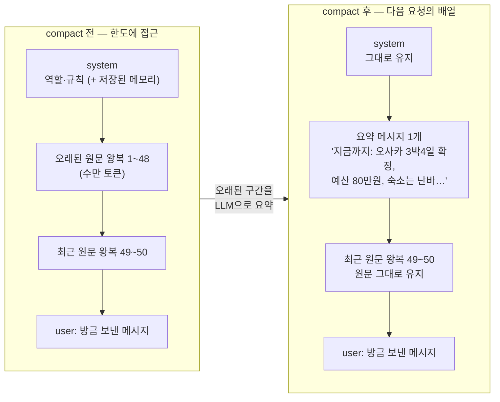

import Slide from 'stack-site-builder/components/Slide.astro';

<Slide class="cover">

# AI Agent 실전

Day 1 · 2. LLM API의 본질

*CodeCompose · 2026*

</Slide>

<Slide>

## 이 세션이 하는 일
::sub[프레임워크를 걷어내고 API의 바닥을 봅니다]

- `examples/01_api/` **11종을 전부 실행**합니다
- 요청에 무엇을 싣고, 응답에서 무엇을 쓰는지 JSON 원문으로 확인
- 토큰·한도·비용이 왜 설계 문제인지 숫자로 확인
- 기억이 서버가 아니라 **messages 배열**에 있다는 것을 실험으로 확인

</Slide>

<Slide class="center">

## 핵심 문장

**LLM API의 전부는 "messages 배열을 보내면 choices가 돌아온다"**

오늘 볼 11종은 전부 이 문장 하나의 변주입니다

</Slide>

<Slide>

## 그림 한 장



무엇을 실어 보내는가(역할·이미지·히스토리),
무엇이 돌아오는가(문장·JSON·델타 청크),
그리고 usage가 곧 돈이라는 것

</Slide>

<Slide>

## 오늘의 순서
::sub[예제 11종을 다섯 묶음으로]

1. 요청과 응답 (최소 호출, 역할)
2. 토큰·한도·온도 (토큰 수, 컨텍스트 초과, temperature)
3. 스트리밍과 병렬 (델타 청크, async)
4. 무상태와 기억 (히스토리, compact)
5. 계약과 비용 (JSON 강제, 이미지, 비용 계산)

</Slide>

<Slide class="center">

## Part 1. 요청과 응답

무엇을 보내고 무엇이 돌아오는가

</Slide>

<Slide>

## 1. 최소 호출
::sub[01_hello_completion.py · 요청·응답 JSON 원문을 그대로 본다]

```python
request = {
    "model": model,
    "messages": [{"role": "user", "content": "안녕하세요! 한 문장으로 인사해 주세요."}],
}
response = completion(**request)
print(response.model_dump_json(indent=2))
```

```bash
docker compose exec lab python examples/01_api/01_hello_completion.py
```

</Slide>

<Slide>

## 응답 원문: 모델이 돌려주는 것 전체

```text
{
  "model": "gemini-3.5-flash-lite",
  "choices": [
    {
      "finish_reason": "stop",
      "message": {
        "content": "안녕하세요! 만나서 반가운데, 오늘 어떤 도움이 필요하신가요?",
        "role": "assistant",
        "tool_calls": null,
        "provider_specific_fields": { "thought_signatures": ["El4KXAERTTIP…"] }
      }
    }
  ],
  "usage": { "completion_tokens": 16, "prompt_tokens": 11, "total_tokens": 27 }
}
```

</Slide>

<Slide>

## 실제로 쓰는 것은 두 곳뿐

```text
choices[0].message.content = '안녕하세요! 만나서 반가운데, …'
usage = 입력 11 토큰 + 출력 16 토큰
```

- `content`: 답
- `usage`: 비용
- `provider_specific_fields`처럼 프로바이더 고유 필드가 섞여 오는 것도
  실물에서만 보입니다

</Slide>

<Slide class="center">

## `"tool_calls": null`

이 자리를 기억해 두세요

**4세션에서 저 자리가 채워지는 순간 에이전트가 시작됩니다**

</Slide>

<Slide>

## 2. 역할: system이 내용과 형식을 정한다
::sub[02_roles.py · 같은 질문에 system만 갈아 끼운다]

```python
personas = {
    "(system 없음)": None,
    "미슐랭 심사위원": "당신은 미슐랭 심사위원입니다. 미식가의 기준으로 …",
    "초등학생 눈높이": "당신은 초등학생에게 설명하는 선생님입니다. …",
    "JSON 응답기": "반드시 {\"추천\": ..., \"이유\": ...} 형태의 JSON으로만 …",
}
```

질문은 하나로 고정: "오사카에서 꼭 먹어야 할 것 하나만"

</Slide>

<Slide>

## system만 바꿨을 뿐인데

```text
=== system = (system 없음) ===
오사카 여행에서 단 하나만 먹어야 한다면 … '오코노미야키'를 추천합니다.

=== system = 미슐랭 심사위원 ===
… 저는 망설임 없이 '제대로 된 갓포 요리(割烹)'를 선택하겠습니다.

=== system = 초등학생 눈높이 ===
와, 오사카 여행 정말 부럽다! 선생님은 타코야키를 꼭 추천할게! …

=== system = JSON 응답기 ===
{"추천": "타코야키", "이유": "오사카의 소울 푸드로, …"}
```

</Slide>

<Slide>

## 결과 읽기: 내용도 형식도 system에서 갈렸다

- 답의 **내용**: 갓포 요리 vs 타코야키
- 답의 **형식**: 산문 vs JSON
- 에이전트의 성격·규칙·말투가 실리는 자리
- 7세션의 하네스에서 이 자리가 **방어선**이 됩니다

</Slide>

<Slide class="center">

## Part 2. 토큰 · 한도 · 온도

돈과 벽, 그리고 재현성

</Slide>

<Slide>

## 3. 토큰: 한글이 더 비싼 이유
::sub[03_tokens.py · API 호출 없이 토크나이저만으로 돈다. 키 불필요]

```text
   한국어 |   영어 | 문장
    11 |    9 | 안녕하세요, 오늘 날씨가 정말 좋네요.…
    23 |   23 | 3박 4일 오사카 여행 일정을 짜 주세요. 예산은 80…
    19 |   10 | 대규모 언어 모델은 토큰 단위로 텍스트를 처리합니다.…
  합계: 한국어 53 토큰 vs 영어 42 토큰 (약 1.3배)
```

과금과 컨텍스트 한도는 **글자 수가 아니라 토큰 수** 기준입니다.
세 번째 문장(19 vs 10)처럼 2배 가까이 벌어지기도 합니다

</Slide>

<Slide>

## 4. 컨텍스트 한도: 넘치면 잘리는 게 아니라 거부된다
::sub[04_context_limit.py · 한도가 가장 작은 모델에 한도의 1.5배를 보낸다]

```python
model = min(available_models(), key=lambda m: get_model_info(m)["max_input_tokens"])
limit = get_model_info(model)["max_input_tokens"]
text = chunk * (int(limit * 1.5) // chunk_tokens + 1)   # 확실히 초과
```

요청이 거부되므로 **과금되지 않습니다**

</Slide>

<Slide>

## 에러 원문

```text
=== anthropic/claude-haiku-4-5의 입력 한도 ===
  max_input_tokens = 200,000

=== 일부러 초과 요청 ===
  보내는 입력: 약 300,001 토큰 (한도의 1.5배)

=== 에러 원문 ===
  ContextWindowExceededError
  … "prompt is too long: 275024 tokens > 200000 maximum"
```

</Slide>

<Slide>

## 결과 읽기: 두 가지가 보인다

- **① 초과분은 잘리는 게 아니라 요청 자체가 거부됩니다**
- **② 토큰 수는 세는 쪽마다 다릅니다**
  우리 근사 토크나이저는 30만, 프로바이더는 27.5만으로 셌습니다
- 한도 근처의 계산은 항상 여유를 둡니다
- 에이전트 루프에서 히스토리가 무한히 자라면 정확히 이 에러를 만납니다

</Slide>

<Slide>

## 5. temperature: 재현성과 다양성의 손잡이
::sub[05_temperature.py · 같은 질문을 0과 1로 5번씩]

```text
(시연 모델: openai/gpt-5.4-nano)

=== temperature = 0.0 ===
  1회: 도쿄 / 2회: 도쿄 / 3회: 도쿄 / 4회: 도쿄 / 5회: 도쿄
  → 서로 다른 답 1종

=== temperature = 1.0 ===
  1회: **도쿄** / 2회: 도쿄 / 3회: 도쿄 / 4회: **오사카** / 5회: 도쿄 (Tokyo)
  → 서로 다른 답 4종
```

</Slide>

<Slide>

## 결과 읽기: 0을 쓰는 자리가 따로 있다

- **0**: 도구 선택·채점·검증처럼 재현성이 필요한 자리
- **높게**: 발상이 필요한 자리
- 곁가지 발견 하나: Gemini 3+는 이 파라미터를 은퇴시키는 중입니다
  (호출마다 경고가 뜹니다)
- 같은 파라미터도 프로바이더마다 지원 상태가 다르다는 실례

</Slide>

<Slide class="center">

## Part 3. 스트리밍과 병렬

기다림을 다루는 두 가지 방법

</Slide>

<Slide>

## 6. 스트리밍: 답은 조각으로 온다
::sub[06_streaming.py · 채팅 UI가 글자를 흘리는 것의 실체]

```text
=== 처음 5개 청크 원문 ===
  chunk[0] delta='**'
  chunk[1] delta='"먹다 지쳐 쓰러진다는 \'구이도락(食い'
  chunk[2] delta="倒れ)'의 본고장이자, 화려한 네온사인과 정겨운 인간미가 공존"
  chunk[3] delta='하는 일본 최고의 활기찬 도시."**'
  chunk[4] delta=''
```

조각의 크기와 경계는 프로바이더 마음입니다.
청크 0은 `**` 두 글자, 청크 2는 한 구절. **이어붙이는 쪽이 완성 텍스트를 책임집니다**

</Slide>

<Slide>

## 7. 병렬 호출: 동시에 물으면 몇 배 빠른가
::sub[07_async_parallel.py · 도시 5곳을 순차로, 그리고 동시에]

```python
tasks = [acompletion(model=model, messages=[…]) for city in cities]
await asyncio.gather(*tasks)
```

```text
=== 순차 호출 (5회) ===   5.2초
=== 병렬 호출 (5회 동시) ===   1.5초
=== 비교 ===   순차 5.2초 → 병렬 1.5초 (약 3.4배)
```

LLM 호출은 네트워크 대기가 대부분이라 병렬화 이득이 큽니다.
`acompletion` + `gather` 패턴 하나면 충분하고,
Day 3 `coding-agent`의 병렬 worker가 이 확장판입니다

</Slide>

<Slide class="center">

## Part 4. 무상태와 기억

서버는 아무것도 기억하지 않습니다

</Slide>

<Slide>

## 8. 무상태: 기억은 서버가 아니라 배열에 있다
::sub[08_multiturn_stateless.py · 히스토리 없이, 그리고 실어서]

```text
=== 1턴: 자기소개 ===
  김철수님, 안녕하세요! 오사카 여행 계획을 세우고 계시다니 …

=== 2턴 (히스토리 없이): 제 이름이 뭐라고 했죠? ===
  죄송하지만, 이전 대화에서 이름을 말씀해 주지 않으셔서 저는 아직
  성함을 모릅니다.

=== 2턴 (히스토리 포함): 같은 질문 ===
  철수님의 이름은 김철수님이십니다!
```

</Slide>

<Slide>

## 결과 읽기: "이어지는 대화"는 착시다

- 서버는 아무것도 기억하지 않습니다
- 클라이언트가 **messages 배열 전체를 매번 다시 보내서** 만드는 착시입니다
- 이 배열이 스텝마다 부풀어 비싸지는 것이 에이전트 루프의 비용 구조
  (5세션에서 그래프로 봅니다)
- **이 배열을 관리하는 일이 곧 컨텍스트 엔지니어링입니다**

</Slide>

<Slide>

## 그런데 채팅은 분명히 나를 기억한다
::sub[간극을 메우는 장치는 전부 배열 관리 기법입니다]

- **같은 대화 안에서의 기억**: 방금 본 그대로. 클라이언트가 대화 전체를
  매번 다시 보냅니다. 서비스가 기억하는 게 아니라 배열이 기억합니다
- **대화를 새로 열어도 남는 기억**: 별도 저장소에 적어 둔 사실
  ("사용자는 개발자다")을 다음 대화의 system 근처에 끼워 넣습니다.
  모델이 기억하는 게 아니라, **매번 읽고 시작하는 쪽지**가 있는 것입니다
- Day 2 `secretary-agent`의 store가 정확히 이 구조입니다

</Slide>

<Slide>

## 그런데 배열은 자라기만 한다
::sub[방치하면 부딪히는 세 가지 벽]

- **한도**: 4번에서 본 그대로, 넘치는 순간 요청 자체가 거부됩니다
- **비용**: 입력 토큰은 매 턴 전체를 다시 냅니다
- **품질**: 컨텍스트가 길어지면 모델이 오래된 세부를 놓치기 시작합니다

그래서 Claude Code 같은 도구는 대화가 차오르면 **compact**를 돌립니다.
오래된 원문을 LLM으로 요약해 짧은 메시지 하나로 갈아끼우는 작업입니다

</Slide>

<Slide>

## compact가 배열을 바꾸는 모양



</Slide>

<Slide>

## 무엇이 남고 무엇이 치환되나

- **유지**: system 메시지, 최근 왕복 몇 개의 원문, 방금 보낸 메시지
  진행 중인 작업의 세부(코드 조각, 직전 지시)가 요약으로 뭉개지면 안 됩니다
- **치환**: 오래된 왕복 수십 개가 요약 메시지 하나로. 수만 토큰이 수백 토큰으로
- **모델 입장에서는 구분이 없습니다**: 요약도 그냥 배열 속 메시지 하나입니다.
  서버는 여전히 무상태이고, 바뀐 것은 우리가 보내는 배열의 내용뿐입니다

</Slide>

<Slide class="center">

## 요약은 손실 압축이다

compact 직후 "아까 그 함수 이름 뭐였지?"에 모델이 답하지 못하는 이유

**요약에서 빠진 내용은 배열에서 사라진 것이고, 사라진 것은 존재하지 않습니다**

</Slide>

<Slide class="center">

## Part 5. 계약과 비용

형태를 강제하고, 값을 세어 본다

</Slide>

<Slide>

## 10. JSON 강제: 부탁이 아니라 계약으로
::sub[09_json_mode.py · 부탁한 버전과 강제한 버전을 json.loads에 통과시킨다]

````text
=== 그냥 부탁만 한 경우 ===
  오사카의 대표적인 명소 2곳을 담은 JSON 배열입니다.
  ```json
  [ { "name": "오사카 성", … } ]
  ```
  → json.loads 실패: Expecting value: line 1 column 1 (char 0)

=== response_format으로 강제한 경우 ===
  [{"name": "오사카 성", "fee": "600엔"}, {"name": "우메다 스카이 빌딩", …}]
  → json.loads 통과
````

</Slide>

<Slide>

## 결과 읽기: 형태의 계약일 뿐 값의 계약은 아니다

- 부탁하면 설명 문장과 코드펜스가 섞여 와서 파싱이 깨집니다
- 강제하면 파싱이 **계약**이 됩니다
- 다만 `fee`가 `"600엔"`이라는 문자열입니다. 형태는 맞지만 타입은 아닙니다
- 타입까지 묶는 방법은 **4세션의 구조화 출력**에서 잇습니다

</Slide>

<Slide>

## 11. 이미지 입력: 멀티모달도 같은 구조
::sub[10_vision.py · 이미지를 직접 받아 base64 data URL로 싣는다]

```python
req = urllib.request.Request(image_url, headers={"User-Agent": "day-01-lab/1.0"})
image_b64 = base64.b64encode(urllib.request.urlopen(req).read()).decode()
content = [
    {"type": "text", "text": "이 사진의 건물이 무엇인지 한 문장으로 답해 주세요."},
    {"type": "image_url", "image_url": {"url": f"data:image/jpeg;base64,{image_b64}"}},
]
```

```text
=== 응답 ===
  이 사진 속 주요 건물은 일본 오사카에 위치한 역사적인 랜드마크인 오사카성입니다.
```

</Slide>

<Slide>

## 결과 읽기: 구조는 그대로다

- `content`가 문자열에서 `[text 조각, image 조각]` 배열로 바뀌었을 뿐입니다
- 이 예제는 처음에 이미지 URL을 그대로 넘기다가
  호스트의 User-Agent 차단과 썸네일 정책에 **두 번 깨졌습니다**
- 이미지를 직접 받아 base64로 싣는 지금 방식이 실전에서도 안전합니다

</Slide>

<Slide>

## 12. 비용 계산: 토큰 곱하기 단가
::sub[11_cost_calc.py · 키 없이 돈다]

```text
=== 모델별 비용 (litellm 내장 단가표) ===
  모델                              입력단가/1M   출력단가/1M      이 호출
  gemini/gemini-3.5-flash-lite     $     0.30   $     2.50   $ 0.001257
  openai/gpt-5.4-nano              $     0.20   $     1.25   $ 0.000630
  anthropic/claude-haiku-4-5       $     1.00   $     5.00   $ 0.002523
```

비용 = 입력 토큰 × 입력 단가 + 출력 토큰 × 출력 단가

</Slide>

<Slide class="center">

## 호출 한 번은 티끌이지만
## 에이전트는 루프입니다

스텝 10번, 부푸는 히스토리, 멀티 에이전트 N명이면 자릿수가 달라집니다

그래서 7세션에서 budget guard를 답니다

</Slide>

<Slide>

## 이 세션이 남기는 것

- 응답에서 쓰는 곳은 `content`와 `usage`, 그리고 아직 비어 있는 `tool_calls`
- 기억은 서버가 아니라 messages 배열에 있고, **그 배열이 비용이다**
- 채팅의 기억도, compact도 전부 배열 관리 기법이다. 요약은 손실 압축이다
- 형태는 강제할 수 있지만(JSON 모드), **값의 보증은 다음 세션들의 몫이다**

</Slide>

<Slide class="center">

## 다음 세션

**LiteLLM 통합 레이어** · `examples/02_litellm/` 10종

오늘 쓴 `completion()`이 무엇이었는지, 왜 공식 SDK가 아닌지

</Slide>
