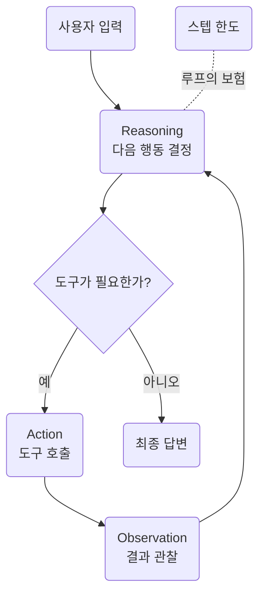

import Slide from 'stack-site-builder/components/Slide.astro';
import ContextGrowth from '../../../../components/ContextGrowth.astro';

<Slide class="cover">

# AI Agent 실전

Day 1 · 5. ReAct 루프

*CodeCompose · 2026*

</Slide>

<Slide>

## 이 세션이 하는 일
::sub[4세션의 왕복이 드디어 루프가 됩니다]

- 완성본 여행 플래너를 돌리며 **트레이스를 읽습니다**.
- `examples/04_react/` **4종을 전부 실행**합니다.
- 스텝 한도가 어떻게 보험으로 동작하는지, 컨텍스트가 어떻게 부푸는지 실측
- 세션 끝에서 에이전트가 **v0.3**, 처음으로 제대로 동작합니다.

</Slide>

<Slide class="center">

## 핵심 문장

**에이전트를 이해한다는 것은 트레이스를 읽을 줄 안다는 뜻이다**.

</Slide>

<Slide>

## ReAct: reasoning → action → observation



</Slide>

<Slide class="center">

## ReAct의 실체

**4세션의 왕복 + for 루프 + 종료 조건 둘**

그 이상이 아닙니다.

</Slide>

<Slide>

## 오늘의 순서

1. 루프의 전부 (v0.3 코드 포인트)
2. 트레이스 읽기
3. 스텝 한도: 1, 3, 10
4. 프롬프트 절제: 문단을 빼면 무엇이 달라지나
5. 컨텍스트 팽창: 우상향 계단
6. 실패 재현: 무한 루프
7. v0.3 완성 확인

</Slide>

<Slide>

## v0.2는 무엇이 부족했나
::sub[도구는 실렸지만, 한 번 쓰고 끝났습니다]

- v0.2의 에이전트는 도구를 **딱 1왕복만** 씁니다.
- "예산을 계산해 보니 초과다. 그럼 다른 조건으로 다시" 같은 행동이 불가능합니다.
- 도구 결과를 보고 **다음 행동을 정하는 자리**가 없기 때문입니다.

오늘 그 자리를 만듭니다.

</Slide>

<Slide class="center">

## Part 1. 루프의 전부

`agent/react.py`, 뼈대만 추리면 이것이 전부입니다.

</Slide>

<Slide>

### 먼저 의사코드로

```plaintext
messages = [system, user]
반복 (최대 max_steps회):
    응답 = 모델에게 (messages + 도구 목록)을 보낸다
    도구 요청이 없으면 → 그 응답이 최종 답. 끝
    도구 요청이 있으면 →
        요청 메시지를 messages에 넣고
        도구를 실행해 결과를 messages에 넣는다
반복이 끝났는데도 안 끝났으면 →
    도구 없이 한 번 더 물어 마무리 답을 받는다
```

이 열 줄이 그대로 코드가 됩니다.

</Slide>

<Slide>

### v0.3 코드 포인트

```python
for step_no in range(1, max_steps + 1):
    response = completion(model=model, messages=messages, tools=tool_schemas())
    message = response.choices[0].message

    if not message.tool_calls:            # 종료 ①: 최종 답
        result.answer = message.content
        return result

    messages.append(message.model_dump()) # action → observation 되먹임
    for call in message.tool_calls:
        observation = run_tool(call.function.name, call.function.arguments)
        messages.append({"role": "tool", "tool_call_id": call.id,
                         "content": observation})

# 종료 ②: 스텝 한도 — 도구 없이 마무리 답변만 받는다
response = completion(model=model, messages=messages)
```

</Slide>

<Slide>

### 분기 조건은 하나뿐

```python
if not message.tool_calls:
```

- 모델이 도구를 요청했으면 **실행하고 되먹인다**.
- 요청하지 않았으면 **그것이 최종 답이다**.
- reasoning은 별도 단계가 아닙니다.
  "도구를 부를까, 이제 답할까"라는 이 판단 자체가 reasoning입니다.

</Slide>

<Slide>

### 종료 조건 ②: 한도 도달

```python
# 한도 도달 후의 마무리 호출
response = completion(model=model, messages=messages)   # tools 없음
```

- 마무리 호출에는 **tools를 싣지 않습니다**.
- 더 돌 수 없어야 보험입니다.
- 여기 tools를 실으면 모델이 또 도구를 요청할 수 있고,
  그러면 한도가 한도가 아니게 됩니다.

</Slide>

<Slide>

### 매 스텝 messages 배열은 이렇게 쌓인다

```plaintext
[system] 여행 상담원 지침
[user]   3박 4일 오사카, 예산 80만원
[assistant] tool_calls: calc_budget({...})      ← 스텝 1이 넣은 것
[tool]      {"합계": 910000, ...}               ← 스텝 1이 넣은 것
[assistant] tool_calls: calc_budget({...})      ← 스텝 2가 넣은 것
[tool]      {"합계": 650000, ...}               ← 스텝 2가 넣은 것
…
```

한 스텝이 배열에 **두 개씩** 메시지를 밀어 넣습니다.  
그리고 이 배열 전체가 매 스텝 다시 전송됩니다.

</Slide>

<Slide>

### 도구 목록도 매 스텝 다시 실린다

```python
response = completion(model=model, messages=messages, tools=tool_schemas())
```

- `tool_schemas()`가 **매 스텝** 호출됩니다.
- 도구 스키마도 토큰입니다. 4세션에서 본 "좁게 준다"가 여기서 비용이 됩니다.
- 도구 3개짜리 이 랩에서도 매 호출 수백 토큰이 도구 설명입니다.

</Slide>

<Slide>

### 매 스텝은 데이터로 남는다

- 매 스텝이 `StepRecord`(도구·인자·결과·토큰)로 기록됩니다.
- 오늘 볼 예제 4종이 전부 **이 데이터를 읽어서** 만들어집니다.
- 스텝 한도 실험도, 컨텍스트 팽창 그래프도 별도 계측 코드가 아니라
  루프가 남긴 기록을 집계한 것입니다.

</Slide>

<Slide class="center">

### 루프를 만드는 데 필요한 것은

## 새로운 개념이 아니라 종료 조건입니다

4세션의 왕복은 이미 있었습니다.  
오늘 더한 것은 `for`와 `if` 두 개뿐입니다.

</Slide>

<Slide class="center">

## Part 2. 트레이스 읽기

에이전트의 사고 과정

</Slide>

<Slide>

### 1. 트레이스 읽기
::sub[01_react_trace.py · "3박 4일 오사카, 예산 80만원"을 verbose로]

```bash
docker compose exec lab python examples/04_react/01_react_trace.py
```

에이전트가 어떤 도구를 어떤 순서로, 왜 불렀는지가
한 화면에 그대로 나옵니다.

</Slide>

<Slide>

### 트레이스를 읽을 때 보는 것
::sub[네 가지만 보면 됩니다]

- **어떤 도구**를 불렀나 (도구 선택이 맞았나)
- **어떤 인자**로 불렀나 (인자가 질문에서 제대로 나왔나)
- **결과를 어떻게 썼나** (다음 스텝이 그 결과에 반응했나)
- **왜 멈췄나** (`final`인가 `max_steps`인가)

</Slide>

<Slide>

### 앞의 두 스텝: 예산을 두 번 계산했다

```text
[step 1] calc_budget({"people": 1, "nights": 3, "style": "보통"})
         → {"합계": 910000, …}                       (컨텍스트 799tk)
[step 2] calc_budget({"nights": 3, "people": 1, "style": "절약"})
         → {"합계": 650000, …}                       (컨텍스트 922tk)
```

- 보통 스타일: 91만원. **예산 80만원 초과**
- 절약 스타일로 다시 계산: 65만원. 통과

</Slide>

<Slide>

### 두 인자를 나란히 놓고 보세요

```text
step 1: {"people": 1, "nights": 3, "style": "보통"}
step 2: {"people": 1, "nights": 3, "style": "절약"}
                                   ^^^^^^^^^^^^^^
```

- 바뀐 것은 `style` 하나뿐입니다.
- 모델이 step 1의 **결과를 읽고** 어느 인자를 고칠지 판단했습니다.
- 이것이 observation 되먹임이 하는 일입니다.

</Slide>

<Slide>

### 그다음에야 장소를 검색했다

```text
[step 3] search_places({"category": "관광", "city": "오사카"}) …  (1045tk)
[step 4] search_places({"category": "식당", "city": "오사카"}) …  (1255tk)
[step 5] search_places({"category": "카페", "city": "오사카"}) …  (1391tk)
[step 6] estimate_travel_time({"from_area": "난바", "to_area": "우메다"}) … (1495tk)
[step 7] estimate_travel_time({…난바→주오구}) …                   (1584tk)
[step 8] estimate_travel_time({…난바→베이에리어}) …               (1673tk)
[한도 도달] max_steps=8, 지금까지의 근거로 마무리
```

</Slide>

<Slide>

### 최종 답

```text
=== 최종 답 (앞부분) ===
  … 도구로 확인한 결과, '보통 스타일'의 예상 합계는 91만 원으로
  예산(80만 원)을 초과하므로, '절약 스타일'을 기준으로 예산을
  맞추어야 합니다. …
```

트레이스에서 본 그 판단이 답에 그대로 실렸습니다.

</Slide>

<Slide class="center">

### 시키지 않은 일이 일어났습니다

"예산을 초과하면 다시 계산하라"고 쓴 적이 없습니다.

**루프 구조에서 자연스럽게 나온 행동입니다**.

</Slide>

<Slide>

### 트레이스가 말해 주는 것

- 어떤 도구를, 어떤 인자로, 어떤 순서로 불렀나
- 각 스텝의 컨텍스트가 얼마나 컸나 (799 → 1,673토큰)
- 이 실행은 **8스텝을 꽉 채워 한도로 종료**됐다.
- 답만 봐서는 이 중 어느 것도 알 수 없습니다.

</Slide>

<Slide>

### 종료 사유 두 가지를 구분하세요

| 종료 사유 | 무슨 뜻인가 | 어떻게 읽나 |
| --- | --- | --- |
| `final` | 모델이 "이제 답하겠다"고 판단 | 정상 종료. 근거가 충분했다 |
| `max_steps` | 한도에 걸려 강제로 마무리 | 근거가 부족할 수 있다. 한도를 의심 |

이번 실행은 `max_steps`였습니다.  
답은 나왔지만 **더 확인하고 싶은 것이 남아 있었다**는 뜻입니다.

</Slide>

<Slide class="center">

### 트레이스는 print가 아니라 데이터입니다

스텝·인자·결과·토큰이 구조로 남아야 읽을 수 있습니다.

7세션에서 이것을 JSONL 로그로 만듭니다.

</Slide>

<Slide class="center">

## Part 3. 스텝 한도

1, 3, 10으로 바꿔 보면

</Slide>

<Slide>

### 2. 같은 질문, 세 가지 한도
::sub[02_max_steps.py · 한도가 도구 사용량과 근거의 두께를 어떻게 바꾸나]

- 실행

```bash
docker compose exec lab python examples/04_react/02_max_steps.py
```

- 결과

```text
=== max_steps = 1 ===
  사용한 스텝: 1, 종료: max_steps
  쓴 도구: ['calc_budget'] / 답 길이: 960자
```

한도 1이어도 **답은 나옵니다**.
마무리 호출이 "지금까지 확인한 것만으로 정리하라"를 시키기 때문입니다.  
대신 근거가 예산 계산 하나뿐입니다.

</Slide>

<Slide>

### 한도 3과 10

```text
=== max_steps = 3 ===
  사용한 스텝: 3, 종료: max_steps
  쓴 도구: ['calc_budget', 'search_places', 'search_places'] / 답 길이: 1161자

=== max_steps = 10 ===
  사용한 스텝: 7, 종료: final
  쓴 도구: ['calc_budget', 'search_places' × 3, 'estimate_travel_time' × 2]
  답 길이: 983자
```

한도 10에서는 **7스텝 만에 `final`로 스스로 멈췄습니다**.

</Slide>

<Slide>

### 결과 읽기

- 한도가 낮으면 답이 안 나오는 게 아니라 **근거가 얇아집니다**.
- 한도 10에서는 한도가 쓰이지도 않았습니다.
- 종료 사유(`max_steps` vs `final`)가 트레이스에 남는 것이 중요합니다.
  "왜 여기서 멈췄나"에 답할 수 있어야 합니다.

</Slide>

<Slide>

### 세 실행을 표로

| 한도 | 사용한 스텝 | 종료 | 쓴 도구 수 | 답 길이 |
| --- | --- | --- | --- | --- |
| 1 | 1 | `max_steps` | 1 | 960자 |
| 3 | 3 | `max_steps` | 3 | 1,161자 |
| 10 | 7 | `final` | 6 | 983자 |

답 길이는 한도에 비례하지 않습니다.  
한도 10의 답이 한도 3보다 짧지만, **근거는 훨씬 두껍습니다**.

</Slide>

<Slide>

### 그럼 한도를 얼마로 둘 것인가

- 너무 낮으면: 근거가 얇은 답이 나옵니다. 그래도 답은 나옵니다.
- 너무 높으면: 폭주 시 비용이 커집니다. 정상 실행에는 영향이 없습니다.
- 실무 기준: **정상 실행이 쓰는 스텝 수의 2배 정도**를 잡고,
  `max_steps` 종료가 자주 보이면 올립니다.
- 이 랩의 기본값은 8입니다.

</Slide>

<Slide class="center">

### 스텝 한도는 품질 설정이 아니라

## 폭주에 대한 보험입니다

보험이 여유로우면 쓰이지 않습니다.

</Slide>

<Slide class="center">

## Part 4. 프롬프트 절제

문단을 빼면 무엇이 달라지나

</Slide>

<Slide>

### 3. 세 가지 프롬프트
::sub[03_prompt_ablation.py · 같은 질문을 세 조건으로]

- **①** 온전한 프롬프트
- **②** 도구 지침 문단 제거
- **③** 빈 프롬프트

```bash
docker compose exec lab python examples/04_react/03_prompt_ablation.py
```

</Slide>

<Slide>

### 무엇을 빼는가

에이전트의 시스템 프롬프트는 대략 이런 문단들로 되어 있습니다.

- 역할 정의 ("너는 여행 상담원이다")
- **도구 지침** ("근거는 반드시 도구로 확인하라")
- 출력 형식 ("일정과 예산 내역을 함께 제시하라")

②는 이 중 도구 지침 문단만 들어냅니다.  
③은 전부 들어냅니다.

</Slide>

<Slide>

### ① 온전한 프롬프트

```text
  스텝 8, 도구 사용 7회
  답: … 오사카 1박 2일 '절약' 스타일 예산을 계산한 결과,
  항공권을 포함할 경우 항공권 비용(약 35만 원)으로 인해 …
```

도구를 7회 쓰며 근거를 확인했습니다.

</Slide>

<Slide>

### ② 도구 지침 제거 · ③ 빈 프롬프트

```text
=== ② 도구 지침 문단 제거 ===
  스텝 4, 도구 사용 3회
  답: … 항공권 비용(약 35만 원 선)만으로도 예산을 초과하게 됩니다 …

=== ③ 빈 프롬프트 ===
  스텝 4, 도구 사용 3회
  답: … 예산(항공권 불포함 기준 30만 원)에 맞춘 절약·알뜰 코스를 짜드렸습니다!
```

</Slide>

<Slide>

### 정직하게 읽어야 하는 결과입니다

- **빈 프롬프트에서도 도구는 쓰였습니다**.
- 요즘 모델은 도구 사용 자체를 훈련으로 익히고 있어서,
  지침을 빼도 루프가 무너지지는 않습니다.
- 기대했던 "프롬프트를 빼면 무너진다"는 그림은 나오지 않았습니다.

</Slide>

<Slide>

### 차이는 꼼꼼함에서 난다

- **온전한 프롬프트**: "근거를 도구로 확인하라"는 지침 때문에
  도구를 7회 쓰며 검증했습니다.
- **빈 프롬프트**: 예산 초과 문제를 **항공권 제외로 슬쩍 우회**했습니다.
- 같은 과제, 같은 모델, 같은 도구. 다른 것은 일하는 기준뿐입니다.

</Slide>

<Slide class="center">

### 프롬프트의 각 문단은

## 루프의 생사가 아니라 일하는 기준을 바꿉니다

</Slide>

<Slide>

### 이 실험을 읽을 때의 주의

- 각 조건을 **1회씩** 돌린 결과입니다. 모델은 비결정적입니다.
- 숫자(스텝 8 vs 4)를 성능 지표로 받아들이면 안 됩니다.
- 읽어야 할 것은 **답의 성격 차이**입니다.
  검증하고 답했는가, 곤란한 조건을 우회했는가
- 프롬프트를 진지하게 평가하려면 같은 조건을 여러 번 돌리고
  기준을 정해 채점해야 합니다. 그 방법이 다음 세션의 Reflexion입니다.

</Slide>

<Slide class="center">

## Part 5. 컨텍스트 팽창

ReAct의 비용 구조

</Slide>

<Slide>

### 4. 스텝별 입력 토큰
::sub[04_context_growth.py · 스텝마다 얼마가 실려 가는가]

- 실행

```bash
docker compose exec lab python examples/04_react/04_context_growth.py
```

- 결과

```text
=== 스텝별 입력(컨텍스트) 토큰 ===
  step 1    810tk █████████████████████ search_places
  step 2   1116tk █████████████████████████████ estimate_travel_time
  step 3   1205tk ███████████████████████████████ estimate_travel_time
  step 4   1294tk █████████████████████████████████ calc_budget
  step 5   1423tk █████████████████████████████████████ calc_budget
  step 6   1552tk ████████████████████████████████████████ 최종답
```

</Slide>

<Slide>

### 합계

```text
=== 합계 ===
  이 한 번의 요청에 입력 토큰 총 7,400개. 마지막 스텝 하나가 1,552개
```

- 첫 스텝 810토큰이 여섯 스텝 만에 1,552토큰
- 합계 7,400토큰 중 **대부분이 같은 내용의 재전송**입니다.

</Slide>

<Slide>

### 왜 우상향 계단인가

- 2세션에서 본 **무상태**의 대가입니다.
- 서버는 아무것도 기억하지 않으므로,
  매 스텝 지금까지의 모든 메시지를 다시 실어 보냅니다.
- 스텝이 늘수록 한 스텝의 비용도 같이 늘어납니다.
  비용은 스텝 수에 비례하는 게 아니라 그보다 빠르게 자랍니다.

</Slide>

<Slide class="center">

### 막대만으로는 "무엇이 다시 가는가"가 안 보입니다

같은 질문을 한 번 더 돌리면서
**매 호출에 실려 간 messages 배열을 통째로** 떠 왔습니다.

다음 화면에서 스텝을 넘겨 봅니다.

</Slide>

<Slide>

### 직접 넘겨 보기: 배열이 자라고, compact가 접는다

<ContextGrowth />

</Slide>

<Slide>

### 넘겨 보면 걸리는 두 가지

- **새로 붙는 것은 매 스텝 메시지 두 개뿐인데**,
  청구서는 직전 호출분을 통째로 다시 냅니다.
- **마지막 호출에서는 입력이 오히려 줄어듭니다.**
  - 메시지는 세 개 늘었는데 도구 스키마를 싣지 않아서인데,
  매 스텝 함께 가던 그 목록의 무게가 여기서 드러납니다.
  - 4세션의 "도구 스키마도 토큰이다"를 숫자로 확인하는 자리입니다.

</Slide>

<Slide>

### 접어 보기: compact도 실측입니다

- 접어 보기를 누르면 2세션 9번의 compact가 **이 배열에 실제로** 적용됩니다.
- 요약문은 손으로 쓴 것이 아니라 **LLM에 접기를 시켜 받은 것**이고,
  전후 토큰도 프로바이더가 세어 준 값입니다.
- 아무 데나 접을 수 없다는 것도 여기서 보입니다.
  assistant와 떨어진 tool 메시지는 프로바이더가 아예 거부합니다.

</Slide>

<Slide>

### 곡선을 공격하는 세 가지 방향

- **재전송을 줄인다**: 오래된 구간을 요약으로 갈아끼운다 (2세션의 compact)
- **LLM 호출 자체를 줄인다**: 계획을 먼저 세우고 도구는 LLM 없이 돌린다
  (다음 세션의 Plan-and-Execute)
- **왕복을 병렬로 편다**: 독립 조회를 한 번에 던진다
  (다음 세션의 ReWOO)

</Slide>

<Slide class="center">

### 루프 설계가 곧 비용 설계입니다

이 곡선이 ReAct의 비용 구조이고,

**다음 세션의 루프들이 정확히 이 곡선을 공격합니다**.

</Slide>

<Slide class="center">

## Part 6. 실패 재현

종료 조건이 없다면

</Slide>

<Slide>

### 무한 루프의 조건

- 모델이 도구만 계속 요청하면 루프가 영원히 돕니다.
- 실제 모델로 재현하면 비결정적이고 돈이 나가므로,
  이 시나리오는 **각본 LLM으로 유닛 테스트에 박제**되어 있습니다.
- 키도 네트워크도 없이 돌아가고, 언제 돌려도 같은 결과가 나옵니다.

</Slide>

<Slide>

### 각본 LLM이란
::sub[비결정적인 것을 결정적으로 만드는 테스트 기법]

- 실제 API 대신 **미리 정해 둔 응답을 순서대로 돌려주는** 가짜 LLM
- "모델이 이렇게 행동하면 우리 코드는 어떻게 되는가"를 정확히 시험할 수 있습니다.
- 무한 루프, 잘못된 인자, 도구 실패처럼
  **실제로는 재현하기 어려운 상황**이 테스트의 주 무대입니다.

</Slide>

<Slide>

### 각본 LLM 테스트

```python
# tests/test_react.py — 모델이 영원히 도구만 요청하는 각본
llm = ScriptedLLM([
    fake_response(tool_calls=[fake_tool_call("search_places", '{"city": "오사카"}')]),
    fake_response(tool_calls=[fake_tool_call("search_places", '{"city": "교토"}', "c2")]),
    fake_response(content="여기까지 확인한 내용으로 정리합니다."),
])
result = react.run("전부 다 검색해", model="fake-model", max_steps=2)
assert result.stopped_by == "max_steps"
assert "tools" not in llm.calls[2]     # 마무리 호출엔 도구가 없어야 보험이다
```

</Slide>

<Slide class="center">

### 세 번째 단언이 핵심입니다

한도에 걸린 뒤의 마무리 호출에 tools가 실렸다면

모델이 또 도구를 요청할 수 있고, **보험이 보험이 아니게 됩니다**.

</Slide>

<Slide>

### 테스트가 박제하는 세 가지

- `stopped_by == "max_steps"`: 한도가 실제로 걸렸는가
- 답이 비어 있지 않은가: 마무리 호출이 답을 만들어 냈는가
- **마무리 호출에 `tools`가 없는가**: 보험이 보험인가

이 셋이 깨지면 무한 루프가 되살아납니다.  
그래서 코드가 아니라 **테스트가 이 설계를 지킵니다**.

</Slide>

<Slide class="center">

## Part 7. v0.3 완성

여행 플래너가 처음 동작합니다.

</Slide>

<Slide>

### 완성 확인

```bash
git checkout v0.3
docker compose exec lab python -m agent.main --verbose "3박 4일 오사카, 예산 80만원"
docker compose exec lab python examples/04_react/01_react_trace.py
docker compose exec lab pytest        # 이 시점의 테스트 17개 통과
```

v0.2는 도구를 1왕복만 썼습니다.  
v0.3부터는 **여러 도구를 오가며 스스로 멈출 때까지 반복**합니다.

</Slide>

<Slide>

### v0.3에서 새로 생긴 것

- `agent/react.py`: 루프 본체와 종료 조건 둘
- `StepRecord`: 스텝마다 도구·인자·결과·토큰을 남기는 자료구조
- `--verbose` 플래그: 그 기록을 사람이 읽을 수 있게 출력
- 테스트 1개 추가 (16개 → 17개): 무한 루프 방어

**루프보다 기록이 먼저입니다.** 기록이 없으면 루프를 고칠 수 없습니다.

</Slide>

<Slide class="center">

### 여기까지가 "에이전트"의 최소 정의입니다

도구를 부를지, 몇 번 부를지, 언제 멈출지를

**코드가 아니라 모델이 결정합니다**.

</Slide>

<Slide>

## 이 세션이 남기는 것

- ReAct는 4세션의 왕복 + for 루프 + 종료 조건 둘. **그 이상이 아니다**.
- 트레이스는 print가 아니라 데이터다.
  스텝·인자·결과·토큰이 남아야 읽을 수 있다.
- 스텝 한도는 품질이 아니라 보험이고, **마무리 호출에 도구가 없어야** 완성된다.
- 컨텍스트는 계단으로 부푼다. **루프 설계가 곧 비용 설계다**.

</Slide>

<Slide class="center">

## 다음 세션

**ReAct 너머의 루프들** · `examples/05_loops/` 6종 → **v0.4**

방금 본 그 우상향 계단을 공격합니다.

</Slide>
