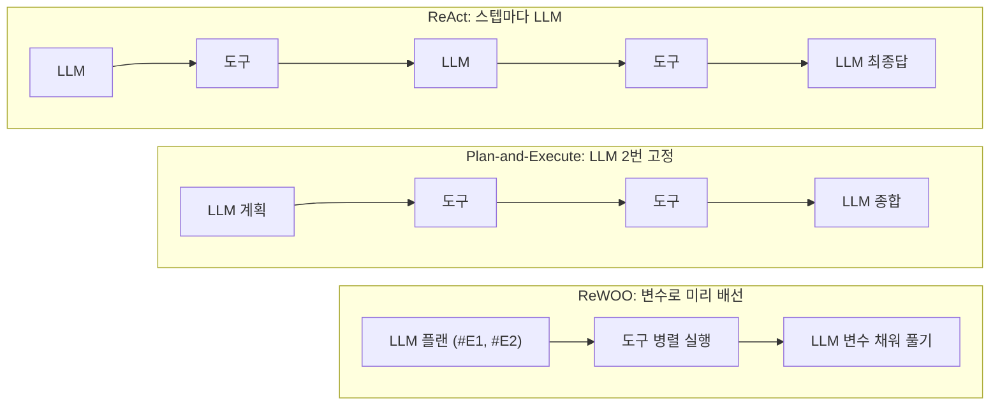
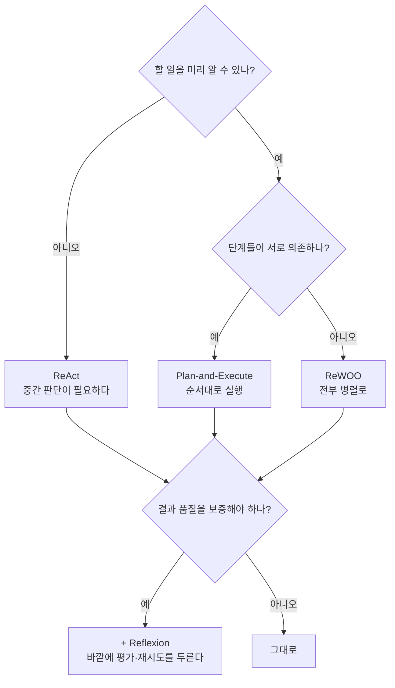

import Slide from 'stack-site-builder/components/Slide.astro';

<Slide class="cover">

# AI Agent 실전

Day 1 · 6. ReAct 너머의 루프들

*CodeCompose · 2026*

</Slide>

<Slide>

## 이 세션이 하는 일
::sub[방금 본 우상향 계단을 공격합니다]

- `examples/05_loops/` **6종을 전부 실행**합니다
- 계획·재계획·평가·병렬이라는 네 가지 다른 전략을 봅니다
- 세션 끝에서 에이전트에 Reflexion 재시도가 실려 **v0.4**가 됩니다
- 도구 층은 결정적 목데이터라 **루프 구조만** 관찰됩니다

</Slide>

<Slide class="center">

## 출발점: ReAct의 한계

한 스텝씩 더듬어 가느라 **느리고**,

매 스텝에 전체 히스토리를 실어 **비쌉니다**

</Slide>

<Slide>

## 한계를 다시 숫자로

- 5세션 실측: 6스텝에 입력 토큰 **7,400개**,
  마지막 한 스텝만 1,552토큰
- 스텝 사이마다 LLM 호출이 끼므로 **지연도 스텝 수에 비례**합니다
- 도구 실행이 서로 독립인데도 **한 번에 하나씩** 돕니다

</Slide>

<Slide>

## 세 루프 한눈에



</Slide>

<Slide>

## 오늘의 순서

1. Plan-and-Execute: 계획 먼저
2. 재계획: 막히면 계획으로 되돌린다
3. Reflexion: 생성과 평가의 분리
4. 루브릭 실험: 기준이 품질을 정의한다
5. ReWOO: 변수로 미리 배선
6. 계산서: 같은 과제의 두 청구서
7. v0.4: 평가와 재시도가 실린다

</Slide>

<Slide class="center">

## Part 1. Plan-and-Execute

계획 먼저, 실행은 LLM 없이

</Slide>

<Slide>

## 발상의 전환

- ReAct: **한 스텝 하고 → 결과 보고 → 다음 스텝 정하고**
- Plan-and-Execute: **할 일을 먼저 다 정하고 → 그냥 실행**
- 사람으로 치면 "일단 해 보면서 생각하기" 대 "계획표 짜고 실행하기"
- 어느 쪽이 맞는지는 **과제가 얼마나 예측 가능한가**에 달렸습니다

</Slide>

<Slide>

## 1. 세 단계로 나눈다
::sub[01_plan_execute.py]

```python
# ① 계획: 도구 호출 목록을 JSON으로 한 번에 뽑는다
plan = json.loads(completion(…, response_format={"type": "json_object"}).…)["steps"]
# ② 실행: LLM 없이 도구만 돈다
observations = [run(step) for step in plan]
# ③ 종합: 결과를 모아 한 번에 답을 만든다
final = completion(…, content=f"요청: {question}\n도구 결과: {observations}…")
```

</Slide>

<Slide>

## ① 계획 (LLM 호출 1번)

```text
=== ① 계획 (LLM 호출 1번) ===
  1. search({'city': '오사카', 'category': '관광'})
  2. budget({'nights': 1, 'people': 2})
```

무엇을 할지 **한 번에** 정합니다.
ReAct처럼 하나 해 보고 다음을 정하는 방식이 아닙니다

</Slide>

<Slide>

## 계획을 JSON으로 받는 이유

```python
completion(…, response_format={"type": "json_object"})
```

- 계획은 **사람이 읽을 글이 아니라 코드가 실행할 목록**입니다
- 2세션의 JSON 강제, 4세션의 구조화 출력이 여기서 쓰입니다
- 계획이 파싱 가능한 구조라야 실행 루프가 그냥 `for`로 돕니다

</Slide>

<Slide class="center">

## 실행 단계에 LLM이 없습니다

`observations = [run(step) for step in plan]`

도구만 도는 이 한 줄에는 **지연도 비용도 토큰도 없습니다**

</Slide>

<Slide>

## ② 실행 (LLM 호출 0번) · ③ 종합 (1번)

```text
=== ② 실행 (LLM 호출 0번) ===
  search → [{"name": "오사카성", …}, {"name": "도톤보리", …}, …]
  budget → {"숙박": 120000, "식비": 200000, "항공": 700000, "합계": 1020000}

=== ③ 종합 (LLM 호출 1번) ===
  ### 예상 예산 (2인 기준, 1박 2일)
  * 항공: 700,000원 / 숙박: 120,000원 / 식비: 200,000원 / 합계: 1,020,000원

=== 정리 ===
  LLM 호출 총 2번 (ReAct였다면 도구 2개 + 최종답 = 3번 이상)
```

</Slide>

<Slide>

## 결과 읽기: 팽창 계단이 아예 생기지 않는다

- 호출 횟수가 **계획 1 + 종합 1로 고정**입니다
- 도구 실행 사이에 LLM이 없으니, 5세션의 우상향 계단이 만들어지지 않습니다
- 스텝이 100개여도 LLM 호출은 여전히 2번입니다

</Slide>

<Slide class="center">

## 대신, 계획이 틀리면 그대로 틀립니다

중간 결과를 보고 방향을 트는 능력이 없습니다

그 약점을 다음 예제가 메웁니다

</Slide>

<Slide class="center">

## Part 2. 재계획

막히면 실패를 들고 계획으로

</Slide>

<Slide>

## 2. 실패 경로를 확실히 밟는다
::sub[02_replan.py · 목DB에 없는 도시(나라)를 묻는다]

```python
if attempt > 1:
    extra = (f"주의: 직전 계획의 {failed!r} 검색이 빈 결과였다. "
             f"검색 가능한 도시: 오사카, 교토")
```

실패 기록과 힌트를 **다음 계획 프롬프트에 첨부**합니다

</Slide>

<Slide>

## 재계획 프롬프트에 담아야 하는 것

- **무엇을 시도했는가**: 직전 계획의 어느 단계였나
- **어떻게 실패했는가**: 빈 결과인가, 에러인가, 조건 미달인가
- **무엇이 가능한가**: 지원 목록 같은 힌트

4세션의 "좋은 에러 메시지" 규율이 루프 단위로 확대된 것입니다.
실패를 알려주기만 하면 모델은 대개 방법을 바꿉니다

</Slide>

<Slide>

## 계획이 옮겨 간다

```text
=== 계획 시도 1 ===
  계획: search({'city': '나라', 'category': '관광'})
  실행 실패: '나라' 검색 결과 0건 → 재계획으로

=== 계획 시도 2 ===
  계획: search({'city': '교토', 'category': '관광'})

=== 실행 성공 ===
  교토 → 2곳: ['후시미 이나리', '기요미즈데라']
```

</Slide>

<Slide>

## 결과 읽기

- 실패를 예외로 던지지 않고 **계획 단계로 되돌립니다**
- 재계획에도 **한도가 있습니다**. 기본 3회
- 소진되면 사람에게 넘깁니다. 조용히 죽지 않는 것까지가 설계입니다

</Slide>

<Slide class="center">

## 한도 없는 재계획은 무한 루프의 다른 이름입니다

계획을 다시 세운다는 것은 **LLM 호출이 또 늘어난다**는 뜻입니다

5세션의 스텝 한도와 같은 자리에 같은 이유로 답니다

</Slide>

<Slide class="center">

## "계획 → 실행 → 막히면 재계획"

**Day 3 `coding-agent` 복구 루프의 원형입니다**

빌드 실패 로그가 되먹여지고,
수정 한도를 넘기면 planner로 돌아가는 그 구조

</Slide>

<Slide class="center">

## Part 3. Reflexion

생성과 평가의 분리

</Slide>

<Slide>

## Reflexion의 세 부품

- **생성자**: 답을 만든다. 지금까지 본 루프 아무거나 써도 됩니다
- **평가자**: 루브릭으로 채점하고 부족한 점을 한 줄로 돌려준다
- **통과 기준과 재시도 상한**: 언제 멈출지를 정하는 숫자 둘

앞의 루프들이 "어떻게 일할까"였다면,
Reflexion은 "잘했는지 누가 판단할까"입니다

</Slide>

<Slide>

## 3. 채점자를 따로 둔다
::sub[03_reflexion.py · 가족 단톡방 후기 3문장을 쓰고 채점한다]

```python
RUBRIC = """다음 기준으로 채점하라 (각 0~10, JSON으로만 답):
- specific: 구체적 장소·음식 이름이 들어갔는가
- tone: 가족 단톡방에 맞는 말투인가
- length: 정확히 3문장인가"""

draft = generate(feedback)          # 생성자
score = evaluate(draft)             # 평가자 (temperature 0)
if total >= 24: break               # 통과 기준
feedback = score["feedback"]        # 미달이면 피드백을 들고 재시도
```

</Slide>

<Slide>

## 실행 결과

```text
=== 시도 1 — 평가 28/30 ===
  "가족들 생각나서 여행 내내 틈틈이 선물 골랐는데 … 다음에는 꼭 우리 가족
  다 같이 다시 오자!"
  채점: {'specific': 8, 'tone': 10, 'length': 10,
        'feedback': '오사카라는 구체적 지명이 언급되어 있으나, 더 구체적인
                     음식이나 장소 이름이 추가되면 완벽합니다.'}
  → 통과 기준(24) 도달, 종료
```

이번 실행은 1회 만에 통과했습니다. **중요한 것은 구조입니다**

</Slide>

<Slide>

## 결과 읽기: 구조가 하는 일

- 평가자는 점수와 함께 **"무엇이 부족한가"를 한 줄로** 돌려줍니다
- 미달이면 그 피드백이 **다음 생성 프롬프트에 박힙니다**
- 채점은 temperature 0입니다. 채점이 흔들리면 재시도가 도박이 됩니다

</Slide>

<Slide>

## 평가자도 LLM이라는 점을 잊지 않습니다

- 평가자가 틀리면 **좋은 답을 버리고 나쁜 답을 통과**시킵니다
- 그래서 채점 기준은 **가능한 한 기계적으로** 씁니다.
  "정확히 3문장인가"는 셀 수 있고, "잘 썼는가"는 셀 수 없습니다
- 셀 수 있는 항목은 아예 코드로 검사하는 편이 낫습니다.
  Day 2 `food-rag-agent`의 검증자가 그 방향으로 갑니다

</Slide>

<Slide class="center">

## "한 번에 잘 쓰기"보다

## "고칠 점을 알고 다시 쓰기"가 쉽다

그 사실을 구조로 만든 것이 Reflexion입니다

</Slide>

<Slide>

## 4. 루브릭 실험: 기준을 바꾸면 승자가 뒤집힌다
::sub[04_eval_rubric.py · 같은 초안 2개를 두 루브릭으로 채점]

- 초안 **A**: 정보형 (입장료·이동 시간·가격·위치)
- 초안 **B**: 감성형 (풍경·여운)

바뀌는 것은 초안이 아니라 **채점 기준**뿐입니다

</Slide>

<Slide>

## 같은 글, 다른 점수

```text
=== 루브릭 ①: 정보 밀도 ===
  초안 A (정보형): 10점 — 입장료·이동 시간·가격·위치가 매우 잘 포함
  초안 B (감성형): 1점 — 구체적인 가격이나 시간 정보가 전혀 없어 낮은 점수

=== 루브릭 ②: 감성 전달 ===
  초안 A (정보형): 4점 — 장면이 연상되거나 여운을 느끼기에는 아쉬움
  초안 B (감성형): 9점 — 풍경이 시각적으로 선명하게 그려지며 깊은 여운
```

10점과 4점, 1점과 9점을 오갔습니다

</Slide>

<Slide class="center">

## Reflexion의 품질은

## 생성자가 아니라 루브릭 설계에서 나옵니다

평가자를 두는 순간
"무엇이 좋은 결과인가"의 정의가 코드에 박제됩니다

</Slide>

<Slide>

## 루브릭 쓸 때
::sub[좋은 루브릭의 조건]

- **항목을 쪼갭니다**: 한 항목에 한 가지만. 총점만 받으면 고칠 곳을 모릅니다
- **셀 수 있게 씁니다**: "3문장인가"처럼 판정이 갈리지 않게
- **통과선을 정합니다**: 만점을 요구하면 재시도가 끝나지 않습니다
- **피드백을 함께 받습니다**: 점수만으로는 다음 시도가 개선되지 않습니다

</Slide>

<Slide class="center">

## Part 4. ReWOO

관찰 없이 플랜 한 번, 도구는 병렬

</Slide>

<Slide>

## 5. 결과 자리를 변수로 비워 둔다
::sub[05_rewoo.py]

```text
=== ① 플랜 (변수 자리가 비어 있다) ===
  #E1 = search({'city': '오사카', 'category': '관광'})
  #E2 = budget({'nights': 1, 'people': 2})
  solve: #E1의 관광지 목록과 #E2의 예산을 조합하여 최종 답을 작성합니다.
```

플랜 시점에 **결과를 변수로 미리 배선**해 둡니다

</Slide>

<Slide>

## 변수 배선이 왜 병렬을 가능하게 하나

- Plan-and-Execute의 계획은 "① 검색하고 ② 예산 계산" 같은 **순서**입니다
- ReWOO의 플랜은 "`#E1`은 검색 결과, `#E2`는 예산" 같은 **자리**입니다
- 자리만 잡아 두면 **누가 먼저 도착하든 상관없습니다**
- 그래서 도구를 전부 한꺼번에 던질 수 있습니다

</Slide>

<Slide>

## 실행과 풀기

```text
=== ② 도구 일괄 실행 (서로 의존이 없으니 병렬 가능) ===
  #E1 ← [{"name": "오사카성", …}, …]
  #E2 ← {"합계": 1020000, …}

=== ③ 변수를 채워 한 번에 풀기 ===
  ### 오사카 1박 2일 2인 여행 예산
  * 숙박비 120,000원 / 식비 200,000원 / 항공료 700,000원 / 총 합계 1,020,000원
```

</Slide>

<Slide>

## 결과 읽기: 대가는 적응력

- ReWOO도 LLM 호출 **2번 고정**입니다
- Plan-and-Execute와 다른 점: 변수로 미리 배선해 두므로
  **도구를 전부 병렬로 던질 수 있습니다**
- 중간 결과를 보고 방향을 트는 능력이 없어서,
  2번 예제 같은 상황이 오면 그대로 무너집니다
- **토큰 절약 특화 루프**입니다

</Slide>

<Slide class="center">

## Part 5. 계산서

같은 과제의 두 청구서

</Slide>

<Slide>

## 6. 루프 비용 비교
::sub[06_loop_cost_compare.py · 같은 과제를 미니 ReAct와 Plan-and-Execute로]

```text
=== 계산서 ===
  루프                     LLM호출     입력tk     출력tk        비용
  ReAct                      2      483      312 $  0.000925
  Plan-and-Execute           2      207      373 $  0.000995
```

</Slide>

<Slide>

## 정직하게 읽어야 하는 결과입니다

- 이 과제는 도구 2개짜리로 작아서, ReAct도 2호출 만에 끝났습니다
- **비용 차이가 사실상 없습니다**
- Plan-and-Execute의 이득은 **스텝이 늘수록 벌어집니다**.
  5세션의 팽창 그래프(6스텝, 입력 7,400토큰)와 나란히 놓고 보면 보입니다

</Slide>

<Slide class="center">

## 작은 과제에 정교한 루프를 다는 것도 낭비입니다

**루프 선택은 과제의 크기와 성격이 정하는 문제입니다**

</Slide>

<Slide>

## 루프의 스펙트럼

| 루프 | 강점 | 대가 | 어울리는 과제 |
| --- | --- | --- | --- |
| ReAct | 적응력, 중간 판단 | 호출 수·컨텍스트 팽창 | 작고 탐색적인 과제 |
| Plan-and-Execute | 호출 2번 고정 | 계획이 틀리면 끝 | 단계가 뻔한 과제 |
| 재계획 | 실패 복구 | 재시도 비용 | 실패가 잦은 과제 |
| Reflexion | 품질 보증 | 채점 호출 추가 | 결과 품질이 중요한 과제 |
| ReWOO | 병렬·토큰 절약 | 적응력 없음 | 독립 조회가 많은 과제 |

</Slide>

<Slide>

## 어느 루프를 고를까



</Slide>

<Slide class="center">

## Reflexion은 다른 루프와 배타적이지 않습니다

생성자 자리에 ReAct도, Plan-and-Execute도 들어갑니다

**v0.4가 정확히 그 구조입니다.** 생성자 = 5세션의 ReAct 루프

</Slide>

<Slide class="center">

## Part 6. v0.4

에이전트에 Reflexion이 실린다

</Slide>

<Slide>

## v0.4 코드 포인트: agent/reflexion.py

```python
RUBRIC = """… (각 0~10)
- schedule: 요청한 기간의 하루 단위 일정이 전부 있는가
- budget: 예산 내역과 합계가 있고, 요청 상한을 존중하는가
- grounded: 장소·수치가 도구 확인 결과에 근거하는가"""

PASS_THRESHOLD = 24            # 30점 만점의 통과선

for attempt in range(1, max_retries + 2):   # 최초 1회 + 재시도 N회
    loop_result = react.run(prompt, …)       # 생성자 = 5세션의 루프
    evaluation = evaluate(question, loop_result.answer)   # temperature 0
    if evaluation.passed:
        return result
    feedback = evaluation.feedback           # 다음 시도의 프롬프트에 박힌다
```

</Slide>

<Slide>

## 코드에서 보는 곳

- **채점은 temperature 0입니다**. 채점이 흔들리면 재시도가 도박이 됩니다
- **재시도 상한**(기본 2회)이 있고, 소진되면 마지막 답과 평가 이력을
  그대로 돌려줍니다. 조용히 죽지 않습니다
- 유닛 테스트가 미달에서 통과로 가는 재시도, 상한 소진,
  피드백이 재시도 프롬프트에 실리는지까지 박제합니다

</Slide>

<Slide>

## 확인

```bash
git checkout v0.4
docker compose exec lab python -m agent.main --verbose "2박 3일 교토, 예산 50만원"
docker compose exec lab pytest        # 이 시점의 테스트 21개 통과
```

생성자는 5세션의 ReAct 루프 그대로입니다.
**바뀐 것은 그 바깥에 평가와 재시도가 한 겹 둘러진 것뿐입니다**

</Slide>

<Slide>

## 이 세션이 남기는 것

- 루프의 스펙트럼: 적응력(ReAct)에서 비용(ReWOO)까지,
  그 사이의 Plan-and-Execute
- 실패는 계획으로 되돌린다. 재계획에도 한도가 있고, 소진되면 사람에게
- **평가 기준이 품질을 정의한다.** 루브릭이 곧 "좋은 결과"의 코드화다
- 이 패턴들은 Day 3 `coding-agent`에서 전부 재등장한다.
  계획 분해, 실패 로그 되먹임, 수정 한도 초과 시 재계획까지 오늘 본 구조 그대로

</Slide>

<Slide class="center">

## 다음 세션

**하네스 엔지니어링** · `examples/06_harness/` 10종 → **v1.0**

루프를 감싸는 실행 환경 전체를 짓습니다

</Slide>
