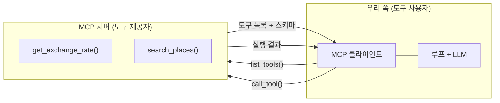

import Slide from 'stack-site-builder/components/Slide.astro';

<Slide class="cover">

# AI Agent 실전

Day 1 · 8. MCP 맛보기

*CodeCompose · 2026*

</Slide>

<Slide>

## 이 세션이 하는 일
::sub[Day 1의 마지막 세션입니다]

- 오늘 하루 종일 도구는 **우리가 손으로** 정의했습니다.
- MCP는 그 도구를 **표준 프로토콜로 주고받는** 방식입니다.
- `examples/07_mcp/` 시연 4종을 전부 실행합니다.

</Slide>

<Slide class="center">

## 핵심 문장

**도구를 손으로 정의하는 대신, 표준 프로토콜로 주고받는다**.

</Slide>

<Slide>

## 무엇이 달라지는가

- 도구 제공자가 MCP 서버를 열면,
  클라이언트는 **도구 목록을 프로토콜로 받아옵니다**.
- 우리 코드에는 도구별 구현이 없어도 됩니다.
  연결만 하면 도구 목록이 늘어납니다.
- 도구 정의(이름·설명·스키마)의 모양은 4세션에서 본 것과 같습니다.
  **표준화된 것은 내용이 아니라 주고받는 방법입니다**.

</Slide>

<Slide>

## 구조



</Slide>

<Slide class="center">

## Part 1. 도구를 서버로 내어놓는다

</Slide>

<Slide>

## 1. 데코레이터 하나
::sub[01_mcp_server.py · 평범한 함수 2개를 MCP 서버에 싣는다]

- 코드

```python
mcp = FastMCP("travel-tools")

@mcp.tool()
def get_exchange_rate(currency: str) -> dict:
    """통화 코드(JPY, USD, EUR)의 원화 환율을 돌려준다."""
    if currency not in RATES:
        return {"error": f"지원하지 않는 통화: {currency}. 지원 목록: {list(RATES)}"}
    return {"currency": currency, "krw": RATES[currency]}

if __name__ == "__main__":
    if "--http" in sys.argv:
        mcp.run(transport="streamable-http")  # 상주 서버: 포트 8000
    else:
        mcp.run()  # stdio: 클라이언트가 이 프로세스를 직접 띄웠을 때의 전송
```

- 실행

```bash
docker compose exec lab python examples/07_mcp/01_mcp_server.py
```

</Slide>

<Slide>

## 실행하면 침묵합니다

- 기본(stdio)으로 단독 실행하면 아무 출력 없이 침묵하고, Ctrl+C로 종료합니다.
- 더 이상한 것: 이 상태에서 다른 터미널로 2번 클라이언트를 돌려도
  **이 서버에는 로그 한 줄 찍히지 않습니다**.
- 서버를 아예 안 띄우고 돌린 것과 결과가 같습니다.

</Slide>

<Slide>

## 이상한 게 아니라 stdio 전송의 본질입니다

- stdio에서는 **클라이언트가 서버를 자기 하위 프로세스로 직접 띄워**
  표준입출력으로 대화합니다.
- 손으로 미리 띄운 서버의 stdio는 터미널에 물려 있어서 아무도 접속할 수 없고,
  2번은 매번 자기 전용 서버를 새로 만듭니다.
- "서버 먼저, 접속은 나중"이라는 익숙한 그림은 4번의 HTTP 전송이 담당합니다.

</Slide>

<Slide>

## 스키마를 손으로 쓴 곳이 없습니다

- 함수 시그니처와 docstring이 **그대로 프로토콜의 도구 명세**가 됩니다.
  타입 힌트에서 자동 생성됩니다.
- 이 파일이 일부러 self-contained인 것도 같은 맥락입니다.
  stdio 클라이언트는 서버 하위 프로세스에 최소 환경만 넘기므로,
  **어디서 띄워도 도는 독립 실행체**가 실전 형태입니다.

</Slide>

<Slide class="center">

## Part 2. 도구 목록이 프로토콜로 배달된다

</Slide>

<Slide>

## 2. 클라이언트
::sub[02_list_tools.py · 키 없이 돌고, 서버를 미리 띄울 필요도 없다]

- 코드

```python
async with stdio_client(SERVER) as (read, write):
    async with ClientSession(read, write) as session:
        await session.initialize()
        tools = (await session.list_tools()).tools          # 목록 수신
        result = await session.call_tool(                    # 원격 실행
            "get_exchange_rate", {"currency": "JPY"})
```

- 실행

```bash
docker compose exec lab python examples/07_mcp/02_list_tools.py
```

이 클라이언트가 1번 서버를 자기 하위 프로세스로 직접 띄워 접속합니다.

</Slide>

<Slide>

## 받은 도구 목록

```text
=== 서버가 내어놓은 도구 목록 (프로토콜로 수신) ===
  get_exchange_rate: 통화 코드(JPY, USD, EUR)의 원화 환율을 돌려준다.
    입력 스키마: {"properties": {"currency": {"title": "Currency", "type": "string"}},
                 "required": ["currency"], …}
  search_places: 도시의 관광지·식당을 검색한다. 지원 도시: 오사카, 교토.

=== 원격 도구 호출: get_exchange_rate(JPY) ===
  { "currency": "JPY", "krw": 9.1 }
```

</Slide>

<Slide>

## 결과 읽기: 구현이 한 줄도 없는데 돕니다

- 수신된 입력 스키마를 보세요.
  **4세션에서 pydantic으로 뽑던 것과 같은 JSON 스키마**입니다.
- 우리 코드에는 도구 구현이 한 줄도 없는데 목록도 실행도 됩니다.
- 도구의 **구현과 사용이 프로토콜을 사이에 두고 분리**된 것입니다.

</Slide>

<Slide class="center">

## Part 3. 받은 도구를 루프에 꽂는다

</Slide>

<Slide>

## 3. 변환 함수 하나
::sub[03_mcp_to_agent.py · 루프는 도구가 어디서 왔는지 모른다]

- 코드

```python
def to_litellm_schema(tool) -> dict:
    """MCP 도구 명세 → litellm 도구 명세. 필드가 그대로 1:1로 옮겨진다."""
    return {"type": "function", "function": {
        "name": tool.name,
        "description": tool.description or "",
        "parameters": tool.inputSchema,
    }}

tools = [to_litellm_schema(t) for t in (await session.list_tools()).tools]
resp = completion(model=model, messages=messages, tools=tools)   # 4세션 그대로
result = await session.call_tool(call.function.name, args)       # 실행만 원격
```

- 실행

```bash
docker compose exec lab python examples/07_mcp/03_mcp_to_agent.py
```

</Slide>

<Slide>

## 실행 결과

```text
=== 프로토콜로 받은 도구 2개를 루프에 장착 ===
  get_exchange_rate
  search_places
  [step 1] get_exchange_rate({"currency": "USD"}) → { "currency": "USD", "krw": 1385.0 }…
  [step 1] search_places({"city": "교토"}) → { "name": "후시미 이나리", … }…

=== 최종 답 ===
  100달러는 현재 환율(약 1,385원) 기준으로 **138,500원**입니다.
  그리고 교토 관광지로는 **후시미 이나리 신사**를 추천합니다. …
```

</Slide>

<Slide class="center">

## 변환 함수가 하는 일은 필드 1:1 복사뿐입니다

MCP의 도구 명세와 4세션의 도구 명세는 사실상 같은 물건이고,

그래서 **코드 수정 없이 도구 목록이 늘어난다**는 말이 성립합니다.

</Slide>

<Slide class="center">

## Part 4. 상주 서버

서버 먼저, 접속은 나중

</Slide>

<Slide>

## 4. HTTP 전송
::sub[04_http_client.py · 2번과 똑같은 일을 익숙한 그림으로]

- 코드

```python
URL = "http://127.0.0.1:8000/mcp"

async with streamablehttp_client(URL) as (read, write, _):
    async with ClientSession(read, write) as session:
        await session.initialize()
        tools = (await session.list_tools()).tools          # 이하 02와 동일
```

- 실행

```bash
# 터미널 1: 서버를 상주로 띄운다 (로그가 여기 찍힌다)
docker compose exec lab python examples/07_mcp/01_mcp_server.py --http

# 터미널 2: 접속해서 도구를 쓴다
docker compose exec lab python examples/07_mcp/04_http_client.py
```

</Slide>

<Slide>

## 이번에는 서버 쪽에 로그가 흐릅니다

```text
INFO:     Uvicorn running on http://127.0.0.1:8000 (Press CTRL+C to quit)
Created new transport with session ID: e92899507abc46a1a04022cc5edfa050
INFO:     127.0.0.1:60710 - "POST /mcp HTTP/1.1" 200 OK
Processing request of type ListToolsRequest
INFO:     127.0.0.1:60712 - "POST /mcp HTTP/1.1" 200 OK
Processing request of type CallToolRequest
Terminating session: e92899507abc46a1a04022cc5edfa050
```

세션이 만들어지고, 요청이 들어오고, 세션이 정리되는 것까지 보입니다.

</Slide>

<Slide>

## 두 전송의 차이

| | stdio (2번) | HTTP (4번) |
| --- | --- | --- |
| 서버의 수명 | 클라이언트가 띄우고 거둔다 | 먼저 떠서 계속 산다 |
| 관계 | 1 클라이언트 : 1 전용 서버 | N 클라이언트 : 1 서버 |
| 쓰임 | 로컬 도구 (에디터·CLI가 서버를 품음) | 세상에 내어주는 배포 |

클라이언트 코드는 **접속 한 줄만** 다르고 나머지는 2번과 같습니다.  
Day 3에서 `food-rag-agent`를 세상에 내어줄 때가 바로 이 HTTP 형태입니다.

</Slide>

<Slide class="center">

## Day 3 예고: 역방향

오늘은 도구를 **가져오는** 쪽이었습니다.

Day 3에서는 우리가 만든 에이전트를 MCP 서버로 만들어 **내어주는** 쪽을 봅니다.  
폰의 Claude 앱에서 식단 추천이 동작하는 순간까지

</Slide>

<Slide>

## Day 1 마무리: 오늘 오른 사다리

| 릴리즈 | 오늘 얻은 것 |
| --- | --- |
| v0.1 | 요청·응답의 해부, 예제 51종 |
| v0.2 | 도구: 스키마와 검증, 실행 관문 |
| v0.3 | ReAct 루프와 트레이스 |
| v0.4 | Reflexion 평가·재시도 |
| v1.0 | 하네스: 경계 방어와 budget guard |
| v1.1\~v1.2 | MCP: 도구를 프로토콜로, stdio와 HTTP 두 전송 |

</Slide>

<Slide class="center">

## 내일은

이 **수제 루프**를 LangGraph의 **선언적 그래프**로 다시 세웁니다.

같은 동작, 다른 구조를 나란히 놓고 비교합니다.

</Slide>
