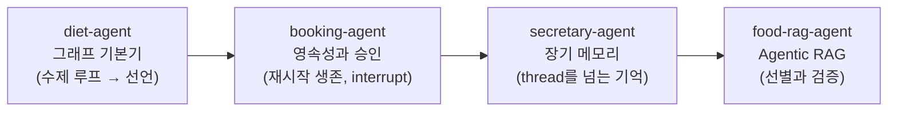
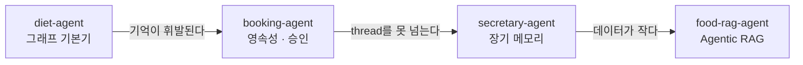

import Slide from 'stack-site-builder/components/Slide.astro';

<Slide class="cover">

# AI Agent 실전

Day 2 · 1. Day 2 도입

*CodeCompose · 2026*

</Slide>

<Slide class="center">

## 오늘의 리듬은 하나입니다

**한 시간에 에이전트 하나, 저장소 하나**

</Slide>

<Slide>

## Day 1과 달라지는 것
::sub[어제의 day-01은 예제 모음집이었습니다]

| | Day 1 (실습 랩) | Day 2 (제품) |
| --- | --- | --- |
| 저장소 | 예제 51종 + 에이전트 1개 | 에이전트 하나 = 저장소 하나 |
| 실행 | `docker compose exec lab python …` | `docker compose up` 하면 웹 제품이 뜸 |
| 컨테이너 | `lab` 하나 | `app` · `ui` · `db` |
| 세션 진행 | 예제를 하나씩 실행 | 릴리즈 사다리를 오르며 제품을 시연·해부 |

오늘부터는 저장소 하나가 **독립된 응용프로그램**입니다.

</Slide>

<Slide>

## 공통인 것은 시작 명령뿐
::sub[어느 저장소든 같습니다]

```bash
git clone https://github.com/2026-ai-agents/<저장소>.git
cd <저장소>
cp .env.sample .env        # 키 채우기 (셋 중 하나면 됨)
docker compose up --build
```

- `app`: FastAPI + LangGraph 에이전트 본체. 그래프도 도구도 키도 여기만
- `ui`: Streamlit 화면. app의 HTTP API만 압니다.
- `db`: PostgreSQL. 도메인 데이터, 그리고 곧 대화 상태까지

</Slide>

<Slide class="center">

## 릴리즈 사다리로 제품을 오릅니다

**v0.1 기동 → 태그를 오르며 feature 시연 → v1.0 확인**

사용법은 Day 1 1세션에서 배운 그대로입니다.

</Slide>

<Slide>

## 사다리 사용법
::sub[Day 1과 같고, exec 대상만 app으로 바뀝니다]

```bash
git checkout v0.2 && docker compose up --build   # 그 시점의 코드로 그 시점의 동작
git diff v0.2 v0.3                               # 이번 feature가 코드로는 무엇이었나
docker compose exec app pytest                   # 어느 태그에서든 그 시점의 테스트가 통과
```

- v0.1은 언제나 "compose가 뜨고 UI가 열리지만 에이전트는 최소 동작"입니다.
- v1.0은 완성된 제품이고, `main`은 항상 완성본입니다.
- 수업 뒤 발견된 문제는 hotfix 태그로 main에 더해집니다.

</Slide>

<Slide>

## 오늘의 에이전트 4개, 개념은 하나씩



</Slide>

<Slide>

## 무엇을 얹는가

| 세션 | 저장소 | 얹는 개념 | 컨테이너 |
| --- | --- | --- | --- |
| 2 | `diet-agent` | LangGraph 기본기: State·Node·Edge, 분기, reducer | app · ui · db |
| 3 | `booking-agent` | 영속성(checkpointer)과 승인(interrupt) | app · ui · admin · db |
| 4 | `secretary-agent` | 장기 메모리(store) | app · ui · db |
| 5 | `food-rag-agent` | Agentic RAG: 선별 깔때기와 검증자 | app · ui · db · rag |

</Slide>

<Slide>

## 이어달리기는 결핍으로 연결됩니다



각 에이전트의 **결핍이 다음 에이전트의 출발점**입니다.

</Slide>

<Slide class="center">

## 왜 LangGraph인가

Day 1에서 우리는 에이전트 루프를 손으로 짰습니다.

`while`, `if`, `append`. 동작했고, 원리도 배웠습니다.

</Slide>

<Slide>

## 그런데 제품이 되려면 계속 얹어야 합니다

- 대화 저장
- 중단과 재개
- 사람의 승인
- 병렬 실행
- 스트리밍

전부 손으로 짤 수 있습니다.  
그러나 **전부 손으로 짜는 팀은 유지보수로 죽습니다**.

</Slide>

<Slide class="center">

## LangGraph는 그 루프를

## State · Node · Edge의 선언으로 바꿉니다

그리고 방금 나열한 것들을
그래프의 **부품**(checkpointer, interrupt, Send, stream)으로 줍니다.

</Slide>

<Slide>

## 오늘 재현할 사고 5종
::sub[먼저 사고를 재현하고, 원인을 추적하고, 방어가 막는 것을 확인합니다]

- **reducer 누락** (2세션): 도구가 끼면 한 턴 안에서도 API가 거부한다.
- **재시작 기억상실** (3세션): `restart` 한 방에 대화가 백지가 된다.
- **SELECT 위장 쓰기** (3세션): 검사문을 통과하는 `setval()`
- **새 대화 백지** (4세션): 일정은 남는데 알레르기는 증발한다.
- **무근거 생성** (5세션): 닭백숙을 115kcal이라 자신 있게 지어낸다.

</Slide>

<Slide class="center">

## 다음 세션

**diet-agent: LangGraph 기본기**

Day 1의 수제 ReAct를 선언적 그래프로 다시 세웁니다.  
같은 동작, 다른 구조

</Slide>
