import Slide from 'stack-site-builder/components/Slide.astro';

<Slide class="cover">

# AI Agent 실전

Day 2 · 2. diet-agent: LangGraph 기본기

*CodeCompose · 2026*

</Slide>

<Slide>

## 이 세션이 하는 일
::sub[Day 1의 수제 ReAct를 선언적 그래프로 다시 세웁니다]

- **제품**: 식단을 입력하면 칼로리·영양을 분석하고 조언하는 상담 웹앱
- 릴리즈 사다리 **v0.1\~v1.0** 네 단을 오르며 해부합니다.
- 같은 에이전트의 **수제 루프 판과 그래프 판을 나란히** 놓고 비교합니다.
- reducer가 없으면 무슨 일이 나는지 사고로 재현합니다.

</Slide>

<Slide class="center">

## 핵심 문장

**Day 1의 수제 ReAct를 선언적 그래프로 다시 세운다**.

같은 동작, 다른 구조

</Slide>

<Slide class="center">

## Part 1. 시스템 구조

Day 1의 `lab` 하나가 세 컨테이너로 갈라집니다.

</Slide>

<Slide>

### 컨테이너 셋

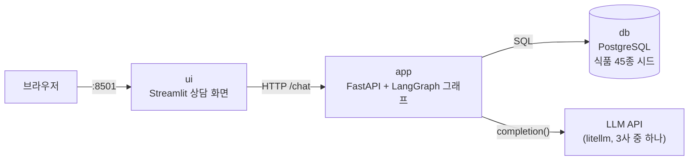

</Slide>

<Slide>

### 각자의 몫
::sub[역할 규약은 Day 2\~3의 모든 저장소에서 반복됩니다]

- **`app`이 에이전트 본체입니다.** 그래프도, 도구도, LLM 키도 여기에만 있습니다.
- **`ui`는 화면일 뿐입니다.** app의 HTTP API만 알고, 키도 DB도 모릅니다.
- **`db`는 도메인 데이터**(식품 영양)를 담습니다.
  뒤에서는 대화 상태의 영속화까지 맡게 됩니다 (booking-agent)

</Slide>

<Slide>

### 상담 요청 하나가 지나는 길

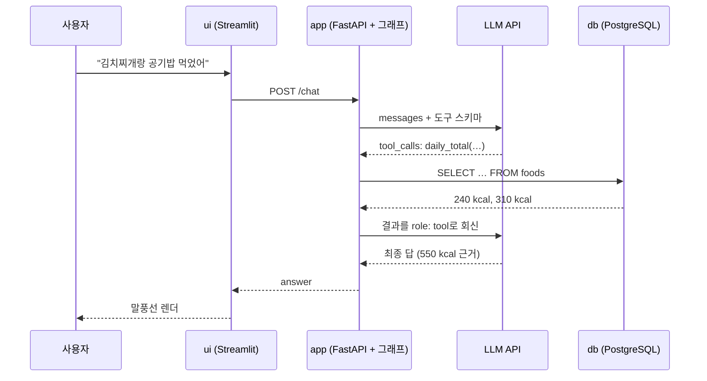

</Slide>

<Slide class="center">

### Day 1 4세션의 왕복 그대로입니다

달라진 것은 그 왕복이

**제품의 컨테이너들 사이**에서 일어난다는 것뿐입니다.

</Slide>

<Slide>

### 시작하기

```bash
git clone https://github.com/2026-ai-agents/diet-agent.git
cd diet-agent
cp .env.sample .env        # 키 채우기 (셋 중 하나면 됨)
docker compose up --build
```

- ui → `http://localhost:8501` (상담 화면)
- app → `http://localhost:8000/docs` (API)
- 테스트: `docker compose exec app pytest` (키·네트워크 불필요)

</Slide>

<Slide class="center">

## Part 2. LangGraph란 무엇인가

이 세션에서 처음 등장하는 이름이니 짚고 갑니다.

</Slide>

<Slide>

### 재료는 셋뿐입니다
::sub[에이전트의 제어 흐름을 상태를 나르는 그래프로 선언합니다]

- **State**: 그래프가 나르는 데이터의 형태. 우리는 대화 메시지 목록 하나
- **Node**: 상태를 받아 상태 조각을 돌려주는 **평범한 파이썬 함수**.
  상속도 데코레이터도 없습니다.
- **Edge**: 노드 사이의 실행 순서. 조건 분기는 함수로 선언합니다.

</Slide>

<Slide class="center">

### 같은 에이전트가 이 저장소에 두 번 있습니다

`demos/handloop.py` (Day 1 방식의 수제 루프, 대조군)

`app/agent/graph.py` (LangGraph 선언, 제품)

프롬프트도 도구도 순환도 같습니다.  
**다른 것은 코드의 구조뿐입니다.**

</Slide>

<Slide>

### 수제 루프: 제어 흐름이 함수 본문 안에

```python
# demos/handloop.py
for _ in range(MAX_STEPS):
    response = completion(
        model=pick_model(),
        messages=[{"role": "system", "content": SYSTEM_PROMPT}, *messages],
        tools=tool_schemas(),
    )
    message = response.choices[0].message
    messages.append(message.model_dump())      # 축적: append를 내가 챙긴다
    if not message.tool_calls:                 # 분기: 루프 속 if
        return message.content                 # 종료: return
    for call in message.tool_calls:            # 도구 실행 + 결과 되먹임
        messages.append({"role": "tool", "tool_call_id": call.id,
                         "content": run_tool(call.function.name, …)})
```

</Slide>

<Slide>

### 그래프 선언: 제어 흐름이 코드 밖에

```python
# app/agent/graph.py
builder = StateGraph(DietState)
builder.add_node("advisor", advisor)
builder.add_node("tools", tools)
builder.add_edge(START, "advisor")
builder.add_conditional_edges("advisor", route_after_advisor,
                              {"tools": "tools", END: END})
builder.add_edge("tools", "advisor")
graph = builder.compile()
```

같은 동작인데 성격이 다릅니다.

</Slide>

<Slide>

### 무엇이 다른가

| | 수제 루프 | 그래프 선언 |
| --- | --- | --- |
| 흐름이 사는 곳 | 함수 본문 속. 읽어야 안다 | 선언부. 보면 안다 |
| 실행 주체 | 내가 쓴 for가 돈다 | 그래프 런타임이 노드를 부른다 |
| 상태 관리 | append를 내가 챙긴다 | reducer가 규칙으로 합친다 |
| 멀티턴 기억 | 호출자가 history 배열을 들고 다닌다 | checkpointer가 thread별로 보관 |
| 기능 추가 | 루프 본문을 수술 | 부품을 꽂는다 |
| 그림과 코드 | 그림은 문서에 따로 그린다 | 코드에서 그림이 나온다 |

</Slide>

<Slide class="center">

### 자유를 내주고 부품을 얻습니다

루프를 손으로 쥐고 있으면 자유롭지만, 모든 기능을 본문에 꿰매야 합니다.

선언으로 넘기면 저장·중단·병렬 같은 부품이
**루프를 다시 짜지 않고** 꽂힙니다.

Day 2\~3의 모든 개념이 그 부품들입니다.

</Slide>

<Slide>

### 시연: 대조군을 직접 돌려본다
::sub[대조군도 이 저장소의 실행 코드입니다. clone 직후 바로 돌아갑니다]

- 실행

```bash
docker compose exec app python demos/handloop.py   # 그래프 없는 diet-agent
```

- 결과

```text
[사용자] 점심에 비빔밥이랑 미역국 먹었어요.
  ↳ 도구 실행: daily_total({"names": ["비빔밥", "미역국"]})
[상담사] * 비빔밥 (1인분): 580 kcal … * 미역국 (1인분): 90 kcal …
  * 총합: 670 kcal …
```

</Slide>

<Slide>

### 2턴째도 기억합니다

```text
[사용자] 제가 방금 뭐 먹었다고 했죠? 저녁 추천도 해주세요.
[상담사] 점심으로 비빔밥과 미역국을 드셨다고 말씀하셨습니다.
총 670 kcal 정도였죠! … 저녁에는 단백질과 채소 위주로 …

(호출자가 들고 다닌 메시지 수: 6)
```

완성판과 같은 상담이 나옵니다.  
도구도 부르고, 기억도 됩니다.

</Slide>

<Slide>

### 차이는 마지막 줄에 있습니다

- 그 기억은 `handloop.py`가 history 배열 **6칸을 직접 들고 다녔기 때문**입니다.
- **저 배열을 잃으면 기억도 끝입니다**.
- 그래프 판에서는 v0.3의 checkpointer가 이 일을 맡습니다.
- 저장이든 중단이든 스트리밍이든, 수제 루프에 기능을 더하려면
  매번 저 본문이 수술대에 오릅니다.

</Slide>

<Slide>

### 코드가 그림을 그린다: draw_mermaid
::sub[선언의 보너스 하나]

```bash
docker compose exec app python -c \
  "from agent.graph import graph; print(graph.get_graph().draw_mermaid())"
```

실측 출력에서 색 지정만 걷어내고 렌더한 그림입니다.  
실선은 무조건 가는 길, 점선은 `route_after_advisor`가 고르는 조건 분기입니다.

</Slide>

<Slide>

### 코드가 뽑아 준 완성 그래프

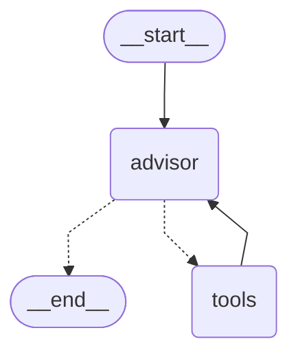

</Slide>

<Slide class="center">

### 이 그림은 코드가 그렸습니다

선언과 그림의 **원천이 같으므로 어긋날 수가 없습니다**.

코드 리뷰에서 "그래프가 어떻게 생겼더라"를
논쟁할 필요가 없어지는 지점입니다.

</Slide>

<Slide class="center">

## Part 3. 릴리즈 사다리

그래프가 자라는 순서

</Slide>

<Slide>

### 네 단이 무엇을 얹는가

| 릴리즈 | 상태 | 테스트 |
| --- | --- | --- |
| v0.1 | compose 기동, UI 빈 화면, 그래프 뼈대 | 2개 |
| v0.2 | 분기 동작: conditional edge가 도구 호출/답변을 가름 | 7개 |
| v0.3 | 대화 누적: reducer + checkpointer로 멀티턴 성립 | 8개 |
| v1.0 | UI 연결 완성: 식단 상담 제품 | 8개 |

네 태그 전부에서 `git checkout → docker compose up --build → pytest`가
통과하는 것을 확인해 두었습니다.

</Slide>

<Slide>

### 그래프의 성장을 나란히

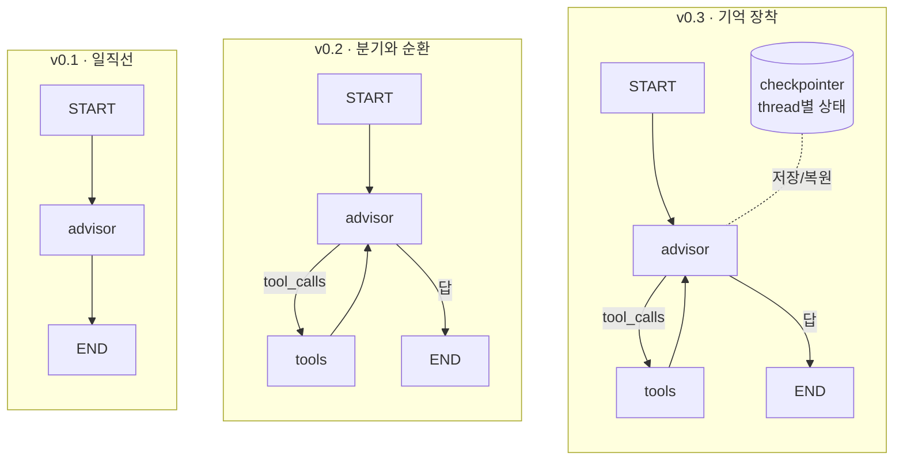

</Slide>

<Slide class="center">

### v1.0은 그래프가 아니라 UI가 완성되는 단입니다

그래프는 **v0.3에서 이미 끝나 있습니다**.

</Slide>

<Slide class="center">

## Part 4. v0.1 · 뼈대

그래프의 네 재료

</Slide>

<Slide>

### 무엇이 서는가

- compose가 3컨테이너를 띄우고, db에 **식품 45종**이 자동 적재됩니다.
- 그래프는 LangGraph의 네 재료가 전부 보이는 최소 구성입니다.
- **도구도 분기도 누적도 아직 없습니다**.

</Slide>

<Slide>

### 코드 발췌: 그래프 전체가 화면 하나에

```python
class DietState(TypedDict):
    """그래프가 나르는 상태. reducer가 없다 — 노드의 반환이 통째로 덮어쓴다."""
    messages: list[dict]

def advisor(state: DietState) -> dict:
    """상담사 노드: 지금까지의 메시지로 LLM을 한 번 부르고, 답을 붙여 돌려준다."""
    response = completion(model=pick_model(),
                          messages=[{"role": "system", "content": SYSTEM_PROMPT},
                                    *state["messages"]])
    answer = {"role": "assistant", "content": response.choices[0].message.content}
    return {"messages": [*state["messages"], answer]}

# ── 선언부: 이 다섯 줄이 v0.1 그래프의 전부다 ──
builder = StateGraph(DietState)      # State
builder.add_node("advisor", advisor) # Node
builder.add_edge(START, "advisor")   # Edge
builder.add_edge("advisor", END)
graph = builder.compile()            # 선언을 실행 가능한 그래프로
```

</Slide>

<Slide class="center">

### 노드는 평범한 함수입니다

상태를 받아 상태 조각을 돌려줄 뿐,

LangGraph의 클래스를 상속하지도, 데코레이터를 달지도 않습니다.

**Day 1에서 짠 함수들이 그대로 노드가 될 수 있다는 뜻입니다.**

</Slide>

<Slide>

### 코드 발췌: 그래프를 HTTP로
::sub[FastAPI는 그래프를 감싸는 얇은 껍데기입니다]

```python
@app.post("/chat", response_model=ChatResponse)
def chat(req: ChatRequest) -> ChatResponse:
    result = graph.invoke({"messages": [{"role": "user", "content": req.message}]})
    return ChatResponse(answer=result["messages"][-1]["content"])
```

`app/main.py`의 핵심은 이 한 줄입니다.

</Slide>

<Slide>

### 시연: 기동

- 실행

```bash
git checkout v0.1 && docker compose up --build
```

- 결과

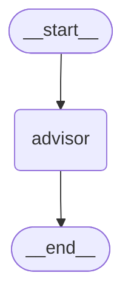

이 일직선이 v0.1 그래프의 전부입니다.

</Slide>

<Slide>

### db에 시드가 실제로 실렸는가

- 실행

```bash
docker compose exec db psql -U diet -d dietdb \
  -c "SELECT name, category, serving, kcal, protein_g FROM foods LIMIT 5;"
```

- 결과

```text
    name    | category |   serving   | kcal | protein_g
------------+----------+-------------+------+-----------
 비빔밥     | 밥       | 1인분(500g) |  580 |      18.0
 공기밥     | 밥       | 1공기(210g) |  310 |       5.5
 김치찌개   | 국찌개   | 1인분(400g) |  240 |      14.0
 닭가슴살   | 구이     | 1쪽(100g)   |  110 |      23.0
 아메리카노 | 음료     | 1잔(355ml)  |   10 |       0.5
```

</Slide>

<Slide>

### UI는 아직 빈 화면입니다

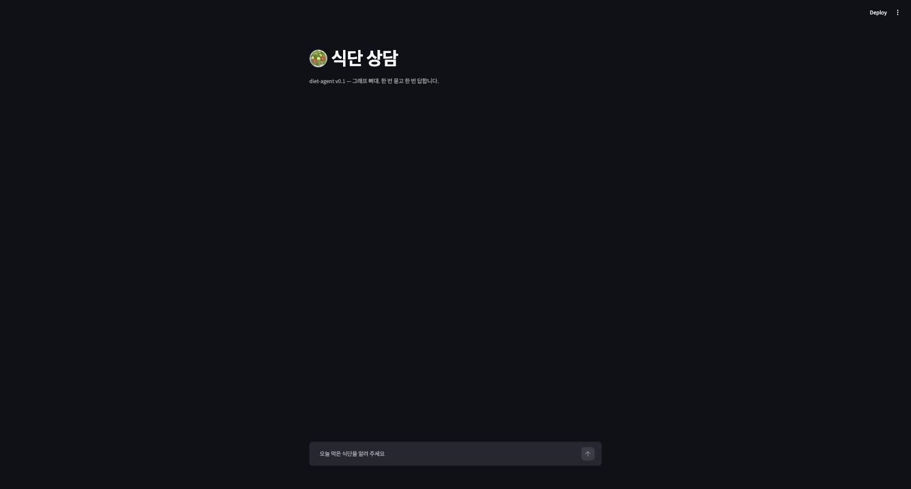

</Slide>

<Slide>

### 실행 결과: 도구 없는 상담

```text
질문: 점심에 김치찌개랑 공기밥 먹었어요. 어때요?

답: 한국인이 가장 사랑하는 든든한 점심 메뉴네요!
  * 탄수화물: 공기밥으로 충분한 탄수화물이 공급됩니다.
  * 단백질 & 지방: 김치찌개에 들어가는 돼지고기나 참치, 두부 등을 통해 …
  * 나트륨: 김치찌개 특성상 국물에 나트륨이 매우 많습니다.
```

</Slide>

<Slide>

### 결과 읽기: 그럴듯한데 수치가 없다

- "들어가는 돼지고기나 참치"처럼 **일반론으로 얼버무립니다**.
- 방금 psql로 확인한 대로 db에는 김치찌개 240kcal이 있는데,
  에이전트는 그것을 모릅니다.
- 도구가 없기 때문이고, 그것이 v0.2입니다.
- State에 reducer가 없어 노드가 **전체 목록을 다시 돌려주고 있다**는 것도
  봐 두세요. v0.3의 복선입니다.

</Slide>

<Slide class="center">

## Part 5. v0.2 · 분기

루프의 `if`가 선언이 된다.

</Slide>

<Slide>

### 무엇이 바뀌나

- `lookup_food`·`daily_total` 도구가 db를 조회합니다.
- advisor는 매 턴 "도구를 부를 것인가, 답할 것인가"를 판단합니다.
- Day 1 루프 안의 `if message.tool_calls`가
  여기서는 **conditional edge 함수 하나의 선언**입니다.

</Slide>

<Slide>

### 분기가 생긴 그래프

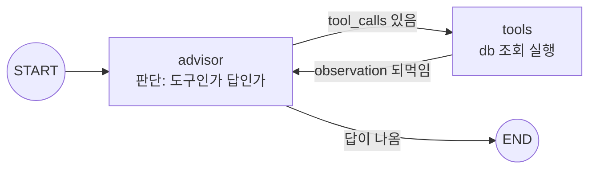

</Slide>

<Slide>

### 코드 발췌: 도구는 Day 1 규약 그대로

```python
class LookupFoodArgs(BaseModel):
    """음식 이름으로 영양 정보를 검색한다. 부분 일치로 최대 5건."""
    name: str = Field(min_length=1, description="음식 이름 (예: 김치찌개)")

def lookup_food(args: LookupFoodArgs) -> dict:
    with psycopg.connect(DATABASE_URL) as conn:
        rows = conn.execute(
            """SELECT name, category, serving, kcal, protein_g, fat_g, carbs_g
               FROM foods WHERE name ILIKE %s ORDER BY name LIMIT 5""",
            (f"%{args.name}%",),
        ).fetchall()
    if not rows:
        return {"error": f"'{args.name}'을(를) 찾지 못했다. …"}
```

pydantic이 스키마와 검증을 겸하고, 에러도 결과로 돌려줍니다.  
달라진 것은 데이터가 목데이터가 아니라 **진짜 db**라는 점뿐입니다.

</Slide>

<Slide>

### 왜 @tool 데코레이터·ToolNode가 아닌가
::sub[의도된 선택입니다]

- 프리빌트들은 langchain-core의 메시지·모델 타입 위에 서 있습니다.
  - 들이는 순간 **LiteLLM + dict 메시지라는 Day 1부터의 스택이 통째로 바뀝니다**.
- 이 세션이 보여야 할 것은 "루프가 선언이 된다" 하나입니다.
  - 노드가 평범한 함수라서 Day 1 규약이 수정 없이 얹힌다는 점 자체가
    LangGraph의 장점이기도 합니다.
- 어노테이션식 도구 선언은 이 과정에서 **MCP가 담당**합니다.

</Slide>

<Slide>

### 코드 발췌: conditional edge

```python
def route_after_advisor(state: DietState) -> Literal["tools", "__end__"]:
    """conditional edge 함수 — Day 1 루프의 if 분기가 선언으로 옮겨온 자리."""
    last = state["messages"][-1]
    return "tools" if last.get("tool_calls") else END

builder.add_conditional_edges("advisor", route_after_advisor,
                              {"tools": "tools", END: END})
builder.add_edge("tools", "advisor")   # observation은 다시 판단으로 돌아간다
```

</Slide>

<Slide class="center">

### 분기 조건이 함수 하나에 격리되어 있어

## 그래프 그림과 코드가 1:1입니다

Day 1에서는 이 분기가 while 루프 본문 안에 묻혀 있었습니다.

</Slide>

<Slide>

### 시연

- 실행

```bash
git checkout v0.2 && docker compose up --build -d
docker compose exec app python demos/trace.py "김치찌개랑 공기밥 먹었는데 총 칼로리는?"
```

- 결과

```text
[advisor] 도구 요청 → daily_total({"names": ["김치찌개", "공기밥"]})
[tools] 결과 회신 → {"items": [{"name": "김치찌개", "kcal": 240, …}, {"name"…
[advisor] 최종 답 ↓

김치찌개와 공기밥의 영양 정보입니다.
* 김치찌개: 240 kcal (탄수화물 12g, 단백질 14g, 지방 14g)
* 공기밥: 310 kcal (탄수화물 68g, 단백질 5.5g, 지방 0.5g)
* 총 합계: **550 kcal** (탄수화물 80g, 단백질 19.5g, 지방 14.5g)
```

</Slide>

<Slide>

### 결과 읽기: 답의 성격이 바뀌었다

- v0.1과 **같은 질문**인데, 일반론 대신 **db 원본 수치**가 근거로 나옵니다.
  240 + 310 = 550
- 트레이스의 세 줄이 그래프 그림과 1:1입니다.
  advisor가 요청하고, tools가 회신하고, advisor가 답합니다.

</Slide>

<Slide class="center">

### 트레이스를 공짜로 얻은 것도 봐 두세요

`graph.stream(stream_mode="updates")` 한 줄이
**노드 단위 관찰**을 줍니다.

Day 1에서는 StepRecord를 손으로 만들었던 자리입니다.

</Slide>

<Slide>

### 그래프도 실측으로: 분기가 그림에 나타난다

- 실행

```bash
docker compose exec app python -c \
  "from agent.graph import graph; print(graph.get_graph().draw_mermaid())"
```

- 결과


</Slide>

<Slide>

### 그래프 구조의 변화는 여기가 마지막입니다

- v0.3과 v1.0에서 같은 명령을 실행하면 출력이 **바이트 단위로 같습니다**.
- v0.3의 reducer와 checkpointer는 **상태(State)와 컴파일 옵션의 일**이라
  그림에 나타나지 않습니다.
- v1.0은 그래프 밖(UI·API)의 완성입니다.

</Slide>

<Slide class="center">

## Part 6. v0.3 · 누적

reducer 한 줄이 멀티턴을 만든다.

</Slide>

<Slide>

### 두 가지가 바뀝니다

- State의 messages에 **reducer**가 붙어 노드는 **델타만** 돌려줍니다.
- **checkpointer**가 thread_id별 상태를 저장합니다.

이 둘이 함께 멀티턴 상담을 성립시킵니다.

</Slide>

<Slide>

### reducer가 있고 없고

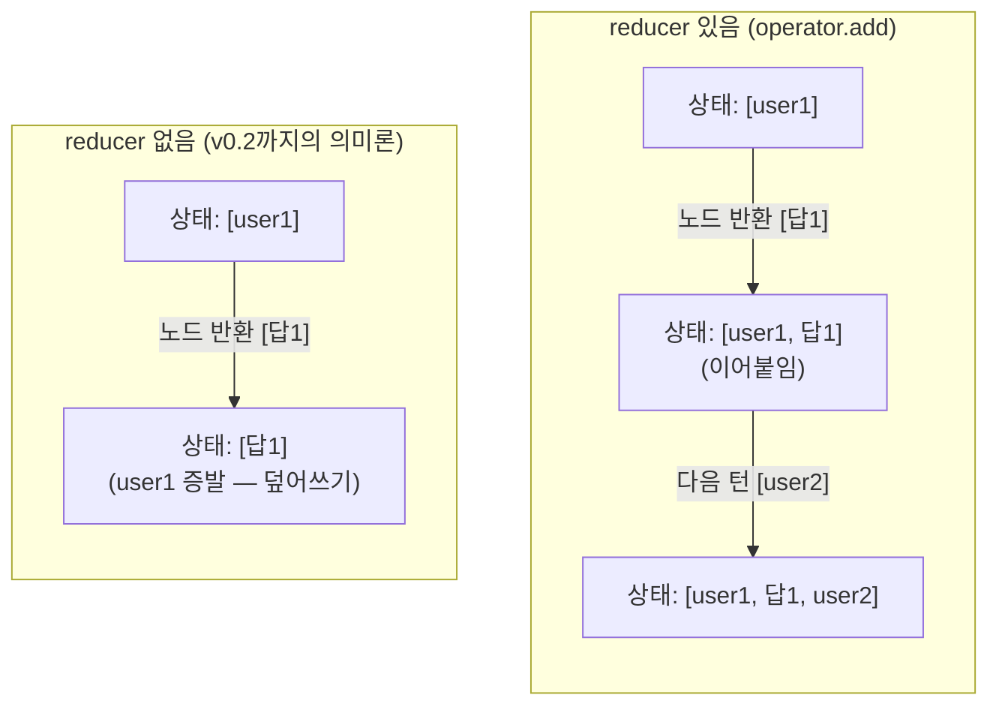

</Slide>

<Slide>

### 코드 발췌: 핵심은 한 줄

```python
class DietState(TypedDict):
    """v0.3의 핵심 한 줄: reducer."""
    messages: Annotated[list[dict], operator.add]

def advisor(state: DietState) -> dict:
    …
    return {"messages": [message.model_dump()]}   # 델타만 — 합치는 건 그래프가

graph = builder.compile(checkpointer=MemorySaver())   # thread별 기억
```

</Slide>

<Slide>

### 호출하는 쪽도 바뀝니다

```python
result = graph.invoke(
    {"messages": [{"role": "user", "content": req.message}]},   # 델타 하나
    config={"configurable": {"thread_id": req.thread_id}},      # 대화의 열쇠
)
```

이제 **새 사용자 메시지 하나만** 넣습니다.  
이전 대화는 그래프가 기억합니다.

</Slide>

<Slide>

### thread_id는 대화의 열쇠

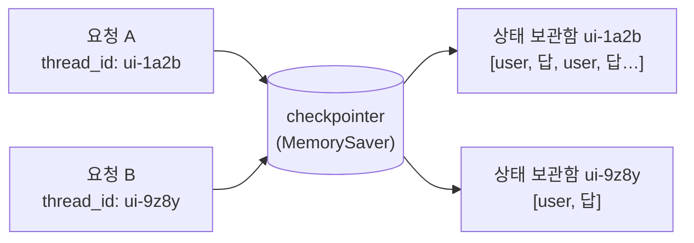

</Slide>

<Slide>

### 시연: thread 안의 기억

- 실행

```bash
git checkout v0.3 && docker compose up --build -d
docker compose exec app python demos/multiturn.py
```

- 결과

```text
=== thread A ===
[1턴] 점심에 비빔밥이랑 미역국 먹었어요.
  → 비빔밥 580 kcal + 미역국 90 kcal = 총계 670 kcal …
[2턴] 제가 방금 뭐 먹었다고 했죠? 저녁 추천도 해주세요.
  → 점심으로 **비빔밥**과 **미역국**을 드셨다고 하셨어요! 총 670 kcal
    정도였습니다. … 저녁은 단백질 위주로 …
```

</Slide>

<Slide>

### 그리고 thread 밖의 백지

```text
=== thread B — 새 대화 ===
[1턴] 제가 방금 뭐 먹었다고 했죠?
  → 이전 대화나 기록이 없어 어떤 음식을 드셨는지 알 수 없습니다!
```

열쇠가 다르면 보관함도 다릅니다.  
**이 격리가 다음 세션들의 전제입니다.**

</Slide>

<Slide>

### 사고 재현: reducer가 없으면
::sub[같은 노드·엣지·checkpointer에서 reducer만 뺀 그래프]

```bash
docker compose exec app python demos/broken_reducer.py
```

</Slide>

<Slide>

### 사고 ①: 대화가 끊긴다

```text
=== 사고 ①: 대화가 끊긴다 (도구 없는 2턴) ===
[1턴] 안녕하세요! 저는 은수예요.
  → 반가워요, 은수님! …
  (이 시점 상태의 메시지 수: 1 — 내 인사는 증발하고 답변만 남았다)
[2턴] 제 이름이 뭐라고 했죠?
  → 이전 대화에서 이름을 말씀해 주신 적이 없습니다!
```

앞의 왼쪽 다이어그램 그대로의 기억 상실입니다.

</Slide>

<Slide>

### 사고 ②: 도구가 끼면 한 턴도 못 버틴다

```text
=== 사고 ②: 도구가 끼면 한 턴도 못 버틴다 ===
[질문] 점심에 비빔밥 먹었어요. (advisor가 도구를 부르는 순간…)
  → APIConnectionError: Missing corresponding tool call for tool
    response message …
```

</Slide>

<Slide>

### 결과 읽기: 고아 tool 메시지

- tools 노드의 델타(role이 tool인 메시지)가 **상태를 덮어씁니다**.
- 짝이 되는 `tool_calls`를 잃은 **고아 tool 메시지**만 남고,
  다음 advisor 호출을 **API가 거부합니다**.
- reducer 없이는 멀티턴이 아니라 **한 턴도 못 버팁니다**.

</Slide>

<Slide class="center">

### reducer는 장식이 아닙니다

없으면 한 턴도 못 버티는 사고를 실측으로 봤습니다.

해법은 State의 한 줄입니다.

</Slide>

<Slide>

### 스트리밍도 여기서

- 실행

```bash
docker compose exec app python demos/stream.py "김치찌개 열량 알려줘"
```

- 결과

```text
[스텝] advisor → 도구 요청 ['lookup_food']
[스텝] tools → 결과 회신
DB 기준으로 **김치찌개(1인분, 400g)**의 영양 정보는 다음과 같습니다.
* **칼로리:** 240 kcal …          ← 토큰이 오는 대로 찍힌다
```

advisor가 토큰을 custom 스트림으로 흘리고(`get_stream_writer`),
완성 메시지는 `stream_chunk_builder`로 복원합니다.

</Slide>

<Slide>

### app은 이것을 SSE로 relay합니다

```text
data: {"type": "step", "node": "advisor", "tools": ["lookup_food"]}
data: {"type": "token", "token": "DB에"}
data: {"type": "token", "token": " 따르면 **바나나 1개(120g)**의 영"}
…
data: {"type": "answer", "answer": "…전체 답…"}
```

스텝 단위(updates)와 토큰 단위(custom)를 함께 구독한 결과입니다.

</Slide>

<Slide>

### 결과 읽기: 기억의 정체는 Day 1 그대로

- 서버가 아니라 **배열이 기억**하고,
  checkpointer는 그 배열을 thread_id로 보관해 주는 장치입니다.
- 다만 `MemorySaver`는 **프로세스 메모리**입니다.
  `docker compose restart` 한 방이면 전부 사라집니다.

</Slide>

<Slide class="center">

### 이 결핍이 다음 세션의 첫 장면입니다

PostgreSQL로 메우는 것이 booking-agent이고,

thread를 넘는 기억은 secretary-agent의 store가 맡습니다.

</Slide>

<Slide class="center">

## Part 7. v1.0 · 제품

UI까지 연결

</Slide>

<Slide>

### 무엇이 완성되나

- Streamlit UI가 세션마다 thread_id를 만들어 서버의 기억과 연결됩니다.
- 답은 SSE로 **토큰이 오는 대로** 그려집니다.
- 도구 조회가 일어나면 말풍선 위에 표시됩니다.
- 사이드바에서 새 상담(새 thread)을 시작할 수 있습니다.

</Slide>

<Slide>

### UI가 스트림을 받는 흐름

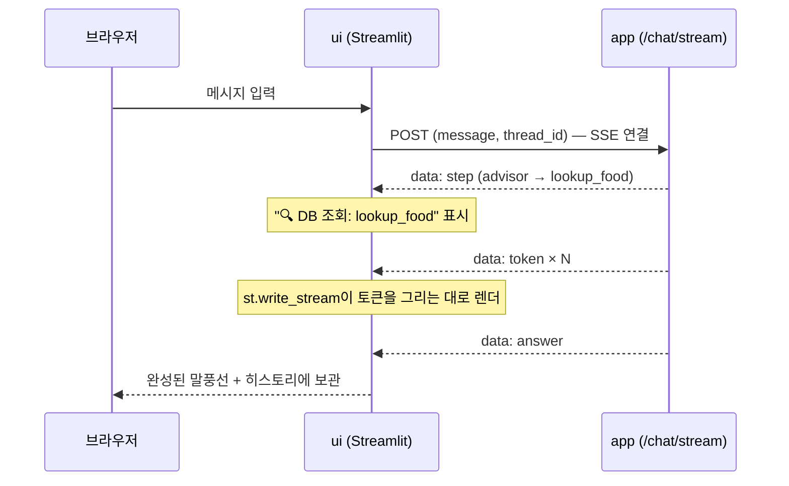

</Slide>

<Slide>

### 코드 발췌: UI가 스트림을 그리는 법

```python
def tokens():
    with requests.post(f"{APP_URL}/chat/stream", json=payload, stream=True) as resp:
        for line in resp.iter_lines(decode_unicode=True):
            event = json.loads(line[len("data: "):])
            if event["type"] == "token":
                yield event["token"]                       # 토큰은 본문으로
            elif event["type"] == "step":
                activity.caption(f"🔍 DB 조회: {…}")        # 스텝은 상태줄로

answer = st.write_stream(tokens())
```

</Slide>

<Slide>

### 시연

```bash
git checkout v1.0 && docker compose up --build    # 제품 완성판
```

브라우저에서 실제로 두 턴을 나눈 화면입니다.  
1턴은 db 수치로 답하고, 2턴은 "방금 김치찌개와 공기밥(총 550 kcal)"을
정확히 기억한 채 저녁을 추천합니다.

</Slide>

<Slide>

### 완성 화면

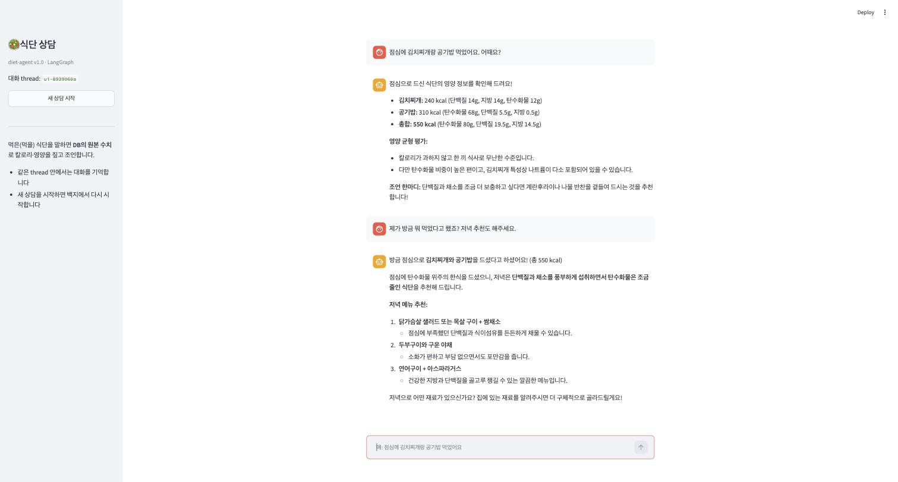

</Slide>

<Slide>

### Day 1과 나란히: 같은 동작, 다른 구조

| | day-01 (수제 루프) | diet-agent (LangGraph) |
| --- | --- | --- |
| 반복 | `for step in range(max_steps)` | 그래프의 순환 엣지 |
| 분기 | 루프 안의 `if message.tool_calls` | `route_after_advisor` 선언 |
| 히스토리 축적 | `messages.append(…)` 손으로 | State의 reducer |
| 멀티턴 기억 | 호출자가 배열을 들고 다님 | checkpointer + thread_id |
| 트레이스 | 직접 만든 StepRecord | `graph.stream(stream_mode=…)` |
| 토큰 스트리밍 | litellm stream을 직접 조립 | `get_stream_writer` |

</Slide>

<Slide class="center">

### 동작은 같습니다

달라진 것은 그 동작이 **선언**되어 있어서,

다음 세션들의 부품(영속 checkpointer, interrupt, store, 병렬 Send)이
**루프를 다시 짜지 않고** 꽂힌다는 점입니다.

</Slide>

<Slide class="center">

## Part 8. 테스트도 교재다

</Slide>

<Slide>

### 대역과 진짜의 경계

- LLM은 **각본 대역**으로 갈아끼웁니다.
- 도구가 때리는 **db는 진짜**를 씁니다.
- 그래서 키 없이 돌면서도 그래프의 경로와 데이터 접근을 함께 검증합니다.

</Slide>

<Slide>

### 분기와 db 접근을 한 문장으로

```python
def test_tool_branch_roundtrip(monkeypatch):
    wire(monkeypatch, [
        fake_response(tool_calls=[fake_tool_call("lookup_food", '{"name": "김치찌개"}')]),
        fake_response(content="김치찌개는 1인분 240kcal입니다."),
    ])
    result = graph_module.graph.invoke(
        {"messages": [{"role": "user", "content": "김치찌개 칼로리?"}]}, cfg()
    )
    # advisor → tools → advisor 경로를 지났고, tools는 진짜 db를 조회했다
    tool_msg = [m for m in result["messages"] if m.get("role") == "tool"][0]
    assert json.loads(tool_msg["content"])["foods"][0]["kcal"] == 240
```

</Slide>

<Slide>

### 나머지 약속들

- `test_same_thread_remembers`: 2턴째 호출에 1턴 히스토리가 실려 가는지
- `test_threads_are_isolated`: 다른 thread는 백지로 시작하는지

`git checkout v0.2 && docker compose exec app pytest`처럼
**어느 태그에서든 그 시점의 테스트가 통과합니다**.

</Slide>

<Slide>

## 이 세션이 남기는 것

- LangGraph의 재료는 넷뿐이다: State, Node, Edge, compile.
  노드는 평범한 함수다.
- 분기는 conditional edge 함수의 선언이고, 그래프 그림과 코드가 1:1이 된다.
- reducer는 장식이 아니다. 없으면 한 턴도 못 버티는 사고를 실측으로 봤다.
- checkpointer는 배열을 thread별로 보관하는 장치이고,
  MemorySaver의 휘발성이 다음 세션의 출발점이 된다.
- 테스트는 각본 LLM + 진짜 db. 어느 태그에서든 통과한다.

</Slide>

<Slide class="center">

## 다음 세션

**booking-agent: 영속성과 승인**

에이전트의 상태는 어디에 사는가.
그리고 되돌릴 수 없는 일은 누가 확인하는가

</Slide>
