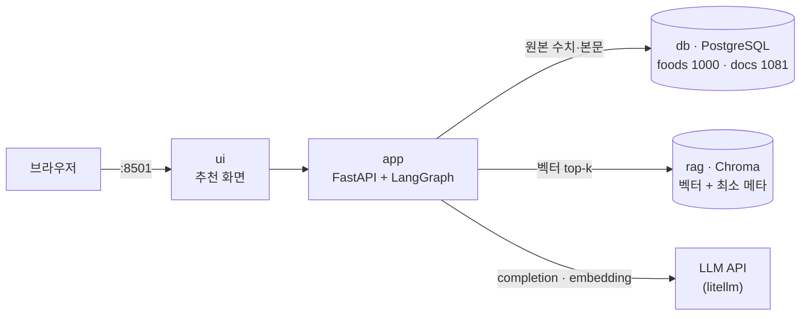
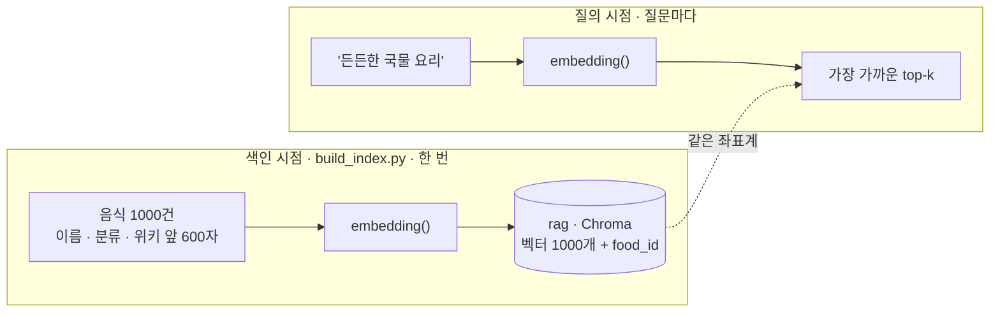
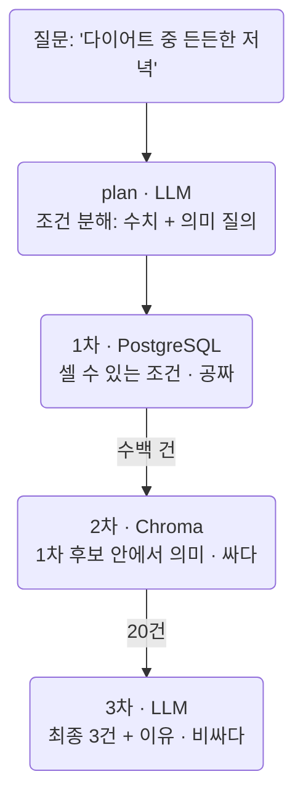
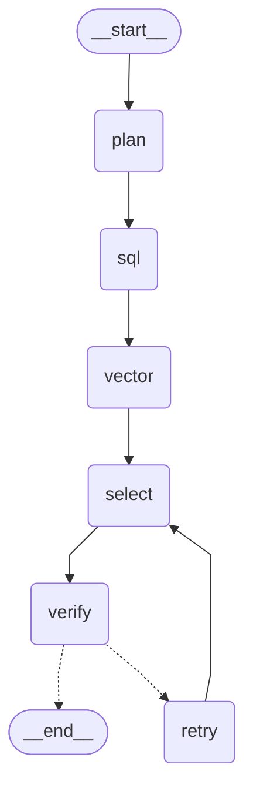
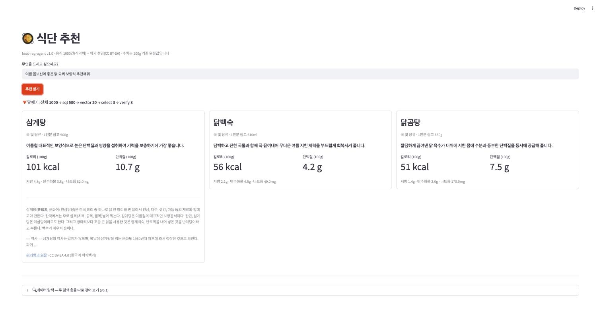
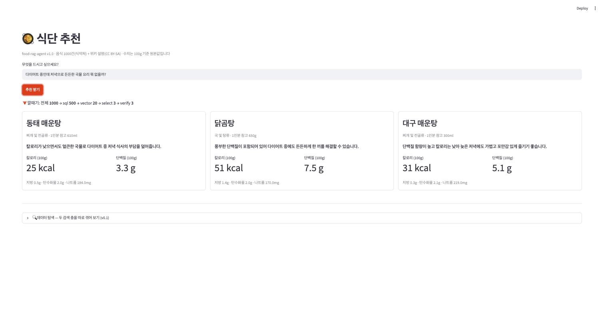

import Slide from 'stack-site-builder/components/Slide.astro';
import VectorSpace from '../../../../components/VectorSpace.astro';

<Slide class="cover">

# AI Agent 실전

Day 2 · 5. food-rag-agent: Agentic RAG

*CodeCompose · 2026*

</Slide>

<Slide>

## 이 세션이 하는 일
::sub[Day 2를 닫는 세션입니다]

- **제품**: "다이어트 중인데 든든한 저녁 뭐 먹을까?"에
  **근거를 붙여** 답하는 식단 추천 웹앱
- 음식 1000건과 위키 설명 1081건 위에서 **고르는 법**을 봅니다.
- LLM이 수치를 지어내는 사고를 재현하고, **코드가 원본과 대조**해 막습니다.
- `rag` 컨테이너(Chroma)가 처음 등장합니다.

</Slide>

<Slide class="center">

## 핵심 문장

**다 읽을 수 없으면 골라야 하고,**

**LLM이 골랐다면 믿기 전에 대조해야 한다**.

</Slide>

<Slide>

## 오늘의 순서

1. 시스템 구조: rag 컨테이너가 처음 등장한다
2. 데이터: 1000건이면 충분하다
3. 벡터 검색이란 무엇인가
4. v0.1 · 두 층: 서로의 구멍이 서로의 강점
5. v0.2 · 깔때기: 싼 층이 줄이고 비싼 층이 고른다
6. v0.3 · 검증자: 코드가 원본과 대조한다
7. v1.0 · 제품: 근거가 함께 나간다

</Slide>

<Slide class="center">

## Part 1. 시스템 구조

컨테이너 넷, 저장소는 둘

</Slide>

<Slide>

## rag 컨테이너가 처음 등장합니다



</Slide>

<Slide>

## Chroma: 벡터 전용 저장소
::sub[rag 컨테이너의 정체]

- 벡터를 넣어 두고 "이것과 가까운 것 k개"를 돌려주는 것이 전부인 저장소입니다.
- secretary-agent는 pgvector로 **같은 일을 pg 안에서** 했습니다.
- 기억 몇 줄이 아니라 **1000건의 색인**이 되면 전용 저장소가 편해집니다.
  - 컬렉션 단위 재생성
  - 거리 함수 선언
  - 메타데이터 필터

</Slide>

<Slide>

## 원본 한 벌, 색인은 옆에

- 수치와 본문의 원본은 **PostgreSQL에만** 있습니다.
- Chroma에는 벡터와 최소 메타데이터(`food_id`)만 둡니다.
- 벡터 검색이 돌려주는 것은 **id와 점수까지**이고,
  화면에 나가는 모든 숫자와 문장은 pg에서 다시 꺼냅니다.
- 색인은 언제든 지우고 다시 만들 수 있는 **파생물**입니다.

</Slide>

<Slide class="center">

## secretary-agent에서 부품으로 만난 벡터 검색이

## 여기서는 전용 벡터 저장소로 승격됩니다

</Slide>

<Slide>

## RAG와 Agentic RAG
::sub[이름을 한 번 정리하고 갑니다]

- **RAG**: 모델이 모르는 것을 외부에서 **찾아와 근거로 붙여** 답하게 하는 방식
- **Agentic RAG**: 찾아오는 과정 자체를 에이전트가 **판단하며 진행**하는 것

이 제품에서 에이전트가 판단하는 것은 셋입니다.

- 질문을 어떤 조건으로 **분해**할지 (plan)
- 좁혀진 후보 중 무엇을 **고를**지 (select)
- 고른 것이 **믿을 만한지** (verify → 재선별)

</Slide>

<Slide class="center">

## Part 2. 데이터

1000건이면 충분하다.

</Slide>

<Slide>

## 무엇이 실려 오는가
::sub[수업은 "정제된 데이터가 이미 있다"에서 출발합니다]

| 데이터 | 출처 | 라이선스 |
| --- | --- | --- |
| 음식 1000건 (foods) | 식약처 전국통합식품영양성분정보(음식) 19,495행에서 큐레이션 | 공공누리 (출처표시) |
| 위키 설명 1081건 (docs) | 한국어 위키백과 "한국 요리" 분류 수집 | CC BY-SA 4.0, 행마다 원문 URL |

clone만 하면 첫 기동 때 적재됩니다.

</Slide>

<Slide>

## 19,495행에서 1000건을 고른 기준

- 프랜차이즈 브랜드 메뉴 **15,225행을 제외**
- 같은 음식의 여러 기원(가정식·외식·급식)에서 **하나를 고름**
- 위키와 이름이 매칭되는 음식 **155건을 전부** 포함
- 23개 분류에서 고르게 채움

큐레이션 원칙은 저장소의 `scripts/`에 **재현 기록**으로 남아 있습니다.

</Slide>

<Slide class="center">

## 1000건 중 845건은 위키 문서가 없습니다

현실 데이터의 결측을 감추지 않고,

**매칭된 것만 근거 발췌를 답니다.**

</Slide>

<Slide>

## 수집기가 남긴 흉터
::sub[수집기 자체도 작은 교재입니다]

- 위키백과가 429를 던지면 `Retry-After`만큼 물러났다 다시 갑니다.
- 네트워크가 끊기면 백오프 재시도합니다.
- 중단되면 받은 만큼 건너뛰고 이어받습니다.

전부 **실제 수집 중에 겪고 고친** 흉터들입니다.

</Slide>

<Slide class="center">

## Part 3. 벡터 검색이란 무엇인가

색인에서 점수까지 한 번에 정리하고 들어갑니다.

</Slide>

<Slide>

## 임베딩: 문장을 좌표로 바꾼다

- 임베딩 모델은 텍스트를 받아 **길이가 고정된 숫자 배열**을 돌려줍니다.
- 숫자 하나하나에 "칼로리"나 "매운맛" 같은 뜻이 붙어 있는 것은 아닙니다.
- 중요한 것은 **배치**입니다.
  의미가 가까운 문장이 가까운 자리에 놓이도록 학습된 좌표계입니다.

</Slide>

<Slide>

## Day 1 3세션에서 이미 실측으로 봤습니다

```text
'국물 요리' vs '탕이나 찌개' = 0.843  (의미가 가깝다)
'국물 요리' vs '주가 상승'   = 0.599  (멀다)
```

"국물"과 "탕"은 **글자가 하나도 겹치지 않는데** 0.843입니다.  
`LIKE '%국물%'`은 이 둘을 이어 주지 못합니다.

</Slide>

<Slide>

## 코사인 유사도: 가깝다를 재는 방법

- 두 벡터가 가까운지는 **사이 각도**로 잽니다.
- 방향이 같으면 1, 직각이면 0, 정반대면 -1입니다.
- **벡터의 길이는 보지 않습니다.**
  짧은 단어든 긴 문장이든 가리키는 방향이 같으면 같은 뜻으로 잡으라는 뜻입니다.

</Slide>

<Slide>

## Chroma에 맡깁니다

```python
client.get_or_create_collection(COLLECTION,
                                metadata={"hnsw:space": "cosine"})
```

- Day 1에서는 이 식을 손으로 짜서 확인했습니다.
- 여기서는 컬렉션을 만들 때 **거리 함수를 선언**합니다.
- Chroma가 돌려주는 값은 거리이므로,
  화면에 나가는 점수는 `1 - distance`로 뒤집은 코사인 유사도입니다.

</Slide>

<Slide class="center">

## 말로는 잘 안 잡히는 대목이라

## 실제 색인을 그대로 그렸습니다

질의를 하나 고르면 그 문장이 숫자 768개가 되고,
같은 공간에 자리를 잡고, 가까운 것부터 끌려 나옵니다.

</Slide>

<Slide>

## 직접 보기: 1000건이 놓인 공간

<VectorSpace />

</Slide>

<Slide>

## 두 질의가 정반대로 갈립니다

- <strong>"든든한 국물 요리"</strong>
  - 국물 무리 **한복판에** 내려앉습니다.
- <strong>"100kcal 이하의 저칼로리 음식"</strong>
  - 어느 무리에도 속하지 못하고 가운데 **어중간한 자리에** 떨어지고,
  - 끌려 나온 것 중에는 100kcal을 넘는 것이 섞입니다.

</Slide>

<Slide class="center">

## 벡터는 분위기를 알지 숫자를 모릅니다

그림에서는 이렇게 보입니다.

</Slide>

<Slide>

## 색인 시점과 질의 시점



</Slide>

<Slide>

## 색인에 넣는 텍스트는 음식의 서술입니다

```python
text = f"{name} · {category}"
if wiki:
    text += " · " + wiki[:WIKI_CHARS]      # WIKI_CHARS = 600
```

이름과 분류, 위키 설명이 있으면 앞 600자까지 붙입니다.

</Slide>

<Slide>

## 칼로리와 단백질은 일부러 넣지 않았습니다

- 수치를 문장으로 적어 벡터에 섞어 봐야
  **"저칼로리"라는 분위기만 얻고 100kcal이라는 경계는 얻지 못합니다**.
- **숫자는 SQL의 일입니다**.

</Slide>

<Slide>

## 질의 때는 같은 모델로 임베딩합니다

```python
# 색인·질의 임베딩 — day-01 랩, secretary-agent와 같은 선택
EMBED_MODEL = "gemini/gemini-embedding-001"
EMBED_DIMS = 768     # Day 1에서 본 기본 3072에서 줄여 잡았다
```

색인과 질의의 모델이 다르면 좌표계가 달라져
**거리가 아무 뜻도 갖지 못합니다**.
모델 문자열을 `agent/config.py` 한 곳에만 두는 이유입니다.

</Slide>

<Slide>

## 벡터가 돌려주는 것은 id와 점수까지다

```python
hits.append({"food_id": meta["food_id"],
             "score": round(1 - res["distances"][0][i], 3)})
foods = {f["food_id"]: f for f in fetch_foods([h["food_id"] for h in hits])}
```

Chroma에서 나오는 것은 `food_id`와 점수뿐이고,
이름도 수치도 **pg에서 다시 꺼냅니다**.

</Slide>

<Slide class="center">

## 좌표는 의미의 지도이지 값의 장부가 아닙니다

이것이 다음 두 층 실습의 전제입니다.

</Slide>

<Slide>

## 시작하기

```bash
git clone https://github.com/2026-ai-agents/food-rag-agent.git
cd food-rag-agent
cp .env.sample .env        # GEMINI_API_KEY 필요 (임베딩)
docker compose up --build
docker compose exec app python build_index.py   # 색인 구축 (한 번, 약 1분)
```

- ui → `http://localhost:8501`
- 테스트: `docker compose exec app pytest`
  (키 없이 통과, LLM·임베딩은 대역이고 db·Chroma는 진짜)

</Slide>

<Slide>

## 릴리즈 사다리: 깔때기가 자라는 순서

| 릴리즈 | 상태 | 테스트 |
| --- | --- | --- |
| v0.1 | 데이터 적재 + 검색 서비스만. 에이전트 없음 | 5개 |
| v0.2 | 선별 깔때기: plan → SQL → 벡터 → LLM, 단계별 후보 수 기록 | 8개 |
| v0.3 | 검증자: 존재·수치·조건을 코드가 원본과 대조, 불합격 재선별 | 13개 |
| v1.0 | 추천 + 원본 수치 + 위키 근거(출처 링크) 표시 완성 | 15개 |

</Slide>

<Slide class="center">

## Part 4. v0.1 · 두 층

서로의 구멍이 서로의 강점이다.

</Slide>

<Slide>

## 무엇이 서는가

- **에이전트가 없습니다**.
- `/search/sql`과 `/search/semantic`이 두 검색 층을 날것으로 내놓습니다.
- 각 층의 성격과 **한계**를 따로 겪어 보는 것이 목적입니다.

</Slide>

<Slide>

## 무엇을 볼 것인가
::sub[네 가지를 순서대로 돌립니다]

1. SQL 층이 **잘하는 것**: 수치 조건
2. SQL 층이 **못하는 것**: "든든한"
3. 벡터 층이 **잘하는 것**: 뉘앙스
4. 벡터 층이 **못하는 것**: 수치 경계

</Slide>

<Slide>

## 시연

```bash
git checkout v0.1 && docker compose up --build -d
docker compose exec app python demos/two_layers.py
```

</Slide>

<Slide>

## 1) SQL 층: 숫자는 완벽하다

```text
=== 1) SQL 층: 100g당 100kcal 이하 · 단백질 5g 이상 ===

  꽃게 매운탕    찌개 및 전골류  31.0kcal · 단백질 5.7g
  대구 매운탕    찌개 및 전골류  31.0kcal · 단백질 5.1g
  갈치찌개      찌개 및 전골류  38.0kcal · 단백질 5.3g
  …
```

</Slide>

<Slide>

## 2) 그런데 SQL로 '든든한'을 찾으면

```text
=== 2) SQL로 '든든한'을 찾으면? ===

  SELECT … WHERE name LIKE '%든든%' → 0건
  '든든한'은 음식 이름이 아니라 뉘앙스다. 문자열 매칭은 여기서 끝난다.
```

</Slide>

<Slide>

## 3) 의미 검색: 뉘앙스는 잡는다

```text
=== 3) 의미 검색: '든든한 국물 요리' ===

  score=0.743  국수전골      찌개 및 전골류   88.0kcal
  score=0.740  닭백숙        국 및 탕류      56.0kcal
  score=0.738  내장탕        국 및 탕류      71.0kcal
  …
```

</Slide>

<Slide>

## 4) 그런데 의미 검색으로 숫자를 찾으면

```text
=== 4) 의미 검색으로 '100kcal 이하 음식'을 찾으면? ===

  score=0.658  과일샐러드     75.0kcal
  score=0.643  샌드위치_채소   244.0kcal ← 100kcal 초과
  score=0.642  김밥_샐러리    130.0kcal ← 100kcal 초과
  …
  '저칼로리'라는 분위기는 잡았지만 4건이 경계를 넘었다.
```

</Slide>

<Slide>

## 결과 읽기: 두 층의 실패가 정확히 대칭이다

- **SQL**은 수치를 완벽하게 거르지만 "든든한"에는 **0건**입니다.
- **벡터**는 "든든한"을 받지만 100kcal 경계에 **244kcal 샌드위치**를 통과시킵니다.

</Slide>

<Slide>

## 어느 층이 무엇을 맡는가

| | SQL 층 | 벡터 층 |
| --- | --- | --- |
| 잘하는 것 | 셀 수 있는 조건, 정렬, 집계 | 뉘앙스, 동의어, 서술 |
| 못하는 것 | 이름에 없는 뉘앙스 | 수치 경계의 보증 |
| 비용 | 공짜 | 싸다 (임베딩 1회) |
| 이 제품에서 | 후보를 수백 건으로 줄인다 | 그 안에서 20건을 고른다 |

</Slide>

<Slide class="center">

## 각 층은 대체가 아니라 분담입니다

이 둘을 잇는 것이 다음 단의 깔때기입니다.

</Slide>

<Slide class="center">

## Part 5. v0.2 · 깔때기

싼 층이 줄이고, 비싼 층이 고른다.

</Slide>

<Slide>

## 무엇이 바뀌나

- 1000건은 컨텍스트에 다 넣을 수 없고, 넣을 수 있어도 비쌉니다.
- **비용 사다리 순서로** 후보를 줄입니다.

</Slide>

<Slide>

## 비용 사다리



</Slide>

<Slide class="center">

## 이 그래프에는 checkpointer가 없습니다

추천은 질문 하나로 끝나는 파이프라인이라
thread에 걸칠 상태가 없습니다.

**모든 그래프에 기억이 필요한 것은 아닙니다.**

</Slide>

<Slide>

## 코드 발췌: plan이 질문을 두 갈래로 가른다

```python
def plan(state: FunnelState) -> dict:
    """질문을 셀 수 있는 조건(SQL)과 흐릿한 조건(벡터)으로 분해한다."""
    response = completion(model=pick_model(), messages=[...],
                          response_format={"type": "json_object"})
    # {"max_kcal": 200, "min_protein_g": null,
    #  "exclude_categories": ["음료 및 차류"], "semantic_query": "든든한 국물 요리"}
```

</Slide>

<Slide>

## plan은 왜 LLM인가

- "다이어트 중인데 든든한 저녁"에서
  **셀 수 있는 조건**(칼로리 상한)과 **흐릿한 조건**(든든한)을 갈라내는 일입니다.
- 규칙으로 짜면 질문 형태마다 규칙이 늘어납니다.
- 출력이 JSON으로 고정되므로,
  Day 1 2세션의 **JSON 강제**가 여기서 파이프라인의 이음새가 됩니다.

</Slide>

<Slide>

## plan이 내놓는 것

```json
{"max_kcal": 200,
 "min_protein_g": null,
 "exclude_categories": ["음료 및 차류"],
 "semantic_query": "든든한 국물 요리"}
```

- 앞의 세 칸은 **SQL이 받습니다**.
- 마지막 한 칸은 **벡터가 받습니다**.
- 질문 하나가 두 층의 입력으로 갈라지는 지점입니다.

</Slide>

<Slide>

## 실행 결과: 깔때기가 좁아지는 것을 숫자로

```text
[질문] 다이어트 중인데 저녁으로 든든한 국물 요리 뭐 없을까?
  plan이 분해한 조건: {"max_kcal": 200, "exclude_categories": ["음료 및 차류", …], …}
  깔때기: 전체 1000 → sql 500 → vector 20 → select 3

  ✔ 닭곰탕 (국 및 탕류 · 51.0kcal · 단백질 7.5g)
    칼로리가 낮으면서도 단백질 함량이 높아 다이어트 중에도 든든하게 즐기기 좋습니다.
  …
```

</Slide>

<Slide>

## 질문이 바뀌면 깔때기 모양도 바뀝니다

```text
[질문] 운동 끝나고 단백질 보충되는 담백한 음식 추천해줘
  plan이 분해한 조건: {"min_protein_g": 15, …}
  깔때기: 전체 1000 → sql 99 → vector 20 → select 3

  ✔ 닭꼬치구이 (구이류 · 181.0kcal · 단백질 32.1g)
  …
```

</Slide>

<Slide>

## 결과 읽기: LLM 앞에는 언제나 20건

- 다이어트 질문은 칼로리 조건으로 **500까지**
- 단백질 질문은 `min_protein 15`로 **99까지**

줄인 뒤에야 벡터와 LLM이 일합니다.  
**이것이 이 제품의 비용 구조입니다.**

</Slide>

<Slide>

## 코드에서 보는 곳

| 단계 | 무엇을 하는가 | 비용 |
| --- | --- | --- |
| `plan` | 질문을 조건으로 분해 (JSON 강제) | LLM 1회 |
| `sql` | 셀 수 있는 조건으로 후보 압축 | 공짜 |
| `vector` | 1차 후보 안에서 의미로 20건 | 임베딩 1회 |
| `select` | 20건을 보고 최종 3건 + 이유 | LLM 1회 |

</Slide>

<Slide class="center">

## 벡터 검색은 1차 후보 "안에서" 돕니다

전체 1000건에서 고르는 것이 아니라,

SQL이 남긴 수백 건 안에서만 의미를 봅니다.

**그래서 244kcal 샌드위치 같은 사고가 여기서는 나지 않습니다.**

</Slide>

<Slide class="center">

## Part 6. v0.3 · 검증자

LLM이 아니라 코드가 원본과 대조한다.

</Slide>

<Slide>

## 사고 재현: 근거를 안 주면 지어낸다
::sub[후보의 이름만 주고 수치를 묻습니다]

```bash
git checkout v0.3 && docker compose up --build -d
docker compose exec app python demos/hallucination.py
```

3차 선별의 출력은 그럴듯하지만 **보증이 없습니다**.

</Slide>

<Slide>

## 1부 · 사고: 이름만 주고 수치를 묻는다

```text
=== 1부 · 사고: 이름만 주고 수치를 묻는다 (무근거 생성) ===

추천               LLM 주장        원본(pg)
닭백숙          115kcal/14g   56.0kcal/4.2g
동태국            45kcal/7g   17.0kcal/2.4g
달걀탕_순두부       65kcal/6g   29.0kcal/1.8g

그럴듯한 숫자다. 검증자가 없다면 이대로 사용자에게 나간다.
```

</Slide>

<Slide class="center">

## 닭백숙 115kcal은 아무 근거 없이 만들어졌습니다

그런데도 **자신만만합니다.**

grounding이 없는 생성이 어떤 모습인지의 표본입니다.

</Slide>

<Slide>

## 2부 · 방어: 같은 주장을 검증자에 통과시킨다

```text
=== 2부 · 방어: 같은 주장을 검증자에 통과시킨다 ===

  ✗ 닭백숙: 수치 불일치: 주장 115kcal ≠ 원본 56.0kcal
  ✗ 동태국: 수치 불일치: 주장 45kcal ≠ 원본 17.0kcal
  ✗ 달걀탕_순두부: 수치 불일치: 주장 65kcal ≠ 원본 29.0kcal

3건 주장 중 3건 불합격. 검증자는 LLM이 아니라 코드다.
```

</Slide>

<Slide>

## 코드 발췌: 검증자는 결정적 검사다

```python
def verify_picks(raw_picks, shortlist, conditions):
    """① 존재: 추천이 후보(원본 행)에 실재하는가
       ② 수치: LLM이 옮겨 적은 수치가 원본과 일치하는가
       ③ 조건: 원본 수치가 사용자 조건을 정말 충족하는가"""
    ...
    passed.append({**origin, "reason": pick.get("reason", "")})   # 수치는 원본으로
```

</Slide>

<Slide>

## 세 가지 검사

- **① 존재**: 추천이 후보(원본 행)에 실재하는가.
  없는 음식을 지어냈으면 여기서 걸립니다.
- **② 수치**: LLM이 옮겨 적은 수치가 원본과 일치하는가.
  닭백숙 115kcal이 걸린 자리입니다.
- **③ 조건**: 원본 수치가 사용자 조건을 **정말** 충족하는가.
  "200kcal 이하"라고 해 놓고 244kcal을 고르지 않았는가

</Slide>

<Slide>

## 불합격은 사유와 함께 돌아갑니다

- 불합격은 사유와 함께 select로 돌아가 **한 번** 재선별됩니다.
- 통과분의 수치는 LLM의 주장이 아니라 **원본 행으로 교체**되어 나갑니다.

</Slide>

<Slide>

## 재선별은 한 번만 돕니다

- 불합격 사유를 들고 select로 돌아가되, **재시도는 한 번**입니다.
- Day 1 6세션에서 본 그대로입니다.
  **한도 없는 재시도는 무한 루프의 다른 이름**입니다.
- 두 번째도 실패하면 통과분만 내보냅니다. 조용히 죽지 않습니다.

</Slide>

<Slide>

## 검증자가 코드여야 하는 이유

- LLM 평가자는 **같은 종류의 실수**를 합니다.
  지어낸 수치를 지어낸 기준으로 채점할 수 있습니다.
- 존재·수치·조건은 전부 **원본과 비교하면 답이 나오는** 검사입니다.
- 답이 정해진 검사를 확률에 맡기지 않습니다.

</Slide>

<Slide class="center">

## Day 1 Reflexion의 제품판입니다

생성 → 평가 → 재시도 순환은 같고,

**평가자가 LLM이 아니라 코드**라는 점이 다릅니다.

"LLM 출력을 그대로 믿지 않는다"가 이 에이전트의 핵심 규율입니다.

</Slide>

<Slide>

## 그래프도 실측으로: verify와 재선별 순환



</Slide>

<Slide>

## 깔때기도 5단이 됩니다

```text
전체 1000 → sql 500 → vector 20 → select 3 → verify 3
```

마지막 숫자가 3이 아닐 때,
즉 **검증이 걸러낸 턴이 바로 검증자가 일한 턴**입니다.

</Slide>

<Slide>

## 통과분의 수치는 원본으로 교체됩니다

- LLM이 옮겨 적은 숫자는 **화면에 나가지 않습니다**.
- 검증자가 통과시킨 뒤에도, 실제로 실리는 값은 pg의 행입니다.
- **이유(reason)만 LLM의 것**입니다. 숫자는 전부 원본입니다.

</Slide>

<Slide class="center">

## Part 7. v1.0 · 제품

어떻게 골라졌는지가 곧 신뢰다.

</Slide>

<Slide>

## 무엇이 완성되나
::sub[화면에 추천만 나오는 게 아닙니다]

- 깔때기 단계별 후보 수
- 검증 탈락 사유
- 원본 수치 (100g 기준 + 1인분 참고량)
- 위키백과 발췌와 원문 링크 (CC BY-SA 표기)

**선별의 과정과 근거가 함께 나옵니다.**

</Slide>

<Slide>

## 왜 과정을 화면에 보여주는가

- 깔때기 후보 수, 검증 탈락 사유가 화면에 나갑니다.
- 추천만 보여주면 사용자는 **믿을지 말지**만 고를 수 있습니다.
- 어떻게 좁혀졌는지가 보이면 **왜 이것인지**를 판단할 수 있습니다.

**어떻게 골라졌는지가 곧 신뢰입니다.**

</Slide>

<Slide>

## grounding: 근거는 응답의 일부다

- **수치**는 검증자가 이미 원본으로 교체했습니다.
- **설명**은 위키 원문에서 300자를 발췌하고,
  **원문 링크와 라이선스 표기**를 함께 답니다.
- 근거를 못 다는 음식은 **발췌 없이 나갑니다**.
  없는 근거를 만들어 붙이지 않습니다.

</Slide>

<Slide>

## 완성 화면



"여름 몸보신에 좋은 닭 요리"에 삼계탕·닭백숙·닭곰탕이 나오고,
위키 문서가 매칭된 삼계탕에는 유래 발췌와 원문 링크가 붙습니다.  
**매칭이 없는 음식은 발췌 없이 정직하게 나갑니다.**

</Slide>

<Slide>

## 다이어트 질문의 완성 화면



</Slide>

<Slide>

## 코드 발췌: 근거를 다는 곳

```python
def attach_grounding(picks):
    """수치는 이미 원본(검증자가 교체), 설명은 위키 원문에서 — 출처 포함."""
    wiki = wiki_doc(pick["wiki_title"]) if pick.get("wiki_title") else None
    return {**pick, "wiki": {"summary": wiki["text"][:300],
                             "url": wiki["url"], "license": wiki["license"]} if wiki else None}
```

</Slide>

<Slide class="center">

## Part 8. 테스트도 교재다

</Slide>

<Slide>

## 대역과 진짜의 경계

- LLM은 **각본**
- 임베딩은 **결정적 해시 대역**
- db와 Chroma는 **진짜**

이 규약 위에서 검증자의 계약이 문장으로 박제됩니다.

</Slide>

<Slide>

## 옮겨 적다 틀린 수치는 걸린다

```python
def test_wrong_number_is_rejected():
    passed, rejected = verify_picks(
        [{"name": "닭곰탕", "kcal": 150, "protein_g": 7.5, "reason": "옮겨 적다 틀림"}],
        SHORTLIST, {})
    assert passed == []
    assert "수치 불일치" in rejected[0]["reason"]
```

</Slide>

<Slide>

## 나머지 약속들

- 환각 이름이 걸러진 뒤 재선별이 **정확히 한 번** 돌고,
  그 프롬프트에 탈락 사유가 실리는 것
- 통과분의 수치가 원본으로 교체되는 것
- 근거 발췌에 출처와 라이선스가 붙는 것

15개가 어느 태그에서든 그 시점 분량만큼 통과합니다.

</Slide>

<Slide>

## 이 세션이 남기는 것

- 검색 층은 대체가 아니라 분담이다.
  SQL은 숫자를, 벡터는 의미를, LLM만 이유를 안다.
- 깔때기는 비용 사다리다. 싼 층이 줄여준 뒤에만 비싼 층이 일한다.
- LLM 출력은 그럴듯함이지 보증이 아니다.
  내보내기 전에 코드가 원본과 대조한다.
- 근거는 응답의 일부다. 수치는 원본으로, 설명은 출처 링크와 함께
- 원본 한 벌, 색인은 옆에. 색인은 파생물이라 언제든 다시 만든다.

</Slide>

<Slide>

## 색인은 언제든 다시 만듭니다

```bash
docker compose exec app python build_index.py   # 약 1분
```

- 원본은 pg에 한 벌뿐이고, Chroma는 파생물입니다.
- 임베딩 모델을 바꾸면 **색인을 통째로 다시 만들어야** 합니다.
  좌표계가 달라지기 때문입니다.
- 그래서 모델 문자열이 `agent/config.py` 한 곳에 있습니다.

</Slide>

<Slide class="center">

## Day 2가 여기서 닫힙니다

</Slide>

<Slide>

## 오늘 얹은 것

| 저장소 | 얹은 개념 |
| --- | --- |
| `diet-agent` | 그래프: State·Node·Edge, conditional edge, reducer |
| `booking-agent` | 영속성(checkpointer)과 승인(interrupt) |
| `secretary-agent` | 기억의 수명(store) |
| `food-rag-agent` | 선별과 검증(Agentic RAG) |

</Slide>

<Slide>

## Day 1부터 이어진 규율

- **LLM이 만든 값은 실행·표시 직전에 코드로 검증한다**
  (Day 1 4세션 인자 환각 → 오늘의 검증자)
- **생성과 평가를 분리한다**
  (Day 1 6세션 Reflexion → 오늘의 verify 순환)
- **재시도에는 한도를 둔다**
  (Day 1 5세션 스텝 한도 → 오늘의 재선별 1회)
- **비싼 층 앞에 싼 층을 세운다**
  (Day 1 7세션 비용 추정 → 오늘의 깔때기)

</Slide>

<Slide>

## 라이선스는 데이터의 일부입니다

- 음식 데이터: 식약처, **공공누리 (출처표시)**
- 위키 설명: **CC BY-SA 4.0**, 행마다 원문 URL

발췌를 화면에 실을 때 **출처 링크와 라이선스를 함께** 답니다.  
남의 데이터로 만든 제품은 그 조건을 지켜야 합니다.

</Slide>

<Slide class="center">

## 넷 다 혼자 일하는 에이전트였습니다

에이전트 **여럿**이 협업하는 순간 무엇이 필요해지는가,

그것이 Day 3의 주제입니다.

</Slide>
