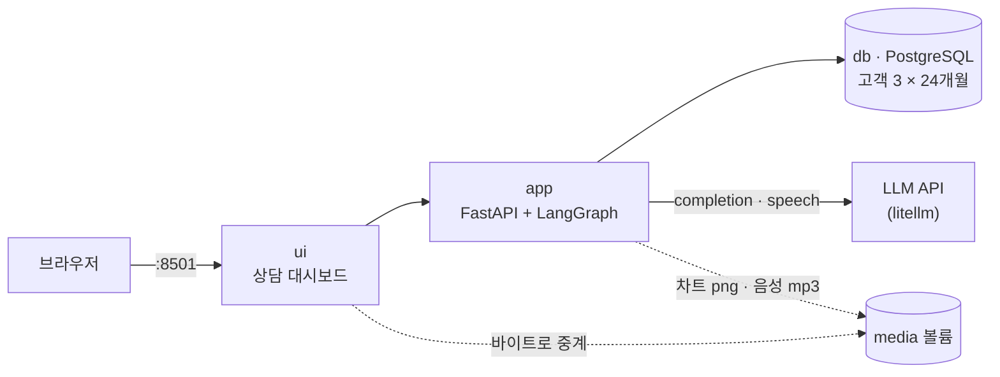
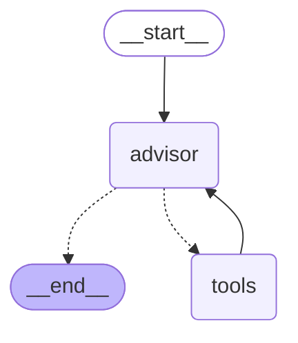
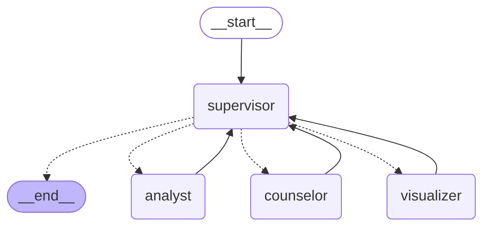
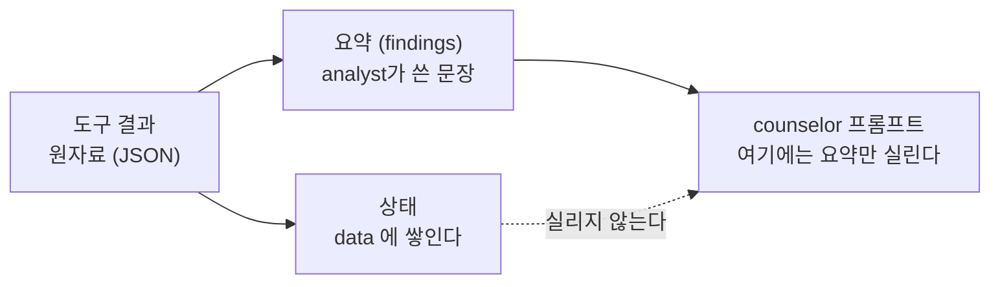
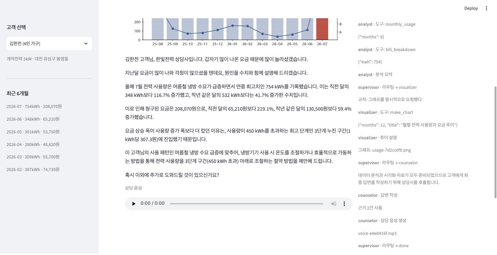

import Slide from 'stack-site-builder/components/Slide.astro';
import RoutingRules from '../../../../components/RoutingRules.astro';

<Slide class="cover">

# AI Agent 실전

Day 3 · 2. energy-agent: supervisor 패턴

*CodeCompose · 2026*

</Slide>

<Slide>

## 이 세션이 하는 일
::sub[나누면 무엇이 좋아지고 무엇이 나빠지는가를 숫자로 봅니다]

- **제품**: 전기 요금이 왜 이렇게 나왔는지
  수치와 그래프와 **음성**으로 답하는 상담 대시보드
- 같은 질문을 단일 구조와 supervisor 구조에 던져
  지침·컨텍스트·호출을 나란히 잽니다.
- 라우팅이 실행마다 흔들리는 사고를 재현하고,
  확실한 판단을 **코드로 되찾아옵니다**.

</Slide>

<Slide class="center">

## 핵심 문장

**나누는 것이 이득인지는 주장이 아니라 숫자로 확인한다**.

</Slide>

<Slide>

## 오늘의 순서

1. 시스템 구조: 컨테이너 셋에 볼륨 하나
2. 데이터: 요금이 튀는 이유가 데이터 안에 있어야 한다
3. v0.1 · 단일 에이전트라는 기준점
4. v0.2 · supervisor로 나눈다
5. v0.3 · 라우팅은 흔들린다
6. v1.0 · 상담은 말로 끝난다

</Slide>

<Slide>

## 시작하기

```bash
git clone https://github.com/2026-ai-agents/energy-agent.git
cd energy-agent
cp .env.sample .env        # 키 채우기 (셋 중 하나면 됨)
docker compose up --build
```

- ui → `http://localhost:8501` (상담 대시보드)
- 진행 리듬은 Day 2와 같습니다.
  v0.1 기동 → 태그를 오르며 feature 시연 → v1.0 확인

</Slide>

<Slide>

## 릴리즈 사다리

| 릴리즈 | 무엇이 생기나 |
| --- | --- |
| v0.1 | 단일 에이전트. 비교 기준점 |
| v0.2 | supervisor 분리: 네 역할로 |
| v0.3 | 차트 도구, 그리고 하이브리드 라우팅 |
| v1.0 | TTS 상담: 답변이 음성으로 |

</Slide>

<Slide class="center">

## Part 1. 시스템 구조

</Slide>

<Slide>

## 컨테이너 셋에 볼륨 하나



Day 2의 구성과 거의 같습니다.  
새로 생긴 것은 **`media` 볼륨 하나뿐**입니다.

</Slide>

<Slide>

## 왜 바이트로 중계하는가

- 차트와 음성은 app이 파일로 쓰고 `/media/{파일명}`으로 내보냅니다.
- ui는 그 주소를 화면에 그대로 박지 않고 **바이트를 받아 전달**합니다.
- 브라우저는 `app`이라는 **컨테이너 이름을 해석할 수 없기** 때문입니다.

Day 2에서 한 번 겪은 함정이 여기서도 같은 모양으로 나타납니다.

</Slide>

<Slide>

## 대시보드가 보여 주는 것 셋

- **답변**: 수치와 근거가 담긴 상담문
- **차트**: 12개월 사용량과 요금
- **트레이스**: 어느 에이전트가 무엇을 왜 했는지

세 번째가 이 세션의 실습 도구입니다.

</Slide>

<Slide class="center">

## Part 2. 데이터

요금이 튀는 이유가 데이터 안에 있어야 한다.

</Slide>

<Slide>

## 튄 달이 실제로 있어야 합니다

- "지난달 요금이 왜 이렇게 많이 나왔나"라고 물으려면
  **실제로 튄 달**이 있어야 합니다.
- 시드 생성기가 난수 씨앗을 고정한 채 고객 3명의 24개월치를 만들고,
  그 결과를 `db/init/02_seed.sql`로 커밋합니다.
- **생성기를 다시 돌려도 같은 표가 나옵니다**.

</Slide>

<Slide class="center">

## 시연 데이터는 지어내되, 재현 가능해야 합니다

난수 씨앗을 고정하고 결과를 **SQL로 커밋**합니다.

강의에서 매번 같은 숫자가 나와야 하기 때문입니다.

</Slide>

<Slide>

## 고객 셋

| 고객 | 성격 | 최근 달 |
| --- | --- | --- |
| 김한전 (4인 가구) | 여름 냉방으로 크게 튄다 | 754kWh · 208,070원 |
| 이절전 (1인 가구) | 계절을 타지 않는다 | 낮고 평탄 |
| 박태양 (자영업) | 영업 패턴을 따른다 | 중간 |

</Slide>

<Slide>

## 요금은 주택용 누진 3단계

- 200kWh까지 kWh당 **120.0원**
- 400kWh까지 **214.6원**
- 그 위는 **307.3원**

754kWh가 3단계에 깊이 들어가면
**사용량이 2배 늘 때 요금은 3배**가 됩니다.

</Slide>

<Slide class="center">

## 사용량 증가율과 요금 증가율이 다르다

이것이 이 제품이 설명해야 할 핵심이고,

그 설명이 가능하도록 **데이터를 만든 것**입니다.

</Slide>

<Slide>

## 같은 계산표를 둘이 나눠 씁니다

- 시드 생성기와 `agent/tools.py`가 **같은 계산표**를 씁니다.
- 도구가 돌려주는 숫자와 db에 든 숫자가 **어긋날 수 없게** 하기 위해서입니다.

</Slide>

<Slide class="center">

## Part 3. v0.1 · 단일 에이전트라는 기준점

첫 단은 일부러 나누지 않고 만듭니다.

</Slide>

<Slide>

## advisor 하나가 전부 합니다

- 도구 다섯 개를 들고
- 분석도 하고
- 추이도 정리하고
- 상담 말투도 씁니다.

</Slide>

<Slide>

## 그래프는 Day 2에서 익숙해진 그 모양



</Slide>

<Slide>

## 두 질문을 던집니다

- **긴 질문**: "지난달 요금이 왜 이렇게 많이 나왔나요?"
- **짧은 질문**: "제 계약전력이 몇 kW인가요?"

둘의 **프롬프트 길이를 비교**하는 것이 목적입니다.

</Slide>

<Slide>

## 실제로 돌리면

```text
[질문] 지난달 요금이 왜 이렇게 많이 나왔나요?
  프롬프트 1,105자 · 답변 직전 컨텍스트 2,640자 · LLM 호출 3회
    - advisor: 도구: compare_usage
    - advisor: 도구: bill_breakdown
    - advisor: 답변 작성

[질문] 제 계약전력이 몇 kW인가요?
  프롬프트 1,105자 · 답변 직전 컨텍스트 1,638자 · LLM 호출 2회
    - advisor: 도구: customer_profile
    - advisor: 답변 작성
```

</Slide>

<Slide class="center">

## 볼 것은 답변의 품질이 아닙니다

**1,105이라는 같은 숫자**입니다.

</Slide>

<Slide>

## 무엇이 문제인가

- "계약전력이 몇 kW인가"라는 **한 줄짜리 질문**에도
  추이 정리 지침과 상담 말투 지침이 **통째로 실려 나갔습니다**.
- 그리고 답변을 쓰는 순간까지
  도구가 물어온 **원자료가 컨텍스트에 그대로 남아** 있습니다.

</Slide>

<Slide class="center">

## v0.1의 프롬프트는 정리하지 않습니다

정리해 버리면 **비교할 대상이 사라집니다**.

</Slide>

<Slide class="center">

## Part 4. v0.2 · supervisor로 나눈다

</Slide>

<Slide>

## advisor 하나를 네 역할로

- **supervisor**: 조율한다.
- **analyst**: 수치를 캔다.
- **visualizer**: 그림을 그린다.
- **counselor**: 말을 만든다.

</Slide>

<Slide>

## 모든 실선이 중앙으로 돌아옵니다



</Slide>

<Slide class="center">

## 이 되돌아옴이 supervisor 패턴의 정의입니다

하위 에이전트는 서로를 부르지 않고,
자기 일을 마치면 중앙으로 복귀합니다.

**다음 세션에서 볼 handoff와 갈리는 지점입니다.**

</Slide>

<Slide>

## supervisor는 에이전트가 아니라 라우터다

- 이름 때문에 오해하기 쉬운데, supervisor는 **일을 하지 않습니다**.
- **다음에 누가 일할지만 정합니다**.
- 하는 일이 그것뿐이라 출력도 그것뿐입니다.

</Slide>

<Slide>

## 모델에게 받는 것은 이 한 줄이 전부

```python
# supervisor가 모델에게 받는 것은 이 한 줄이 전부다
{"next": "analyst", "why": "요금 내역을 먼저 조회해야 한다"}
```

그래서 supervisor 노드에는 **도구가 없고, 답변도 쓰지 않습니다**.

</Slide>

<Slide>

## 이름 하나를 고르는 일을 엣지로 잇는다

```python
graph.add_conditional_edges("supervisor", lambda state: state["route"],
                            ["analyst", "visualizer", "counselor", END])
```

</Slide>

<Slide class="center">

## 노드는 정하고, 엣지는 나른다

Day 2에서 "도구를 부를까 답할까"를 갈랐던 그 구조가,

여기서는 "누구에게 보낼까"를 가르는 데 그대로 쓰입니다.

**새 문법이 아니라 같은 문법의 다른 쓰임입니다.**

</Slide>

<Slide>

## supervisor의 상태에는 무엇이 있나

- **question**: 고객이 물은 것
- **data**: 도구가 물어온 원자료. 쌓이되 프롬프트에는 안 실린다.
- **findings**: 하위 에이전트가 올린 요약
- **route**: 다음에 누가 일할지
- **answer**: 나왔으면 끝이라는 신호

</Slide>

<Slide>

## 나눌 때 실제로 나누는 것 셋

- **지침**
- **도구**
- **문맥**

</Slide>

<Slide>

## ① 지침: 역할마다 자기 문장만

- 각 역할은 **자기 문장만 이고 갑니다**.
- 상담문을 쓰는 순간 필요한 것은 말투 지침이지,
  도구 사용법과 차트 규칙이 아닙니다.

</Slide>

<Slide>

## ② 도구: 볼 수 없는 도구는 잘못 부를 수도 없다

- analyst는 조회 도구 **넷**을 봅니다.
- visualizer는 `make_chart` **하나**만 봅니다.
- counselor에게는 **도구가 없습니다**.

</Slide>

<Slide>

## ③ 문맥: 요약만 위로 올린다

- 하위 에이전트는 <strong>요약(findings)</strong>만 위로 올립니다.
- 도구가 물어온 **원자료(data)** 는 상태에 쌓이되,
  다음 에이전트의 프롬프트에는 실리지 않습니다.

</Slide>

<Slide class="center">

## 이제 같은 질문을 두 구조에 던집니다

바뀐 것은 **구조뿐**입니다.

모델도, 데이터도, 질문도 같습니다.

</Slide>

<Slide>

## 같은 질문, 두 구조 ① 단일

```text
=== 지난달 요금이 왜 이렇게 많이 나왔나요? ===

[single] 에이전트 1 · 지침 1,105자 · 컨텍스트 2,640자 · LLM 호출 3회
    advisor     도구: compare_usage
    advisor     도구: bill_breakdown
    advisor     답변 작성
```

</Slide>

<Slide>

## 같은 질문, 두 구조 ② supervisor

```text
[supervisor] 에이전트 4 · 지침 199자 · 컨텍스트 466자 · LLM 호출 5회
    supervisor  라우팅 → analyst (규칙: 자료가 없으면 분석부터)
    analyst     도구: compare_usage
    analyst     도구: monthly_usage
    analyst     도구: bill_breakdown
    analyst     분석 요약
    supervisor  라우팅 → counselor (분석 데이터가 확보되었으므로 답변 작성)
    counselor   답변 작성 (근거 1건 사용)
    supervisor  라우팅 → done (규칙: 답변이 나왔다)
```

</Slide>

<Slide>

## 숫자로 나란히

| | 단일 (v0.1) | supervisor (v0.2) |
| --- | --- | --- |
| 답변을 쓴 에이전트의 지침 | 1,105자 | 199자 |
| 답변 직전 컨텍스트 | 2,640자 | 466자 |
| LLM 호출 | 3회 | 5회 |

</Slide>

<Slide>

## 총량은 줄지 않았습니다

```text
supervisor  532자
analyst     140자
visualizer  147자
counselor   199자
```

역할별 지침을 다 합치면 **1,018자**로,
v0.1의 1,105자와 크게 다르지 않습니다.

</Slide>

<Slide class="center">

## 줄어든 것은 총량이 아니라

## 한 번의 호출이 이고 가는 무게입니다

상담문을 쓰는 순간 필요한 것은 199자짜리 말투 지침입니다.

v0.1은 그 전부를 **매 호출마다** 함께 보냈습니다.

</Slide>

<Slide>

## 호출이 5회로 늘어난 내역

- supervisor 라우팅 판단 **3회**
- analyst 작업 **1회**
- counselor 작업 **1회**

**라우팅 판단 자체가 LLM 호출**이라는 것이 이 구조의 비용입니다.

</Slide>

<Slide>

## 왜 요약만 위로 올리는가

컨텍스트를 **예산**이라고 생각하면 이해가 빠릅니다.  
한 번의 호출에 실을 수 있는 분량은 정해져 있고,
거기에 무엇을 넣을지가 설계입니다.

</Slide>

<Slide>

## 원자료는 사라지지 않습니다



**다음 호출에 실리지 않을 뿐**입니다.  
트레이스에서는 여전히 볼 수 있고, 필요하면 꺼내 쓸 수도 있습니다.

</Slide>

<Slide>

## 이 선택에는 대가가 있습니다

- **요약하는 순간 정보가 샙니다**.
- analyst가 "직전 달 대비 116% 증가"라고만 적으면,
  counselor는 월별 수치를 다시 볼 수 없습니다.
- 무엇을 요약에 남길지는 **하위 에이전트의 프롬프트가 정합니다**.

</Slide>

<Slide class="center">

## 다음 세션의 handoff는 정확히 반대 선택을 합니다

요약하지 않고 **대화를 통째로 넘깁니다**.

</Slide>

<Slide class="center">

## 지침은 5분의 1, 컨텍스트는 6분의 1

## 그리고 호출은 늘었습니다

이것이 나누는 대가입니다.  
라우팅 판단 자체가 LLM 호출이기 때문에,
왕복이 늘수록 비용과 지연이 함께 늘어납니다.

</Slide>

<Slide class="center">

## 나누어서 좋아지는 것과 나빠지는 것이

## 이 표 한 장에 같이 있습니다

어느 쪽을 택할지는 **제품이 정합니다**.

</Slide>

<Slide class="center">

## Part 5. v0.3 · 라우팅은 흔들린다

</Slide>

<Slide>

## 차트를 붙이면 사고가 드러납니다

- 차트는 visualizer의 일입니다.
- 그런데 **언제 visualizer를 부를지는 supervisor의 판단**입니다.
- 판단은 매번 같지 않습니다.

</Slide>

<Slide>

## 무엇을 세어야 보이는가

- 답변만 봐서는 **모릅니다**.
- 세어야 할 것은 셋입니다.
  - 그래프를 몇 번 그렸나
  - LLM 호출이 몇 번이었나
  - 어떤 경로로 갔나

</Slide>

<Slide>

## 실패 재현: 같은 질문을 세 번씩

```text
=== ① 라우팅을 전부 LLM에게 맡김 ===

최근 1년 추이를 그래프로 보여주세요
    그래프 3/3회 · LLM 호출 9~12회
    경로: analyst → visualizer → counselor → done
    경로: analyst → visualizer → counselor → visualizer → done

요금이 좀 이상한 것 같은데 확인해 주세요
    그래프 0/3회 · LLM 호출 6~7회
    경로: analyst → counselor → done

제 계약전력이 몇 kW인가요?
    그래프 0/3회 · LLM 호출 3~6회
    경로: analyst → counselor → done
    경로: counselor → done
```

</Slide>

<Slide>

## 같은 질문, 같은 코드, 같은 데이터인데 경로가 갈립니다

두 군데를 보십시오.

</Slide>

<Slide>

## ① 그래프를 두 번 그린 실행

- counselor가 답을 쓴 뒤에 supervisor가 **visualizer를 한 번 더** 불렀습니다.
- 결과는 크게 다르지 않지만 호출은 **9회에서 12회로** 늘었습니다.

</Slide>

<Slide>

## ② analyst를 건너뛴 실행

- "계약전력이 몇 kW인가"에 supervisor가 **곧장 counselor를** 불렀습니다.
- counselor에게는 **도구가 없습니다**.
- **자료를 한 번도 조회하지 않은 채 상담문을 쓴 것**입니다.

</Slide>

<Slide class="center">

## 두 번째가 더 무섭습니다

출력만 보면 그럴듯한 답이 나오기 때문에,

**트레이스를 세지 않으면 사고가 났다는 사실 자체를 모릅니다.**

</Slide>

<Slide class="center">

## 고칠 방법을 고르기 전에

## 무엇이 문제인지 정확히 말해야 합니다

문제는 "라우팅이 틀린다"가 아니라

**"같은 입력에 경로가 흔들린다"** 입니다.

</Slide>

<Slide>

## 규칙을 넣은 뒤

```text
=== ② 하이브리드: 확실한 것은 코드, 애매한 것만 LLM ===

최근 1년 추이를 그래프로 보여주세요   LLM 호출 6~6회
    경로: analyst → visualizer → counselor → done

요금이 좀 이상한 것 같은데 확인해 주세요   LLM 호출 5~5회
    경로: analyst → counselor → done

제 계약전력이 몇 kW인가요?             LLM 호출 4~4회
    경로: analyst → counselor → done
```

</Slide>

<Slide>

## 나란히 놓으면

| 질문 | LLM 라우팅 | 하이브리드 |
| --- | --- | --- |
| 그래프 요청 | 9\~12회 · 경로 2종 | 6회 고정 · 경로 1종 |
| 애매한 요청 | 6\~7회 · 경로 1종 | 5회 고정 · 경로 1종 |
| 단순 조회 | 3\~6회 · 경로 2종 | 4회 고정 · 경로 1종 |

</Slide>

<Slide class="center">

## 호출 수가 줄어든 것보다

## 폭이 사라진 것이 중요합니다

실행마다 달라지던 경로가 하나로 고정되면,
그때부터 **트레이스는 디버깅에 쓸 수 있는 기록**이 됩니다.

</Slide>

<Slide>

## 3회가 4회로 늘어난 것은 손해가 아닙니다

- 단순 조회에서 최소 호출이 3회에서 4회로 늘었습니다.
- **자료 없이 답하던 그 3회짜리 실행이 사라진 값**입니다.

</Slide>

<Slide>

## 규칙 셋이 하는 일

- **답이 나왔으면 끝이다**: 더 부를 이유가 없습니다.
- **자료가 없으면 분석부터**: 자료 없이 할 수 있는 것은 없습니다.
- **그래프를 명시적으로 요청했다**: 판단할 거리가 아닙니다.

그리고 **그 밖은 LLM에게** 넘깁니다.

</Slide>

<Slide>

## 확실한 것은 코드가 정한다

```python
def _rule_route(state):
    if state.get("answer"):                      # 답이 나왔으면 끝이다
        return "done", "규칙: 답변이 나왔다"
    if "analyst" not in done_agents:             # 자료 없이 할 수 있는 것은 없다
        return "analyst", "규칙: 자료가 없으면 분석부터"
    if wants_chart(state["question"]) and "visualizer" not in done_agents:
        return "visualizer", "규칙: 그래프를 명시적으로 요청했다"
    return None                                  # 애매하면 LLM에게 묻는다
```

supervisor를 더 똑똑하게 만들려 하지 않았습니다.  
**판단이 필요 없는 자리**를 골라 코드로 확정했습니다.

</Slide>

<Slide>

## 판단할 거리가 없는 자리들

- "그래프로 보여 주세요"라고 적힌 질문에
  그래프를 그릴지 말지는 **판단할 거리가 아닙니다**.
- 자료가 하나도 없는 상태에서 상담문을 쓸 수 없다는 것도 마찬가지입니다.

이런 자리를 모델에게 되묻는 것은
**비용을 내고 불확실성을 사는 일**입니다.

</Slide>

<Slide class="center">

## 라우팅을 LLM에게 맡길지 코드로 정할지는

## 기능의 문제가 아니라 확실성의 문제입니다

규칙으로 끝낼 수 있으면 규칙으로 끝내고,
애매한 자리만 모델에게 넘깁니다.

트레이스에는 어느 쪽이 정했는지가 `규칙:`으로 남습니다.

</Slide>

<Slide>

## 직접 만져 보기: 규칙은 어디서 멈추는가

<RoutingRules />

</Slide>

<Slide>

## 멈추는 자리가 곧 값을 치르는 자리입니다

- "그래프로 보여 주세요"에는 **규칙이 끝까지 정합니다**.
- "요금이 좀 이상한데요"에는 **두 번째 결정에서 멈춥니다**.
- 멈춘 그 자리에서 LLM 호출이 하나 붙습니다.

</Slide>

<Slide>

## 트레이스를 읽을 때 보는 것

- 어느 **에이전트**가 일했나
- 무슨 **도구**를 어떤 인자로 불렀나
- 각 라우팅을 **규칙이 정했나, LLM이 정했나**
- 최종 **답변과 음성**이 나왔나

</Slide>

<Slide>

## 차트의 숫자는 어디서 오는가

- `make_chart`는 **몇 개월치를 그릴지와 제목만** 받습니다.
- 수치는 받지 않습니다. **도구가 db에서 직접 조회해 그립니다**.
- LLM이 옮겨 적은 숫자로 그리면 막대 높이가 원본과 어긋날 수 있고,
  그것은 **화면에서 확인할 방법이 없는** 종류의 오류입니다.

food-rag-agent의 "원본 한 벌" 규율과 같은 이유입니다.

</Slide>

<Slide class="center">

## 라우팅을 고치는 두 가지 방법

프롬프트를 다듬어 **판단을 교정**하거나,

판단이 필요 없는 자리를 **코드로 확정**하거나.

이 저장소는 두 번째를 골랐습니다.

</Slide>

<Slide class="center">

## Part 6. v1.0 · 상담은 말로 끝난다

</Slide>

<Slide>

## 화면에 좋은 글이 그대로 좋은 말은 아닙니다

- 전화 상담이 목적이라면 최종 산출물은 글이 아니라 **말**입니다.
- 그런데 둘은 같은 물건이 아닙니다.

</Slide>

<Slide>

## 답변 · 원고 · 음성

```text
=== 답변 (화면) ===
- **올해 7월 사용량**은 754kWh로 연중 최고치입니다.
- 직전 달 348kWh보다 116.7% 늘었고, 요금은 208,070원입니다.
201자

=== 원고 (전화) ===
올해 7월 사용량은 754킬로와트시로 연중 최고치입니다.
직전 달 348킬로와트시보다 116.7% 늘었고, 요금은 208070원입니다.
198자 (상한 700자)

=== 음성 ===
voice-fa7cf9d7.mp3 · 553,728바이트 · 약 35초
```

</Slide>

<Slide>

## 무엇이 걸리는가

- **별표와 머리표**는 읽으면 걸립니다.
- **`kWh`** 는 "케이더블유에이치"로 읽힙니다.
- **`208,070`의 쉼표**는 숫자를 끊습니다.

그래서 **말할 원고를 따로 만듭니다**.

</Slide>

<Slide class="center">

## 음성이 최종 산출물이면

## 답변의 길이부터 다시 정해야 합니다

원고 198자가 소리로는 35초이고,

상한인 700자면 2분에 가깝습니다.

</Slide>

<Slide>

## 원고를 따로 만드는 규칙

- 마크다운 기호를 걷어냅니다.
- 단위를 **읽는 말로** 바꿉니다 (`kWh` → 킬로와트시)
- 숫자의 쉼표를 뗍니다.
- 길이 상한을 겁니다 (700자)

</Slide>

<Slide>

## 음성은 관문이 아닙니다

- 음성 합성은 counselor의 마지막 단계이지만,
  **실패해도 상담을 막지 않습니다**.
- 예외를 잡아 트레이스에 남기고 답변은 그대로 내보냅니다.
- **바깥 서비스 하나가 죽었다고 상담 자체가 죽는 구조는 만들지 않습니다**.

</Slide>

<Slide>

## TTS는 키가 있는 쪽을 씁니다

- `OPENAI_API_KEY`가 있으면 gpt-4o-mini-tts로 mp3
- `GEMINI_API_KEY`가 있으면 gemini-2.5-flash-preview-tts로 wav
- 둘 다 없으면 **음성만 건너뜁니다**.

</Slide>

<Slide>

## 테스트가 네트워크를 타면 그것은 버그다

- TTS를 붙이자 테스트 시간이 **1초대에서 16초대로** 뛰었습니다.
- 테스트가 실제로 음성을 만들고 있었던 것입니다.
- LLM을 각본 대역으로 바꾼 것과 같은 이유로 음성 합성도 대역으로 막았고,
  시간은 다시 1초대로 돌아왔습니다.

</Slide>

<Slide>

## 대신 음성 전용 테스트를 따로 둡니다

- 원고 변환 규칙
- **합성이 실패해도 답변은 나간다**는 약속

</Slide>

<Slide>

## 정리하면

| | v0.1 단일 | v0.2 supervisor | v0.3 하이브리드 |
| --- | --- | --- | --- |
| 지침 | 1,105자 | 199자 | 199자 |
| 컨텍스트 | 2,640자 | 466자 | 466자 |
| 호출 | 3회 | 5회 | 4\~6회 고정 |
| 경로 | 하나뿐 | 실행마다 흔들림 | 질문마다 하나 |

</Slide>

<Slide class="center">

## Part 7. 완성 화면

</Slide>

<Slide>

## 상담 답변


</Slide>

<Slide>

## 트레이스 패널이 이 세션의 실습 도구입니다



어느 에이전트가 무슨 도구를 어떤 인자로 불렀는지,
그리고 각 라우팅을 **규칙이 정했는지 LLM이 정했는지**가 그대로 남습니다.

</Slide>

<Slide>

## 이 세션이 남기는 것

| 물음 | 이 저장소의 답 |
| --- | --- |
| 언제 나누는가 | 단일 구조로 먼저 만들고, 지침과 컨텍스트가 서로를 간섭할 때 |
| 나누면 무엇을 얻는가 | 지침 5분의 1, 컨텍스트 6분의 1 |
| 나누면 무엇을 잃는가 | LLM 호출 3회에서 5회로, 그리고 라우팅이라는 새 실패 모드 |
| 무엇을 넘기는가 | 요약만 넘기고 원자료는 상태에 남긴다 |
| 라우팅은 누가 정하는가 | 확실한 것은 코드가, 애매한 것만 LLM이 |
| 바깥 서비스가 죽으면 | 음성만 빠지고 답변은 나간다 |

</Slide>

<Slide class="center">

## 다음 세션

**support-agent: handoff 패턴**

제어권이 **중앙으로 돌아오지 않는** 구조를 봅니다.

</Slide>
