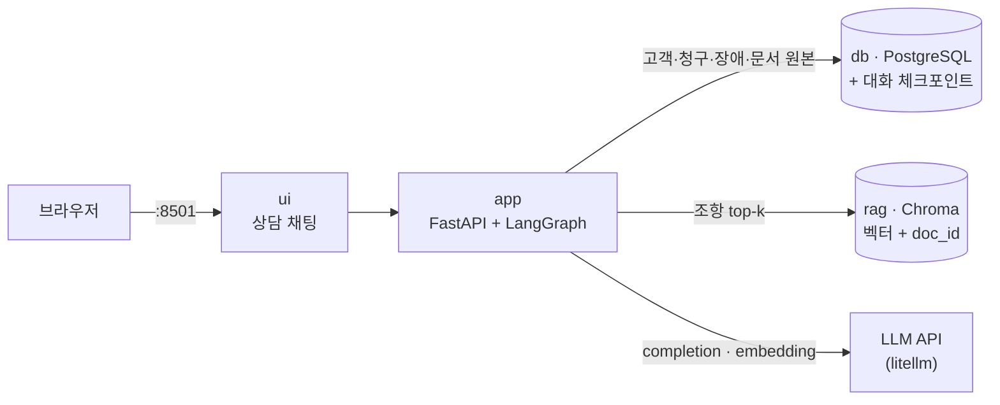
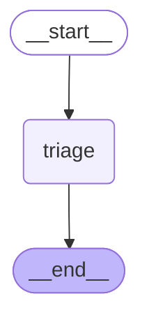
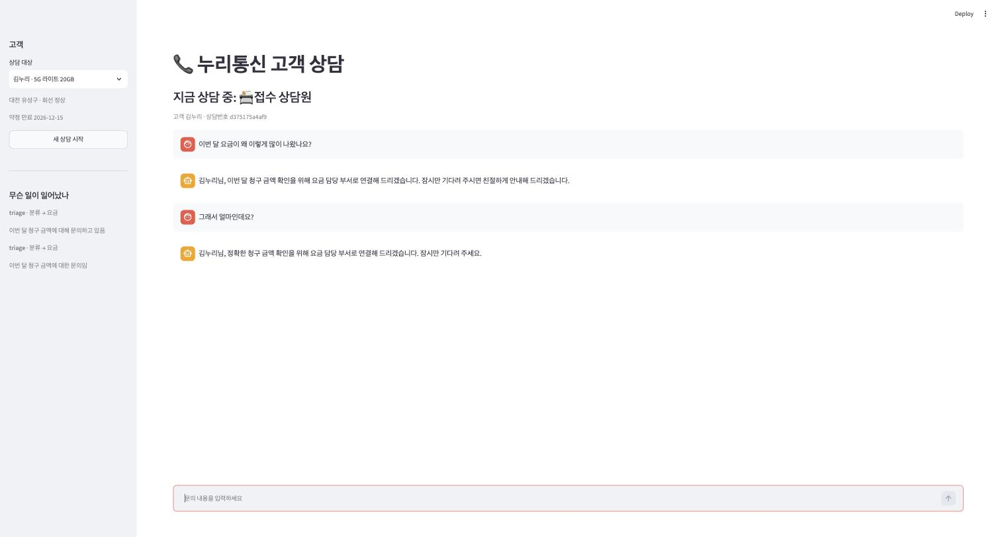
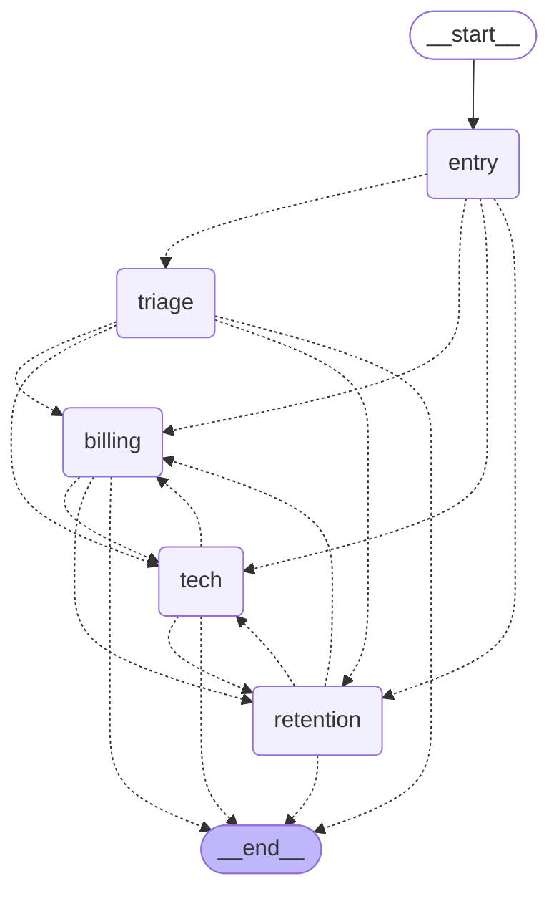
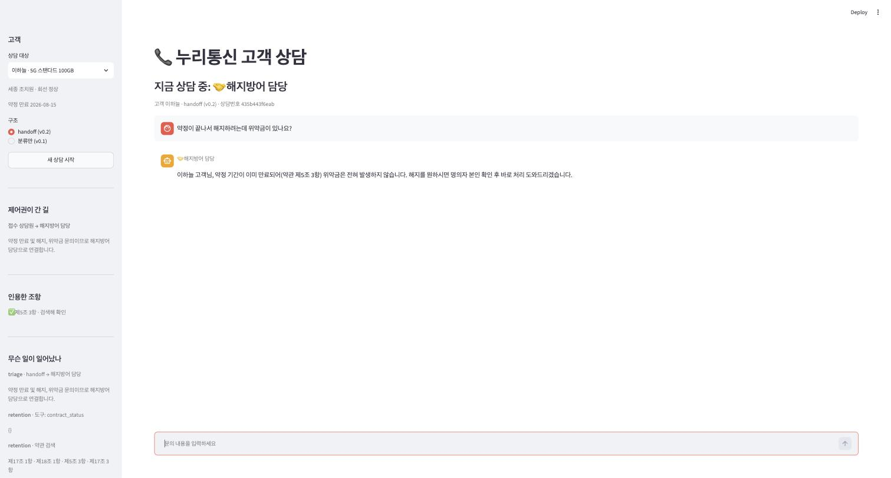

import Slide from 'stack-site-builder/components/Slide.astro';
import HandoffRules from '../../../../components/HandoffRules.astro';

<Slide class="cover">

# AI Agent 실전

Day 3 · 3. support-agent: handoff 패턴

*CodeCompose · 2026*

</Slide>

<Slide>

## 이 세션이 하는 일
::sub[supervisor에서는 모든 왕복이 중앙으로 돌아왔습니다. 여기서는 돌아오지 않습니다]

- **제품**: 가상 통신사 누리통신의 고객 상담 채팅.
  접수 상담원이 문의를 받아 요금·기술지원·해지방어 담당에게 넘깁니다.
- **제어권을 넘긴다**는 것이 코드에서 무엇인지 봅니다.
- 넘긴 뒤 무엇이 망가지는지, 그 자유를 어디까지 규칙으로 묶어야 하는지
  실측으로 확인합니다.

</Slide>

<Slide class="center">

## 핵심 문장

**넘길 자유가 크다는 것은**

**잘못 넘길 자유도 크다는 뜻이다**.

</Slide>

<Slide>

## 오늘의 순서

1. 앞 세션과 무엇이 다른가
2. 데이터: 상담이 성립하려면 사연이 있어야 한다
3. v0.1 · 말만 하는 분류
4. v0.2 · 제어권이 실제로 넘어간다
5. v0.3 · 넘길 자유가 크면 잘못 넘길 자유도 크다
6. v1.0 · RAG가 부품이 된다

</Slide>

<Slide>

## 시작하기

```bash
git clone https://github.com/2026-ai-agents/support-agent.git
cd support-agent
cp .env.sample .env        # 키 채우기
docker compose up --build
```

- ui → `http://localhost:8501` (상담 채팅)
- 색인은 `build_index.py` 한 번으로 만듭니다.

</Slide>

<Slide>

## 릴리즈 사다리

| 릴리즈 | 무엇이 생기나 |
| --- | --- |
| v0.1 | 분류만. 말은 하는데 아무도 움직이지 않는다 |
| v0.2 | handoff: 제어권이 실제로 넘어간다 |
| v0.3 | 라우팅 기준 셋을 코드로 |
| v1.0 | RAG 재사용과 인용 검증 |

</Slide>

<Slide class="center">

## Part 1. 앞 세션과 무엇이 다른가

</Slide>

<Slide>

## 돌아오지 않습니다

| | energy-agent (supervisor) | support-agent (handoff) |
| --- | --- | --- |
| 제어권 | 늘 중앙으로 복귀 | 넘어간 곳에 남는다 |
| 넘기는 것 | 요약(findings) | 대화 전체 |
| 다음 턴 | 다시 supervisor부터 | 담당이 바로 받는다 |
| 중앙의 역할 | 매 왕복을 조율 | 첫 배분 이후 사라진다 |
| 새 실패 모드 | 라우팅 실수 | 잘못 넘긴 뒤 돌아올 길이 없음 |

**이 한 줄의 차이가 코드와 상태와 실패 모드를 모두 바꿉니다.**

</Slide>

<Slide class="center">

## 이 한 줄의 차이가

## 코드와 상태와 실패 모드를 모두 바꿉니다

"돌아오지 않는다"는 말이 무엇을 바꾸는지

세 단에 걸쳐 확인합니다.

</Slide>

<Slide>

## 컨테이너 넷



</Slide>

<Slide class="center">

## rag 컨테이너가 그대로 돌아왔습니다

다른 점은 **쓰임새**입니다.

food-rag-agent에서 검색은 **제품 자체**였고,
여기서는 **담당 하나가 쓰는 도구**입니다.

</Slide>

<Slide class="center">

## Part 2. 데이터

상담이 성립하려면 사연이 있어야 한다.

</Slide>

<Slide>

## 고객 넷이 각자 다른 문의를 들고 옵니다

| 고객 | 사연 | 어디로 갈 문의인가 |
| --- | --- | --- |
| 김누리 | 20GB 요금제에 데이터 초과 6GB + 로밍 38,500원 | 요금 |
| 박서준 | 어제 대전 서구 인터넷 4시간 장애 | 기술지원 |
| 이하늘 | 약정이 이번 달 만료, 떠나려 한다 | 해지방어 |
| 최민수 | 요금도 늘었고 인터넷도 끊겼다 | 복합 (v0.3) |

</Slide>

<Slide>

## 네 담당

- **접수(triage)**: 듣고 넘긴다. 조회 도구가 없다.
- **요금(billing)**: 청구 조회 + 약관 검색
- **기술지원(tech)**: 장애 조회
- **해지방어(retention)**: 약정 조회 + 약관 검색

</Slide>

<Slide>

## 문서 50건은 강의용으로 지어낸 것입니다

- 중요한 것은 문장이 그럴듯한지가 아닙니다.
- **조항 번호로 가리킬 수 있는 단위로 쪼개져 있는지**입니다.
- v1.0의 인용 검증이 **이 구조 위에서만** 성립합니다.

</Slide>

<Slide class="center">

## 조항 번호로 가리킬 수 있어야

## 검증할 수 있습니다

"약관에 그렇게 되어 있습니다"는 검사할 방법이 없습니다.

</Slide>

<Slide class="center">

## Part 3. v0.1 · 말만 하는 분류

</Slide>

<Slide>

## 접수 상담원 하나

- 문의를 듣고 어디로 보낼지 정합니다.
- "요금 담당으로 연결해 드리겠습니다"라고 말합니다.
- 그리고 **아무 일도 일어나지 않습니다**.

</Slide>

<Slide>

## 그래프는 노드 하나



</Slide>

<Slide>

## 무엇을 볼 것인가

트레이스의 `handled_by` 한 칸입니다.

**세 턴 내내 같은 값이면 아무 일도 일어나지 않은 것**입니다.

</Slide>

<Slide>

## 세 턴 내내 담당이 변하지 않습니다

```text
[김누리] 이번 달 요금이 왜 이렇게 많이 나왔나요?
    분류: 요금 · 담당: triage
[김누리] 그래서 얼마인데요?
    분류: 요금 · 담당: triage
[김누리] 언제 고쳐지나요?
    분류: 불명 · 담당: triage
```

접수 상담원에게는 **조회 도구가 없으므로**
금액도 원인도 말할 수 없고, 그래서 같은 약속만 반복합니다.

</Slide>

<Slide>

## v0.1 화면



</Slide>

<Slide class="center">

## 분류는 판단이고

## 판단만으로는 아무도 움직이지 않습니다

이것이 v0.2와 비교할 기준점입니다.

</Slide>

<Slide>

## v0.2에서 붙는 것

- `entry` 노드: 이미 담당이 있으면 접수를 건너뜁니다.
- 담당 셋: 요금 · 기술지원 · 해지방어
- 이양 도구 셋: `transfer_to_*`

</Slide>

<Slide class="center">

## Part 4. v0.2 · 제어권이 실제로 넘어간다

</Slide>

<Slide>

## 되돌아오는 화살표가 없습니다



</Slide>

<Slide class="center">

## supervisor 그림과 나란히 놓고 보십시오

거기서는 화살표가 전부 중앙으로 되돌아왔습니다.

여기에는 되돌아오는 화살표가 없습니다.  
대신 **담당끼리 옆으로 잇는** 화살표가 있습니다.

</Slide>

<Slide>

## 먼저: `Command`가 무엇인가

- Day 2부터 지금까지 노드는 **상태 조각**을 돌려주었습니다.
- 어디로 갈지는 **미리 그려 둔 엣지**가 정했습니다.
- supervisor 구조에서도 그랬습니다.
  `route` 값을 상태에 넣으면 조건부 엣지가 그 값을 읽어 옮겼습니다.

</Slide>

<Slide class="center">

## 지금까지 이동을 정한 것은 그래프였습니다

노드는 상태 조각만 돌려주었고,

**어디로 갈지는 엣지가 읽었습니다.**

</Slide>

<Slide>

## `Command`는 그 둘을 하나로 합칩니다

```python
# 지금까지: 상태만 돌려주고, 이동은 엣지가 정한다
def supervisor(state):
    return {"route": "analyst"}          # 엣지가 이 값을 읽는다

# Command: 상태 갱신과 이동을 한 번에 돌려준다
def triage(state):
    return Command(goto="billing",       # 다음은 요금 담당
                   update={"current_agent": "billing"})   # 상태는 이렇게 바꾼다
```

</Slide>

<Slide>

## 조건부 엣지와 무엇이 다른가

| | 조건부 엣지 | `Command` |
| --- | --- | --- |
| 이동을 정하는 곳 | 그래프(엣지 함수) | 노드 자신 |
| 상태 갱신과의 관계 | 두 단계로 나뉜다 | 한 번에 |
| 어울리는 구조 | 중앙이 다음을 정하는 supervisor | 각자가 다음을 정하는 handoff |

</Slide>

<Slide class="center">

## handoff에 Command가 맞는 이유는

## 구조가 그렇게 생겼기 때문입니다

요금 담당이 해지방어에게 넘길 때,
그 결정을 아는 것은 **요금 담당뿐**입니다.

중앙에 물어보고 옮기는 것이 아니라 **자기가 옮깁니다**.

</Slide>

<Slide>

## 부작용 하나: 그래프만 봐서는 화살표를 못 그린다

```python
graph.add_node("triage", triage, destinations=("billing", "tech", "retention", END))
```

- 이동을 노드가 정하므로 갈 수 있는 곳을 **미리 적어 둡니다**.
- 실행에는 영향이 없고 **그림에만 영향이 있습니다**.
- 이 저장소에서 그림은 설명의 절반이므로 적어 둘 값어치가 있습니다.

</Slide>

<Slide class="center">

## 넘긴다는 것은 세 가지가 함께 일어나는 일입니다

하나만 빠져도 handoff가 되지 않습니다.

</Slide>

<Slide>

## 세 가지가 이 구조를 만듭니다

- **① 넘기는 행위가 도구다**.
- **② 넘어가는 것은 대화 전체다**.
- **③ 담당이 체크포인터에 남는다**.

</Slide>

<Slide>

## ① 넘기는 행위가 도구다

```python
if called in HANDOFF_TARGETS:              # 여기서 제어권이 넘어간다
    target = HANDOFF_TARGETS[called]
    return Command(goto=target, update={
        "current_agent": target,
        "handoffs": [{"from": name, "to": target, "reason": reason}],
        "came_from": name,
    })
```

모델이 `transfer_to_billing`을 부르면 코드가 그것을 **이동으로 바꿉니다**.
인자는 이유 한 줄뿐입니다.

</Slide>

<Slide>

## 인자는 이유 한 줄뿐입니다

- `transfer_to_billing(reason="요금 과다 청구 문의")`
- 모델이 정하는 것은 **어디로, 왜**입니다.
- 나머지(상태 갱신, 기록, 이동)는 **코드의 일**입니다.

</Slide>

<Slide>

## ② 넘어가는 것은 대화 전체다

- supervisor 구조에서는 하위 에이전트가 **요약만** 위로 올렸고,
  원자료는 상태에 남았습니다.
- 여기서는 반대입니다. **받는 쪽이 고객의 말을 직접 읽습니다**.
- **요약하는 사람이 중간에 없기 때문**입니다.

</Slide>

<Slide>

## ③ 담당이 체크포인터에 남는다

```python
def entry(state):
    current = state.get("current_agent") or ""
    if current in ("billing", "tech", "retention"):
        return Command(goto=current)      # 접수를 거치지 않는다
    return Command(goto="triage")
```

이것이 없으면 handoff가 아니라 **한 번의 우회**일 뿐입니다.

</Slide>

<Slide class="center">

## 셋이 갖춰지면 무엇이 달라지는가

같은 세 마디 대화를 v0.1과 v0.2에 던져 봅니다.

</Slide>

<Slide>

## 실측: 같은 대화, 두 구조

```text
=== v0.1 분류만 ===
[고객] 이번 달 요금이 왜…      받은 사람: 접수 상담원
[고객] 그래서 얼마나…          받은 사람: 접수 상담원
[고객] 그냥 해지할래요.        받은 사람: 접수 상담원

=== v0.2 handoff ===
[고객] 이번 달 요금이 왜…      받은 사람: 요금 담당
[고객] 그래서 얼마나…          받은 사람: 요금 담당
[고객] 그냥 해지할래요.        받은 사람: 해지방어 담당

이양 기록
    접수 상담원 → 요금 담당 (요금 과다 청구 및 납부 관련 문의)
    요금 담당 → 해지방어 담당 (고객이 해지를 요청하여 이관)
```

</Slide>

<Slide>

## 두 마디를 보십시오

- **두 번째 마디**에서 접수를 다시 거치지 않은 것이 **체크포인터의 몫**입니다.
- **세 번째 마디**에서 요금 담당이 해지방어에게 **직접** 넘긴 것이
  **handoff의 몫**입니다.

</Slide>

<Slide>

## 함정: 매 턴 상태를 통째로 보내면 이양이 지워진다

- 개발 중에 실제로 겪은 것입니다.
- 두 번째 턴에도 습관처럼 `current_agent: ""`를 함께 보냈습니다.
  - 체크포인터에 남아 있던 담당을 **덮어썼습니다**.
  - 매 턴 접수부터 다시 시작했습니다.
- 화면상으로는 잘 도는 것처럼 보였고, **트레이스를 세어야 보였습니다**.

</Slide>

<Slide>

## 이어지는 턴이 들고 오는 것

```python
def new_turn(customer_id, customer_name, message):
    """이어지는 턴이 들고 오는 것은 고객이 방금 한 말뿐이다."""
    return {"messages": [{"role": "user", "content": message}],
            "customer_id": customer_id, "customer_name": customer_name,
            "turn_handoffs": 0, "came_from": ""}
```

**상태에 남겨야 할 것과 매 턴 새로 보낼 것을 나누는 일**이
handoff 구조에서는 설계의 일부입니다.

</Slide>

<Slide>

## 상태에 남길 것과 매 턴 보낼 것

| | 상태에 남긴다 | 매 턴 새로 보낸다 |
| --- | --- | --- |
| `current_agent` | 지금 담당이 누구인가 | |
| `messages` | 대화 전체 | 고객이 방금 한 말 |
| `turn_handoffs` | | 이번 턴의 이양 횟수 |
| `came_from` | | 방금 누가 넘겼는가 |

**이 표를 잘못 그리면 이양이 매 턴 지워집니다.**

</Slide>

<Slide class="center">

## Part 5. v0.3 · 넘길 자유가 크면

## 잘못 넘길 자유도 크다

</Slide>

<Slide class="center">

## 자유롭게 두면 무슨 일이 나는가

v0.2를 그대로 두고 **세 종류의 문의**를 각각 3회씩 던집니다.

복합 문의, 이어지는 불만, 분류 불가.

</Slide>

<Slide>

## 같은 문의를 3회씩 던져 세어 봤습니다

```text
=== ① 규칙 없이 (v0.2) ===

[복합 문의] 요금도 이상하고 인터넷도 안 돼요.
    이양 0회 · 말로만 넘김 2/3 · 되물음 1/3

[이어지는 불만] 너무 비싸네요. 그냥 해지할래요.
    이양 2~4회 · 핑퐁 1/3 · 경로 2종
    경로: 접수 → 요금 → 해지방어 → 요금 → 해지방어
    경로: 접수 → 요금 → 해지방어

[분류 불가] 저기요, 좀 답답해서 전화드렸어요.
    이양 0회 · 말로만 넘김 3/3
```

</Slide>

<Slide class="center">

## 셋 다 답변만 봐서는 보이지 않습니다

트레이스의 **이양 기록**을 세어야 나타납니다.

</Slide>

<Slide>

## 세 가지가 나왔습니다

- **말로만 넘김**
  - 접수가 도구를 부르지 않고 "연결해 드리겠습니다"라고만 합니다.
  - v0.1로 되돌아간 셈인데, **답변만 보면 알 수 없습니다**.
- **핑퐁**
  - 넘겨받은 담당이 "이건 저쪽 일"이라며 도로 넘깁니다.
  - 한 턴 이양 상한이 막아 주지 않았다면 계속 돌았을 것입니다.
- **경로 흔들림**
  - 같은 문의인데 실행마다 다른 길로 갑니다.

</Slide>

<Slide>

## 핑퐁이 화면에 남은 모습


</Slide>

<Slide>

## 세 문제를 세 규칙으로

| 문제 | 규칙 |
| --- | --- |
| 말로만 넘김 | 접수의 출력은 언제나 도구 호출 |
| 핑퐁 | 방금 넘겨준 곳으로 되돌리지 않는다 |
| 복합 문의 | 두 갈래가 섞이면 넘기지 않고 되묻는다 |

</Slide>

<Slide>

## 기준 셋을 코드로

```python
def _routing_plan(state, name):
    # ② 방금 넘겨준 곳으로 되돌리지 않는다
    back = transfer_tool_of(state.get("came_from"))
    if back in allowed:
        allowed.remove(back)

    # ③ 두 갈래가 섞여 들어오면 접수는 넘기지 않고 되묻는다
    if name == "triage" and len(topics_in(last_user_message)) >= 2:
        return [], True, "규칙: 문의가 둘 이상이라 되묻는다"

    # ① 접수의 출력은 언제나 도구 호출이다
    return allowed, name == "triage", note
```

energy-agent에서 배운 것과 같은 방식입니다.  
프롬프트로 타이르지 않고, **판단이 필요 없는 자리를 코드가 가져옵니다**.

</Slide>

<Slide class="center">

## 프롬프트로 타이르지 않습니다

energy-agent에서 배운 것과 같은 방식입니다.

**판단이 필요 없는 자리를 코드가 가져옵니다.**

</Slide>

<Slide>

## `tool_choice`: 쥐어주는 것과 쓰게 하는 것은 다르다

- ①의 "말로만 넘김"은 **도구를 안 준** 문제가 아닙니다.
- **줬는데 안 쓴** 문제입니다.
- 도구 목록을 넘길 때 모델이 그것을 어떻게 대할지는 **인자 하나**로 정해집니다.

</Slide>

<Slide class="center">

## 도구를 준다고 쓰는 것이 아닙니다

`tool_choice` 인자 하나가

**쥐어주는 것과 쓰게 하는 것**을 가릅니다.

</Slide>

<Slide>

## 세 값

| `tool_choice` | 뜻 | 여기서 |
| --- | --- | --- |
| `"auto"` (기본) | 쓸지 말지 모델이 정한다 | 전문 담당. 답하는 것이 일이므로 강제하지 않는다 |
| `"required"` | 반드시 하나는 부른다 | 접수 상담원. 넘기거나 되묻거나 둘 중 하나 |
| `"none"` | 부르지 못한다 | 쓰지 않음 |

</Slide>

<Slide>

## 강제만으로는 부족합니다

- 접수에 `required`를 걸면 "말로 얼버무리기"가 **문법적으로 불가능**해집니다.
- 다만 넘길 곳이 없는데 반드시 부르라고 하면 **아무 데나 넘기게** 됩니다.
- 그래서 **"판단이 안 선다"에도 갈 곳**을 만들어 줘야 합니다.
  그것이 `ask_clarification` 도구입니다.

</Slide>

<Slide>

## 넘기거나, 되묻거나

```python
schemas = handoff_schemas(allowed) + [ASK_TOOL]          # 넘기거나, 되묻거나
completion(..., tools=schemas, tool_choice="required")   # 둘 중 하나는 반드시
```

</Slide>

<Slide class="center">

## 강제하기 전에 도망갈 문을 만들어 두는 것

강제만 하면 모델은 **가장 그럴듯한 거짓말**을 고릅니다.

</Slide>

<Slide>

## 규칙이 막는 것과 여는 것

- **막는다**: 되돌아가는 길, 말로만 넘기기
- **연다**: 되묻기라는 제3의 선택지

강제와 도피처는 **짝**으로 옵니다.

</Slide>

<Slide>

## 기준을 세운 뒤

```text
=== ② 기준을 세우고 (v0.3) ===

[복합 문의]      이양 0회 · 되물음 3/3
[이어지는 불만]  이양 2회 고정 · 문제 없음 · 경로 1종
[분류 불가]      이양 0회 · 되물음 3/3
```

</Slide>

<Slide class="center">

## 모델이 더 똑똑해진 것이 아닙니다

되묻기는 원래 좋은 상담원이 하는 일이고,

그것을 **규칙이 보장한 것**입니다.

</Slide>

<Slide>

## 직접 만져 보기: 규칙은 무엇을 닫는가

<HandoffRules />

</Slide>

<Slide>

## 규칙은 고르지 않고 좁힙니다

- "요금도 이상하고 인터넷도 안 돼요"를 접수에게 주면
  **넘길 곳이 전부 닫히고 되묻기만** 남습니다.
- 요금 담당이 넘긴 상태에서 해지방어를 골라 보면
  **요금 담당으로 되돌아가는 길이 막혀** 있습니다.

</Slide>

<Slide class="center">

## 규칙이 늘어난 만큼 자유는 줄었습니다

그 대가로 얻은 것은 **경로 1종**입니다.

디버깅할 수 있는 시스템은 그때부터 시작합니다.

</Slide>

<Slide class="center">

## Part 6. v1.0 · RAG가 부품이 된다

</Slide>

<Slide class="center">

## 도구를 나누는 것이 곧 경계입니다

기술지원 담당은 약관을 검색할 수 없습니다.

**볼 수 없는 도구는 잘못 부를 수도 없습니다.**

</Slide>

<Slide>

## 두 담당에게만 약관 검색을 줍니다

- **요금 담당**과 **해지방어 담당**에게 약관 검색 도구를 줍니다.
- **기술지원 담당에게는 주지 않습니다**.
- Day 2에서 **제품이었던 것**이 여기서는 두 담당이 나눠 쓰는 **부품**입니다.

</Slide>

<Slide>

## 원본 한 벌 규율은 그대로입니다

- 본문은 PostgreSQL의 `documents` 표에만 있습니다.
- Chroma에는 벡터와 `doc_id`만 둡니다.
- 색인이 통째로 날아가도 `build_index.py` 한 번이면 복구됩니다.

</Slide>

<Slide>

## 두 담당이 나눠 쓰는 부품

- Day 2에서 rag는 **제품 자체**였습니다.
- 여기서는 요금·해지방어 담당이 **필요할 때 부르는 도구**입니다.
- 같은 부품이 문제에 따라 다른 자리에 놓입니다.

</Slide>

<Slide>

## 실측: 조항을 찾아 인용한다

```text
[김누리] 데이터 초과 요금은 어떻게 계산되나요? 근거 조항도 알려주세요.
    받은 사람: 요금 담당
    검색: 제9조 2항 · 정책 D-1 · 제9조 3항 · 제7조 4항
    답변: 제9조 2항에 따르면, 기본 제공 데이터를 모두 사용한 이후의 사용량에는
          요금제별 초과 요율이 적용됩니다…
    인용: 제9조 2항 — 확인

[이하늘] 약정이 끝났는데 지금 해지하면 위약금이 있나요?
    받은 사람: 해지방어 담당
    검색: 제5조 3항 · 제18조 1항 · 제5조 1항 · 제17조 3항
    인용: 제5조 3항 — 확인
```

</Slide>

<Slide>

## 검색과 인용은 다른 일입니다

- **검색**: 이번 턴에 rag에서 무엇을 꺼냈는가
- **인용**: 답변 문장이 무엇을 가리켰는가

이 둘을 **대조**하는 것이 검증입니다.

</Slide>

<Slide>

## 인용마다 두 가지를 따로 봅니다

- **존재**: 그 조항이 실제로 있는가. 없으면 지어낸 것입니다.
- **근거**: 이번 턴에 실제로 검색한 조항인가. 아니면 기억으로 말한 것입니다.

</Slide>

<Slide class="center">

## 두 번째가 더 미묘합니다

존재하는 조항을 인용했더라도 찾아보지 않고 말했다면,

**맞은 것은 우연입니다.**

</Slide>

<Slide>

## 없는 조항은 걸립니다

```text
답변(가정): 제9조 2항과 제99조 3항에 따라 초과 요금이 산정됩니다.
판정: 인용 2건 · 없는 조항 제99조 3항
```

</Slide>

<Slide>

## 검증자는 문장을 읽지 않습니다

- **번호만 봅니다**.
- 그래서 결정적이고,
  "약관에 그렇게 되어 있습니다" 같은 문장은 **검사 대상조차 되지 않습니다**.
- **인용을 번호로 하게 만드는 것이 검증의 전제**입니다.

food-rag-agent의 결정적 검증자와 같은 자리, 같은 이유입니다.

</Slide>

<Slide>

## 검증까지 화면에



</Slide>

<Slide>

## 검증이 잡는 것과 못 잡는 것

- **잡는다**: 없는 조항 번호, 검색하지 않고 말한 번호
- **못 잡는다**: 조항은 맞는데 **해석이 틀린 경우**

번호 검증은 **거짓의 하한선**을 긋는 장치이지
정답을 보증하는 장치가 아닙니다.

</Slide>

<Slide class="center">

## 두 패턴을 언제 고르는가

</Slide>

<Slide>

## 문제의 모양이 구조를 정합니다

| | supervisor가 어울리는 문제 | handoff가 어울리는 문제 |
| --- | --- | --- |
| 일의 성격 | 여러 결과를 모아 하나를 만든다 | 한 사람이 끝까지 맡는 것이 자연스럽다 |
| 대화 | 한 번의 요청과 한 번의 답 | 여러 턴이 이어진다 |
| 문맥 | 요약해도 되는 것 | 원문이 필요한 것 |
| 비용 | 왕복마다 중앙 호출이 붙는다 | 넘길 때만 붙는다 |
| 위험 | 중앙이 병목이자 단일 실패점 | 잘못 넘기면 돌아올 길이 없다 |

</Slide>

<Slide class="center">

## 구조가 문제를 따라간 것이지

## 그 반대가 아닙니다

energy-agent는 분석·시각화·상담을 **모아 한 답을 만드는** 일이었고,

support-agent는 **상담원이 바뀌는** 일입니다.

</Slide>

<Slide class="center">

## handoff의 자유는 규칙으로 좁혀야 쓸 수 있습니다

넘길 곳이 넷이면 잘못 넘길 곳도 넷입니다.

</Slide>

<Slide>

## 이 세션이 남기는 것

| 물음 | 이 저장소의 답 |
| --- | --- |
| 넘긴다는 것은 코드로 무엇인가 | 도구 호출을 `Command(goto=…)`로 바꾸는 것 |
| 무엇이 함께 넘어가는가 | 대화 전체. 요약하는 사람이 중간에 없다 |
| 넘어간 뒤 다음 턴은 | 담당이 바로 받는다. 담당은 체크포인터에 남는다 |
| 무엇이 망가지는가 | 말로만 넘김, 핑퐁, 경로 흔들림 |
| 무엇을 규칙으로 묶는가 | 반드시 도구로, 되돌리지 않기, 섞이면 되묻기 |
| RAG는 어디에 있는가 | 두 담당이 나눠 쓰는 부품. 인용은 번호로, 검증은 코드로 |

</Slide>

<Slide class="center">

## 다음 세션

**coding-agent: 병렬 코딩 에이전트**

역할을 **사람이 미리 정하지 않는** 구조,
그리고 3일의 종합

</Slide>
