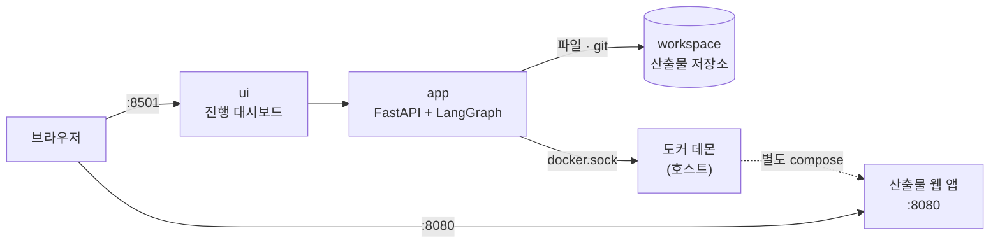
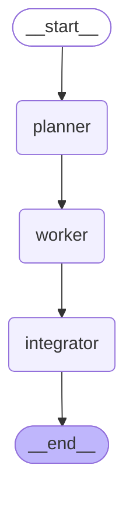
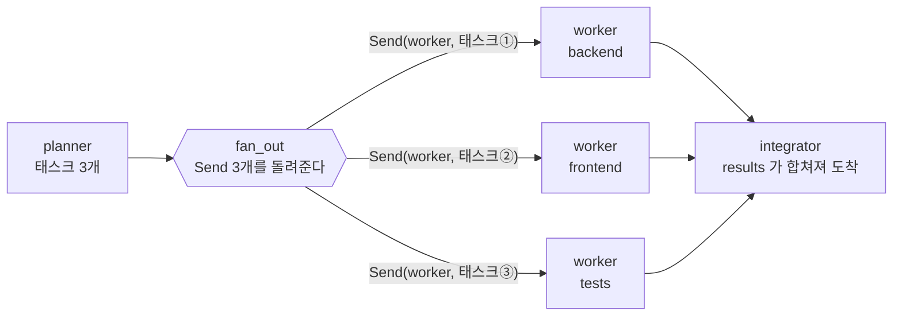
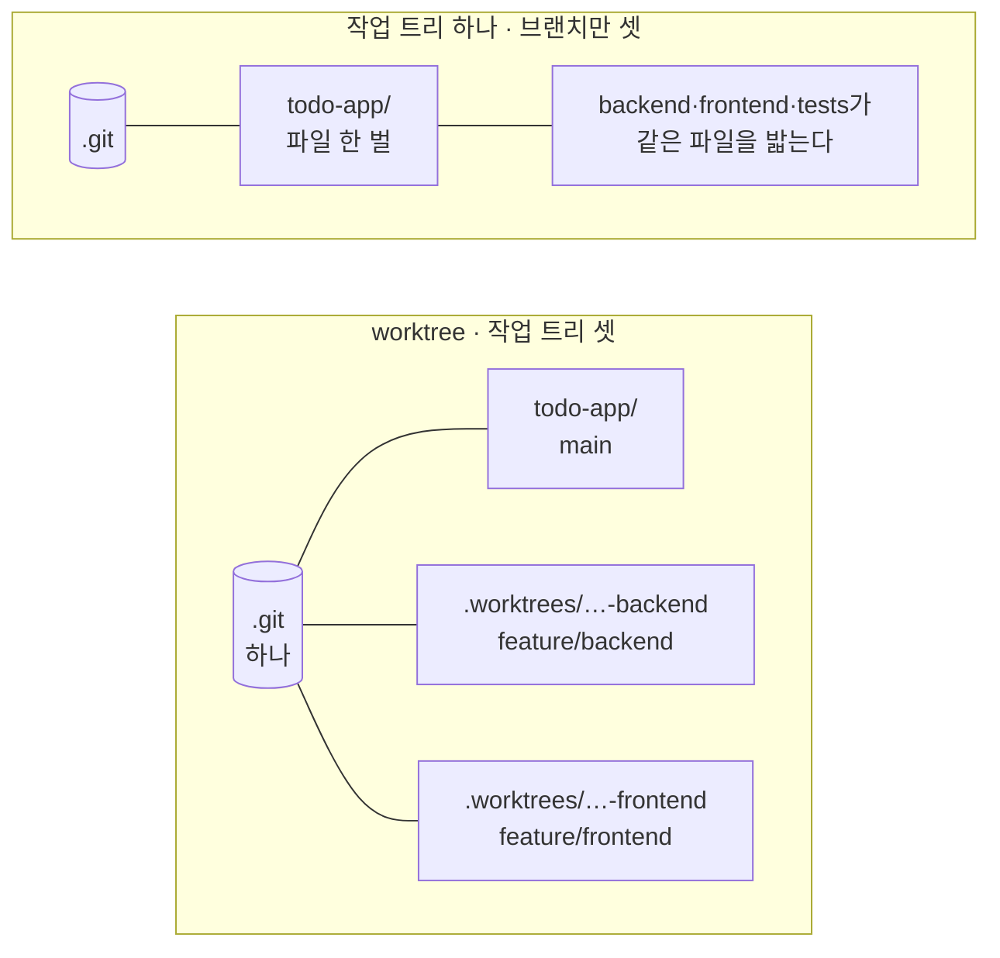
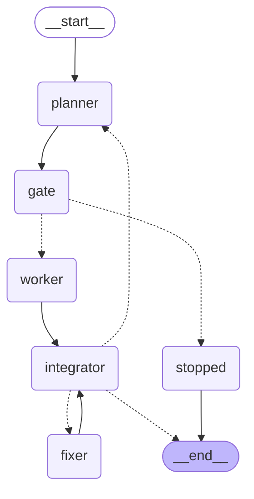

import Slide from 'stack-site-builder/components/Slide.astro';
import CostGate from '../../../../components/CostGate.astro';

<Slide class="cover">

# AI Agent 실전

Day 3 · 4. coding-agent: 병렬 코딩 에이전트

*CodeCompose · 2026*

</Slide>

<Slide>

## 이 세션이 하는 일
::sub[3일 동안 배운 것이 전부 이 안에 있습니다]

- **제품**: `SPEC.md`를 주면 코드를 짜서 돌려주는 에이전트
  - 태스크로 쪼개고
  - 각자의 브랜치에서 코드를 짜고
  - 머지해서 테스트하고, 도커로 띄웁니다.
- 마지막에는 **에이전트가 만든 웹 앱이 브라우저에서 돕니다**.

</Slide>

<Slide class="center">

## 핵심 문장

**병렬화는 모델의 문제가 아니라 작업 공간의 문제다**.

</Slide>

<Slide>

## 이 세션은 새 개념을 얹는 자리가 아닙니다

| 어디서 왔나 | 여기서 무엇이 되었나 |
| --- | --- |
| Day 1 도구 루프 | `write_file` 하나. "에이전트가 코드를 짠다"의 실체 |
| Day 1 하네스 | 스텝·수정·재계획 한도. 폭주하지 않는 이유 |
| Day 1 Plan-and-Execute | planner가 SPEC을 세 태스크로 쪼갠다 |
| Day 1 Reflexion | 빌드 실패 로그를 fixer에게 되먹인다 |
| Day 2 interrupt | 비용 상한을 넘으면 사람 앞에 선다 |
| Day 2 비용 사다리 | 난이도가 hard면 상위 모델, easy면 저가 모델 |
| Day 3 병렬 실행 | Send로 셋을 동시에, worktree로 격리 |

**배운 것들이 각자의 자리를 찾는 자리입니다.**

</Slide>

<Slide class="center">

## 이 저장소는 두 개의 제품을 만듭니다

**에이전트**와, 그 에이전트가 **만든 앱**.

둘은 서로 다른 compose로 뜹니다.

</Slide>

<Slide>

## 오늘의 순서

1. 만드는 것과 만들어진 것
2. 경계를 먼저 긋는다
3. v0.1 · 한 사람이 하나씩
4. v0.2 · Send와 worktree
5. v0.3 · 값을 먼저 묻는 문
6. v0.4 · 실패한 뒤가 진짜 일이다
7. v1.0 · 전체 실행

</Slide>

<Slide>

## 시작하기

```bash
git clone https://github.com/2026-ai-agents/coding-agent.git
cd coding-agent
cp .env.sample .env        # 키 채우기
docker compose up --build
```

- ui → `http://localhost:8501` (진행 대시보드)
- 산출물 → `http://localhost:8080` (에이전트가 만든 앱)

</Slide>

<Slide>

## 릴리즈 사다리는 다섯 단

| 릴리즈 | 무엇이 생기나 |
| --- | --- |
| v0.1 | 순차 실행. 비교 기준점 |
| v0.2 | Send + worktree로 병렬 |
| v0.3 | 비용 게이트와 난이도별 모델 배정 |
| v0.4 | 복구 루프: 되먹임과 재계획 |
| v1.0 | 대시보드 완성 |

</Slide>

<Slide class="center">

## Part 1. 만드는 것과 만들어진 것

</Slide>

<Slide>

### 산출물은 별도 compose로 뜹니다



</Slide>

<Slide class="center">

### 만드는 것과 만들어진 것을 섞지 않는 것

이 저장소의 첫 규율입니다.

대시보드가 죽어도 산출물은 돌고,
산출물을 내려도 대시보드는 남습니다.

</Slide>

<Slide>

### 도커 소켓을 빌려 쓸 때의 함정

- 컨테이너 안에서 도커를 부르려면 **소켓을 빌려 씁니다**.
- **빌드 컨텍스트**는 CLI가 직접 읽어 데몬으로 흘려보내므로 **컨테이너 경로**
- 반대로 compose 안의 **bind mount**는 데몬이 호스트에서 해석하므로
  **호스트 경로**가 필요합니다.
- 그래서 산출물 compose에는 **bind mount를 넣지 않았습니다**.

</Slide>

<Slide class="center">

## Part 2. 경계를 먼저 긋는다

</Slide>

<Slide>

### SPEC 하나가 태스크 셋이 됩니다

- **backend**: FastAPI 서버와 메모리 스토어
- **frontend**: 싱글 페이지 웹 UI
- **tests**: API 통합 테스트

planner가 SPEC을 읽고 이렇게 쪼갭니다.

</Slide>

<Slide>

### 셋이 한 제품을 나눠 만들 때 흔한 사고는 둘

- 같은 파일을 **동시에 고치는 것**
- 서로 다른 **규약을 가정하는 것**

병렬로 짜기 **전에** 코드로 못 박습니다.

</Slide>

<Slide class="center">

### 병렬로 짜기 전에 코드로 못 박습니다

프롬프트로 "서로 겹치지 마세요"라고 부탁하지 않습니다.

</Slide>

<Slide>

### 누가 무엇을 쓰는가

| | 누가 쓰는가 | 왜 |
| --- | --- | --- |
| `app.py` | backend 에이전트 | 제품 코드 |
| `static/index.html` | frontend 에이전트 | 제품 코드 |
| `tests/test_api.py` | tests 에이전트 | 제품 코드 |
| `Dockerfile` · `docker-compose.yml` | 골격 | 매번 흔들릴 이유가 없다 |
| 브랜치 · 커밋 · 머지 · 빌드 | 하네스 | 모델이 git을 부를 이유가 없다 |

</Slide>

<Slide>

### 소유권 밖의 파일에 쓰려 하면 코드가 거부합니다

- 엔드포인트 규약은 **골격이 정해** 세 프롬프트에 그대로 실립니다.
- **인프라 파일을 LLM이 매번 쓰게 하지 않는 것**도 같은 이유입니다.
- 바뀔 이유가 없는 것을 바뀔 수 있게 두면 **실패만 늘어납니다**.

</Slide>

<Slide class="center">

### 바뀔 이유가 없는 것을

## 바뀔 수 있게 두지 않습니다

`Dockerfile`도 `docker-compose.yml`도 골격이 씁니다.

모델이 매번 다시 쓸 이유가 없습니다.

</Slide>

<Slide class="center">

## Part 3. v0.1 · 한 사람이 하나씩

</Slide>

<Slide>

### 일직선입니다



</Slide>

<Slide>

### 동작합니다

```text
역할        모델                                          구간
backend   gemini-3.5-flash-lite             2.0s →   3.9s  완료
frontend  gemini-3.5-flash-lite             3.9s →   8.6s  완료
tests     gemini-3.5-flash-lite             8.6s →  11.2s  완료

전체 13.4초 · LLM 4회 · 출력 3,191 토큰 · $0.0086
머지 True · 테스트 True · 기동 True
```

</Slide>

<Slide class="center">

### 그리고 구간이 겹치지 않습니다

셋은 서로의 결과를 기다릴 이유가 없는데도 **줄을 서 있습니다**.

</Slide>

<Slide>

### 무엇을 보고 순차라고 하는가

- 구간이 `2.0 → 3.9`, `3.9 → 8.6`, `8.6 → 11.2`
- **끝나는 시각과 시작하는 시각이 맞물려 있습니다**.
- 셋은 서로를 기다릴 이유가 없는데도 기다렸습니다.

</Slide>

<Slide>

### git 이력이 곧 작업 기록입니다

```text
*   bc66232 Merge branch 'feature/tests'
|\
| * 72643a0 tests: API 및 기능 통합 테스트 작성
* | dbe0c7d Merge branch 'feature/frontend'
|\|
| * d4575e5 frontend: 싱글 페이지 웹 인터페이스 구현
* | 1ba9447 Merge branch 'feature/backend'
|\|
| * 99b9124 backend: FastAPI 백엔드 및 메모리 스토어 구현
|/
* 3f010b2 Scaffold the product skeleton
```

누가 어느 가지에서 무엇을 했는지가 남습니다.

</Slide>

<Slide class="center">

## Part 4. v0.2 · Send와 worktree

바뀐 것은 두 줄입니다.

</Slide>

<Slide>

### 비교가 공정한 이유

- planner도, worker가 하는 일도, integrator도
  **v0.1의 것을 그대로 가져다 씁니다**.
- 그래서 시간 차이가 **병렬화만의 값**입니다.

</Slide>

<Slide class="center">

### 조건부 엣지를 한 번 더 봅니다

문자열 하나를 돌려주면 **한 곳으로** 갑니다.

`Send`의 리스트를 돌려주면 **여러 벌 동시에** 뜹니다.

같은 자리, 다른 반환값입니다.

</Slide>

<Slide>

### `Send`가 무엇인가

- 조건부 엣지는 지금까지 **문자열 하나**를 돌려주었습니다.
  "다음은 analyst"처럼 갈 곳 하나를 고르는 함수였습니다.
- 같은 자리에서 `Send`의 **리스트**를 돌려주면 뜻이 달라집니다.
- 같은 노드를 **여러 벌 동시에** 띄웁니다.

</Slide>

<Slide>

### fan_out이 놓이는 자리

- planner가 태스크 목록을 만듭니다.
- `fan_out`은 **조건부 엣지 자리**에 놓입니다.
- 문자열 대신 `Send` 리스트를 돌려줍니다.

</Slide>

<Slide>

### v0.2의 전부

```python
def fan_out(state):
    """여기가 v0.2의 전부다. 태스크마다 worker 하나씩."""
    return [Send("worker", {"task": task, "spec": state["spec"], "index": index})
            for index, task in enumerate(state["tasks"])]
```

`Send(노드_이름, 페이로드)`에서 페이로드는 **그 실행분의 입력**이 됩니다.  
worker가 받는 것은 전체 상태가 아니라 **자기 몫의 딕셔너리 하나**입니다.

</Slide>

<Slide>

### 셋으로 갈라지고, 하나로 모입니다



</Slide>

<Slide class="center">

### 돌아오는 길은 reducer가 맡습니다

세 worker가 각각 `{"results": [결과]}`를 돌려주면
`Annotated[list, operator.add]`가 하나로 합칩니다.

Day 2 첫 세션의 그 reducer입니다.  
**병렬의 절반은 reducer가 이미 하고 있었습니다.**

</Slide>

<Slide>

### 미리 엣지를 세 개 그리는 것과 무엇이 다른가

| | 미리 그린 병렬 엣지 | `Send` |
| --- | --- | --- |
| 개수 | 그래프를 짤 때 고정 | 실행 시점에 정해진다 |
| 각 실행의 입력 | 같은 상태 | 서로 다른 페이로드 |
| 어울리는 일 | 역할이 고정된 분업 | 목록을 훑는 일(map) |

SPEC이 태스크 다섯 개로 쪼개지면 worker도 다섯이 됩니다.  
**그래프를 다시 그리지 않습니다.**

</Slide>

<Slide class="center">

### 그리고 worktree

이것이 없으면 위의 한 줄은 **사고**입니다.

</Slide>

<Slide class="center">

### Send만으로는 사고입니다

셋이 동시에 뜨는 것까지는 됐는데,

**셋이 같은 디렉터리에 파일을 씁니다.**

</Slide>

<Slide>

### 브랜치와 작업 트리는 다른 것이다

- **브랜치는 이름표**이고, **작업 트리는 실제 파일이 놓인 디렉터리**입니다.
- 평소에는 저장소 하나에 작업 트리가 하나뿐이라 둘이 붙어 다니는 것처럼 보입니다.
- `git checkout`은 그 **하나뿐인 디렉터리의 파일을 통째로 갈아 끼우는** 명령입니다.

</Slide>

<Slide class="center">

### 셋이 동시에 checkout 하면

**마지막으로 실행한 것이 이깁니다.**

브랜치를 나눈 것과 무관하게 **파일은 한 벌뿐**이기 때문입니다.

</Slide>

<Slide>

### 작업 트리를 셋으로



</Slide>

<Slide>

### worktree를 쓰는 순서

1. `git worktree add -b feature/backend <경로> main`
2. 그 디렉터리에서 파일을 쓰고 커밋
3. `git worktree remove --force <경로>`

**디렉터리는 임시, 브랜치는 영구**입니다.

</Slide>

<Slide>

### 커밋 이력은 공유하고 파일만 따로 씁니다

```sh
git worktree add -b feature/backend /workspace/.worktrees/todo-app-backend main
# … 그 디렉터리에서 짜고 커밋 …
git worktree remove --force /workspace/.worktrees/todo-app-backend
```

일이 끝나면 **디렉터리는 치우고 브랜치는 남깁니다**.

</Slide>

<Slide>

### 코드에서는 이렇게 감쌉니다

```python
worktree = runner.project.add_worktree(task["role"], task["branch"])
try:
    result = work_on(runner, task, payload["spec"], task["model"], worktree)
finally:
    runner.project.remove_worktree(task["role"])   # 브랜치는 남고 디렉터리만 치운다
```

</Slide>

<Slide class="center">

### 병렬로 벌고 싶은 것은

## 모델이 파일을 쓰는 시간입니다

그것을 벌려면 **파일이 놓일 자리가 따로 있어야** 합니다.

git 명령 자체는 오히려 자물쇠로 줄을 세웠습니다.  
worktree 장부를 동시에 건드려서 얻을 것은 없기 때문입니다.

</Slide>

<Slide>

### worktree가 하는 일

- `.git`은 **하나**입니다. 커밋 이력을 공유합니다.
- 작업 디렉터리만 **셋**으로 늘립니다.
- 일이 끝나면 디렉터리는 치우고 **브랜치는 남깁니다**.

</Slide>

<Slide>

### 순차와 병렬

```text
=== v0.1 순차 ===
backend      2.0s →   3.9s          ██████
frontend     3.9s →   8.6s                ████████████████
tests        8.6s →  11.2s                                 █████████
전체 13.4초 · $0.0086 · 기동 True

=== v0.2 병렬 (Send + worktree) ===
backend      2.5s →   4.8s                 █████████████
frontend     2.5s →   6.7s                 █████████████████████████
tests        2.5s →   4.9s                 ██████████████
전체 8.8초 · $0.0085 · 기동 True
```

</Slide>

<Slide class="center">

### 시간은 줄고 비용은 그대로입니다

같은 일을 같은 모델로 하기 때문입니다.

**병렬화가 파는 물건은 시간 하나뿐이고,
그것을 정확히 아는 것이 중요합니다.**

</Slide>

<Slide>

### 병렬화가 못 파는 것

- **비용**: 같은 일을 같은 모델로 하므로 그대로입니다.
- **품질**: 셋이 동시에 짜도 각자의 결과는 같습니다.
- **정합성**: 오히려 어긋날 위험이 커집니다. v0.4의 주제입니다.

</Slide>

<Slide class="center">

## Part 5. v0.3 · 값을 먼저 묻는 문

</Slide>

<Slide>

### planner와 worker 사이에 문이 하나 생겼습니다



</Slide>

<Slide class="center">

### 비용은 실행 전에 묻습니다

다 쓰고 나서 알려주는 것은 청구서이지 게이트가 아닙니다.

</Slide>

<Slide>

### 문이 하는 일 셋

- 난이도에 따라 **모델을 배정**합니다.
- 예상 **비용을 계산**합니다.
- 상한을 넘으면 `interrupt`로 **사람에게 묻습니다**.

</Slide>

<Slide>

### 상한을 세 가지로 시험합니다

- 넉넉한 상한 → 묻지 않는다.
- 빠듯한 상한 + 승인 → 간다.
- 빠듯한 상한 + 중단 → 멈춘다.

</Slide>

<Slide>

### ① 상한이 넉넉하면 묻지 않습니다

```text
=== ① 상한 $0.05 — 넉넉하다 ===
    묻지 않고 끝까지 갔다 · 8.8초 · 실측 $0.0087
    추정 $0.0114 vs 실측 $0.0087
```

</Slide>

<Slide>

### ② 빠듯하면 묻고, 승인하면 갑니다

```text
=== ② 상한 $0.005 — 빠듯하다, 승인한다 ===
    backend   gemini-3.5-flash-lite   출력 1500 토큰  $0.0040
    frontend  gemini-3.5-flash-lite   출력 1800 토큰  $0.0047
    tests     gemini-3.5-flash-lite   출력 1000 토큰  $0.0027
    합계                                             $0.0114  (상한 $0.0050)
    사람이 승인한다 → 7.7초 · 실측 $0.0089
```

</Slide>

<Slide>

### ③ 중단하면 멈춥니다

```text
=== ③ 상한 $0.005 — 빠듯하다, 중단한다 ===
    비용 상한을 넘어 사용자가 중단했습니다
    실측 $0.0011 — planner 한 번뿐이다. worker는 돌지 않았다.
```

</Slide>

<Slide class="center">

### 세 번째가 이 기능의 값어치입니다

**거절할 수 있어야 문입니다.**

매번 묻는 문은 문이 아니고,
거절할 수 없는 물음은 물음이 아닙니다.

</Slide>

<Slide>

### 난이도가 모델을 정합니다

- planner가 태스크마다 **난이도를 판정**합니다.
- `hard`면 상위 모델, `easy`면 저가 모델
- Day 2 food-rag-agent의 **비용 사다리**가 여기서는
  "층"이 아니라 "태스크"에 적용됩니다.

</Slide>

<Slide>

### 추정은 일부러 거칩니다

- 역할별 **예상 출력 토큰에 가격표를 곱한 것**이 전부입니다.
- **자릿수만 맞으면** 상한은 제 일을 합니다.
- 화면에 추정과 실측을 나란히 두면 "얼마나 맞는지"까지 함께 배웁니다.

</Slide>

<Slide>

### 직접 만져 보기: 난이도가 비용을 가른다

<CostGate />

</Slide>

<Slide>

### backend 하나만 hard로 바꿔 보십시오

- 상위 모델이 배정되면서 추정이 **세 배 가까이 뜁니다**.
- **난이도 판정 한 번이 비용을 가르고, 그 판정을 planner가 합니다**.
- 게이트가 있어야 하는 이유가 여기 있습니다.

</Slide>

<Slide>

### 게이트 화면


</Slide>

<Slide class="center">

### 게이트는 돈만 쓰는 것이 아닙니다

시간도 씁니다.

**사람이 버튼을 누를 때까지 아무것도 돌지 않습니다.**

</Slide>

<Slide class="center">

## Part 6. v0.4 · 실패한 뒤가 진짜 일이다

</Slide>

<Slide>

### 셋이 따로 짜면 규약의 빈틈에서 어긋납니다

```text
FAILED tests/test_api.py::test_create_todo - assert 201 == 200
```

- backend는 생성에 **201**을 돌려주고 tests는 **200**을 기대했습니다.
- 규약이 상태 코드를 못 박지 않았기 때문입니다.
- **사람 팀에서도 똑같이 나는 사고입니다**.

</Slide>

<Slide class="center">

### 규약의 빈틈은 사람 팀에서도 납니다

201과 200. 상태 코드를 못 박지 않았기 때문입니다.

**에이전트가 특별히 못한 것이 아닙니다.**

</Slide>

<Slide>

### 세 단계로 대응합니다

- **고치기** (최대 2회)
  - integrator가 실패 로그를 fixer에게 되먹입니다.
  - fixer는 **한 번에 한 파일만** 다시 씁니다.
- **재계획** (최대 1회)
  - 실패 로그를 붙여 planner가 다시 계획합니다.
  - worker는 새 브랜치 `-r2`에서 짭니다.
- **포기**
  - 그다음은 멈춥니다.

</Slide>

<Slide class="center">

### 여러 개를 한꺼번에 고치면

## 무엇이 나았는지 알 수 없습니다

**무한히 도는 자동화는 자동화가 아닙니다.**

</Slide>

<Slide class="center">

### 한 번에 한 파일만 고칩니다

여러 개를 한꺼번에 고치면

**무엇이 나았는지 알 수 없습니다.**

</Slide>

<Slide>

### 실패를 일부러 심고 재어 봤습니다

```text
=== ① 통합 실패를 심는다 ===
    FAILED tests/test_api.py::test_create_returns_the_item - assert 200 == 12345

=== ② integrator가 로그를 읽고 한 파일을 고친다 ===
    수정 1회차 · 고친 파일 ['tests/test_api.py'] ac44a9f → 테스트 True
    비용: $0.0089 (1회, 수정은 상위 모델로)
```

</Slide>

<Slide class="center">

### fixer는 테스트를 고쳤습니다

규약과 어긋난 쪽이 **테스트**였기 때문입니다.

무엇을 고칠지는 **모델이** 정하고,
한 번에 한 파일이라는 제약만 **코드가** 겁니다.

</Slide>

<Slide>

### 한도의 값어치는 계속 실패시켜 보면 드러납니다

```text
수정 1회 · 재계획 1회 · 기동 False
비용 $0.0942 — 한도가 없었다면 여기서 멈추지 않았다.
```

</Slide>

<Slide>

### 두 번의 시도가 git 이력에 그대로 남습니다

```text
* 41e1c81 (HEAD -> main) fix: app.py
| * cde5a7b (feature/backend-r2) backend: FastAPI 서버 및 메모리 기반 Todo REST API 구현
|/
| * 93dbd56 (feature/frontend-r2) frontend: 단일 페이지 Todo 웹 UI 구현
|/
* baf559f fix: app.py
| * f3c8b3f (feature/backend) backend: 메모리 기반 Todo API 구현
|/
* 488cab6 Scaffold the product skeleton
```

이것이 사후에 **무슨 일이 있었는지 읽는 방법**입니다.

</Slide>

<Slide>

### 한도 셋이 폭주를 막습니다

| 한도 | 값 | 넘으면 |
| --- | --- | --- |
| 수정 | 2회 | 재계획으로 |
| 재계획 | 1회 | 멈춘다 |
| 비용 | 사람이 정한 상한 | 승인을 묻는다 |

Day 1 하네스의 스텝 한도가 여기서는 **셋으로 늘었습니다**.

</Slide>

<Slide class="center">

## Part 7. v1.0 · 전체 실행

SPEC을 고르고, 상한을 걸고, 실행하고, 승인하고, 결과를 봅니다.

</Slide>

<Slide>

### v1.0의 흐름

1. SPEC을 고른다
2. 비용 상한을 건다
3. 실행한다
4. 게이트에서 **승인한다**
5. 결과와 산출물을 본다

</Slide>

<Slide>

### 완료된 대시보드


</Slide>

<Slide class="center">

### 실측과 추정을 나란히 둡니다

추정 $0.0114, 실측 $0.0092.

**얼마나 맞는지까지 화면이 가르칩니다.**

</Slide>

<Slide>

### 30초대에서 시작하는 이유

- 태스크 구간이 30초대에서 시작하는 것은 **병렬이라서가 아닙니다**.
- **사람이 승인 버튼을 누를 때까지 기다렸기 때문**입니다.
- 게이트는 돈만 쓰는 것이 아니라 **시간도 씁니다**.

</Slide>

<Slide>

### 그리고 에이전트가 만든 웹 앱이 돕니다


</Slide>

<Slide class="center">

### SPEC을 타이머 앱으로 바꾸면

## 같은 에이전트가 다른 제품을 만듭니다

바뀐 것은 **문서 한 장**이고, 코드는 그대로입니다.

</Slide>

<Slide class="center">

### 3일이 여기서 합쳐졌습니다

도구 루프와 한도, 계획과 되먹임,

그래프와 승인, 그리고 병렬.

**전부 한 제품 안에서 각자의 자리를 찾았습니다.**

</Slide>

<Slide>

## 이 세션이 남기는 것

| 물음 | 이 저장소의 답 |
| --- | --- |
| "에이전트가 코드를 짠다"의 실체는 | `write_file` 도구 하나와 평범한 git·docker 호출 |
| 병렬화의 어려움은 어디에 있나 | 모델이 아니라 작업 공간. worktree가 없으면 서로를 밟는다 |
| 병렬로 무엇을 버는가 | 시간뿐이다. 비용은 그대로다 |
| 비용은 언제 묻는가 | 실행 전에. 거절할 수 있어야 문이다 |
| 실패하면 어떻게 하는가 | 로그를 되먹여 한 파일씩 고치고, 안 되면 재계획하고, 한도를 넘으면 멈춘다 |
| 무슨 일이 있었는지 어떻게 아는가 | git 이력. 브랜치와 커밋이 곧 작업 기록이다 |

</Slide>

<Slide class="center">

## 다음 세션

**마무리와 회고**

무엇이 무너졌고, 무엇이 그것을 고쳤는지로 3일을 되짚습니다.

</Slide>
