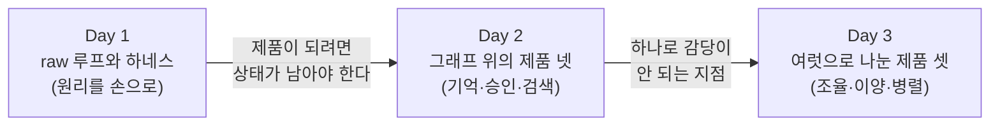

import Slide from 'stack-site-builder/components/Slide.astro';

<Slide class="cover">

# AI Agent 실전

Day 3 · 5. 마무리와 회고

*CodeCompose · 2026*

</Slide>

<Slide class="center">

## 3일을 한 문장으로

**모델은 그대로였고, 그 둘레를 우리가 지었습니다.**

</Slide>

<Slide>

## 사흘의 모양



</Slide>

<Slide>

## 같은 API, 다른 둘레

- Day 1의 마지막 예제와 Day 3의 마지막 저장소는 **같은 API를 부릅니다**.
- 달라진 것은 그 호출을 **감싼 것들**입니다.
  - 도구가 붙고, 루프에 한도가 생기고
  - 상태가 디스크에 남고, 검색이 근거를 대고
  - 역할이 갈리고, 값을 먼저 묻는 문이 생겼습니다.

</Slide>

<Slide class="center">

## 에이전트는 모델이 아니라 조립물이라는 것

3일의 답입니다.

</Slide>

<Slide>

## 저장소 여덟 개

| 저장소 | 언제 | 무엇을 얹었나 |
| --- | --- | --- |
| `day-01` | Day 1 | 도구 루프·ReAct·Plan-and-Execute·Reflexion·하네스·예제 51종 |
| `diet-agent` | Day 2 ① | LangGraph 기본기: 상태·reducer·조건부 엣지·스트리밍 |
| `booking-agent` | Day 2 ② | checkpointer 영속성, interrupt 승인, time-travel |
| `secretary-agent` | Day 2 ③ | store 장기 메모리, 의미 기반 회상, 기억 갱신 |
| `food-rag-agent` | Day 2 ④ | Agentic RAG, 두 검색 층, 결정적 검증자 |
| `energy-agent` | Day 3 ① | supervisor 패턴, 차트 도구, 하이브리드 라우팅, TTS |
| `support-agent` | Day 3 ② | handoff 패턴, 라우팅 기준, RAG 재사용과 인용 검증 |
| `coding-agent` | Day 3 ③ | 병렬 실행, 비용 게이트, 복구 루프 |

</Slide>

<Slide class="center">

## 여덟 저장소가 모두 릴리즈 사다리를 갖고 있습니다

태그 하나가 강의의 한 장면이고,

`git checkout v0.2` 한 줄이면 그 장면이 다시 돕니다.

**완성본만 남기지 않은 것**이 이 자료의 형태입니다.

</Slide>

<Slide>

## 개념이 놓인 자리
::sub[배운 자리와 다시 쓰인 자리가 다릅니다]

| 개념 | 배운 곳 | 다시 쓰인 곳 |
| --- | --- | --- |
| 도구 루프 | Day 1 ④⑤ | 전부. coding-agent에서는 `write_file` 하나로 줄었다 |
| 한도(스텝·비용) | Day 1 ⑦ | coding-agent의 수정·재계획 한도 |
| Reflexion | Day 1 ⑥ | coding-agent가 빌드 실패 로그를 fixer에게 되먹인다 |
| checkpointer | Day 2 ② | support-agent에서 "담당이 누구인가"를 다음 턴까지 나른다 |
| interrupt | Day 2 ② | coding-agent의 비용 게이트 |
| 두 검색 층 | Day 2 ④ | support-agent가 약관 조항을 찾는 부품으로 |
| 결정적 검증자 | Day 2 ④ | support-agent의 인용 검증(존재·근거) |
| 상태 설계 | Day 2 ① | Day 3 전체. 넘길 것과 남길 것을 정하는 일 |

**한 번 쓰고 끝난 개념은 거의 없습니다.**

</Slide>

<Slide class="center">

## 우리가 실제로 낸 사고들

이 과정에서 가장 오래 남는 것은 아마 이 표일 것입니다.

</Slide>

<Slide>

## 아홉 가지 사고

| 사고 | 어디서 | 무엇이 고쳤나 |
| --- | --- | --- |
| 무한 루프 | Day 1 하네스 | 스텝 한도. 판단이 아니라 숫자 |
| 프롬프트 인젝션 | Day 1 하네스 | 데이터와 지시의 경계, 권한 최소화, 필터 |
| 대화가 끊긴다 | diet-agent | reducer. 상태를 덮어쓰지 않고 쌓는다 |
| 재시작 한 방에 전부 잊는다 | booking-agent | MemorySaver에서 PostgresSaver로 |
| 일정은 남고 알레르기는 증발한다 | secretary-agent | thread 밖의 기억, 즉 store |
| 근거를 안 주면 지어낸다 | food-rag-agent | 코드가 원본과 대조하는 검증자 |
| 자료 없이 상담문을 쓴다 | energy-agent | 규칙이 정하는 라우팅 |
| 말로만 넘기고 핑퐁이 돈다 | support-agent | 반드시 도구로, 되돌리지 않기, 섞이면 되묻기 |
| 201과 200이 어긋난다 | coding-agent | 실패 로그를 되먹이는 복구 루프와 한도 |

전부 실제로 재현해 트레이스를 읽은 것들입니다.

</Slide>

<Slide class="center">

## 아홉 가지 중 여덟은

## 모델을 바꿔서 고친 것이 아닙니다

**구조를 바꾸거나, 경계를 긋거나, 한도를 걸어** 고쳤습니다.

이것이 이 과정이 하고 싶은 말입니다.

</Slide>

<Slide class="center">

## 되풀이된 규율 여섯

세션이 달라져도 같은 문장이 계속 나왔습니다.

</Slide>

<Slide>

## ① 원본은 한 벌만 둔다

- 수치와 본문은 db에, 색인은 옆에
- 화면에 나가는 숫자는 언제나 **원본에서 다시 꺼냅니다**.

</Slide>

<Slide>

## ② 경계를 먼저 긋는다

- 역할별 파일 소유권과 엔드포인트 규약이 있어야 **병렬이 성립합니다**.
- 신원은 도구 인자가 아니라 **상태에서 주입합니다**.

</Slide>

<Slide>

## ③ 확실한 것은 코드가 정한다

- 판단할 거리가 없는 자리를 모델에게 되묻는 것은
  **비용을 내고 불확실성을 사는 일**입니다.

</Slide>

<Slide>

## ④ 넘길 것과 남길 것을 나눈다

- supervisor는 **요약을 올리고 원자료를 남깁니다**.
- handoff는 **대화를 통째로 넘깁니다**.
- 구조가 다르면 나르는 것도 다릅니다.

</Slide>

<Slide>

## ⑤ 한도가 있어야 자동화다

- 무한히 고치는 루프
- 무한히 넘기는 이양
- 상한 없는 비용

이것들은 자동화가 아니라 **고장**입니다.

</Slide>

<Slide>

## ⑥ 재어 보고 말한다

- 좋아졌다는 주장에는 **숫자를 붙입니다**.
- **나빠진 것도 함께** 적습니다.

지침 5분의 1, 대신 호출 3회에서 5회로

</Slide>

<Slide class="center">

## 무엇을 언제 쓰는가

</Slide>

<Slide>

## 나눌 것인가

| 신호 | 답 |
| --- | --- |
| 아직 안 만들어 봤다 | 단일 에이전트로 먼저 만든다 |
| 지침이 서로 간섭한다 | 나눈다 |
| 여러 결과를 모아 하나를 만든다 | supervisor |
| 담당이 바뀌며 대화가 이어진다 | handoff |
| 역할을 미리 정할 수 없다 | 계획이 역할을 만든다 (coding-agent) |

</Slide>

<Slide>

## 무엇으로 기억할 것인가

| 필요 | 도구 |
| --- | --- |
| 한 대화를 이어가기 | checkpointer |
| 대화 밖의 사실(알레르기·선호) | store |
| 문서에서 찾아오기 | 벡터 검색 + 원본 조회 |
| 셀 수 있는 조건 | SQL. 임베딩을 쓸 자리가 아니다 |

</Slide>

<Slide class="center">

## 다시 오르는 법

강의가 끝나도 사다리는 남습니다.

</Slide>

<Slide>

## 어느 저장소든 같은 방식입니다

```sh
git clone https://github.com/2026-ai-agents/<저장소>
cd <저장소>
cp .env.sample .env        # 키를 하나 이상 채운다
git checkout v0.1
docker compose up --build  # 여기서부터 한 단씩
```

</Slide>

<Slide>

## 세 가지만 기억하십시오

- **태그를 순서대로 오르며** 각 단의 시연 스크립트를 돌려 보십시오.
  - **숫자가 이 문서와 다르게 나오는 것이 정상입니다.**
  - 모델은 매번 같지 않습니다.
- **coding-agent는 SPEC을 바꾸면** 다른 제품을 만듭니다.
  - 타이머 앱 SPEC이 함께 들어 있습니다.
- **각 저장소의 `CLAUDE.md`** 에 그 저장소의 규율이 적혀 있습니다.
  - AI 도구와 함께 이어서 작업할 때 그대로 쓰입니다.

</Slide>

<Slide class="center">

## 여기서 다루지 않은 것

3일에 담지 못한 것을 적어 두는 편이 정직합니다.

</Slide>

<Slide>

## 다음에 부딪힐 것들

- **평가**: "좋아졌다"를 매번 손으로 확인했습니다.
  회귀를 자동으로 잡는 평가셋과 채점은 다루지 않았습니다.
- **관측**: 트레이스를 화면과 로그로 읽었습니다.
  실제 운영에서는 수집·검색·경보가 필요합니다.
- **배포와 운영**: 전부 로컬 compose입니다.
  스케일, 비밀 관리, 무중단 배포는 다루지 않았습니다.
- **보안**: 인젝션 방어는 Day 1에서 맛만 봤습니다.
  멀티테넌시, 권한 모델, 감사 로그는 남은 숙제입니다.
- **비용의 실전**: 게이트와 장부는 만들었지만,
  캐싱·배치·모델 선택 전략은 더 깊은 주제입니다.

</Slide>

<Slide class="center">

## 3일 동안 만든 것은 여덟 개의 저장소이지만

## 가져가는 것은 무엇이 무너지는지 아는 눈이면 충분합니다

</Slide>

<Slide class="center">

## 무너지는 자리를 알면

어디에 한도를 걸고 어디에 경계를 그을지 보이고,

그때부터는 **어떤 프레임워크를 쓰든 같은 일입니다.**

</Slide>

<Slide class="center">

## 수고하셨습니다

*CodeCompose · 2026*

</Slide>
